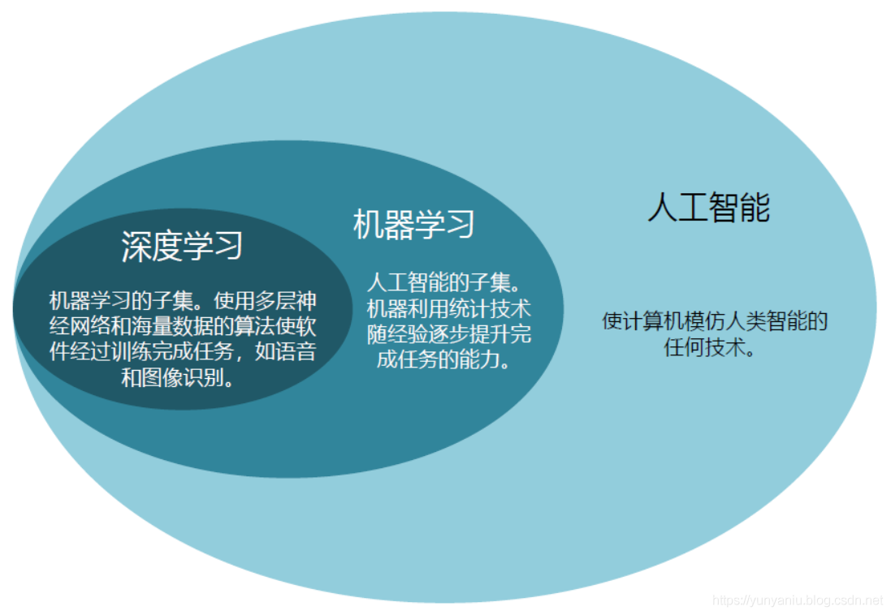
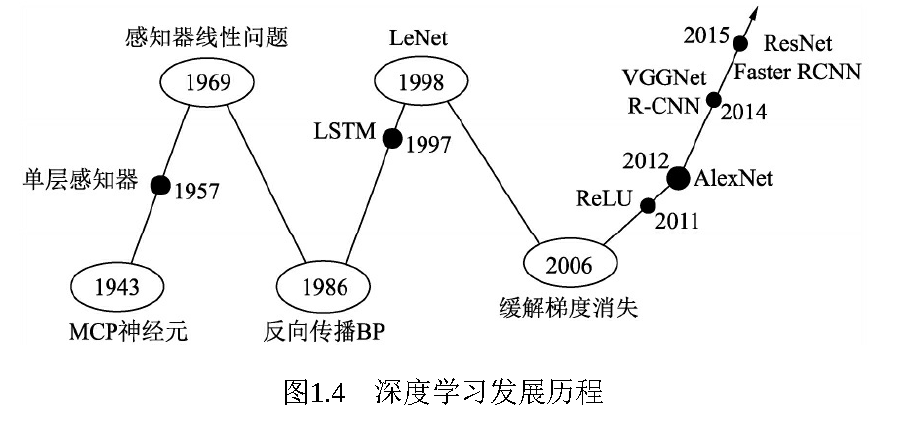
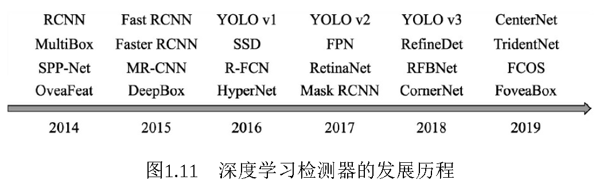
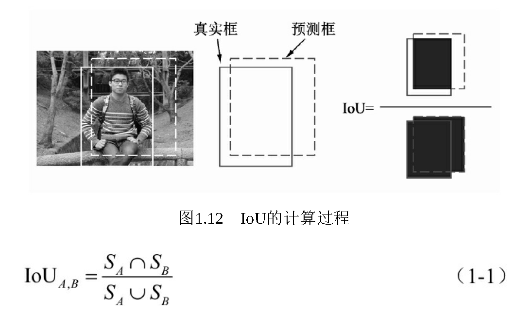

# 1.1 物体检测基础知识

# 人工智能、机器学习和深度学习
**（1）三者关系：**如果把人工智能比喻成人类的大脑，机器学习则是人类通过大量数据来认知学习的过程，而深度学习则是学习过程中非常高效的一种算法。机器学习的思想是让机器自动地从大量的数据中学习出规律，并利用该规律对未知的数据做出预测。在机器学习的算法中，深度学习是特指利用深度神经网络的结构完成训练和预测的算法。

**（2）机器学习：机器学习的关键在于从大量的数据中找出规律，自动地学习出算法所需的参数。**机器学习算法中最重要的就是数据，根据使用的数据形式，可以分为三大类：监督学习（Supervised Learning）、无监督学习（Unsupervised Learning）与强化学习（Reinforcement Learning）。**监督学习：**通常包括训练与预测阶段。在训练时利用带有人工标注标签的数据对模型进行训练，在预测时则根据训练好的模型对输入进行预测。**无监督学习：**输入的数据没有标签信息，也就无法对模型进行明确的惩罚。无监督学习常见的思路是采用某种形式的回报来激励模型做出一定的决策。**强化学习：**让模型在一定的环境中学习，每次行动会有对应的奖励，目标是使奖励最大化，被认为是走向通用人工智能的学习方法。

**（3）深度学习：**深度学习是机器学习的技术分支之一，主要是通过搭建深层的人工神经网络（Artificial Neural Network）来进行知识的学习，输入数据通常较为复杂、规模大、维度高。根据网络结构的不同，深度学习模型可以分为卷积神经网络（Convolutional Neural Network，CNN）、循环神经网络（Recurrent Neural Network，RNN）及生成式对抗网络（Generative Adviserial Network，GAN）。

---

# 物体检测技术
物体检测技术，通常是指在一张图像中检测出物体出现的位置及对应的类别。

在RCNN基础上，2015年的Fast RCNN实现了端到端的检测与卷积共享，Faster RCNN提出了锚框（Anchor）这一划时代的思想，将物体检测推向了第一个高峰。在2016年，YOLO v1实现了无锚框（Anchor-Free）的一阶检测，SSD实现了多特征图的一阶检测，这两种算法对随后的物体检测也产生了深远的影响。

**端到端的检测：**end-to-end（端对端）的方法，一端输入我的原始数据，一端输出我想得到的结果。只关心输入和输出，中间的步骤全部都不管。简单来讲，就是在训练时候直接输入数据集，得到mAP，不需要关心专门训练的，相当于黑箱操作。这就是端到端的训练，不需要手工处理数据，全都封装在网络模型中。测试时，输入图像，直接得到检测结果。

**卷积共享：**所谓卷积里面的权值共享:就是将卷积核里面的所有数值都当做权值，在进行卷积运算的时候，卷积核扫描整个图就实现了权值共享。

---

# **物体检测技术评价指标**
IoU计算：

召回率：检测出的标签框与所有标签框的比值

准确率：即当前遍历过的预测框中，属于正确预测边框的比值

> 更新: 2023-05-25 14:32:23  
> 原文: <https://3dcv.yuque.com/org-wiki-3dcv-mm1l0t/qe88dq/kdu352>