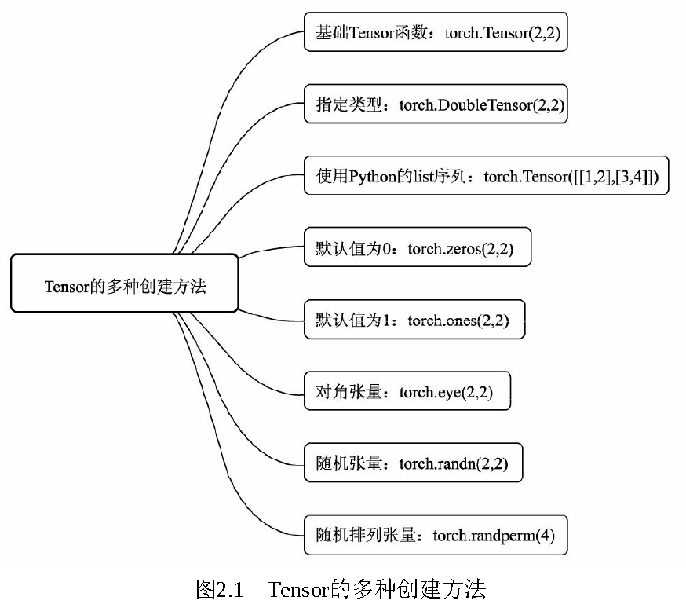

# 1.2 PyTorch基础

# 基本数据：Tensor
Tensor，即张量，是PyTorch中的基本操作对象，可以看做是包含单一数据类型元素的多维矩阵。PyTorch中默认的数据类型是torch.FloatTensor，即torch.Tensor等同于torch.FloatTensor。对于Tensor之间的类型转换，可以通过type(new_type)、type_as()、int()等多种方式进行操作。

Tensor有多种**创建方法**，如下图。

**组合与分块**是将Tensor相互叠加或者分开，**组合操作**是指将不同的Tensor叠加起来，主要有torch.cat()和torch.stack()两个函数。cat即concatenate的意思，是指沿着已有的数据的某一维度进行拼接，操作后数据的总维数不变，在进行拼接时，除了拼接的维度之外，其他维度必须相同。而torch.stack()函数指新增维度，并按照指定的维度进行叠加。**分块**则是与组合相反的操作，指将Tensor分割成不同的子Tensor，主要有torch.chunk()与torch.split()两个函数，前者需要指定分块的数量，而后者则需要指定每一块的大小，以整型或者list来表示。

**索引操作**与NumPy非常类似，主要包含下标索引、表达式索引、使用torch.where()与Tensor.clamp()的选择性索引。**变形操作**则是指改变Tensor的维度，以适应在深度学习的计算中，数据维度经常变换的需求，是一种十分重要的操作。

**排序函数**sort()，选择沿着指定维度进行排序，返回排序后的Tensor及对应的索引位置。**max()与min()函数**则是沿着指定维度选择最大与最小元素，返回该元素及对应的索引位置。对于Tensor的单元素**数学运算**，如abs()、sqrt()、log()、pow()和三角函数等，都是逐元素操作（element-wise），输出的Tensor形状与原始Tensor形状一致。对于类似求和、求均值、求方差、求距离等需要**多个元素完成的操作**，往往需要沿着某个维度进行计算，在Tensor中属于归并操作，输出形状小于输入形状。

**Tensor自动广播机制**，即不同形状的Tensor进行计算时，可自动扩展到较大的相同形状，再进行计算。广播机制的前提是任一个Tensor至少有一个维度，且从尾部遍历Tensor维度时，两者维度必须相等，其中一个要么是1要么不存在。

**向量化操作**是指可以在同一时间进行批量地并行计算，例如矩阵运算，以达到更好的计算效率的一种方式。在实际使用时，应尽量使用向量化直接对Tensor操作，避免低效率的for循环对元素逐个操作，尤其是在训练网络模型时，如果有大量的for循环，会极大地影响训练的速度。

**Tensor的内存共享**主要有以下三种情况：Tensor初始化另一个Tensor、add_()等原地操作符、Tensor与NumPy的转换。

# 自动求导机制Autograd与计算图
基本数据Tensor可以保证完成前向传播，想要完成神经网络的训练，接下来还需要进行反向传播与梯度更新，而PyTorch提供了自动求导机制autograd，将前向传播的计算记录成计算图，自动完成求导。自动求导机制记录了Tensor的操作，以便自动求导与反向传播。可以通过requires_grad参数来创建支持自动求导机制的Tensor。

计算图是PyTorch对于神经网络的具体实现形式，包括每一个数据Tensor及Tensor之间的函数function。

Autograd的基本原理是随着每一步Tensor的计算操作，逐渐生成计算图，并将操作的function记录在Tensor的grad_fn中。在前向计算完后，只需对根节点进行backward函数操作，即可从当前根节点自动进行反向传播与梯度计算，从而得到每一个叶子节点的梯度，梯度计算遵循链式求导法则。

# 神经网络工具箱torch.nn
torch.autograd库虽然实现了自动求导与梯度反向传播，但如果我们要完成一个模型的训练，仍需要手写参数的自动更新、训练过程的控制等，还是不够便利。为此，PyTorch进一步提供了集成度更高的模块化接口torch.nn，该接口构建于Autograd之上，提供了网络模组、优化器和初始化策略等一系列功能。

# 模型处理
模型是神经网络训练优化后得到的成果，包含了神经网络骨架及学习得到的参数。PyTorch对于模型的处理提供了模型的生成、预训练模型的加载和模型保存3个方面。

模型的生成：对于深度学习，torchvision.models库提供了众多经典的网络结构与预训练模型，例如VGG、ResNet和Inception等，利用这些模型可以快速搭建物体检测网络，不需要逐层手动实现。

加载预训练模型：对于计算机视觉的任务，包括物体检测，我们通常很难拿到很大的数据集，在这种情况下重新训练一个新的模型是比较复杂的，并且不容易调整，因此，Fine-tune（微调）是一个常用的选择。所谓Fine-tune是指利用别人在一些数据集上训练好的预训练模型，在自己的数据集上训练自己的模型。

模型的保存：在PyTorch中，参数的保存通过torch.save()函数实现，可保存对象包括网络模型、优化器等，而这些对象的当前状态数据可以通过自身的state_dict()函数获取。

# 数据处理
**主流公开数据集：**ImageNet数据集首次在2009年计算机视觉与模式识别（CVPR）会议上发布，其目的是促进计算机图像识别的技术发展。PASCAL VOC为图像分类与物体检测提供了一整套标准的数据集。COCO是由微软赞助的一个大型数据集，针对物体检测、分割、图像语义理解和人体关节点等，拥有超过30万张图片，200万多个实例及80个物体类别。当然，随着自动驾驶领域的快速发展，也出现了众多自动驾驶领域的数据集，如KITTI、Cityscape和Udacity等。

**数据加载：**PyTorch将数据集的处理过程标准化，提供了Dataset基本的数据类，并在torchvision中提供了众多数据变换函数，数据加载的具体过程主要分为3步：继承Dataset类、增强数据变换、继承Dataloader。

**GPU加速：**PyTorch为数据在GPU上运行提供了非常便利的操作。首先可以使torch.cuda.is_available()来判断当前环境下GPU是否可用，其次是对于Tensor和模型，可以直接调用cuda()方法将数据转移到GPU上运行，并且可以输入数字来指定具体转移到哪块GPU上运行。

**数据可视化：**在PyTorch中，有各种数据可视化工具，可以在网络训练时更好地查看训练过程中的各个损失变化情况，监督训练过程，并为进一步的参数优化与训练优化提供方向。常用的可视化工具有TensorBoardX和Visdom。

> 更新: 2023-05-25 14:32:26  
> 原文: <https://3dcv.yuque.com/org-wiki-3dcv-mm1l0t/qe88dq/muprwp>