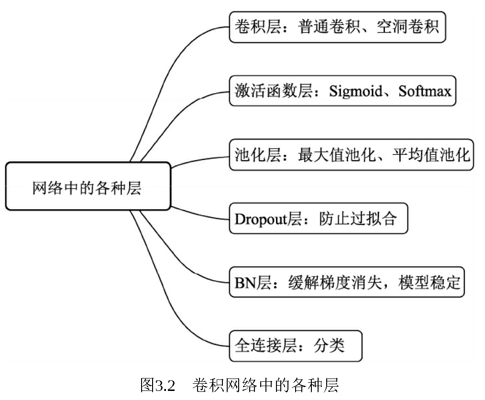

# 2.1 神经网络基本组成

# 卷积网络中的各种层

**卷积层：**卷积的本质是用卷积核的参数来提取数据的特征，通过矩阵点乘运算与求和运算来得到结果。卷积层是线性的。

**激活函数层：**神经网络如果仅仅是由线性的卷积运算堆叠组成，则其无法形成复杂的表达空间，也就很难提取出高语义的信息，因此还需要加入非线性的映射，又称为激活函数，可以逼近任意的非线性函数，以提升整个神经网络的表达能力。

**池化（Pooling）层：**降低特征图的参数量，提升计算速度，增加感受野，是一种降采样操作。最大值池化与平均值池化。

**Dropout层：**防止过拟合问题在训练时，每个神经元以概率p保留，即以1-p的概率停止工作，每次前向传播保留下来的神经元都不同，这样可以使得模型不太依赖于某些局部特征，泛化性能更强。

**BN层：**改变数据分布避免了参数陷入饱和区，缓解梯度消失，加速网络收敛。

**全连接层：**分类。全连接层（Fully Connected Layers）一般连接到卷积网络输出的特征图后边，特点是每一个节点都与上下层的所有节点相连，输入与输出都被延展成一维向量，因此从参数量来看全连接层的参数量是最多的。

# 

> 更新: 2023-05-25 14:32:29  
> 原文: <https://3dcv.yuque.com/org-wiki-3dcv-mm1l0t/qe88dq/ecxgxb>