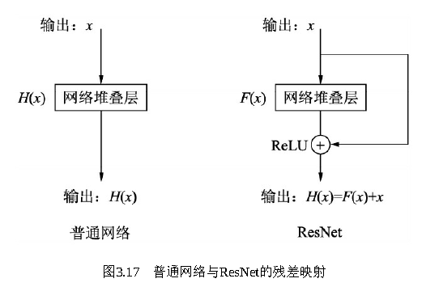
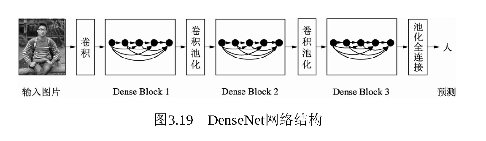

# 2.2 经典的网络Backbone

# 走向深度：VGGNet
VGGNet（Visual Geometry Group Network）探索了网络深度与性能的关系，用更小的卷积核与更深的网络结构，取得了较好的效果，成为卷积结构发展史上较为重要的一个网络。

VGGNet网络一共有6个不同的版本，最常用的是VGG16。VGGNet采用了五组卷积与三个全连接层，最后使用Softmax做分类。VGGNet有一个显著的特点：每次经过池化层（maxpool）后特征图的尺寸减小一倍，而通道数则增加一倍（最后一个池化层除外）。

VGGNet中，使用的卷积核基本都是3×3，而且很多地方出现了多个3×3堆叠的现象，这种结构的优点在于，首先从感受野来看，两个3×3的卷积核与一个5×5的卷积核是一样的；其次，同等感受野时，3×3卷积核的参数量更少。更为重要的是，两个3×3卷积核的非线性能力要比5×5卷积核强，因为其拥有两个激活函数，可大大提高卷积网络的学习能力。

# 纵横交错：Inception
一般来说，增加网络的深度与宽度可以提升网络的性能，但是这样做也会带来参数量的大幅度增加，同时较深的网络需要较多的数据，否则容易产生过拟合现象。除此之外，增加神经网络的深度容易带来梯度消失的现象。Inception v1（又名GoogLeNet）网络较好地解决了这个问题。

Inception v1网络是一个精心设计的22层卷积网络，并提出了具有良好局部特征结构的Inception模块，即对特征并行地执行多个大小不同的卷积运算与池化，最后再拼接到一起。由于1×1、3×3和5×5的卷积运算对应不同的特征图区域，因此这样做的好处是可以得到更好的图像表征信息。

Inception模块使用了三个不同大小的卷积核进行卷积运算，同时还有一个最大值池化，然后将这4部分级联起来（通道拼接），送入下一层。

在上述模块的基础上，为进一步降低网络参数量，Inception又增加了多个1×1的卷积模块。这种1×1的模块可以先将特征图降维，再送给3×3和5×5大小的卷积核，由于通道数的降低，参数量也有了较大的减少。值得一提的是，用1×1卷积核实现降维的思想，在后面的多个轻量化网络中都会使用到。

Inception v1网络一共有9个上述堆叠的模块，共有22层，在最后的Inception模块处使用了全局平均池化。为了避免深层网络训练时带来的梯度消失问题，作者还引入了两个辅助的分类器，在第3个与第6个Inception模块输出后执行Softmax并计算损失，在训练时和最后的损失一并回传。

Inception v1的参数量是AlexNet的，VGGNet的，适合处理大规模数据，尤其是对于计算资源有限的平台。

# 里程碑：ResNet
ResNet（Residual Network，残差网络）较好地解决了以下问题，梯度消失问题和越深的网络返回的梯度相关性会越来越差，接近于白噪声，导致梯度更新也接近于随机扰动。

ResNet的思想在于引入了一个深度残差框架来解决梯度消失问题，即让卷积网络去学习残差映射，而不是期望每一个堆叠层的网络都完整地拟合潜在的映射（拟合函数）。

# 继往开来：DenseNet
DenseNet最大化了这种前后层信息交流，通过建立前面所有层与后面层的密集连接，实现了特征在通道维度上的复用，使其可以在参数与计算量更少的情况下实现比ResNet更优的性能。

DenseNet的网络架构由多个Dense Block与中间的卷积池化组成，核心就在Dense Block中。Dense Block中的黑点代表一个卷积层，其中的多条黑线代表数据的流动，每一层的输入由前面的所有卷积层的输出组成。注意这里使用了通道拼接（Concatnate）操作，而非ResNet的逐元素相加操作。

# 特征金字塔：FPN
FPN（Feature PyramidNetwork）方法融合了不同层的特征，较好地改善了多尺度检测问题。

FPN的总体架构主要包含自下而上网络、自上而下网络、横向连接与卷积融合4个部分。

FPN将深层的语义信息传到底层，来补充浅层的语义信息，从而获得了高分辨率、强语义的特征，在小物体检测、实例分割等领域有着非常不俗的表现。

# 为检测而生：DetNet
DetNet结构，引入了空洞卷积，使得模型兼具较大感受野与较高分辨率，同时避免了FPN的多次上采样，实现了较好的检测效果。

DetNet具体的网络结构细节有以下3点：

·引入了一个新的Stage 6，用于物体检测。Stage 5与Stage 6使用了DetNet提出的Bottleneck结构，最大的特点是利用空洞数为2的3×3卷积取代了步长为2的3×3卷积。

·Stage 5与Stage 6的每一个Bottleneck输出的特征图尺寸都为原图的，通道数都为256，而传统的Backbone通常是特征图尺寸递减，通道数递增。

·在组成特征金字塔时，由于特征图大小完全相同，因此可以直接从右向左传递相加，避免了上一节的上采样操作。为了进一步融合各通道的特征，需要对每一个阶段的输出进行1×1卷积后再与后一Stage传回的特征相加。

DetNet这种精心设计的结构，在增加感受野的同时，获得了较大的特征图尺寸，有利于物体的定位。与此同时，由于各Stage的特征图尺寸相同，避免了上一节的上采样，既一定程度上降低了计算量，又有利于小物体的检测。

> 更新: 2023-05-25 14:32:44  
> 原文: <https://3dcv.yuque.com/org-wiki-3dcv-mm1l0t/qe88dq/xwtqxz>