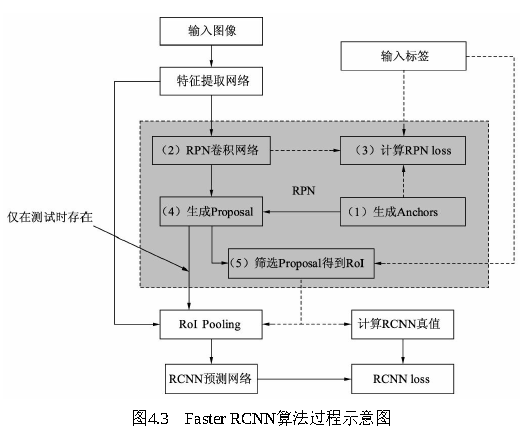

# 3.两阶经典检测器：Faster RCNN

Faster RCNN主要包括4部分：**特征提取网络、RPN模块、RoI Pooling（Region of Interest）模块与RCNN模块**。

1、**特征提取网络Backbone**：输入图像首先经过Backbone得到特征图。

2、**RPN模块**：区域生成模块，其作用是生成较好的建议框，即Proposal，这里用到了强先验的Anchor。RPN包含5个子模块：

    （1）**Anchor生成**：RPN对feature map上的每一个点都对应 了9个Anchors，这9个Anchors大小宽高不同，对应到原图基本可以覆盖所有可能出现的物体。因此，有了数量庞大的Anchors，RPN接下来的工作就是从中筛选，并调整出更好的位置，得到Proposal。下面这篇博客有助于[全面理解目标检测中的Anchor](https://blog.csdn.net/weixin_40920183/article/details/121134146?utm_medium=distribute.pc_relevant.none-task-blog-2~default~baidujs_title~default-0-121134146-blog-125194384.pc_relevant_multi_platform_whitelistv1&spm=1001.2101.3001.4242.1&utm_relevant_index=3)。

    （2）**RPN卷积网络**：与上面的Anchor对应，由于feature map上每个点对应了9个Anchors，因此可以利用1×1的卷积在feature map上得到每一个Anchor的预测得分与预测偏移值。

    （3）**计算RPN loss**：这一步只在训练中，将所有的Anchors与标签进行匹配，匹配程度较好的Anchors赋予正样本，较差的赋予负样本，得到分类与偏移的真值，与第二步中的预测得分与预测偏移值进行loss的计算。

    （4）**生成Proposal**：利用第二步中每一个Anchor预测的得分与偏移量，可以进一步得到一组较好的Proposal，送到后续网络中。

    （5）**筛选Proposal得到RoI**：在训练时，由于Proposal数量还是太多（默认是2000），需要进一步筛选Proposal得到RoI（默认数量是256）。在测试阶段，则不需要此模块，Proposal可以直接作为RoI，默认数量为300。

3、**RoI Pooling模块**：这部分承上启下，接受卷积网络提取的featuremap和RPN的RoI，输出送到RCNN网络中。由于RCNN模块使用了全连接网络，要求特征的维度固定，而每一个RoI对应的特征大小各不相同，无法送入到全连接网络，因此RoI Pooling将RoI的特征池化到固定的维度，方便送到全连接网络中。

4、**RCNN模块**：将RoI Pooling得到的特征送入全连接网络，预测每一个RoI的分类，并预测偏移量以精修边框位置，并计算损失，完成整个Faster RCNN过程。主要包含3部分：

     （1）**RCNN全连接网络**：将得到的固定维度的RoI特征接到全连接网络中，输出为RCNN部分的预测得分与预测回归偏移量。

     （2）**计算RCNN的真值**：对于筛选出的RoI，需要确定是正样本还是负样本，同时计算与对应真实物体的偏移量。在实际实现时，为实现方便，这一步往往与RPN最后筛选RoI那一步放到一起。

     （3）**RCNN loss**：通过RCNN的预测值与RoI部分的真值，计算分类与回归loss。

> 更新: 2023-05-18 09:51:10  
> 原文: <https://3dcv.yuque.com/org-wiki-3dcv-mm1l0t/qe88dq/pyp2pb>