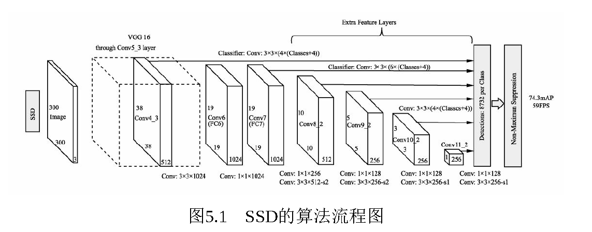

# 4.单阶多层检测器：SSD

SSD算法的算法流程如上图所示，输入图像首先经过了**VGGNet**的基础网络，在此之上又增加了几个卷积层，然后利用3×3的卷积核在6个大小与深浅不同的特征层上进行预测，得到预选框的分类与回归预测值，最后直接预测出结果，或者求得网络损失。

SSD的算法思想，主要可以分为4个方面：

（1）**数据增强**：SSD在数据部分做了充分的数据增强工作，包括光学变换与几何变换等，极大限度地扩充了数据集的丰富性，从而有效提升了模型的检测精度。

（2）**网络骨架**：SSD在原始VGGNet的基础上，进一步延伸了4个卷积模块，最深处的特征图大小为1×1，这些特征图具有不同的尺度与感受野，可以负责检测不同尺度的物体。

（3）**PriorBox与多层特征图**：与Faster RCNN类似，SSD利用了固定大小与宽高的PriorBox作为区域生成，但与Faster RCNN不同的是，SSD不是只在一个特征图上设定预选框，而是在6个不同尺度上都设立预选框，并且在浅层特征图上设立较小的PriorBox来负责检测小物体，在深层特征图上设立较大的PriorBox来负责检测大物体。

（4）**正、负样本的选取与损失计算**：利用3×3的卷积在6个特征图上进行特征的提取，并分为分类与回归两个分支，代表所有预选框的预测值，随后进行预选框与真实框的匹配，利用IoU筛选出正样本与负样本，最终计算出分类损失与回归损失。

由整个过程可以看出，SSD只进行了一次框的预测与损失计算，属于**一阶**网络。

> 更新: 2023-04-26 22:07:49  
> 原文: <https://3dcv.yuque.com/org-wiki-3dcv-mm1l0t/qe88dq/lbc7km>