# 5.单阶段经典检测器 YOLO

# YOLO v1
 YOLO v1首先利用卷积神经网络进行了 特征提取，结构与GoogLeNet模型有些类似。 在该结构中，输出图像的尺寸固定为448×448，经过24个卷积层与两个 全连接层后，最后输出的特征图大小为7×7×30。

 YOLO v1的网络结构，有以下3个细节：  

1 在3×3的卷积后通常会接一个通道数更低的1×1卷积，这种方式既 降低了计算量，同时也提升了模型的非线性能力。 

2 除了最后一层使用了线性激活函数外，其余层的激活函数为Leaky ReLU。

3 在训练中使用了Dropout与数据增强的方法来防止过拟合。  

 YOLO v1的网络结构并无太多创新之处，其精髓主要在最后7×7×30 大小的特征图中。YOLO v1将输入图像划分成7×7的区 域，每一个区域对应于最后特征图上的一个点，该点的通道数为30，代 表了预测的30个特征。 YOLO v1在每一个区域内预测两个边框，如图6.2中的预测框A与 B，这样整个图上一共预测7×7×2=98个框，这些边框大小与位置各不相 同，基本可以覆盖整个图上可能出现的物体。  

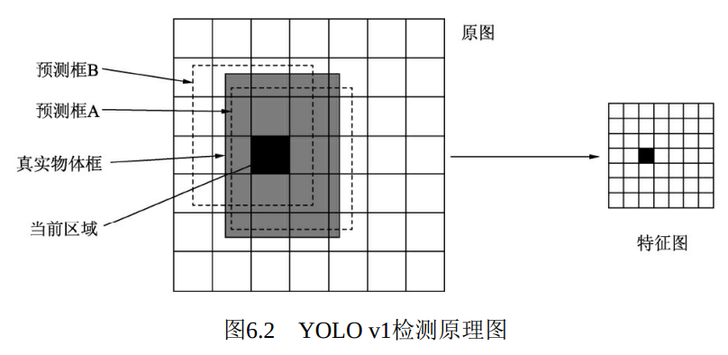

 如果一个物体的中心点落在了某个区域内，则该区域就负责检测该 物体。 具体是将该区域的两个框与真实物体框进行匹配，IoU更大的 框负责回归该真实物体框。

 最终的预测特征由类别概率、边框的置信度及边框的位置组成 （ 类别概率： 预测的是边框属于哪一个类别， 置信度： 表示该区域内是否包含物体的概率，类似于Faster RCNN 中是前景还是背景。 边框位置： 对每一个边框需要预测其中心坐标及宽、高这4个量。） 

 YOLO v1并没有先验框，而是直接在每个区域预测框的大小与位 置，是一个回归问题。这样做能够成功检测的原因在于，区域本身就包含了一定的位置信息，另外被检测物体的尺度在一个可以回归的范围内。YOLO v1采用了物体类别与置信度分开的预测方法 

损失函数：

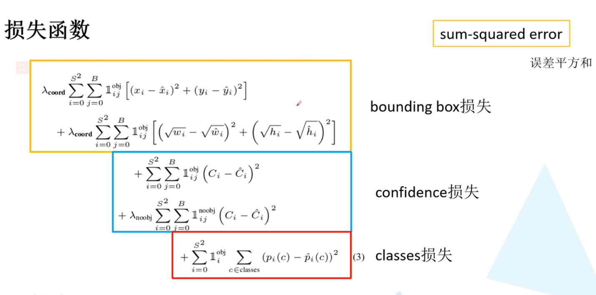

第一项为正样本中心点坐标的损失。λcoord的目的是为了调节位置 损失的权重，YOLO v1设置λcoord为5，调高了位置损失的权重。

第二项为正样本宽高的损失。由于宽高差值受物体尺度的影响， 因此这里先对宽高进行了平方根处理，在一定程度上降低对尺度的敏 感，强化了小物体的损失权重。    

第三、四项分别为正样本与负样本的置信度损失，正样本置信度 真值为1，负样本置信度为0。λnoobj默认为0.5，目的是调低负样本置信 度损失的权重。

最后一项为正样本的类别损失。

yolo v1 的缺陷 聚集在一起的小目标的检测效果差，目标出现新的尺寸时效果差，原因是定位的不准确   

# YOLO v2
网络结构的改善：YOLO v2对于基础网络结构进行了多种优化，提出了一个全新的网络结构，称之为DarkNet。原始的DarkNet拥有19个卷积层与5个池化层，在增加了一个Passthrough层后一共拥有22个卷积层，精度与VGGNet相当，但浮点运算量只有VGGNet的1/5左右，因此速度极快。

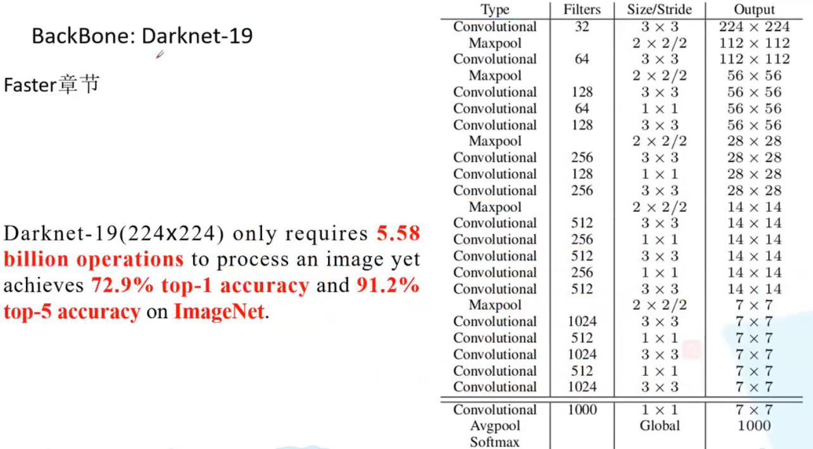

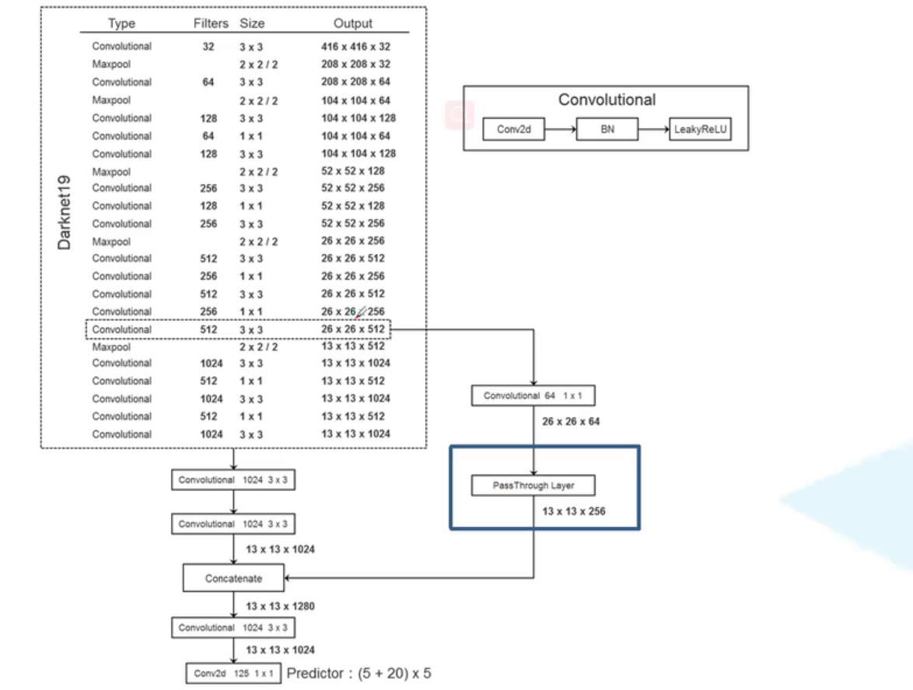

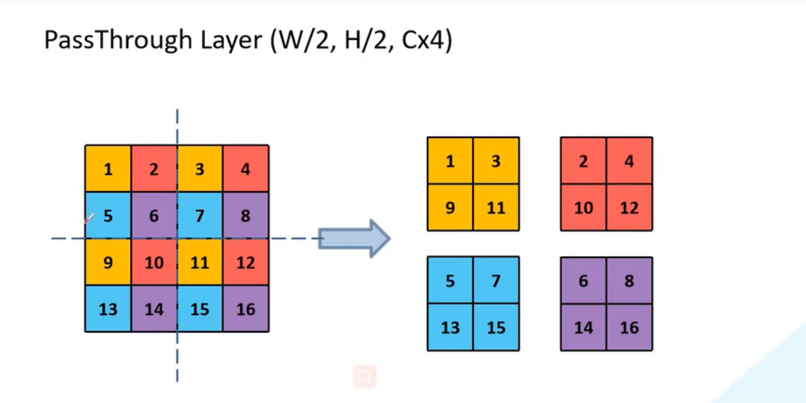

BN层：DarkNet使用了BN层，这一点带来了2%以上的性能提升。BN层有助于解决反向传播中的梯度消失与爆炸问题，可以加速模型的 收敛，同时起到一定的正则化作用。

用连续3×3卷积替代了v1版本中的7×7卷积，这样既减少了计算量，又增加了网络深度。此外，DarkNet去掉了全连接层与Dropout层。

Passthrough层：DarkNet还进行了深浅层特征的融合，具体方法是将浅层26×26×512的特征变换为13×13×2048，这样就可以直接与深层13×13×1024的特征进行通道拼接。这种特征融合有利于小物体的检测，也为模型带来了1%的性能提升。

先验框的设计

YOLO v2首先使用了聚类的算法来确定先验框的尺度，并且优化了后续的偏移计算方法 YOLO v2通过在训练集上聚类来获得预选框，只需要设定预选框的数量k，就可以利用聚类算法得到最适合的k个框。在聚类时，两个边框之间的距离使用下式的计算方法，即IoU越大，边框距离越近。

                                            $ d(box, centroid)=1-IoU(box,centroid)
 $

YOLO v2不再直接预测边框的位置坐标，而是预测先验框与真实物体的偏移量。在Faster RCNN中，中心坐标的偏移公式

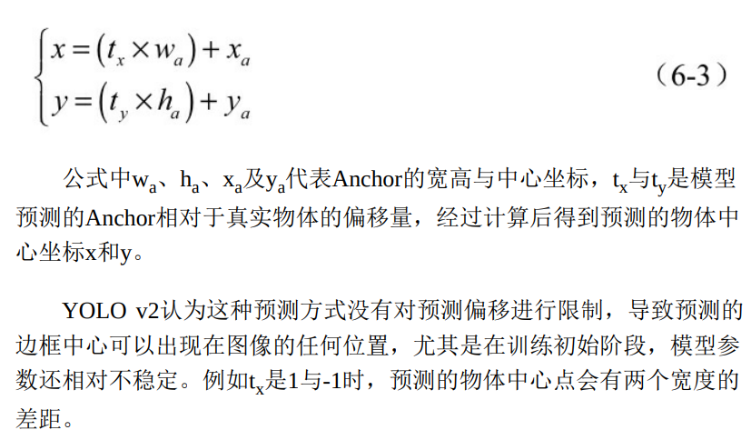

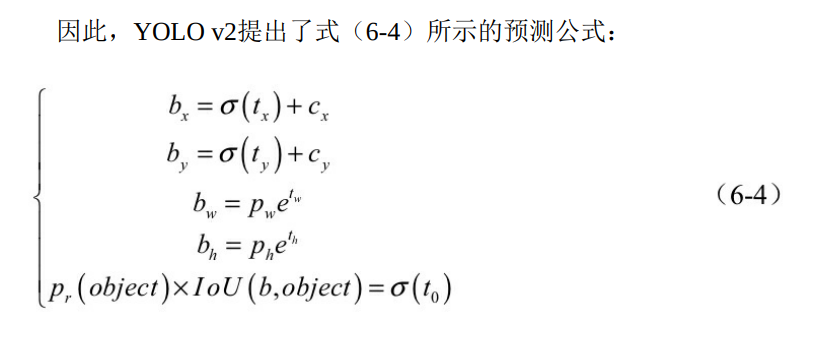  
 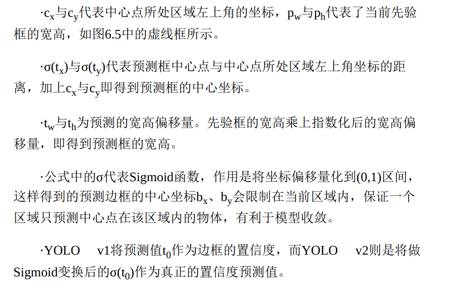

YOLO v2损失函数

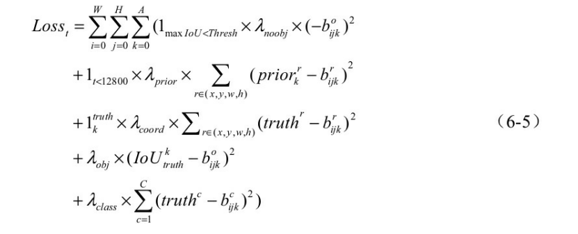

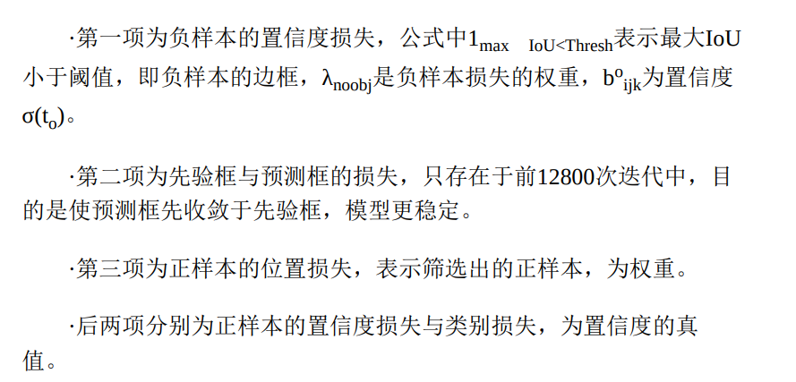

YOLO v2可以接受任意尺寸的输入图片。在训练阶段，为了使模型对于不同尺度的物体鲁棒，YOLO v2采取了多种尺度的图片作为训练的输入。 尺度集合为{320,352,384,...,608}

多阶段训练 由于物体检测数据标注成本较高，因此大多数物体检测模型都是先利用分类数据集来训练卷积层，然后再在物体检测数据集上训练。例 如，YOLO v1先利用ImageNet上224×224大小的图像预训练，然后在448×448的尺度上进行物体检测的训练。这种转变使得模型要适应突变 的图像尺度，增加了训练难度。

# YOLO v3
 YOLO v3，将当今一些较好的检测思想融入到了YOLO中，在保持速度优势的 前提下，进一步提升了检测精度，尤其是对小物体的检测能力。  具体来讲，YOLO v3主要改进了网络结构、网络特征及后续计算三个部分。

YOLO v3采用Darknet-53模型结构，Darknet-53结构图如下

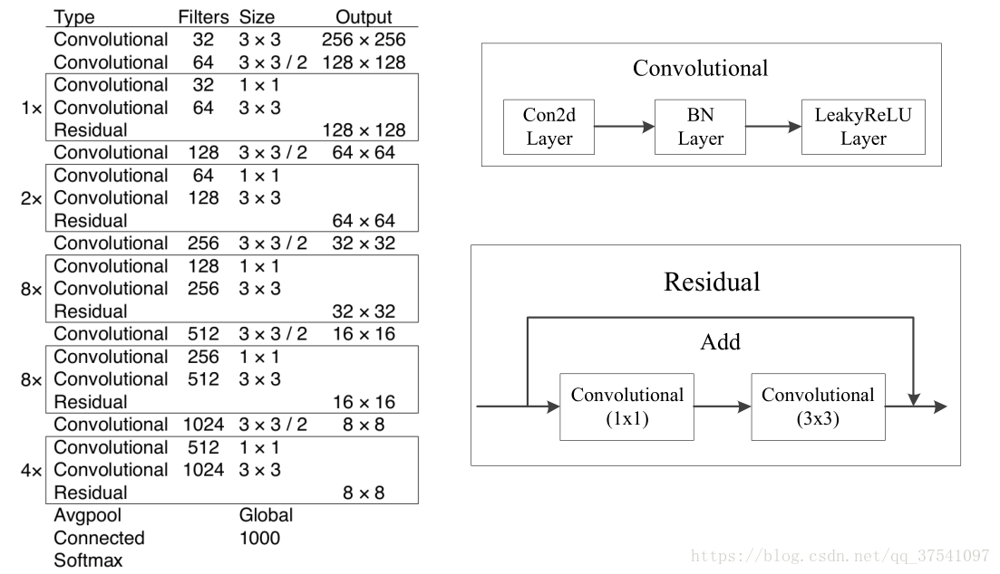

YOLO v3 416模型进行绘制的，所以输入的尺寸是416x416，预测的三个特征层大小分别是52，26，13。YOLO-v3模型结构如下

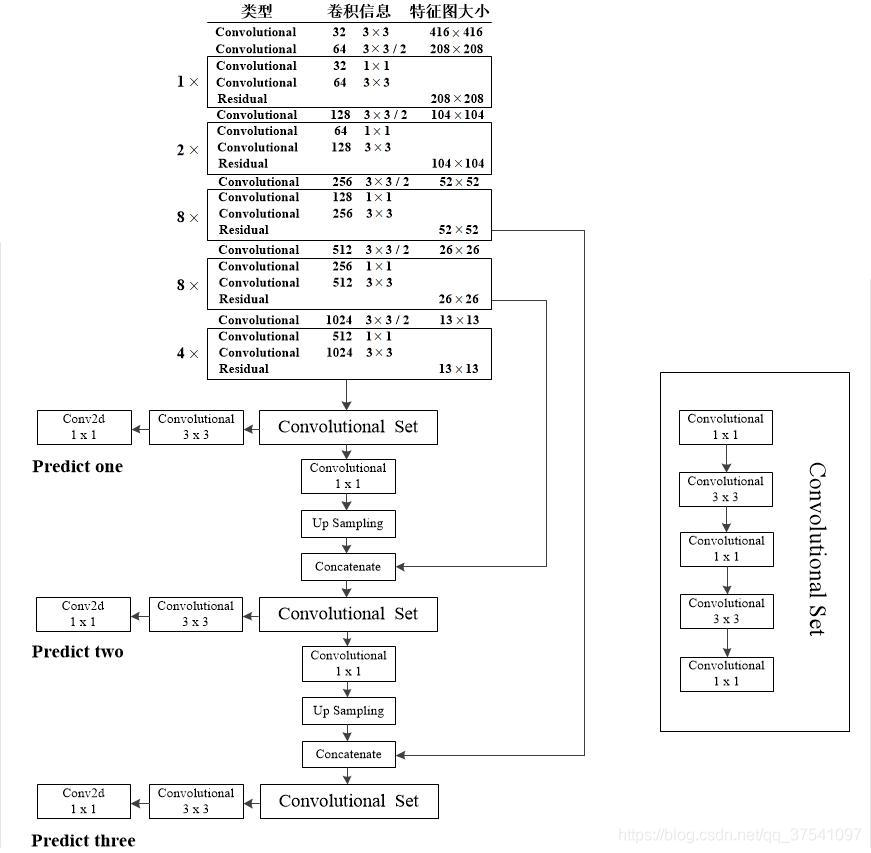

YOLO v3的速度并没有之前的版本快，而是在保证实时性的前提下追求检测的精度。如果追求速度，YOLO v3提供了一个更轻量化的网络tiny-DarkNet，在模型大小与速度上，实现了SOTA（State of the Art）的效果

YOLO v3输出了3个大小不同的特征图，从上到下分别对应深层、中层与浅层的特征。深层的特征图尺寸小，感受野大，有利于检测大尺度物体，而浅层的特征图则与之相反，更便于检测小尺度物体，这一点类似于FPN结构。

YOLO v3依然沿用了预选框Anchor，由于特征图数量不再是一个，因此匹配方法也要相应地进行改变。具体方法是，依然使用聚类的算法得到了9种不同大小宽高的先验框，

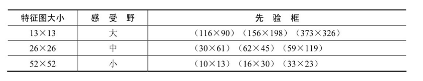

YOLO v3的另一个改进是使用了Logistic函数代替Softmax函数，以处理类别的预测得分。原因在于，Softmax函数输出的多个类别预测之间会相互抑制，只能预测出一个类别，而Logistic分类器相互独立，可以实现多类别的预测。 Logistic类别预测方法在Mask RCNN中也被采用，可以实现类别间的解耦。预测之后使用Binary的交叉熵函数可以进一步求得类别损失。

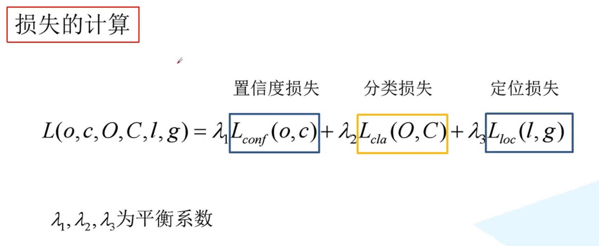

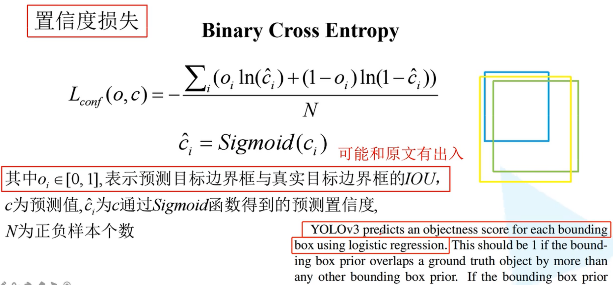

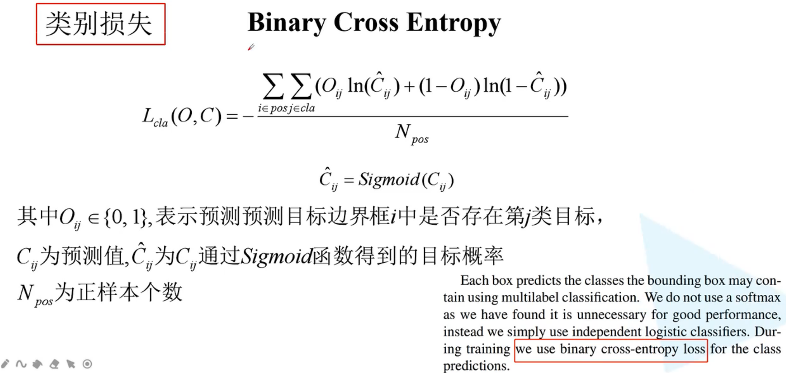

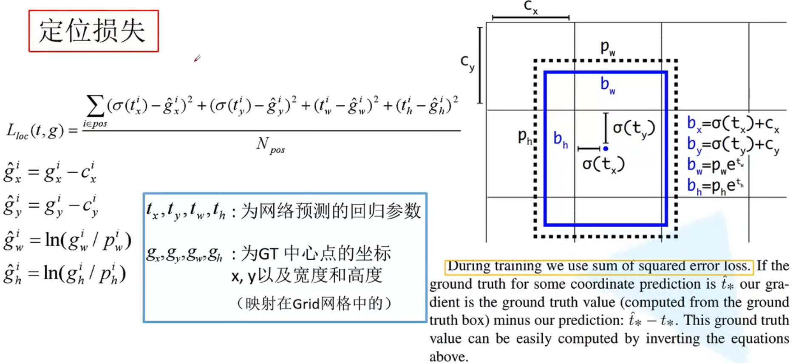

# 

> 更新: 2023-04-26 22:07:32  
> 原文: <https://3dcv.yuque.com/org-wiki-3dcv-mm1l0t/qe88dq/sg8ple>