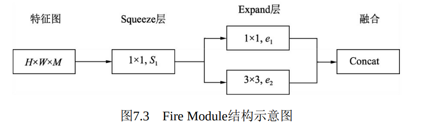
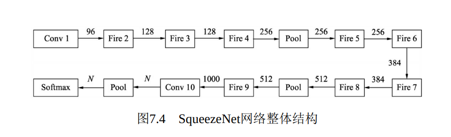

# 6.1 压缩再扩展SqueezeNet

# 简介
 当物体检测应用到实际工业场景时，模型的参数量是一个十分重要 的指标，较小的模型可以高效地进行分布式训练，减小模型更新开销， 降低平台体积功耗存储和计算能力的限制，方便在FPGA等边缘平台上 部署。  

 基于以上几点，Han等人提出了轻量化模型SqueezeNet，其性能与 AlexNet相近，而模型参数仅有AlexNet的1/50。  

 随着网络结构的逐渐加深，模型的性能有了大幅度提升，但这也增 加了网络参数与前向计算的时间。SqueezeNet从网络结构优化的角度出 发，使用了如下3点策略来减少网络参数，提升网络性能：  

 1 使用1×1卷积来替代部分的3×3卷积，这也是之前介绍过的常用的 策略，可以将参数减少为原来的1/9。 

2 减少输入通道的数量，这一点也是通过1×1卷积来实现，通道数量 的减少可以使后续卷积核的数量也相应地减少。 

3 在减少通道数之后，使用多个尺寸的卷积核进行计算，以保留更 多的信息，提升分类的准确率。  

 SqueezeNet提出了基础模块，称之为 Fire Module。图中输入特征尺寸为H×W，通道数为M，依次经过一个 Squeeze层与Expand层，然后进行融合处理。  



SqueezeNet层：首先使用1×1卷积进行降维，特征图的尺寸不变， 这里的S1小于M，达到了压缩的目的。 Expand层：并行地使用1×1卷积与3×3卷积获得不同感受野的特征 图，有点类似Inception模块，达到扩展的目的。

Concat：对得到的两个特征图进行通道拼接，作为最终输出。 ·模块中的S1、e1与e2都是可调的超参，Fire Module默认 e1=e2=4×S1。激活函数使用了ReLU函数。  

模块实现

```plain
import torch
from torch import nn
class Fire(nn.Module):
    def __init__(self, inplanes, squeeze_planes, expand_planes):
        super(Fire, self).__init__()
        # 这里的squeeze_planes为S1
        self.conv1 = nn.Conv2d(inplanes, squeeze_planes, kernel_size=1, stride=1)
        self.bn1 = nn.BatchNorm2d(squeeze_planes)
        self.relu1 = nn.ReLU(inplace=True)
        # expand_planes为e1和e2
        self.conv2 = nn.Conv2d(squeeze_planes, expand_planes, kernel_size=1,
        stride=1)
        self.bn2 = nn.BatchNorm2d(expand_planes)
        self.conv3 = nn.Conv2d(squeeze_planes, expand_planes, kernel_size=3,
        stride=1, padding=1)
        self.bn3 = nn.BatchNorm2d(expand_planes)
        self.relu2 = nn.ReLU(inplace=True)
    def forward(self, x):
        x = self.conv1(x)
        x = self.bn1(x)
        x = self.relu1(x)
        out1 = self.conv2(x)
        out1 = self.bn2(out1)
        out2 = self.conv3(x)
        out2 = self.bn3(out2)
        # 对两个分支的输出进行Concat处理
        out = torch.cat([out1, out2], 1)
        out = self.relu2(out)
        return out
```

SqueezeNet网络结构



 SqueezeNet一共使用了3个Pool层，前两个是Max Pooling层，步长 为2，最后一个为全局平均池化，利用该层可以取代全连接层，减少了 计算量。  


> 更新: 2023-04-26 22:07:37  
> 原文: <https://3dcv.yuque.com/org-wiki-3dcv-mm1l0t/qe88dq/pp0pxb>