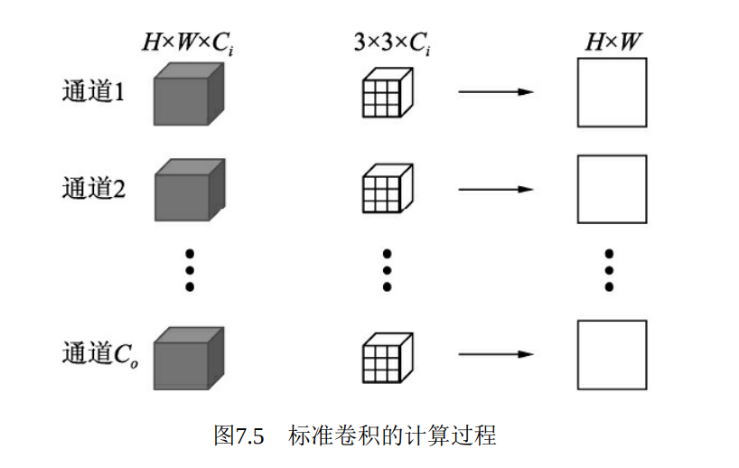
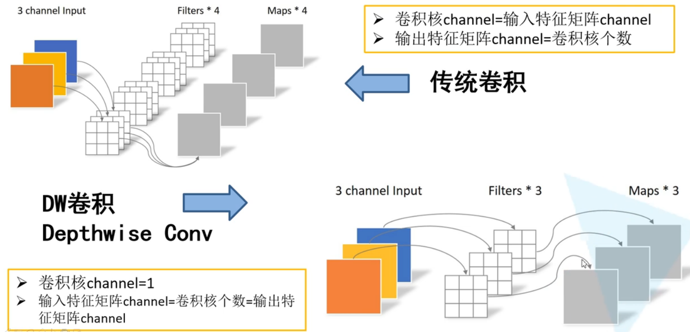
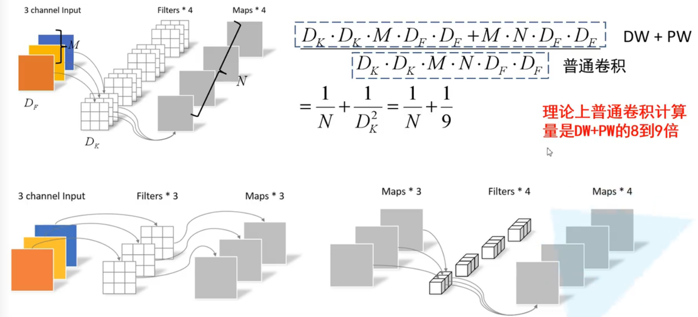
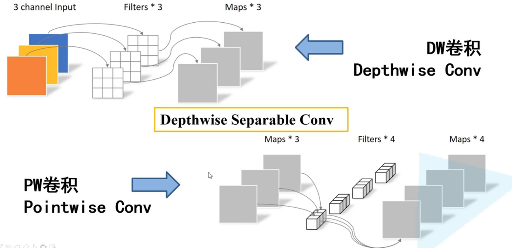
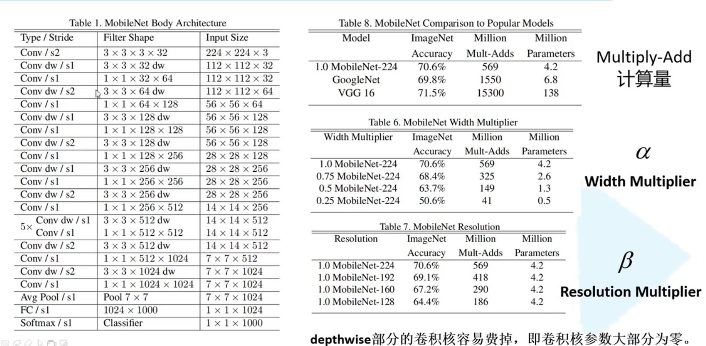
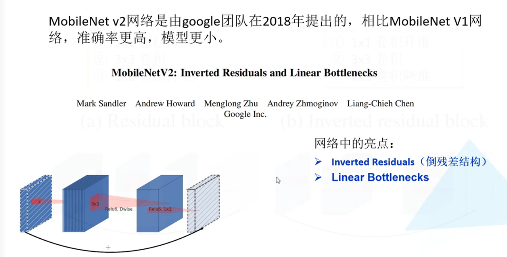
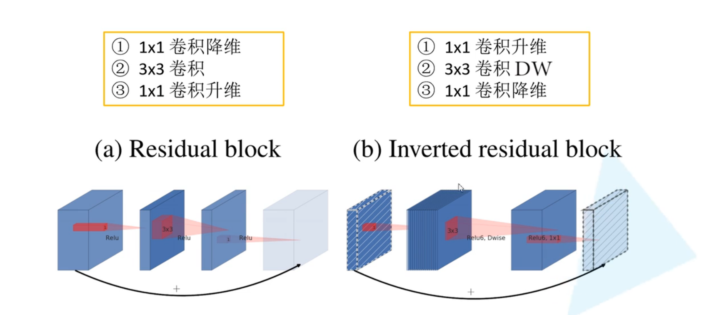
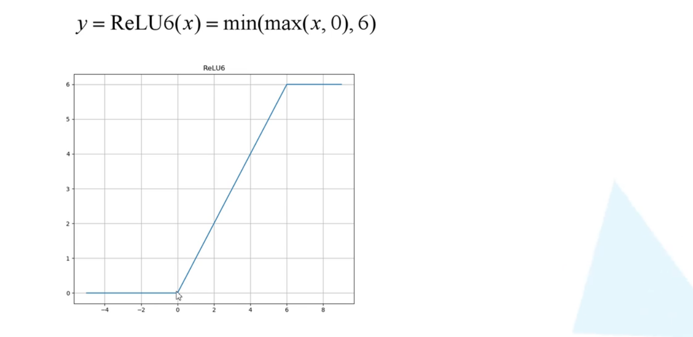
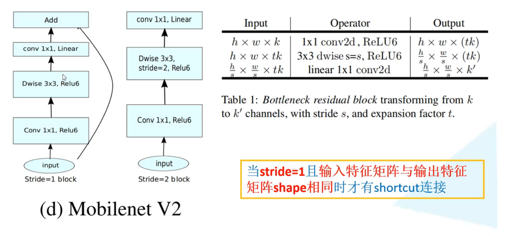
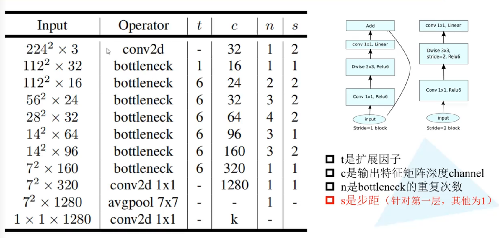

# 6.2深度可分离MobileNet

[MobileNet讲解](https://www.bilibili.com/video/BV1yE411p7L7/?spm_id_from=333.788&vd_source=545d25bc2e2abd95f96465b4df4a7da8)

[代码讲解](https://www.bilibili.com/video/BV1qE411T7qZ/?spm_id_from=333.788&vd_source=545d25bc2e2abd95f96465b4df4a7da8)

# MobileNet v1简介
深度可分离卷积（Depthwise Separable Convolution），将卷积的过程分为逐通道卷积与逐点1×1卷积两步。虽然深度可分离卷积将一步卷积过程扩展为两步，但减少了冗余计算，因此总体上计算量有了大幅度降低。MobileNet也大量采用了深度可分离卷积作为基础单元。

逐通道卷积的计算过程如图7.6所示，对于一个通道的输入特征H×W，利用一个3×3卷积核进行点乘求和，得到一个通道的输出H×W。然后，对于所有的输入通道Ci，使用Ci个3×3卷积核即可得到Ci×H×W大小的输出。

逐通道卷积的总计算量 Fd=Ci×3×3×H×W

逐通道卷积有如下几个特点： ·卷积核参数量为Ci×3×3，远少于标准卷积Ci×3×3×Co的数量。 ·通道之间相互独立，没有各通道间的特征融合，这也是逐通道卷积的核心思想，例如图7.6中输出特征的每一个点只对应输入特征一个通道上的3×3大小的特征，而不是标准卷积中Ci×3×3大小。 ·由于只在通道间进行卷积，导致输入与输出特征图的通道数相 同，无法改变通道数。

DW卷积与普通卷积

深度可分离卷积（Depthwise Separable Convolution）

MobileNet结构

v1 缺陷以下两点： ·模型结构较为复古，采用了与VGGNet类似的卷积简单堆叠，没有采用残差、特征融合等先进的结构。 ·深度分解卷积中各通道相互独立，卷积核维度较小，输出特征中只有较少的输入特征，再加上ReLU激活函数，使得输出很容易变为0，难以恢复正常训练，因此在训练时部分卷积核容易被训练废掉。

# MobileNet v2简介
MobileNet v2中，由于使用了深度可分离卷积来逐通道计算，本身计算量就比较少，因此在此可以使用1×1卷积来升维，在计算量增加不大的基础上获取更好的效果，最后再用1×1卷积降维。这种结构中间宽两边窄，类似于柳叶，该结构也因此被称为Inverted Residual Block。

深度可分离卷积得到的特征对应于低维空间，特征较少，如果后续接线性映射则能够保留大部分特征，而如果接非线性映射如ReLU，则会破坏特征，造成特征的损耗，从而使得模型效果变差。 针对此问题，MobileNet v2直接去掉了每一个Block中最后的ReLU6层采用线性层激活，减少了特征的损耗，获得了更好的检测效果。

 总体上，MobileNet v2在原结构的基础上进行了简单的修改，通过 较少的计算量即可获得较高的精度，非常适合于移动端的部署。  

> 更新: 2023-04-26 22:07:39  
> 原文: <https://3dcv.yuque.com/org-wiki-3dcv-mm1l0t/qe88dq/suophf>