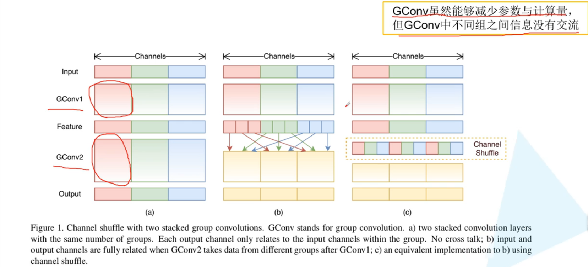
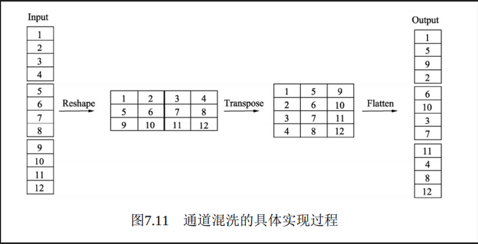
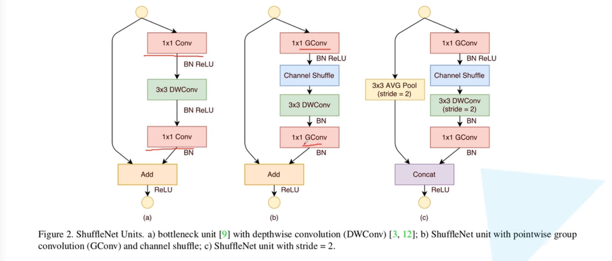
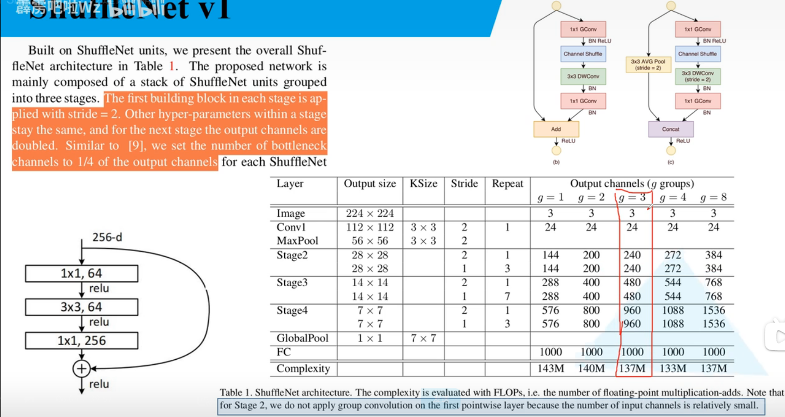
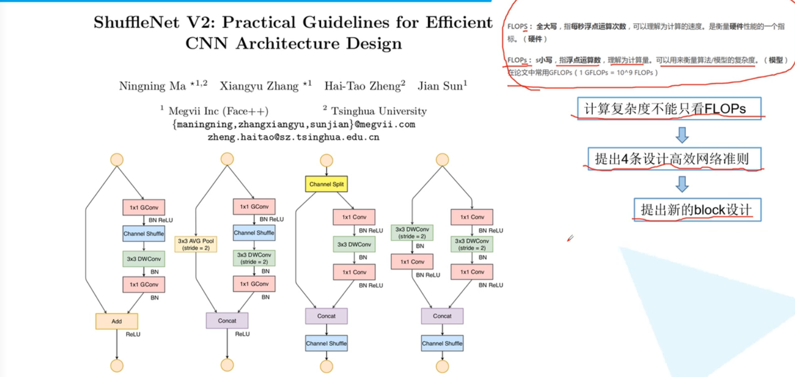
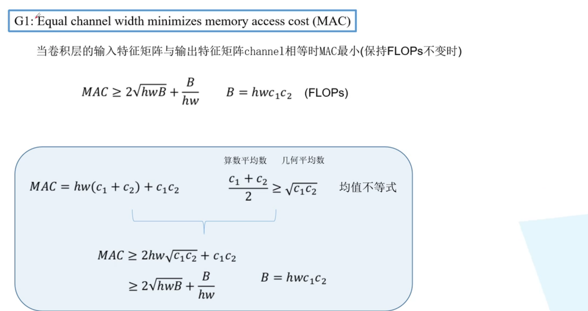
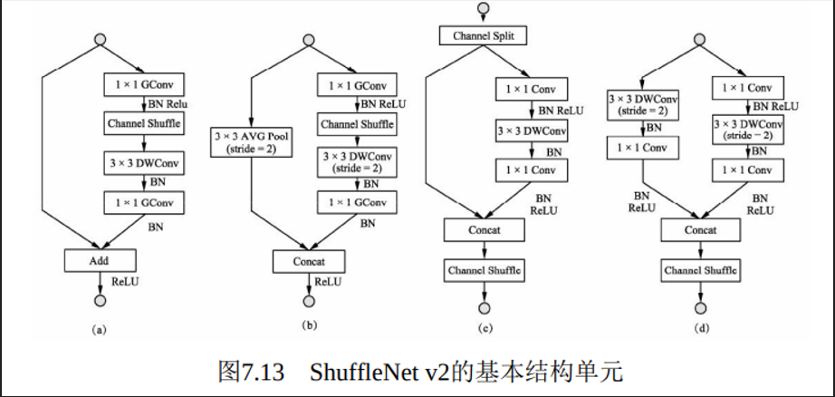
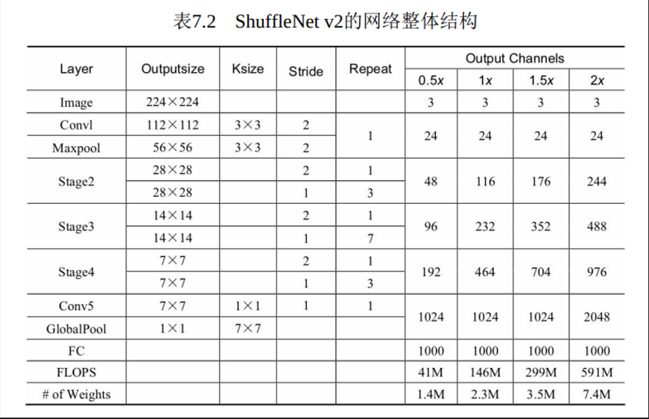

# 6.3 通道混洗ShuffleNet

[原理讲解](https://www.bilibili.com/video/BV15y4y1Y7SY?spm_id_from=333.999.0.0&vd_source=545d25bc2e2abd95f96465b4df4a7da8)

[代码讲解](https://www.bilibili.com/video/BV1dh411r76X/?spm_id_from=333.788&vd_source=545d25bc2e2abd95f96465b4df4a7da8)

#  <font style="color:rgb(0, 0, 0);">ShuffleNet v1</font>
<font style="color:rgb(0, 0, 0);">a图代表了常规的两个组卷积操作，可以看到，如果没有逐点的1×1卷积或者通道混洗，最终输出的特征仅由一部分输入通道的特征计算得出，这种操作阻碍了信息的流通，进而降低了特征的表达能力。</font>



<font style="color:rgb(0, 0, 0);">为了更好地讲解实现过程，这里对输入通道做了1~12的编号，一共包含3个组，每个组包含4个通道。如图所示</font>




<font style="color:rgb(0, 0, 0);">Reshape：首先将输入通道一个维度Reshape成两个维度，一个是卷积组数，一个是每个卷积组包含的通道数。</font>

<font style="color:rgb(0, 0, 0);">Transpose：将扩展出的两维进行置换。</font>

<font style="color:rgb(0, 0, 0);">Flatten：将置换后的通道Flatten平展后即可完成最后的通道混洗。</font>

```plain
def channel_shuffle(x, groups):
      batchsize, num_channels, height, width = x.data.size()
      channels_per_group = num_channels // groups
      # Reshape操作，将通道扩展为两维
      x = x.view(batchsize, groups, channels_per_group, height, width)
      # Transpose操作，将组卷积两个维度进行置换
      x = torch.transpose(x, 1, 2).contiguous()
      # Flatten操作，两个维度平展成一个维度
      x = x.view(batchsize, -1, height, width)
      return x

```

  
 <font style="color:rgb(0, 0, 0);">a 图是一个带有深度可分离卷积的残差模块，这里的1×1是逐点的卷积。相比深度可分离卷积，1×1计算量较大。</font>

<font style="color:rgb(0, 0, 0);">b 图则是基本的ShuffleNet基本单元，可以看到1×1卷积采用的是组卷积，然后进行通道的混洗，这两步可以取代1×1的逐点卷积，并且大大降低了计算量。3×3卷积仍然采用深度可分离的方式。</font>

<font style="color:rgb(0, 0, 0);">c 图是带有降采样的ShuffleNet单元，在旁路中使用了步长为2的3×3平均池化进行降采样，在主路中3×3卷积步长为2实现降采样。另外，由于降采样时通常要伴有通道数的增加，ShuffleNet直接将两分支拼接在一起来实现了通道数的增加，而不是常规的逐点相加。</font>



  
 <font style="color:rgb(0, 0, 0);">g代表组卷积的组数，以控制卷积连接的稀疏性。组数越多，计算量越少，因此在相同的计算资源，可以使用更多的卷积核以获取更多的通道数。</font>

<font style="color:rgb(0, 0, 0);">ShuffleNet在3个阶段内使用了其特殊的基本单元，这3个阶段的第一个Block的步长为2以完成降采样，下一个阶段的通道数是上一个的两倍。</font>

<font style="color:rgb(0, 0, 0);">深度可分离卷积虽然可以有效降低计算量，但其存储访问效率较差，因此第一个卷积并没有使用ShuffleNet基本单元，而是只在后续3个阶段使用</font>

# <font style="color:rgb(0, 0, 0);">ShuffleNet v2</font>
<font style="color:rgb(0, 0, 0);">原有的一些轻量化方法在衡量模型性能时，通常使用浮点运算量FLOPs（Floating Point Operations）作为主要指标。FLOPs是指模型在进 行一次前向传播时所需的浮点计算次数，其单位为FLOP，可以用来衡量模型的复杂度。</font>

<font style="color:rgb(0, 0, 0);">然而，通过一系列实验发现ShuffleNet v2仅仅依赖FLOPs是有问题的，FLOPs近似的网络会存在不同的速度，还有另外两个重要的指标： 内存访问时间（Memory Access Cost，MAC）与网络的并行度。</font>



 原有的一些轻量化方法在衡量模型性能时，通常使用浮点运算量 FLOPs（Floating Point Operations）作为主要指标。FLOPs是指模型在进 行一次前向传播时所需的浮点计算次数，其单位为FLOP，可以用来衡 量模型的复杂度。 然而，通过一系列实验发现ShuffleNet v2仅仅依赖FLOPs是有问题 的，FLOPs近似的网络会存在不同的速度，还有另外两个重要的指标： 内存访问时间（Memory Access Cost，MAC）与网络的并行度。  



<font style="color:rgb(0, 0, 0);">建立高性能网络的4个基本规则：</font>

<font style="color:rgb(0, 0, 0);">（1）卷积层的输入特征与输出特征通道数相等时，MAC最小，此时模型速度最快。</font>

<font style="color:rgb(0, 0, 0);">（2）过多的组卷积会增加MAC，导致模型的速度变慢。</font>

<font style="color:rgb(0, 0, 0);">（3）网络的碎片化会降低可并行度，这表明模型中分支数量越少，模型速度会越快。</font>

<font style="color:rgb(0, 0, 0);">（4）逐元素（Element Wise）操作虽然FLOPs值较低，但其MAC较高，因此也应当尽可能减少逐元素操作。</font>

<font style="color:rgb(0, 0, 0);">出ShuffleNet v1有3点违反了此规则：</font>

<font style="color:rgb(0, 0, 0);">·在Bottleneck中使用了1×1组卷积与1×1的逐点卷积，导致输入输出通道数不同，违背了规则1与规则2。</font>

<font style="color:rgb(0, 0, 0);">·整体网络中使用了大量的组卷积，造成了太多的分组，违背了规则3。</font>

<font style="color:rgb(0, 0, 0);">·网络中存在大量的逐点相加操作，违背了规则4。</font>

所以提出了v2版本

  
 <font style="color:rgb(0, 0, 0);">前面两个为ShuffleNet v1,后面两个为ShuffleNet v2。</font>

<font style="color:rgb(0, 0, 0);">ShuffleNet v2的基本单元有如下3点新特性：</font>

<font style="color:rgb(0, 0, 0);">1 提出了一种新的Channel Split操作，将输入特征分成两部分，一部分进行真正的深度可分离计算，将计算结果与另一部分进行通道Concat，最后进行通道的混洗操作，完成信息的互通。</font>

<font style="color:rgb(0, 0, 0);">2 整个过程没有使用到1×1组卷积，也避免了逐点相加的操作。</font>

<font style="color:rgb(0, 0, 0);">3 在需要降采样与通道翻倍时，ShuffleNet v2去掉了Channel Split操作，这样最后Concat时通道数会翻倍</font>




> 更新: 2023-04-26 22:07:40  
> 原文: <https://3dcv.yuque.com/org-wiki-3dcv-mm1l0t/qe88dq/zvtbfx>