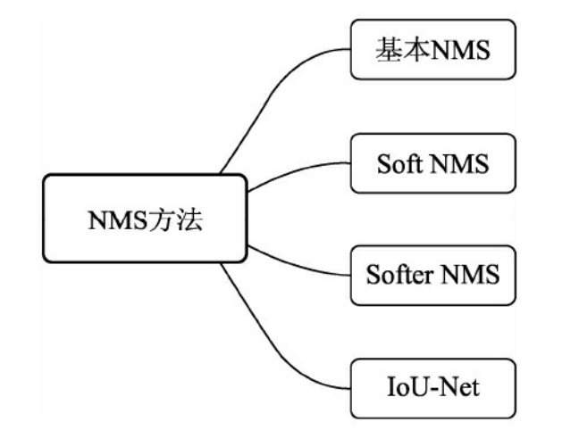
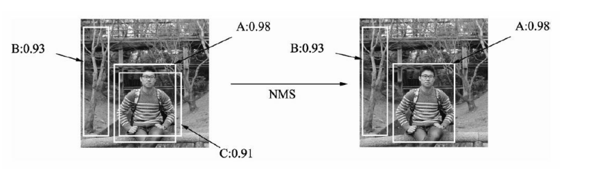
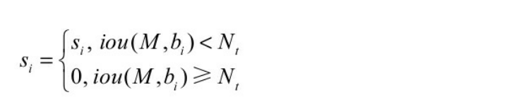
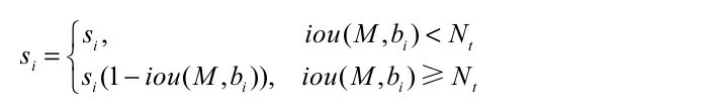
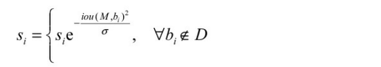
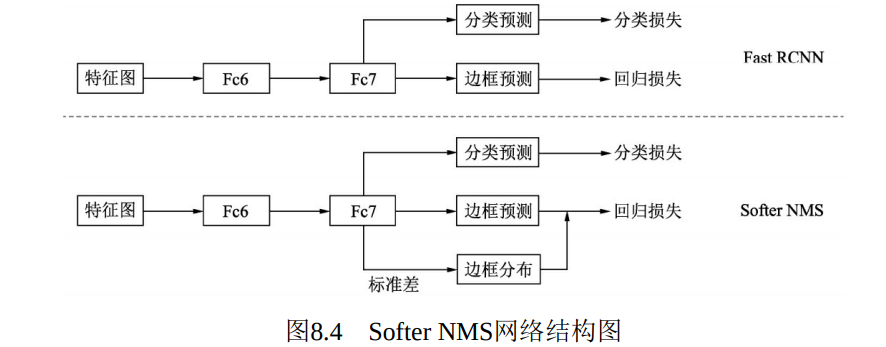
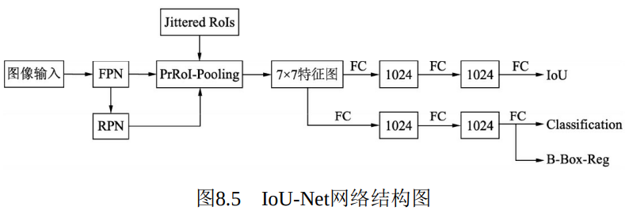
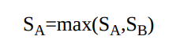
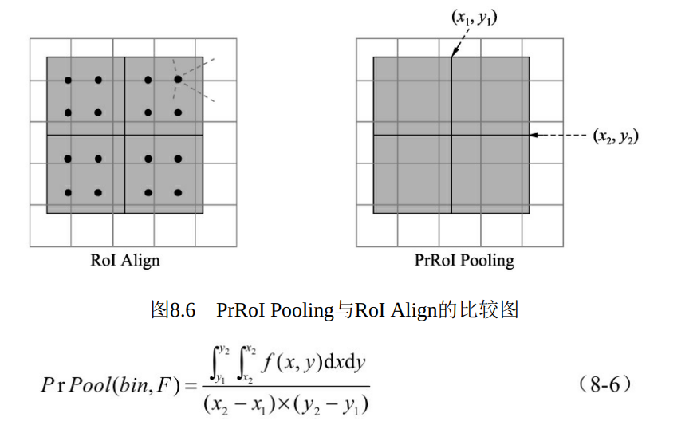

# 7.1 NMS 非极大值抑制

[视频讲解](https://www.bilibili.com/video/BV12h411J7s2?spm_id_from=333.337.search-card.all.click&vd_source=545d25bc2e2abd95f96465b4df4a7da8)  NMS

[视频讲解](https://www.bilibili.com/video/BV1Lz411B7nQ?spm_id_from=333.337.search-card.all.click&vd_source=545d25bc2e2abd95f96465b4df4a7da8) NMS 、 soft NMS

# NMS
NMS方法

 NMS基本过程  

 为了保证物体检测的召回率，在Faster RCNN或者SSD网络的计算 输出中，通常都会有不止一个候选框对应同一个真实物体。如下图左 边图片中存在3个候选框，但是候选框A与C对应的是同一个物体，由于 C的得分比A要低，在评测时，C候选框会被当做一个False Positive来看 待，从而降低模型精度。实际上，由于候选框A的质量要比C好，理想 的输出是A而不是C，我们希望能够抑制掉候选框C。  

NMS 非极大值抑制，顾名思义就是抑制不是极大值的边框，这里的抑制通常是直接去掉冗余的边框。过程涉及以下两个量化指标

1 预测得分：NMS假设一个边框的预测得分越高，这个框就要被优先考虑，其他与其重叠超过一定程度的边框要被舍弃，非极大值即是指得分的非极大值。

2 IoU：在评价两个边框的重合程度时，NMS使用了IoU这个指标。如果两个边框的IoU超过一定阈值时，得分低的边框会被舍弃。阈值通常会取0.5或者0.7。

 NMS存在一个非常简约的实现方法，算法输入包含了所有预测框的 得分、左上点坐标、右下点坐标一共5个预测量，以及一个设定的IoU阈 值。具体流程如下：  

 （1）按照得分，对所有边框进行降序排列，记录下排列的索引 order，并新建一个列表keep，作为最终筛选后的边框索引结果。 

（2）将排序后的第一个边框置为当前边框，并将其保留到keep 中，再求当前边框与剩余所有框的IoU。 

（3）在order中，仅仅保留IoU小于设定阈值的索引，重复第（2） 步，直到order中仅仅剩余一个边框，则将其保留到keep中，退出循环， NMS结束。  

 NMS方法虽然简单有效，但在更高的物体检测需求下，也存在如下 4个缺陷：  

1 最大的问题就是将得分较低的边框强制性地去掉，如果物体出现较为密集时，本身属于两个物体的边框，其中得分较低的也有可能被抑制掉，从而降低了模型的召回率。

2 阈值难以确定。过高的阈值容易出现大量误检，而过低的阈值则容易降低模型的召回率，这个超参很难确定。

3 将得分作为衡量指标。NMS简单地将得分作为一个边框的置信度，但在一些情况下，得分高的边框不一定位置更准，因此这个衡量指标也有待考量。

4 速度：NMS的实现存在较多的循环步骤，GPU的并行化实现不是特别容易，尤其是预测框较多时，耗时较多。

# Soft NMS 抑制得分
NMS最大的问题就是将得分较低的边框强制性地去掉，如果物体出现较为密集时，本身属于两个物体的边框，其中得分较低的也有可能被抑制掉，从而降低了模型的召回率。

基于此原因，诞生了Soft NMS方法，利用一行代码即改进了强硬的NMS方法。简而言之，Soft NMS对于IoU大于阈值的边框，没有将其得分直接置0，而是降低该边框的得分

 NMS的计算公式  :

 公式中Si代表了每个边框的得分，M为当前得分最高的框，bi为剩 余框的某一个，Nt为设定的阈值，可以看到当IoU大于Nt时，该边框的 得分直接置0，相当于被舍弃掉了，从而有可能造成边框的漏检。  

 Soft NMS对于IoU大于阈值的边框，没有将其得 分直接置0，而是降低该边框的得分，具体方法如式  

 利用边框的得分与IoU来确定新的边框得分， 如果当前边框与边框M的IoU超过设定阈值Nt时，边框的得分呈线性的衰减。   但是，上式并不是一个连续的函数，当一个边框与M的重叠 IoU超过阈值Nt时，其得分会发生跳变，这种跳变会对检测结果产生较 大的波动，因此还需要寻找一个更为稳定、连续的得分重置函数，最终 Soft NMS给出了如下式所示的重置函数。  

 Soft NMS 也是一种贪心算法，并不能保证找到最优的得分重置映射。  

#  Softer NMS   加权平均
 Softer NMS方法对预测边框 与真实物体做了两个分布假设：  

1 真实物体的分布是狄拉克delta分布，即标准方差为0的高斯分布的 极限。

2 预测边框的分布满足高斯分布。  

 基于这两个假设，Softer NMS提出了一种基于KL（Kullback-Leibler）散度的边框回归损失函数KL loss。KL散度是用来衡量两个概 率分布的非对称性衡量，KL散度越接近于0，则两个概率分布越相似。  

 具体到边框上，KL Loss是最小化预测边框的高斯分布与真实物体 的狄克拉分布之间的KL散度。即预测边框分布越接近于真实物体分 布，损失越小。  

 Softer NMS提出了如下图所示的预测结构  

 Softer NMS在原Fast RCNN预测的 基础上，增加了一个标准差预测分支，从而形成边框的高斯分布，与边框的预测一起可以求得KL损失。

Softer NMS在原Fast RCNN预测的基础上，增加了一个标准差预测分支，从而形成边框的高斯分布，Softer NMS通过提出的KL Loss与加权平均的NMS策略， 在多个数据集上有效提升了检测边框的位置精度。

# IoU-Net 定位置信度
基础架构与原始的Faster RCNN类似，使用了FPN方法作为基础特征提取模块，然后经过RoI的Pooling得到固定大小的特征图，利用全连接网络完成最后的多任务预测。

IoU-Net与Faster RCNN也有不同之处

1 在Head处增加了一个IoU预测的分支，与分类回归分支并行。图8.5中的Jittered RoIs模块用于IoU分支的训练。

2 基于IoU分支的预测值，改善了NMS的处理过程。

3 提出了PrRoI-Pooling（Precise RoI Pooling）方法，进一步提升了感兴趣区域池化的精度。

IoU预测的分支。训练时IoU-Net通过自动生成候选框的方式来训练IoU分支，而不是从RPN获取。Jittered RoIs在训练集的真实物体框上增加随机扰动，生 成了一系列候选框，并移除与真实物体框IoU小于0.5的边框。IoU预测分支的训练数据需要从每一批的输入图像中单独生成。此外，还需要对IoU分支的标签进行归一化，保证其分布在-1,1区间中。

基于定位置信度的NMS。IoU预测值可以作为边框定位的置信度，因此可以利用其来改善NMS过程。IoU-Net利用IoU的预测值作为边框排列的依据，并抑制掉与当前框IoU超过设定阈值的其他候选框。 在NMS过程中，IoU-Net还做了置信度的聚类，即对于匹配到同一真实物体的边框，类别也需要拥有一致的预测值。具体做法是，在NMS过程中，当边框A抑制边框B时，通过下式来更新边框A的分类置信度。

IoU-Net提出了PrRoI Pooling方法，采用积分的方式实现了更为精准的感兴趣区域池化，与RoI Align只采样4个点不同，PrRoI Pooling方法将整个区域看做 是连续的，采用如下式的积分公式求解每一个区域的池化输出值，区域内的每一个点（x,y）都可以通过双线性插值的方法得到。这种方法还有一个好处是其反向传播是连续可导的，因此避免了任何的量化过程

> 更新: 2023-04-26 22:07:44  
> 原文: <https://3dcv.yuque.com/org-wiki-3dcv-mm1l0t/qe88dq/qdzr08>