# 7.2 样本不均衡问题

# 样本不均衡
 由于检测算法各不相同，以及数据集之间的差异，可能会存在正负样本、难易样本、类别间样本这3种不均衡问题  。

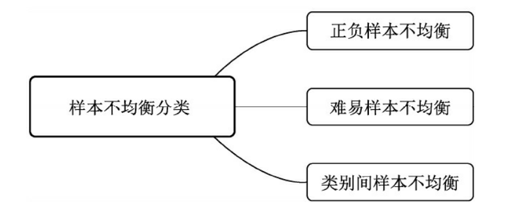

正负样本不均衡。有核心价值的是对应着真实物体的正样本，在训练时会根据其loss来调整网络参数。相比之下，负样本对应着图像的背景，如果有大量的负样本参与训练，则会淹没正样本的损失，从而降低网络收敛的效率与检测精度。

难易样本不均衡。难样本指的是分类不太明确的边框，处在前景与背景的过渡区域上，在网络训练中难样本损失会较大， 大量的样本并非处在前景与背景的过渡区，而是与真实物体没有重叠区域的负样本，或者与真实物体重叠程度很高的正样本，这部分被称为简单样本，单个损失会较小，对参数收敛的作用有限。虽然简单样本单个损失小，但由于数量众多，因此如果全都计算损失的话，其损失也会比难样本大很多，这种难易样本的不均衡也会影响模型的收敛与精度

类别间样本不均衡

针对以上3种不均衡问题，经典的物体检测算法在处理样本时，总体上有如下4种缓解办法:

1 Faster RCNN、SSD等算法在正负样本的筛选时，根据样本与真实物体的IoU大小，设置了3∶1的正负样本比例，这一点缓解了正负样本的不均衡，同时也对难易样本不均衡起到了作用。

2 Faster RCNN在RPN模块中，通过前景得分排序筛选出了2000个左右的候选框，这也会将大量的负样本与简单样本过滤掉，缓解了前两个不均衡问题。

3 权重惩罚：对于难易样本与类别间的不均衡，可以增大难样本与少类别的损失权重，从而增大模型对这些样本的惩罚，缓解不均衡问题。

4 数据增强：从数据侧入手，可以在当前数据集上使用随机生成和添加扰动的方法，也可以利用网络爬虫数据等增加数据集的丰富性，从而缓解难易样本和类别间样本等不均衡问题，可以参考SSD的数据增强方法。

# 在线难样本挖掘OHEM
OHEM可以看做是HNM在物体检测算法上的应用，在实现时选择了Fast RCNN作为基础检测算法。Fast RCNN与Faster RCNN类似，采用了两阶结构，在第二个阶段通过RCNN网络得到了边框的预测值，接下来使用了如下3点标准来确定正、负样本。

1 当前RoI与真实物体的IoU大于0.5时，判定为正样本。

2 当前RoI与真实物体的IoU大于0且小于0.5时，判定为负样本。

3 为了均衡正、负样本的数量，控制正、负样本的比例为1∶3，总数量不超过256。通过这种方式有效缓解了正、负样本的不均衡。

OHEM将交替训练与SGD优化方法进行了结合，在每张图片的RoI中选择了较难的样本，实现了在线的难样本挖掘。

OHEM实现在线难样本挖掘的网络如图下所示。图中包含了两个相同的RCNN网络，上半部的a部分是只可读的网络，只进行前向运算；下半部的b网络即可读也可写，需要完成前向计算与反向传播。

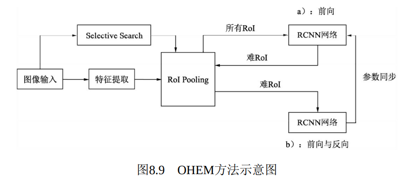

在一个batch的训练中，基于Fast RCNN的OHEM算法可以分为以下5步：

（1）按照原始Fast RCNN算法，经过卷积提取网络与RoI Pooling得到了每一张图像的RoI。

（2）上半部的a网络对所有的RoI进行前向计算，得到每一个RoI的损失。

（3）对RoI的损失进行排序，进行一步NMS操作，以去除掉重叠严重的RoI，并在筛选后的RoI中选择出固定数量损失较大的部分，作为难样本。

（4）将筛选出的难样本输入到可读写的b网络中，进行前向计算，得到损失。

（5）利用b网络得到的反向传播更新网络，并将更新后的参数与上半部的a网络同步，完成一次迭代。

# 专注难样本Focal Loss
为了解决一阶网络中样本的不均衡问题，何凯明等人首先改善了分类过程中的交叉熵函数，提出了可以动态调整权重的Focal Loss。为了形成对比，接下来分别介绍标准交叉熵、平衡交叉熵及Focal Loss。

## 标准交叉熵损失 CE
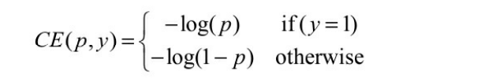

p代表样本在该类别的预测概率，y代表样本标签。可以看出，当标签为1时，p越接近1，则损失越小；标签为0时p越接近0，则损失越小，符合优化的方向。

将p标记为pt：

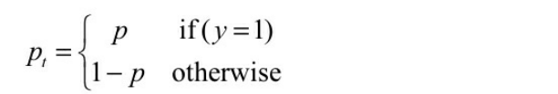

交叉熵可以表示为式

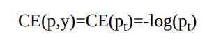

## 平衡交叉熵损失
为了改善样本的不平衡问题，平衡交叉熵在标准的基础上增加了一个系数αt来平衡正、负样本的权重，αt由超参α α取值在[0,1]区间内

 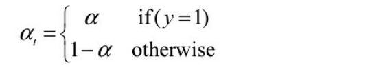

有了αt，平衡交叉熵损失公式

     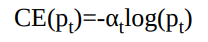

#  专注难样本Focal Loss  
Focal Loss为了同时调节正、负样本与难易样本，提出了损失函数。

       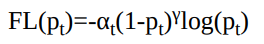

 对于该损失函数，有如下3个属性：  

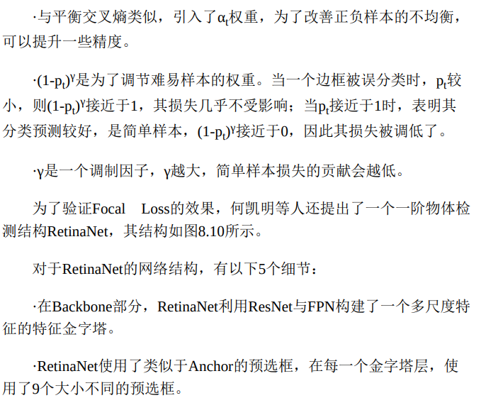

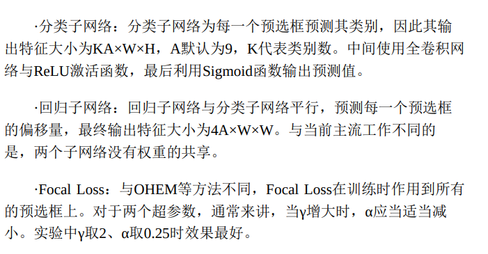

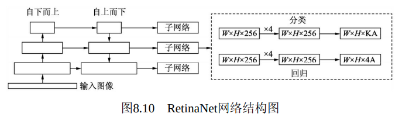

> 更新: 2023-05-25 14:31:12  
> 原文: <https://3dcv.yuque.com/org-wiki-3dcv-mm1l0t/qe88dq/gbwkxk>