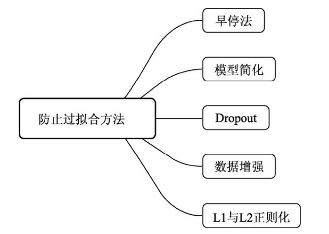
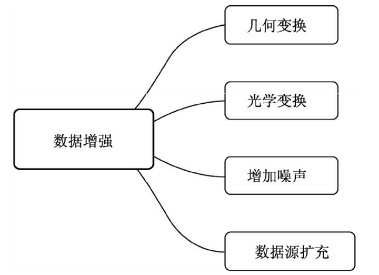
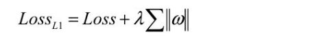
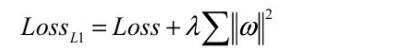
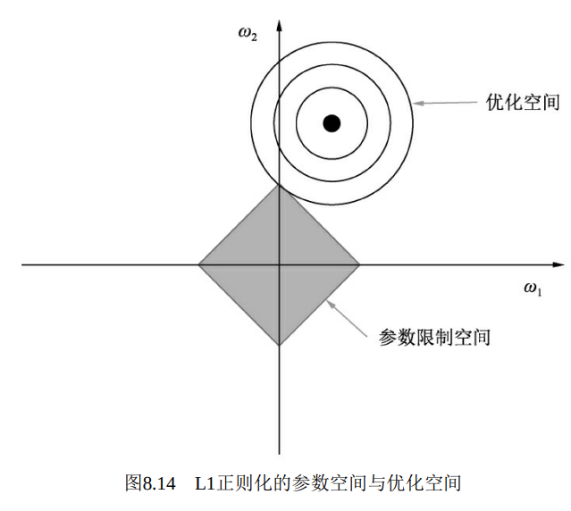
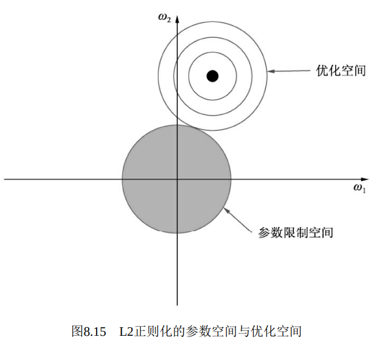

# 7.3 模型过拟合

# 简介
 对于物体检测算法来说，模型过拟合是经常发生的一个现象。在训练过程中训练集与验证集的误差变化。在训练初期，验 证集的误差是随着训练集的误差下降而下降的，这时候模型在充分学习 数据的分布空间，对数据拟合得越来越好。

 然而，当训练次数超出一定步数后，训练集的误差虽然仍在下降， 但验证集的误差却在逐渐上升，此时就发生了过拟合现象。 通常，训练集的数据量有限，只是全局数据的子集，数据分布总是 会与全局数据存在偏差。当训练超过一定程度后，模型对数据分布拟合 地很充分了，训练数据的轻微扰动都会导致模型发生显著变化。因此， 过拟合现象的本质其实是模型学习到了训练数据自身的特性，非全局的 特性。    

 由于检测算法各不相同，以及数据集之间的差异，可能会存在正负样本、难易样本、类别间样本这3种不均衡问题。

 当前几种主流的防止模型过拟合的方法。  

1 早停法：在训练时，每隔一段时间就在验证集上做评估，当验证集误差出现增大时则停止训练，这是最实际有效的一个防止过拟合的方法。

2 简化模型：当数据不够充分时，如果模型的拟合能力过强，也容易陷入过拟合。因此，可以在不太影响模型精度的前提下，通过减少模型的深度等方法， 适当地简化模型结构。

3 Dropout：在第3章中已有详细介绍，其思想主要是在训练阶段以概率p保留每个神经元，以1-p的概率丢弃该神经元。Dropout也属于正则化方法的一种，通过这种方式可以使模型不强依赖于某些神经元，因而增加其泛化能力，减少过拟合，一般应用于全连接网络。

4 数据增强和L1、L2正则化下面介绍

# 数据增强
实际中我们能获得的数据通常是有限的，因此可以通过数据增强的手段来扩展数据集。 SSD中的数据预处理部分是一个经典的数据增强过程。通常来讲，我们可以从4个方面去尝试进行数据增强，

·几何变换：可以丰富物体在图像中出现的位置和尺度等，从而满足模型的平移不变性与尺度不变性，例如平移、翻转、缩放和裁剪等操作。尤其是水平翻转180°，在多个物体检测算法中都有使用，效果很好。

·光学变换：可以增加不同光照和场景下的图像，典型操作有亮度、对比度、色相与饱和度的随机扰动、通道色域之间的交换等。

·增加噪声：通过在原始图像上增加一定的扰动，如高斯噪声，可以使模型对可能遇到的噪声等自然扰动产生鲁棒性，从而提升模型的泛化能力。需要注意噪声不能过大，以免影响模型的输出。

·数据源头：有时为了扩充数据集，可以将检测物体与其他背景图像融合，通过替换物体背景的方式来增加数据集的丰富性。 数据增强不仅可以防止模型的过拟合，对于模型的检测性能也通常会有较大的提升。

# L1与L2正则化
L1与L2正则化

正则化通常是指对模型参数进行限制，增加模型的泛化能力，是一个非常有效的防止模型过拟合的方法。

L1与L2正则是最常用的两种正则化手段，主要是通过在损失函数中增加一项对网络参数的约束，使得参数渐渐变小，模型趋于简单，以防止过拟合。

L1正则化的损失函数

ω代表网络中的参数，超参数λ需要人为指定。需要注意的是，L1使用绝对值来约束参数，导致其在0点不可微分，这种情况下参数ω很有可能最终被约束为0。

优化空间与参数限制空间有很大的概率相交于ω1与ω2的坐标轴上，即使扩展到更高的参数维度，L1的参数限制空间始终存在尖锐的凸点，因此L1正则化会导致参数的稀疏化。如果需要做模型的压缩，L1正则是一个不错的选择

L2正则化则使用了平方函数来约束网络参数，其损失函数

> 更新: 2023-05-25 14:32:18  
> 原文: <https://3dcv.yuque.com/org-wiki-3dcv-mm1l0t/qe88dq/dagnro>