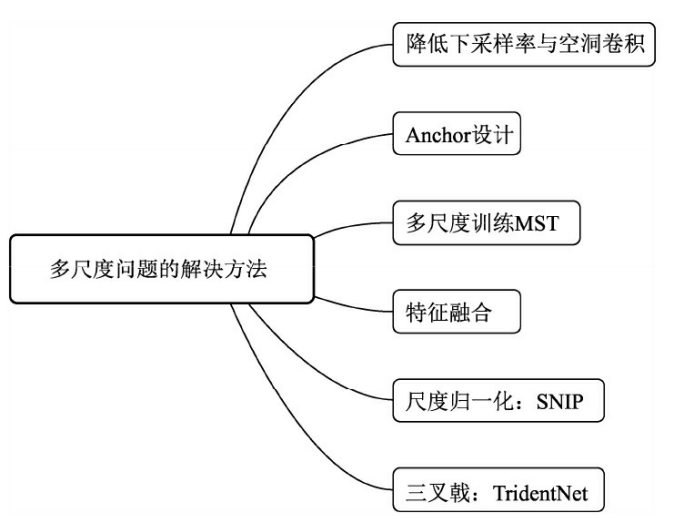
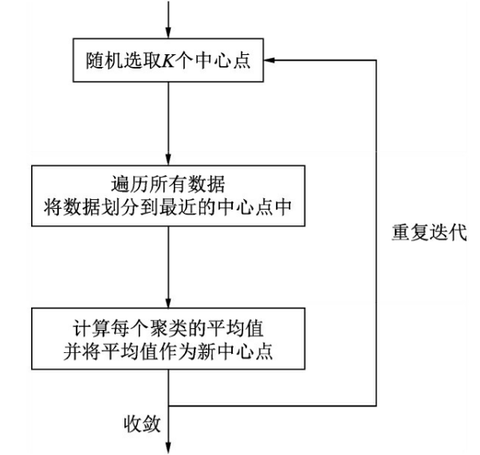
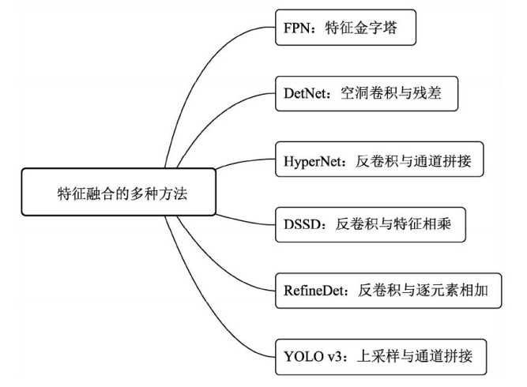
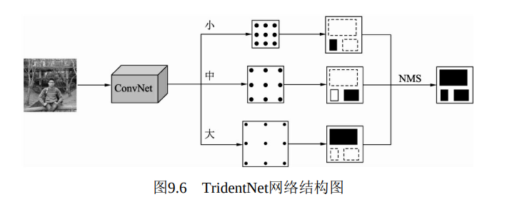
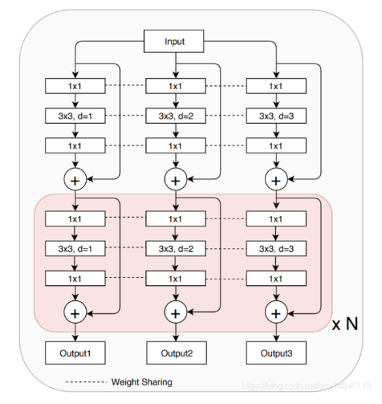

# 8.1.1 多尺度检测

# 多尺度问题
多尺度的物体中，大尺度的物体由于面积大、特征丰富，通常来讲较为容易检测。难度较大的主要是小尺度的物体小物体通常有如下两种定义方式

·绝对尺度：一般尺寸小于32×32的物体可以视为小物体。

·相对尺度：物体宽高是原图宽高的1/10以下，可以视为小物体。

检测算法对于小物体并不友好，体现在以下4个方面：

·过大的下采样率：假设当前小物体尺寸为15×15，一般的物体检测中卷积下采样率为16，这样在特征图上，小物体连一个点都占据不到。

·过大的感受野：在卷积网络中，特征图上特征点的感受野比下采样率大很多，导致在特征图上的一个点中，小物体占据的特征更少，会包含大量周围区域的特征，从而影响其检测结果。

·语义与空间的矛盾：当前检测算法，如Faster RCNN，其Backbone大都是自上到下的方式，深层与浅层特征图在语义性与空间性上没有做到更好的均衡。

·SSD缺乏特征融合：SSD虽然使用了多层特征图，但浅层的特征图语义信息不足，没有进行特征的融合，致使小物体检测的结果较差。

#  降低下采样率与空洞卷积  
 对于小物体检测而言，降低网络的下采样率也许是最为简单的提升 方式，通常的做法是直接去除掉Pooling层。   如果仅仅去除 掉Pooling层，则会减小后续层的感受野。如果使用预训练模型进行微调 （Fine-tune），则仅去除掉Pooling层会使得后续层感受野与预训练模型 对应层的感受野不同，从而导致不能很好地收敛。   因此，我们需要在去除Pooling的前提下增加后续层的感受野，空洞 卷积就派上用场了。   采用空洞卷积也不能保证修改后与修改前的感受野 完全相同，但能够最大限度地使感受野在可接受的误差内。  

#  Anchor设计  
Anchor的设计对于小物体的检测也尤为重要，如果Anchor过大，即使小物体全部在Anchor内，也会因为其自身面积小导致IoU低，从而造成漏检。

统计实验。抛开物体检测的算法，仅仅利用训练集的标签与设计的Anchor进行匹配试验，试验的指标是所有训练标签的召回率，以及正样本的平均IoU值。当然，也可以增加每个标签的正样本数、标签的最大IoU等作为辅助指标。

为了方便地匹配，在此不考虑Anchor与标签的位置偏移，而是把两者的中心点放在一起，仅仅利用其宽高信息进行匹配。这种统计实验实际是通过手工设计的方式，寻找与标签宽高分布最为一致的一组Anchor。

边框聚类。边框聚类时通常使用K-Means算法，这也是YOLO采用的Anchor聚类方法。作为最简单的聚类算法之一，

输入超参数K，即最终想要获得的边框数量，首先随机选取K个中心点，然后遍历所有的数据，并将所有的边框划分到最近的中心点中。

在每个边框都落到不同的聚类后，计算每一个聚类的平均值，并将此平均值作为新的中心点。重复上述过程，直到算法收敛。

# 多尺度训练
多尺度训练（Multi Scale Training，MST）通常是指设置几种不同的图片输入尺度，训练时从多个尺度中随机选取一种尺度，将输入图片缩放到该尺度并送入网络中，是一种简单又有效的提升多尺度物体检测的方法。而在测试时，为了得到更为精准的检测结果，也可以将测试图片的尺度放大，例如放大4倍，这样可以避免过多的小物体。是种十分有效的trick方法，放大了小物体的尺度，同时增加了多尺度物体的多样性。

# 特征融合
FPN：将深层信息上采样，与浅层信息逐元素地相加，从而构建了尺寸不同的特征金字塔结构，性能优越，现已成为物体检测算法的一个标准组件。

DetNet：专为物体检测而生的Backbone，利用空洞卷积与残差结构，使得多个融合后的特征图尺寸相同，从而也避免了上采样操作。

Faster RCNN系列中，HyperNet将第1、3、5个卷积组后得到的特征图进行融合，浅层的特征进行池化、深层的特征进行反卷积，最终采用通道拼接的方式进行融合，优势互补。

SSD系列中，DSSD在SSD的基础上，对深层特征图进行反卷积，与浅层的特征相乘，得到了更优的多层特征图，这对于小物体的检测十分有利。

RefineDet将SSD的多层特征图结构作为了Faster RCNN的RPN网络，结合了两者的优点。特征图处理上与FPN类似，利用反卷积与逐元素相加，将深层特征图与浅层的特征图进行结合，实现了一个十分精巧的检测网络。

YOLO系列中，YOLO v3也使用了特征融合的思想，通过上采样与通道拼接的方式，最终输出了3种尺寸的特征图。

特征融合的普遍缺点是通常会带来一定计算量的增加。

# 尺度归一化：SNIP
SNIP也使用了类似于MST的多尺度训练方法，构建了3个尺度的图像金字塔，但在训练时，只对指定范围内的Proposal进行反向传播，而忽略掉过大或者过小的Proposal。具体的实现细节如下：

1. 3个尺度分别拥有各自的RPN模块，并且各自预测指定范围内的物体。

2  对于大尺度的特征图，其RPN只负责预测被放大的小物体，对于小尺度的特征图，其RPN只负责预测被缩小的大物体，这样真实的物体尺度分布在较小的区间内，避免了极大或者极小的物体。

3  在RPN阶段，如果真实物体不在该RPN预测范围内，会被判定为无效，并且与该无效物体的IoU大于0.3的Anchor也被判定为无效的Anchor。

4  在训练时，只对有效的Proposal进行反向传播。在测试阶段，对有效的预测Boxes先缩放到原图尺度，利用Soft NMS将不同分辨率的预测结果合并。

5  实现时SNIP采用了可变形卷积的卷积方式，并且为了降低对于GPU的占用，将原图随机裁剪为1000×1000大小的图像。

# 三叉戟：TridentNet
TridentNet网络的作者将这3种不同的感受野网络并行化，提出了如图9.6所示的检测框架。采用ResNet作为基础Backbone，前三个stage沿用原始的结构，在第四个stage，使用了三个感受野不同的并行网络。

3个不同的分支使用了空洞数不同的空洞卷积，感受野由小到大，可以更好地覆盖多尺度的物体分布。

由于3个分支要检测的内容是相同的、要学习的特征也是相同的，只不过是形成了不同的感受野来检测不同尺度的物体，因此，3个分支共享权重，这样既充分利用了样本信息，学习到更本质的物体检测信息，也减少了参数量与过拟合的风险。

借鉴了SNIP的思想，在每一个分支内只训练一定范围内的样本，避免了过大与过小的样本对于网络参数的影响。  
 

> 更新: 2023-04-26 22:07:52  
> 原文: <https://3dcv.yuque.com/org-wiki-3dcv-mm1l0t/qe88dq/retleg>