# 8.1.2 拥挤与遮挡

#  遮挡背景  
##  行人之间的自遮挡  
自遮挡会严重影响检测的性能，主要体现在以下两个方面：

1  定位不准确：在提取行人的特征时，遮挡会带来特征的缺失，并且距离很近的行人特征会相互影响，带来干扰，这都会降低行人定位的准确性。

2  对NMS的阈值更为敏感：用于行人靠得很近，如果NMS的阈值较低，则很容易将本属于两个行人的预测框抑制掉一个，造成漏检；而如果阈值较高，很可能会在两个行人之间多了一个错误预测框，造成误检。因此，行人的自遮挡对NMS十分不友好，从而导致检测性能的降低。

## 行人被其他物体遮挡
对于行人检测的遮挡问题，这里总结了目前较为有效的5个解决方法

改进NMS：由于NMS对行人遮挡检测影响很大，因此改进NMS是一个出路，像第8章中的Soft NMS和IoU-Net等方法都能在一定程度上提升遮挡检测的性能。

增加语义信息：遮挡会造成行人部分信息的缺失，因此可以尝试引入额外的特征，如分割信息、梯度和边缘信息等，详细方法可见CVPR 2017中的HyperLearner。

划分多个part处理：由于行人之间的形状较为相似，因此可以利用这个先验信息，将行人按照不同部位，如头部、上身、手臂等划分为多个part进行单独处理，然后再综合考虑，可以在一定程度上缓解遮挡带来的整体信息缺失。

 Repulsion Loss及OR-CNN，则是近两年在行人检 测领域涌现出的性能优越的方法，将介绍两种方法。

# 排斥损失：Repulsion Loss
进一步分析了当前Faster RCNN对于遮挡问题的检测能力。 Faster RCNN对于边框的位置采用了smoothL1函数来计算损失，这里的目的是使RoI更加贴合真实物体的边框。 Repulsion Loss的回归损失

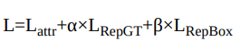

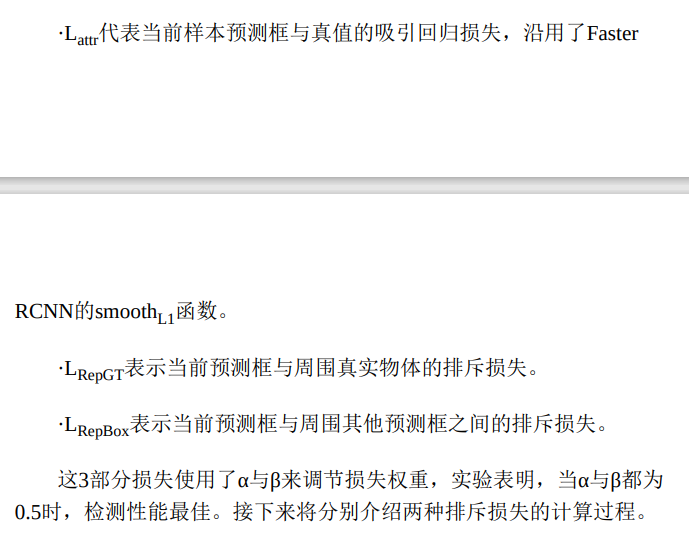

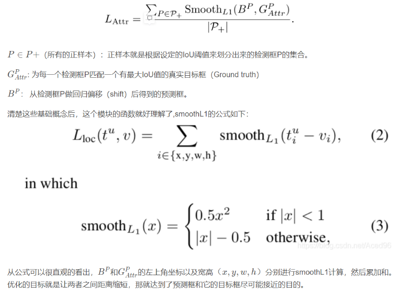

##  与其他标签的排斥 RepGT  
RepGT损失的设计思想是为了让当前预测框尽可能地远离周围的标签物体，这里的周围标签物体指的是，除了预测框本身要回归的物体之外，与该预测框有最大IoU的物体标签，选取公式

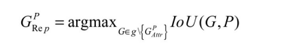

受IoU Loss的启发，这里衡量预测框与周围物体标签的距离使用了如所示的IoG（Intersection over GroundTruth）函数

     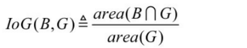

为了最小化IoG，采用了如式所示的Smoothln作为优化函数。

    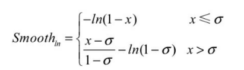

与smoothL1类似，Smoothln也是采用了一阶与更高阶函数的组合，其中引入了超参σ来控制高阶函数的有效范围。需要注意的是，IoG的取 值范围为[0,1]，这一点与smoothL1是不同的。最终形式的所有预测框的RepGT损失如式所示，其中ρ+为所有有效的预测框。

      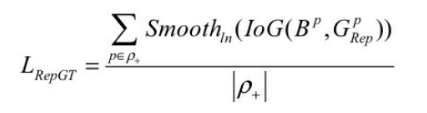

## 与其他预测框的排斥 RepBox
在当前的检测框架中，NMS是非常重要的一个环节，用来抑制掉重叠的边框。然而在拥挤严重的行人检测中，NMS会容易造成边框的漏检。 针对此问题，Repulsion Loss增加了RepBox损失，目的是让预测框尽可能地远离周围预测框，降低两者之间的IoU，从而避免本属于两个物体的预测框，其中一个被NMS抑制掉。

RepBox损失同样也使用了Smoothln作为优化的函数，整体损失公式如下：

          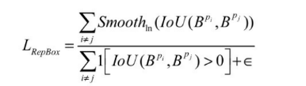 

#  OR-CNN  
在Faster RCNN的基础上，对损失函数及RoI Pooling两处进行了改进，引入了part-based的思想，有效地缓解了行人遮挡的问题。

设计了一种新的损失Aggregation Loss，使得多个匹配到同一个物体标签的Anchor尽量地靠近，具体实现方式为在原有的regression loss基础上加上compactness loss；在RoI Pooling处根据行人部位分为了5个不同的模块，提出了PORoI Pooling（Part Occlusion-aware RoI Pooling）方法。

## 聚集损失  Aggregation Loss
在RPN阶段，聚集损失除了可以使Anchor更靠近物体标签之外，还可以将对应于同一个物体标签的所有Anchor紧密地分布，其损失函数

        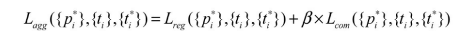

Lreg代表常规的回归损失，可以使Anchor更加靠近要回归的物体标签，沿用了Faster RCNN的smoothL1损失函数，紧密损失Lcom（Compactness Loss），目 的是使得要回归到同一个物体标签的所有Anchor尽可能靠的更近，具体函数形式如下：

                                     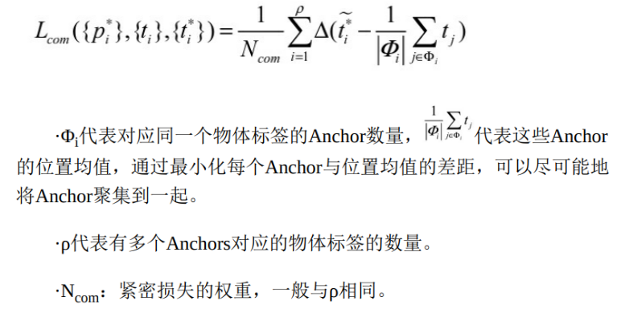

## 行人部位拆解的池化   PORoI Pooling
RORoI Pooling将这种分部位的思想融入到了RoI Pooling中，如图所示。图中行人的整体以及5个子部位，对这6个区域分别进行Pooling计算。

                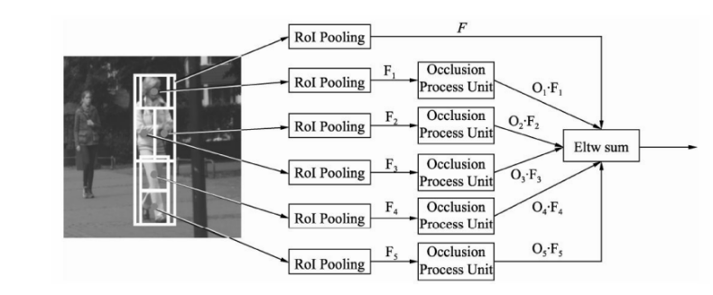

子部位的特征进行Pooling后，还需要经过一个作者提出的遮挡处理单元（Occlusion Process Unit），目的是判断该子部位被遮挡的程度。 最后，作者采用了逐元素相加的方式将6个区域的特征进行融合。遮挡处理单元的具体形式如图所示，这里的处理实际上是将遮 挡的程度施加到原特征上，遮挡单元经过Softmax后得到了被遮挡的概率值，这部分可以与整个检测框架进行端到端地训练。

                         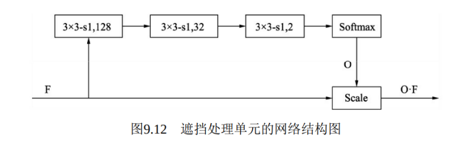

> 更新: 2023-04-26 22:07:54  
> 原文: <https://3dcv.yuque.com/org-wiki-3dcv-mm1l0t/qe88dq/cmhipi>