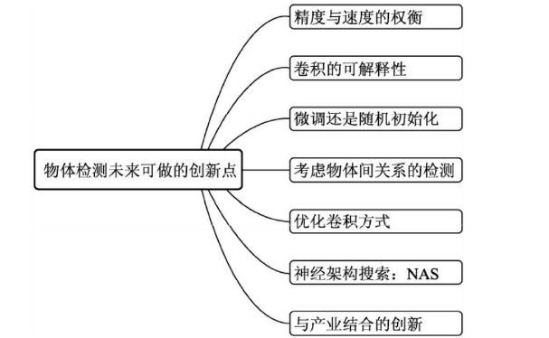
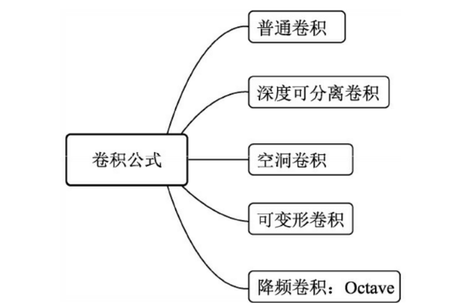
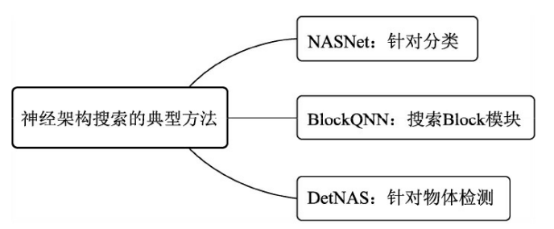
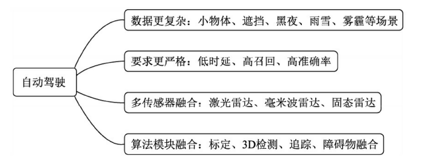
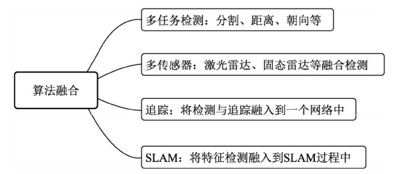

# 8.2.1 重新思考物体检测

# 简介

# 精度与速度的权衡
物体检测的发展始终围绕着精度与速度这两个指标，新提出的算法要么在检测的精度上有了新的突破，要么大幅提升了检测的速度。

·速度需求：自动驾驶等场景下，通常需要对图像处理达到非常低的时延才能保证足够的安全，这时检测器需要达到实时性；而在机械臂自动分拣等系统中，速度并不是第一考虑因素。

·召回率：在交通流量统计系统中，首先需要保障的指标是车辆、行人等物体的召回率，这会直接影响流量统计，相比之下，检测的边框精准度是次要的指标。

·边框精准度：在智能测量、机械臂自动分拣等应用中，检测边框的精准度直接影响系统的成功率，因此需要选择边框精准度更高的网络，这是首要因素。

·移动端：当前，移动端的检测算法需求越来越高，如手机等ARM平台、边缘计算平台等，这对于模型的移动部署、轻量化提出了更高的需求。例如旷视的ThunderNet模型，利用两阶的结构，在ARM平台上实现了实时的物体检测。

# 卷积网络的可解释性与稳定性
当前，新的网络结构、检测思想往往是通过大量的实验对比得出的，并没有经过严谨的公式推导理论证明。卷积网络为什么有效，并没有得到一个公认的解释。 在实际场景使用时，检测器更像是一个黑箱，在有明确输入的场景下，我们并没有办法准确估计检测器的输出，这种不确定性，也限制了检测模型的应用范围。对于网络的可解释性，有一个名词叫做XAI（Explainable Artificial Intelligence，可解释人工智能），即人工智能应当拥有可解释性、可靠性、透明性与负责属性，尤其是在涉及人身安全、政治、军事时，可解释性尤为重要。因此，深入分析卷积网络的可视化与可解释性，也是未来物体检测领域需要解决的问题。

目前物体的检测是将矩形边框内的所有特征考虑在内，并且较大的感受野使得最终的RoI会包含边框外较多的特征，而这两种本不属于物体的特征势必会影响检测的性能，这也是当前检测器的一个缺点。

由于拥有池化等操作，卷积网络对于微小的位移、变形等具有一定的鲁棒性。然而，最近的一个实验却发现，深度卷积网络并没有表现出预期的性质，当图像中的物体发生肉眼难以辨别的微小平移时，检测置信度发生了巨大的变化。该文章的作者将造成这种现象的原因归结于网络中的降采样，当网络中拥有了具有一定步长的降采样操作后，图像必须平移降采样率的整数倍后，才会体现出平移的不变性。这也是当前卷积网络的明显缺点之一。

# 训练：微调还是随机初始化
（1）虽然微调的方式可以加速模型在训练初期的收敛，但预训练与微调的时间总和与随机初始化训练的时间大致相同。使用随机初始化的方式得到的模型，其精度可以匹配微调训练得出的模型。

（2）微调的方式并不能有效地防止过拟合，即无法提供较好的正则化效果。

（3）在某些检测精度要求高、位置敏感的任务中，其数据集与ImageNet数据集会存在较大差距，这种情况下采用微调的训练方法会限制检测器的性能。

在当前的物体检测模型中，使用随机初始化进行训练的检测算法有DSOD（Deeply Supervised Object Detector）、DropBlock等，这种一阶网络相比于两阶网络，其结构更容易端到端，因此也更容易利用随机初始化来使得模型收敛。训练结果表明，随机初始化的方法并不比微调的方法精度低

# 考虑物体间关系的检测
考虑特征之间的关系思想，在自然语言处理（Natural Language Processing，NLP）领域中较为常见，因为单词特征简单且相互之间依赖性很强。相比之下，图像中的物体具有不同的尺度、位置，其位置特征更为复杂。为了对物体关系建模，Relation Networks的作者提出了一个物体关系模块（Object Relation Module），考虑物体间的几何空间，不同数量的输入之间可以并行运算，可以方便地添加到一般的特征提取模块中，

值得一提的是，考虑物体间关系的方法还有利于改善NMS，可以根据需求来自适应地进行NMS，而不是固定的超参数阈值。随着检测算法的继续沉淀与深入发展，相信会涌现出更多构建物体间关系的方法，这也有利于增进对场景的理解，从而提升检测的语义性，向更智能的方向发展，渐渐靠近人类的思维方式

# 优化卷积方式
Repulsion Loss针对拥挤行人设计了更优越的损失函数，IoU-Net等探索了更优的NMS设计方法，Grid R-CNN利用网络grid优化了传统的边框回归方式等。

1  普通卷积方法作为卷积神经网络的基础单元，可以出色地完成特征提取任务，但计算复杂度较高。

2  为了减少卷积的冗余计算，深度可分离卷积应运而生，可以有效地提升网络运行速度。

3  在物体检测中，当我们在增加网络的感受野的同时，又不想网络有太大的下采样率与计算量时，空洞卷积提供了很好的解决办法，尤其是在最新的检测算法中，空洞卷积尤为常见。

4  可变形卷积。传统的卷积核一般是正方形或者长方形的，但微软亚洲研究院的学者却提出了新的卷积方式，其卷积核的形状是可以变化的，称之为可变形卷积。这种可变形卷积可以只提取感兴趣的区域，而不必是固定的矩形，这样特征会更加纯净，性能会更好。在实现时，可变形卷积需要在传统的卷积层之前增加一层过滤器，目的是学习下一个卷积层卷积核的位置偏移量，这种实现方式移植方便，只会增加较少的计算量，但可以带来更好的检测性能。这种可变形的卷积方式更为灵活，摆脱了固定卷积的限制，

5  降频卷积Octave ，Octave卷积的思想正是通过降低了低频率特征的尺寸，从而减少了计算量，因此取名Octave卷积。在图像处理领域，图像可以分为描述基础背景结构的低频特征与描述快速变化细节的高频特征两部分，其中高频特征占据了主要的图像信息。与此类似，卷积特征也可以分为高频特征与低频特征两种，Octave卷积通过相邻位置的特征共享，减小了低频特征的尺寸，进而减小了特征的冗余与空间内存的占用。

# NASNet方法

NASNet方法

·由于ImageNet数据集较大，直接使用NAS代价太大，因此NASNet先在较小的CIFAR-10数据集上进行搜索，然后再迁移到ImageNet数据集上训练。 ·NASNet的宏观网络结构还是需要人工设计，搜索空间是由多个卷积层Cell组成的，这些卷积层结构相同，权重不相同。 ·NASNet使用了RNN（Recurrent Neural Network，循环神经网络）来实现卷积层Cell的自动搜索，具体来讲，控制器RNN是一个单层的LSTM（Long Short-Term Memory，长短期记忆网络），使用该搜索方法最终得到了3个最佳的结构。

BlockQNN方法

当前主流的深度网络通常是由多个重复的子网络来组成，即Block。BlockQNN正是借鉴了该思想，搜索Block的结构，在大大减少搜索空间的同时，也提升了网络的泛化能力。 为了更好地表示Block结构，BlockQNN首先对网络结构做了编码，将神经网络看做一个有向无环图，将每一个卷积层看做一个节点，然后对每一层的层数序号、类型、卷积核大小及两个前序节点的序号进行编码

DetNAS方法

DetNAS将搜索空间编码为超网，主要包含超级网络训练、使用进化算法EA进行超级网络的搜索，以及结果网络再训练这三个步骤。DetNAS主要基于ShuffleNet v2的架构，在COCO数据集上实现了超越ResNet101的检测精度。

#  与产业结合的创新  

·数据更复杂：自动驾驶车辆通常配有多个不同位置的相机用来识别障碍物，其中会包含大量的遮挡、小物体等，也会存在夜晚、雨雪及雾霾等难检测的场景，这些都对检测模型提出了更高的要求。

·指标要求严格：安全是自动驾驶的第一原则，因此时延、检测准召率、准确率这些指标都有着极高的要求。对于很少出现的障碍物、甚至新出现的障碍物类别，如何实现稳定的检测？

·传感器融合：与激光、雷达相比，相机的语义信息更丰富，但是精度相对较差，因此当前成熟的解决方案通常是两种传感器的融合。此外，毫米波雷达与近两年兴起的固态雷达，在某些场景下也都有使用，因此，多传感器算法的融合也对2D物体检测算法提出了新的要求。

·算法融合：对于自动驾驶车辆，其最终的检测对象应该是具有时序性质的3D世界坐标系下的障碍物信息，2D的物体检测仅仅是算法中的一环，还包括了标定、3D检测、追踪和障碍物融合等。因此，如何将该领域中的其他算法模块与物体检测相融合，也是一个亟待解决的方向。

·多任务融合：对于可行驶区域、形状多变的对象来讲，只靠2D的物体检测是远远不够的，还需要更为精细的图像分割算法。此外2D的检测还包括车是否在路上、尾灯判断等多个任务。然而，在一个车载单元上运行多个单独的模型是十分奢侈的，如何用一个网络实现多个任务的学习十分重要。

·多传感器的融合：自动驾驶领域通常采用了激光雷达、相机等多种传感器来充分保障行驶的安全，当前更多的传感器数据处理方法还是相互独立的，因此如何更好地用神经网络实现多个传感器数据的检测，也是一个值得探索的方向。

·与追踪的融合：追踪是物体检测的下游算法模块，通常也是将检测与追踪独立成两个模块处理，当前已有多种基于神经网络的追踪算法，因此这两者也完全可以实现更好的结合。

·与定位建图的结合：实时定位与地图构建（Simultaneous Localization and Mapping，SLAM）算法模块是自动驾驶中非常重要的一环，可以为自动驾驶车辆提供精确的地图与定位信息。由于其中包含图像或者点云的特征提取，因此完全可以将卷积神经网络的优势引入到该算法中。

> 更新: 2023-04-26 22:07:56  
> 原文: <https://3dcv.yuque.com/org-wiki-3dcv-mm1l0t/qe88dq/kdc0s3>