# 8.2.2 摆脱锚框   Anchor-Free

# 简介
使用Anchor通常会面临如下3个问题：

·正、负样本不均衡：我们通常在特征图所有点上均匀采样Anchor，而在大部分地方都是没有物体的背景区域，导致简单负样本数量众多，这部分样本对于我们的检测器没有任何作用。

·超参难调：Anchor需要数量、大小、宽高等多个超参数，这些超参数对检测的召回率和速度等指标影响极大。此外，人的先验知识也很难应付数据的长尾问题，这显然不是我们乐意见到的。

·匹配耗时严重：为了确定每个Anchor是正样本还是负样本，通常要将每个Anchor与所有的标签进行IoU的计算，这会占据大量的内存资源与计算时间。

近期出现了大量Anchor-Free的算法。Anchor-Free的思想最早可见于2015年的DenseBox，以及前面讲解过的YOLO。在各种Anchor-Free的算法中，根据其表征一个物体的方法，大体可以分为以下两类，

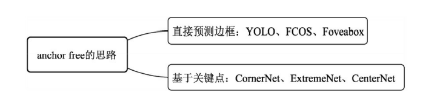

·直接预测边框：根据网络特征直接预测物体出现的边框，即上、下、左、右4个值。典型算法如YOLO、自动学习在FPN上分配标签的FSAF（Feature Selective Anchor-Free）、利用分割思想解决检测的FCOS（Fully Convolutional One-Stage），以及改善了边框回归方式的Foveabox算法。

·关键点的思想：使用边框的角点或者中心点进行物体检测，这类算法通常是受人体姿态的关键点估计启发，开辟了物体检测算法的一个新天地，典型有CornerNet、ExtremeNet及CenterNet等。

# 基于角点的检测   CornerNet
CornerNet的思路实际是受多人体姿态估计的方法启发。在多人体姿态估计领域中，一个重要的解决思路是Bottom-Up，即先使用卷积网络检测整个图像中的关键点，然后对属于同一个人体的关键点进行拼接，形成姿态。

CornerNet将这种思想应用到了物体检测领域中，将传统的预测边框思路转化为了预测边框的左上角与右下角两个角点问题，然后再对属于同一个边框的角点进行组合，

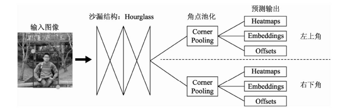

·沙漏结构Hourglass：特征提取的Backbone，能够为后续的网络预测提供很好的角点特征图。

·角点池化：作为一个特征的池化方式，角点池化可以将物体的信息整合到左上角点或者右下角点。

·预测输出：传统的物体检测会预测边框的类别与位置偏移，而CornerNet则与之完全不同，其预测了角点出现的位置Heatmaps、角点的配对Embeddings及角点位置的偏移Offsets。

## 沙漏结构：Hourglass
Hourglass的整体形状类似于沙漏，两边大，中间小。Hourglass结构是从人体姿态估计领域中借鉴而来，通过多个Hourglass模块的串联，可以十分有效地提取人体姿态的关键点。

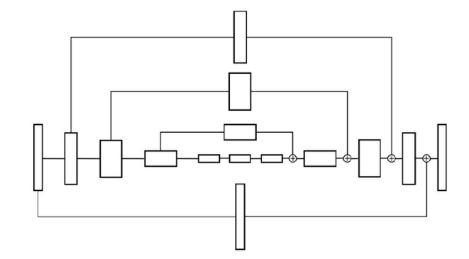

## 角点池化  Corner Pooling
为了达到想要的池化效果，CornerNet提出了Corner Pooling的方法，左上点的池化区域是其右侧与下方的特征点，右下点的池化区域是其左侧与上方的特征点，如图所示为左上点的Corner Pooling过程。在图中，假设当前点的坐标为(x,y)，特征图宽为W，高为H， 则Corner Pooling的计算过程如下：

（1）计算该点到其下方所有点的最大值，即(x,y)到(x,H)所有点的最大值。

（2）计算该点到其最右侧所有点的最大值，即(x,y)到(W,y)所有点的最大值。

（3）将两个最大值相加，作为Corner Pooling的输出。工程实现时，可以分别从下到上、从右到左计算最大值，这样效率会更高。右下点的Corner Pooling过程与左上点类似，

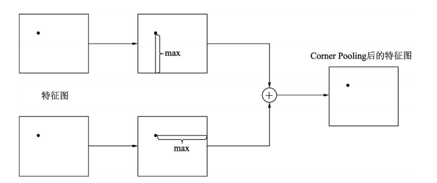

## 预测输出
最后一个重要部分就是CornerNet的预测输出，以及损失的计算方式

·Heatmaps：角点热图，预测特征图中可能出现的角点，大小为C×W×H，C代表类别数，以左上角点的分支为例，坐标为(c,x,y)的预测点代表了在特征图上坐标为(x,y)的点是第c个类别物体的左上角点的分数。

·Embeddings：Heatmaps中的预测角点都是独立的，而一个物体需要一对角点，因此Embeddings分支负责将左上角点的分支与右下角点的分支进行匹配，找到属于同一个物体的角点，完成检测任务，其大小为1×W×H。

·Offsets：第三个预测Offsets代表在取整计算时丢失的精度，以进一步提升检测的精度。关于为何会丢失精度，在前面章节的RoI Pooling部分已有详细说明。这种取整的丢失对于小物体检测影响很大，因此CornerNet引入了偏差的预测来修正检测框的位置，其大小为2×W×H

CornerNet在损失计算时借鉴了Focal Loss的思想

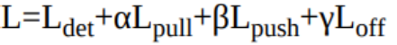

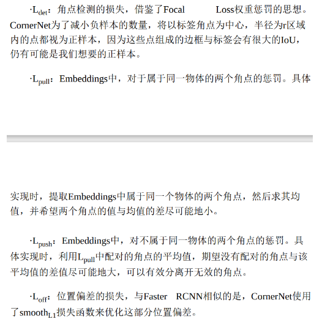

# 检测中心点  CenterNet
的CenterNet算法成功地实现了这种思想，将物体检测问题变成了一个关键点的估计问题，通过预测物体的中心点位置及对应物体的长与宽，实现了当前检测精度与速度最好的权衡，整体结构相当地优雅。

CenterNet尝试了串联Hourglass、ResNet等多种网络用来提取特征，生成了特征点的热图。实验结果表明，Hourglass的网络能够提供更精确的检测精度，而更轻量的ResNet的检测速度会更快。

CenterNet参考了CornerNet的思想，网络输出了以下3个预测值：

·关键点热图：这里的关键点热图与CornerNet类似，只是这里只预测一个中心点的位置。对于标签的处理，CenterNet将标签进行下采样，然后通过式（10-2）的高斯核函数分散到热图上。

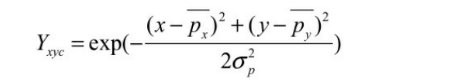

·中心点偏差：CenterNet对每个中心点增加了一个偏移的预测，并且所有类别共享同一个偏移预测值。

·宽与高的预测：CenterNet不需要预测Embeddings来处理配对，而是预测了物体的宽与高，这里的预测是原图像素坐标的尺度。

总体上，对于特征图上的一个点，CenterNet会预测C+4个值，其中包括C个类别的中心点得分、中心点(x,y)的偏差以及该物体的宽高(w,h)。

         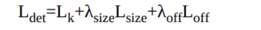  
 Lk为关键点的损失，使用了Focal Loss的形式；Lsize为宽与高的预测损失，Loff为偏移预测的损失；Lsize与λoff是为了平衡各部分损失而引入的权重。

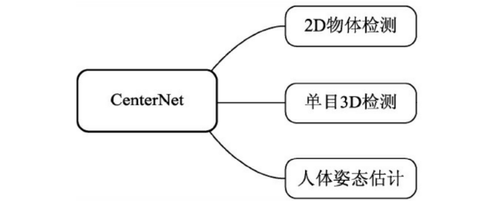

#   
 锚框自学习：Guided Anchoring
商汤提出了锚框自学习（Guided Anchoring）的算法，根据图像的特征能够自动地预测Anchor的位置和形状，生成一组稀疏但高效的Anchor，全程无须人工的设计。

## 锚框预测：Anchor Generation
Guided Anchoring利用网络特征自动地预测了Anchor的分布，其中包含Anchor出现的位置与形状两个特征。

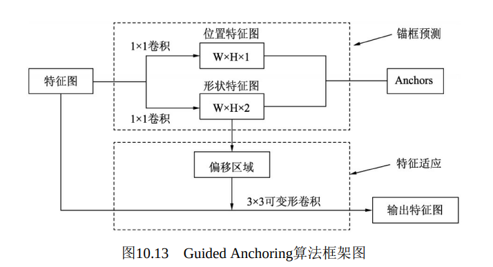

具体地，Guided Anchoring使用了与CenterNet预测物体类似的思想，采用了两个分支来预测Anchor。

·中心点位置：使用了一个1×1卷积来预测Anchor可能出现的位置，这里的输出大小为W×H×1，每个点表示Anchor的中心点出现在此位置的概率。

·形状预测：使用了一个1×1卷积来预测Anchor的宽与高两个特征，输出大小为W×H×2。

在计算损失时，Guided Anchoring采用了IoU作为衡量指标，希望IoU最大化。需要注意的是，由于缺乏先验的边框，我们没有办法通过先验框与标签匹配的方法来确定优化的标签对象，因此对于一个预测Anchor，它应该去优化与哪一个标签的IoU？

为了解决这个问题，Guided Anchoring在每一个点上采样了9组不同宽高的边框，来取代预测的Anchor，进而完成匹配关系，确定优化对象

## 特征自适应：Feature Adaption
Feature Adaption使用了一个3×3可变形卷积作用于特征图上，以适配Anchor的形状。

与普通可变形卷积不同，这里的偏置取自于预测的Anchor，具体是利用一个1×1卷积作用于预测的Anchor宽高，实现极为巧妙。从功能上理解，这里的特征自适应有些类似于RoI Pooling层。Guided Anchoring的总体损失函数如式（10-4）所示，在常规的分类损失Lcls与回归损失Lreg之外，还包括Anchor的位置损失Lloc与形状损失Lshape。

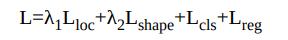

> 更新: 2023-04-26 22:07:57  
> 原文: <https://3dcv.yuque.com/org-wiki-3dcv-mm1l0t/qe88dq/zuqt2z>