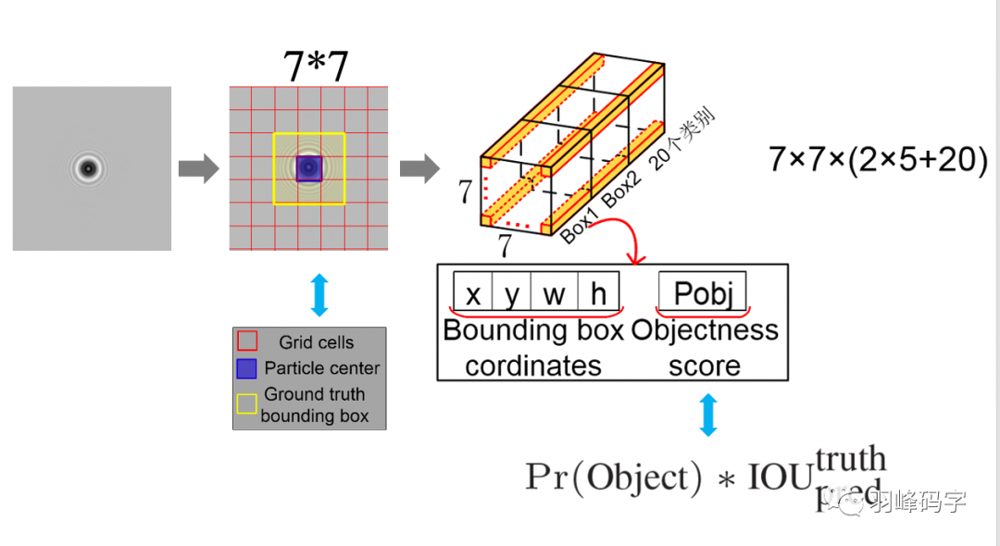
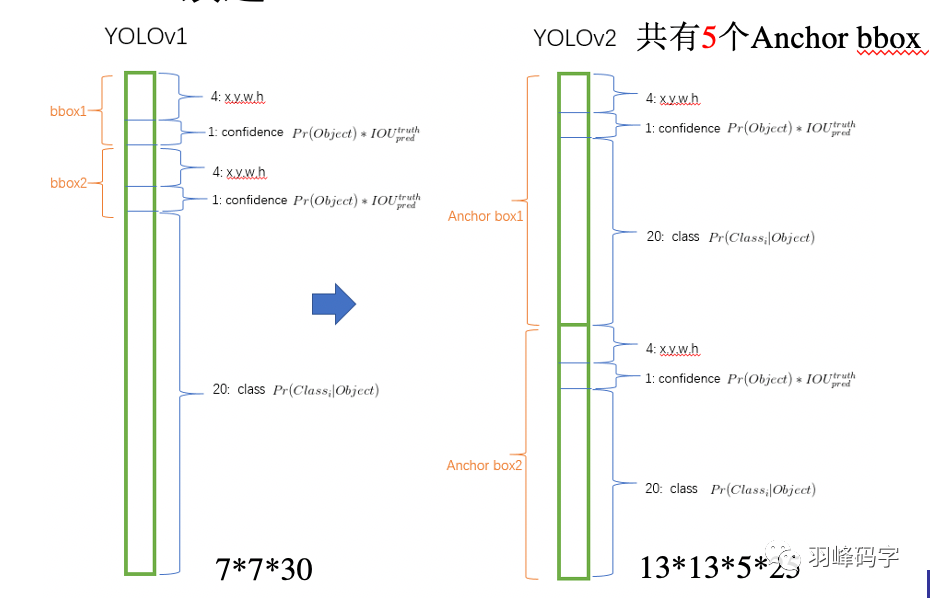
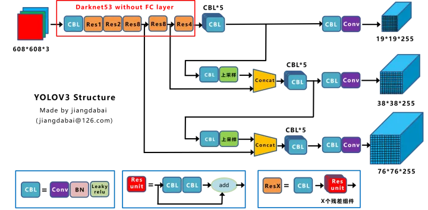
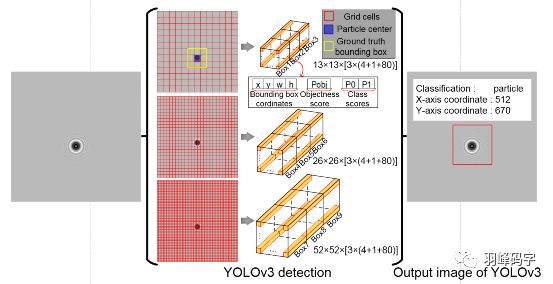
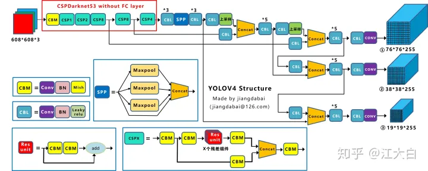
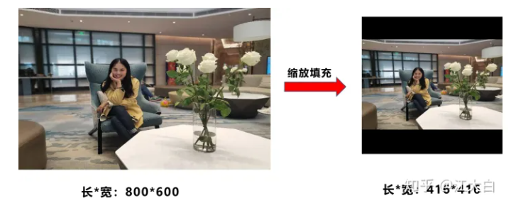
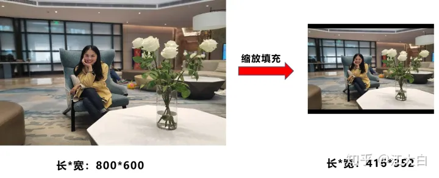

# YOLO

# Head机制对比
对head的改进主要集中在早期的v1, v2, v3

## YOLOv1

7x7 : 对应feature map的size 也就是grid size (7*7是超参数 可以根据backbone所输出的size改变)

2*5 : 每个 feature map 的 pixel 的 两个目标的 xywhc (2是超参数 可以设置为其他)

xy:中心点

wh:长宽

c:该框包含物体的置信度

20 : feature map 的 pixel 的 类别class (20是由类别个数决定的) 

7*7*(2*5+20) : 合起来就是，为每个像素预测两个边界框(xywhc)和一个物体类别(20个score取最大)

## YOLOv2

13*13 : 换了backbone，输出的是13*13

5 * 25 : 为每个像素预测5个目标。25包含 4+1+20

4 : xywh 与yolov1类似，不过由于引入了anchor 这里的xywh是相对anchor的偏移量

1 : 包含物体的置信度c

20 : class的分数

不同于yolov1的是：每个目标都包含了类别class，而yolov1中是对每个像素进行预测class。

Assigner：若GT的中心点落在这个gird cell中，该grid cell中的Anchor与该GT的IoU最大的负责预测它（YOLOv2同样需要假定每个cell至多含有一个grounth truth，而在实际上基本不会出现多于1个的情况）

（more detaili in [知乎](https://zhuanlan.zhihu.com/p/564732055)）

**Anchor机制会涉及坐标系的变换以及gt匹配策略**

## YOLOv3

引入多尺度head

3个head 分别负责预测 大 中 小 物体 inference时将3个head的结果一起decode_with_anchor用于nms得到最终结果 

3个head的grid cell 分别为 13*13 26*26 52*52 对应draknet53 (yolov3的backbone) 的3个输出，darknet53是darknet19 (yolov2的backbone)+resnet的组合

# 特点
由于引入了多个Head，Assigner不再以中心点去匹配gt，而是选择最大IoU的预测框作为正样本；正样本外大于一定阈值的预测框会被忽略；负样本小于阈值的作为负样本去计算置信度。

“

1. ground truth为什么不按照中心点分配对应的预测box？

（1）在Yolov3的训练策略中，不再像Yolov1那样，每个cell负责中心落在该cell中的ground truth。原因是Yolov3一共产生3个特征图，3个特征图上的cell，中心是有重合的。训练时，可能最契合的是特征图1的第3个box，但是推理的时候特征图2的第1个box置信度最高。所以Yolov3的训练，不再按照ground truth中心点，严格分配指定cell，而是根据预测值寻找IOU最大的预测框作为正例。

”

“3. 为什么有忽略样例？

（1）忽略样例是Yolov3中的点睛之笔。由于Yolov3使用了多尺度特征图，不同尺度的特征图之间会有重合检测部分。比如有一个真实物体，在训练时被分配到的检测框是特征图1的第三个box，IOU达0.98，此时恰好特征图2的第一个box与该ground truth的IOU达0.95，也检测到了该ground truth，如果此时给其置信度强行打0的标签，网络学习效果会不理想。

”

## YOLOv4

yolov4集成了2D CV 中的 大量trick

见江大白博客

## YOLOv5
### 自适应缩放

之前的方法固定的填充为416*416

v5新加入了个trick自适应缩放，尽量少留黑边

如此增加了推理速度~37% (训练时仍保持之前的方法)

### 加权NMS

# loss
Bounding Box Regeression的Loss近些年的发展过程是：**Smooth L1 Loss-> IoU Loss（2016）-> GIoU Loss（2019）-> DIoU Loss（2020）->CIoU Loss（2020）**

> 更新: 2023-11-02 11:36:55  
> 原文: <https://3dcv.yuque.com/org-wiki-3dcv-mm1l0t/qe88dq/xacxhzpox9sdap49>