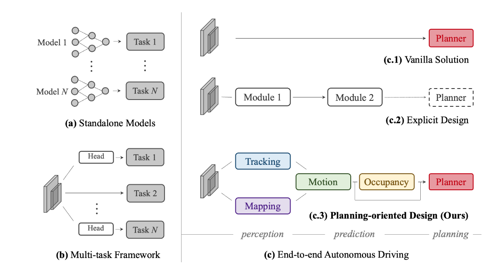
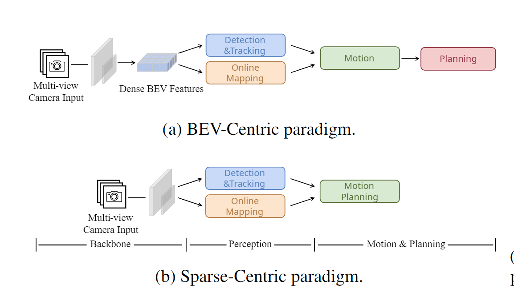
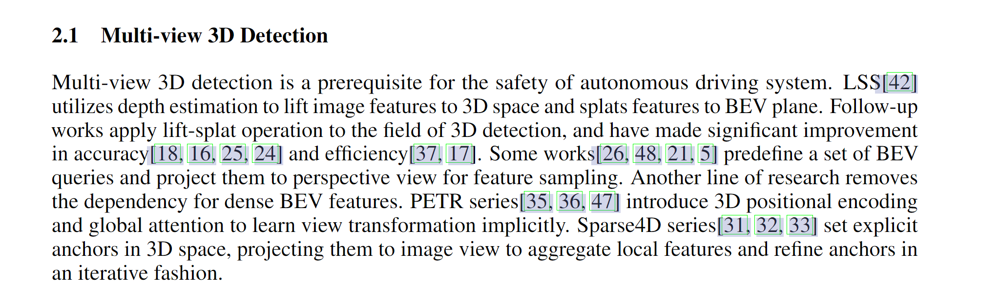
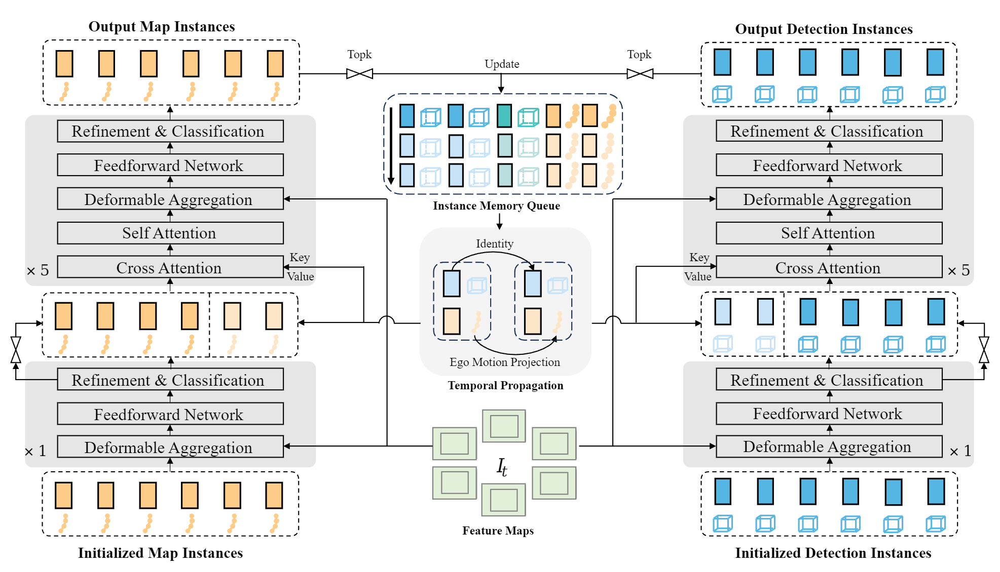
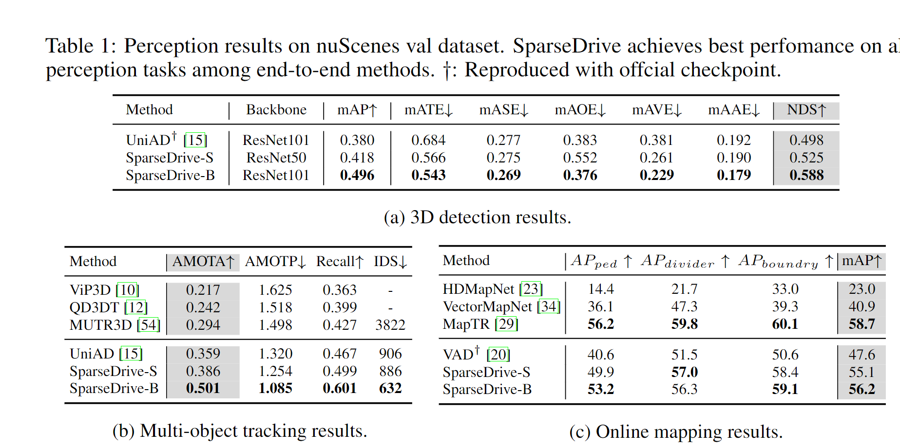
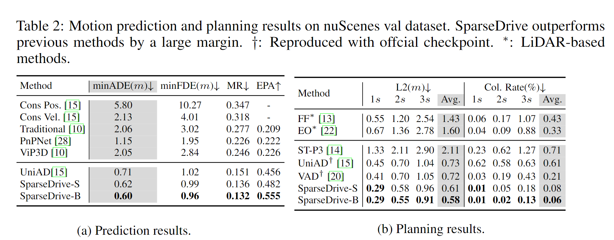

# e2d系列

# UniAD CVPR2023

任务之间的协同，而不是类似 ab c1 c2的单独任务调用或者叫co-learning

# SparseDrive

Moti: BEV表征是昂贵的；以往的方法主要集中在场景学习上，采用直接的设计进行预测和规划，没有充分利用这两个任务之间的相似性，极大地限制了性能；我们消除了BEV表征，提出了对称稀疏感知，并行预测和规控。

一段写得好Related work

## method
### 对称感知

#### Sparse Detection. 
类似Sparse4D，有6个decoder，在第一个decoder里初始化一个anchor(类似Object Query)，将Anchor附近初始化为关键点，利用关键点投影到图像上采样，得到实例feature，不断优化这个实例feature，其他的decoder添加了时序cross-attention和一个self-attention。Anchor作为position embedding.

#### Sparse Map.
结构和检测相似 

# VAD
moti: 以前的工作依赖于密集的栅格化场景表示(例如，代理占用和语义地图)来执行规划，这是计算密集型的，错过了实例级结构信息。

VAD的改进：一方面，VAD利用矢量化的代理运动和地图元素作为显式实例级规划约束，有效地提高了规划的安全性。另一方面，VAD 通过摆脱计算密集型表征和手工设计的后处理步骤，比以前的端到端规划方法快得多。

一方面，VAD 采用地图查询和代理查询从传感器数据中**隐式学习**实例级地图特征和代理运动特征，并通过查询交互提取引导信息进行规划。另一方面，VAD 提出了基于**显式**矢量化场景表示的三个实例级规划约束：用于横向和纵向保持自我车辆与其他动态代理之间的安全距离的自我代理碰撞约束；将规划轨迹推离道路边界的自我边界超步进约束；以及自我车道方向约束，用于正则化具有矢量化车道方向的自动驾驶车辆的未来运动方向。

> 更新: 2024-09-08 17:37:48  
> 原文: <https://3dcv.yuque.com/org-wiki-3dcv-mm1l0t/wawabo/bwc4abvie1619x06>