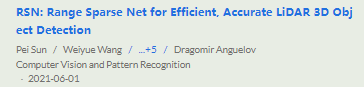
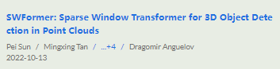
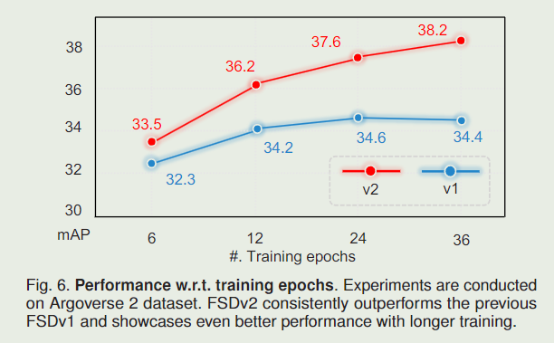
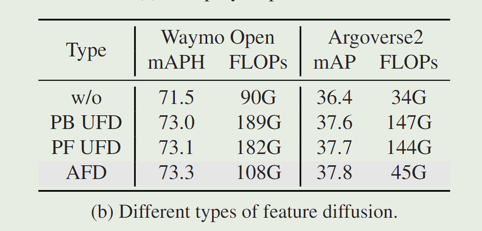
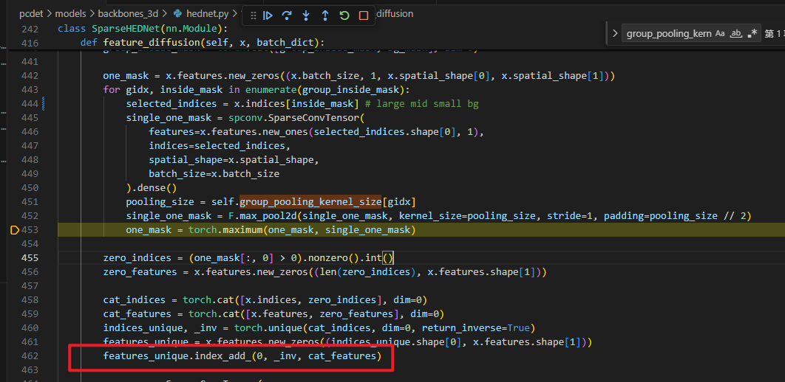
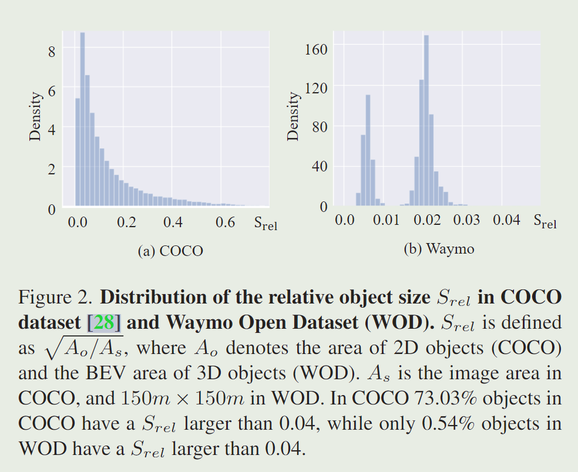
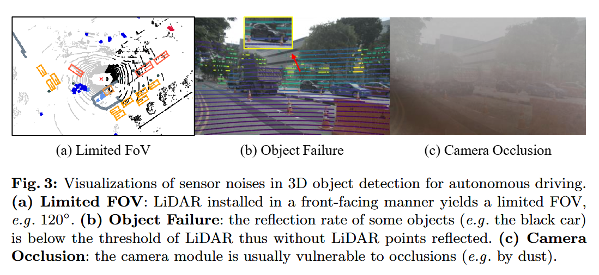
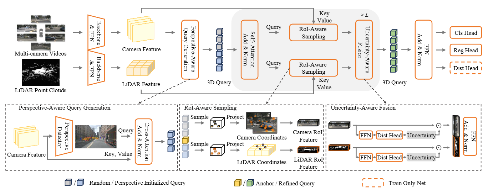
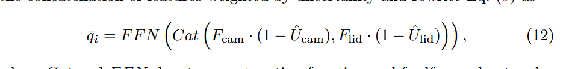
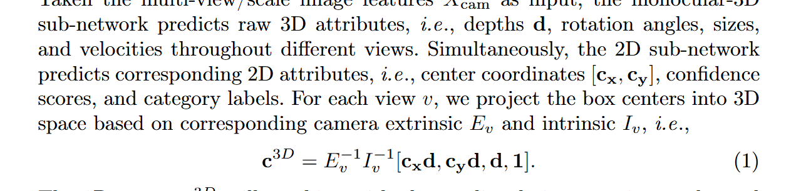

# 全稀疏

# 稀疏检测器的motivation
密集检测器的密集BEV特征的计算量会随着具体二次方增长

# 核心moti -- 中心丢失
**激光点云通常只停留在目标的表面，而不是目标实体中心，也就是说在点云视角中，目标通常是空心的。**

在密集检测器（或混合检测器）中，密集BEV会使特征扩散，为空心物体补齐中心特征。

在全稀疏检测器中，稀疏bev特征会导致大目标（汽车、大卡车）[中心缺失问题](https://readpaper.com/pdf-annotate/note?pdfId=4674915234238955521&noteId=1772008183759474944)。

该问题已经被

提出过。

# FSDv1
moti：提出全稀疏概念，首次提出了稀疏bev所带来的中心特征丢失问题，利用votenet来投票出中心点进行回归，如果使用没有中心点的特征进行回归会导致偏差极大。

# FSD++

# FSDv2
moti：为了减少v1中由聚类和vote等手工设计而引入的归纳偏置

method：引入虚拟体素并且全篇都围绕虚拟体素展开，将v1中的vote center体素化，利用了一个vvm来编码这些体素，而不是对点聚类，消除了手工设计。

discussion：

1. 末尾基于vote center的两种情况讨论了聚类和vvm的区别
2. 讨论了关于虚拟体素head的设计

experiemnt:

多epoch带来的提升 = 减少了归纳偏置

# SAFDNet
## Motivation
类似FocalsConv，不要背景点，增强前景点的体素扩散，设置阈值来筛选前景和背景

UFD和AFD是两种不同的扩散策略

是否只要添加了扩散策略在Argo上就会提升？

## 扩散中两个潜在的问题：
1. 这种扩散会产生重叠
2. 重叠的特征值会被多次累加，如果两个目标挨得近的话，特征值会被累加，这是否会产生问题?

# SWFormer
提出分割--> diffsuion

这里的diffusion也是在dense bev上执行的

# SST
画的不错的图

# SparseLIF
ECCV 2024

Moti:

1. 在本文中，我们发现弥合性能差距的关键是**增强两种模式中丰富表示的认识（Awareness）**。

近年来，密集范式取得了显著的成功，但存在繁琐的视图转换，导致高延迟、有限的检测距离和有限的上限性能。

最近的工作引入了一种没有显式视图转换的稀疏基于查询的范式。一些开创性的稀疏检测器使用全局注意力在一个[64,71]或两个[1]阶段聚合多模态特征。

然而，详尽的全局注意力掩盖了稀疏范式的优势，使得从长期时间信息中受益变得困难。

例如，FUTR3D[7]和DeepInteraction[75]等作品使用参考点从两种模式中采样特征。尽管取得了巨大的进步，但这些方法仍然落后于密集方法。因此，与密集检测器相比，**完全稀疏的多模态检测器是否可以获得更好的性能仍然是一个悬而未决的问题。**

Method:

SparseLIF通过在查询生成、特征采样和多模态融合三个方面增强丰富的激光雷达和相机表示的认识，弥合了性能差距。(三个关键点Query generation; feature sampling; multi-modality fusion)

+ 首先，我们认为随机生成Query （DETR3D） 将在学习将查询提议移动到真实目标方面付出额外的努力。我们提出了 Perspective-Aware Query Generation (PAQG) 模块来简化学习。

（具体：PAQG将一些proposal特征和相机特征注入query，这将会缩短query学习的过程。）

+ 其次，这些具有透视先验的查询将通过 **RoI 感知采样 (RIAS) 模块与两种模态的特征交互。**（该模块不是诉诸繁琐的全局注意力，而是定位感兴趣的区域，然后在先验查询的指导下仅在几个参考点采样互补特征，从而符合完全稀疏范式，享受低延迟。）
+ 第三，我们观察到，在现实场景中，激光雷达和相机经常受到各种传感器问题的影响，如图3所示，这将使传感器输入不可靠和不确定，从而降低多模态检测器的性能。因此，我们提出了**不确定性感知融合 (UAF) 模块来精确量化每个模态的不确定性**，并**引导我们的模型专注于多模态融合中可信模态**

总结：

三个模块：

1. PAQG增强了Query的生成，不再使用随机Query了 （类似TransFusion的多模态Query生成）

2D里有文章将输入作为query的生成（Efficient DETR: Improving End-to-End Object Detector with Dense Prior）

2. RIAS 在RoIfeature上来Sample特征，得到两个稀疏的特征，而不是像以前在dense feature上。
3. 引入了一种不确定性融合方案：将量化出来的不确定性因子 U_cam当作Weight去加权QueryFeature，然后送到最终的head中。

将预测框中心点和GT中心点的距离作为不确定性因子的关键参数。（奇怪有趣的点：但是推理时没有GT，本文仅去预测一个距离，而不是真的两中心点的距离，并且这里没有Loss优化。）

投影公式

总结下：本文的稀疏指的是用两个roi来融合 相对于之前的两个dense feature融合 roi是稀疏的。（但是head中的uery也是稀疏的）

> 更新: 2025-03-31 14:26:51  
> 原文: <https://3dcv.yuque.com/org-wiki-3dcv-mm1l0t/wawabo/egocogkt3vtcycdo>