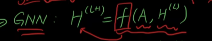
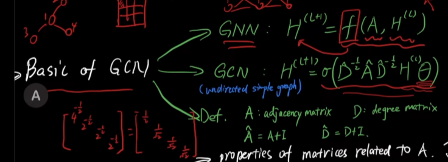
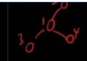
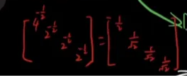

# 图卷积学习

# 图结构

数据结构

# 图神经网络（GNN）

<code>H(l+1)=_f_(A, H(l))</code>

其中，A是邻接矩阵表示这个图，H是每个Node的特征

所有的GNN皆在设计不同的<code>_f_(·)</code>

# 图卷积网络（GCN）

$ H^{(l+1)} = \sigma(\widehat{D}^{-\frac{1}{2}} \widehat{A} \widehat{D}^{-\frac{1}{2}} H^{(l)} \theta) $

A是邻接矩阵，D是度矩阵

A\_hat是A+I 加上单位矩阵，也就是添加一个自环；D\_hat是对应的A\_hat的度矩阵

如果一个Garph是，那么$ \widehat{D}^{-\frac{1}{2}} $为 

$ \theta $为可学习权重

## 谱图理论（Spectral Graph Theory）

### 线代复习

$ A\overrightarrow{x} = \lambda\overrightarrow{x} (|\overrightarrow{x}|\ne0) $

A是特征向量；\lambda是特征值

如果一个矩阵式实对称，那么它对应着n个特征值

d

## 傅里叶变换（Fourier Transform）

> 更新: 2025-11-25 18:37:21  
> 原文: <https://3dcv.yuque.com/org-wiki-3dcv-mm1l0t/wawabo/kqsgf96mpgic58hb>