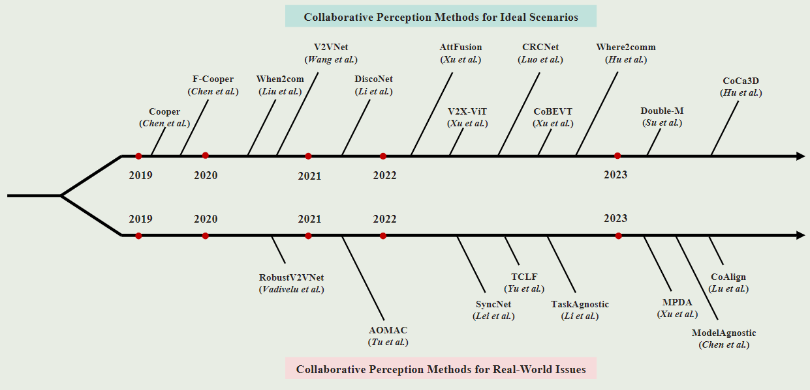
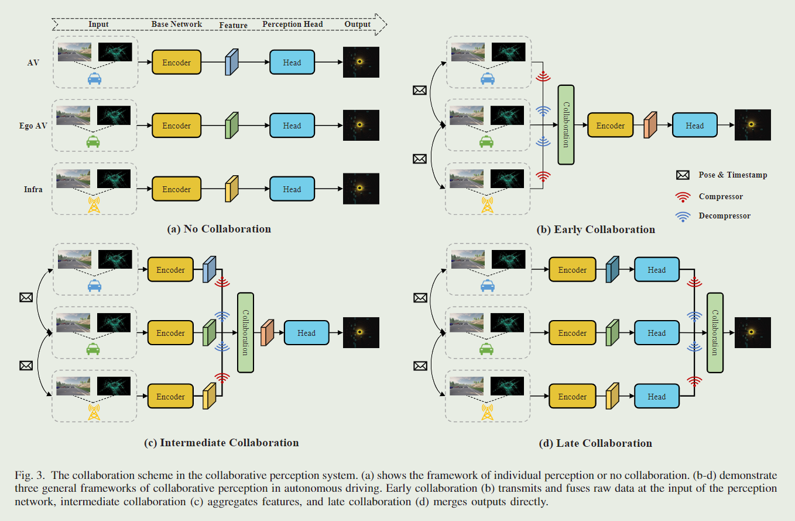
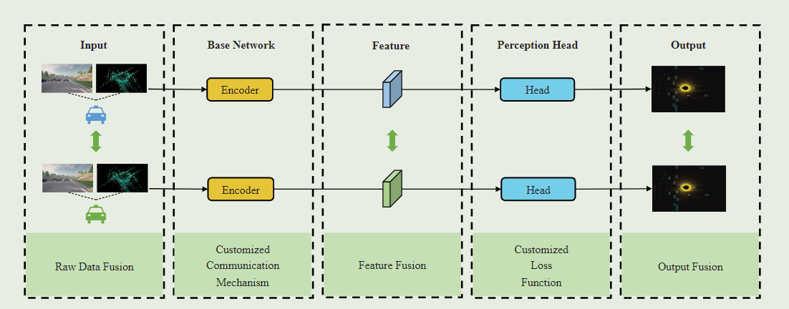
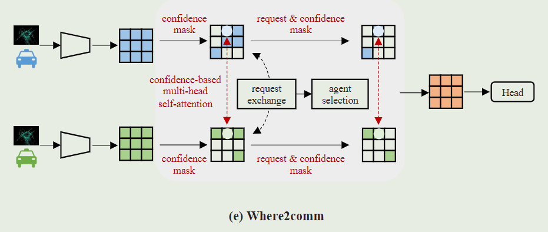
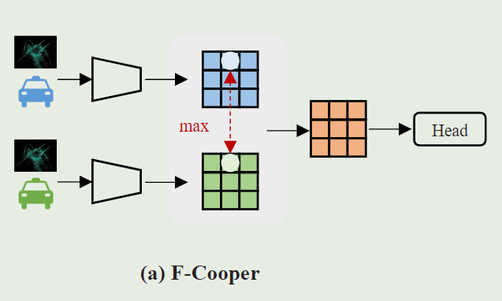
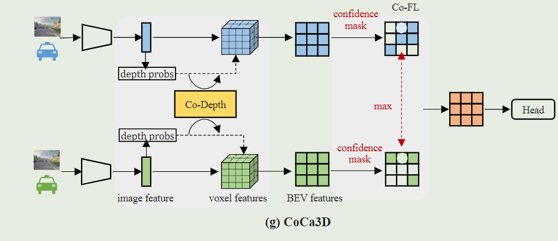
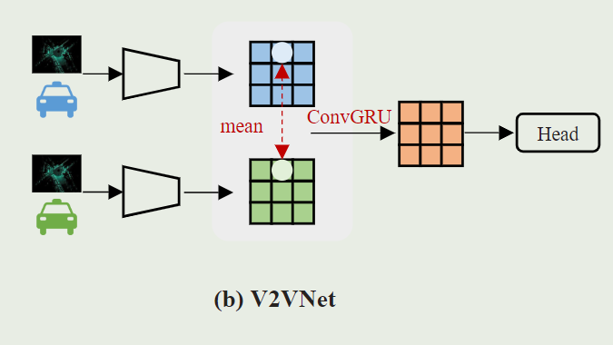
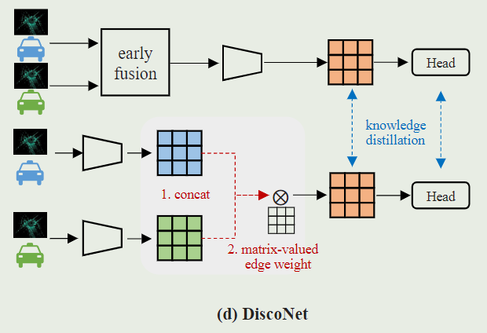
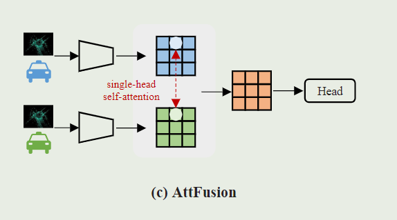
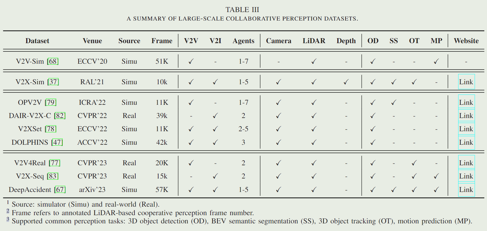

# 车路综述调研

综述调研

[Collaborative Perception in Autonomous Driving: Methods, Datasets and Challenges](https://readpaper.com/pdf-annotate/note?pdfId=4794834976143048705&noteId=1953597847666349824)

（IEEE Intelligent Transportation Systems Magazine） 北交

# 大的方向

### Collaborative Perception Methods for Ideal scenarios
Cooper F-Cooper When2com V2VNet DiscoNet AttFusion CRCNet Where2comm Double-M CoCa3D

### Collaborative Perception Methods for Real-World Issues
RobustV2VNet AOMAC SyncNet TCLF TaskAgnostic MPDA ModelAgnostic CoAlign

# 协同策略
分为Early、Intermediate、Late三种通信方式

## Early Collaboration
早期的协作在网络的输入处采用原始数据融合，也称为数据级或低级融合（图 3 (b))。

在自动驾驶场景中，自我车辆接收并转换来自其他代理的原始传感器数据，然后在车载聚合转换后的数据。

原始数据包含最全面的信息和对代理的大量描述。

因此，早期的协作从根本上可以克服个体感知中的遮挡和远程问题，并最大程度地提高性能。

然而，早期的协作依赖于高带宽，这使得实现实时边缘计算具有挑战性。

## Intermediate Collaboration
考虑到早期协作的高带宽，一些工作提出了中间协作感知方法来平衡性能带宽权衡。

在中间协作中（图 3 (c))，其他代理通常将深度语义特征转移到自我车辆中。

然而，特征提取往往会导致信息丢失和不必要的信息冗余，这促使人们探索合适的特征选择和融合策略。

然而，特征提取往往会导致**信息丢失**和**不必要的信息冗余**，这促使人们探索合适的特征选择和融合策略。

## Late Collaboration
也称**结果级、目标级融合**。

每个智能体单独的推理数据得到结果。

后期协作比早期和中间协作更具带宽经济性，更简单。

然而，后期协作也有局限性。由于单个输出可能是嘈杂和不完整的，后期协作总是具有最差的感知性能。

# Method
## For ideal scenarios

协同感知中常见的模块

### Raw Data Fusion
#### [Cooper](https://readpaper.com/paper/2946180323)
早期协同多数采用点云，由于点云无序。

点云可以被压缩到一个更小的大小通过提取坐标和反射值。

将接收的点云变换到同坐标系下，与原点云concat。然后预测。

#### [Coop3D](https://readpaper.com/paper/2996759437)
base on Cooper。不采用拼接。

利用空间变换融合数据。不同于Cooper贡献V2V信息，Coop3D提出了一个中央系统来合并多Sensor data，这样做有益于分担传感器和处理开销。

### Customized Communication Mechanism
早期协作中的原始数据融合拓宽了自我车辆的视野，这也导致了高带宽压力。

为了缓解，开发出Intermediate融合。

最初的中间协作方法遵循**贪心通信机制**来获取尽可能多的信息。

通常，它们与通信范围内的所有代理共享信息，并将压缩的完整特征图放入**集体感知消息 **(Collective Perception Messages，CPMs)。

然而，由于特征稀疏和代理冗余，**贪婪通信**可能会**极大地浪费带宽。**

为了填补这一空白，一些工作[26，42，66，84]建立了**动态通信机制**来选择代理和特征。

#### [Who2com](https://readpaper.com/paper/3012836272)
Who2com [42] 在带宽约束下建立了第一个通信机制，这是通过三次握手实现的。具体来说，Who2com 使用通用注意力函数 [46] 来计算代理之间的匹配分数，并选择最需要的代理来有效地减少带宽。

#### [When2com](https://readpaper.com/paper/3035098634)
基于 Who2com，When2com [41] 引入了缩放的一般注意力来确定何时与其他注意力通信。因此，只有当信息不足时，Ego才会与他人交流，有效地节省协作资源。

#### [FPVRCNN](https://readpaper.com/paper/4558763642519035905)
只共享候选框中的feature 关键点  （类似What2Com？）

关键点选择模块减少了共享深度特征的冗余，并为初始建议提供了有价值的补充信息。

#### [Where2com](https://readpaper.com/paper/4672316191629393921)

Where2comm [26] 还提出了一种新颖的空间置信度感知通信机制。它的核心思想是利用空间置信度图来决定共享特征和通信目标。

在特征选择阶段，Where2comm 选择并传输满足高置信度和其他代理请求的空间元素。

在代理选择阶段，自我代理只与可以提供所需特征的代理进行通信。

通过在感知关键区域发送和接收特征，Where2comm节省了大量的带宽，显著提高了协作效率.

### Feature Fusion
特征融合模块在中间协作中至关重要。在收到来自其他代理的 CPM 后，自我车辆可以利用不同的策略来聚合这些特征。可行的融合策略能够捕获特征之间的潜在关系并提高感知网络的性能。根据基于特征融合的思想，我们将现有的特征融合方法分为**传统的**、**基于图的融合**和**基于注意的融合**。

#### [F-Cooper](https://readpaper.com/paper/2972681376)
第一个中间协同感知框架F-Cooper[10]提取**低级体素**和**深度空间特征**。

基于这两个层次特征，F-Cooper提出了两种特征融合策略:体素特征融合(Voxel Feature Fusion, VFF)和空间特征融合(Spatial Feature Fusion, SFF)。

两者都采用逐元素 maxout 来融合重叠区域中的特征。

由于体素特征更接近原始数据，VFF 能够作为近目标检测的原始数据融合方法。同时，SFF 也有其优势。

受SENet[25]的启发，SFF选择部分通道来减少传输时间消耗，同时保持相当的检测精度。

#### [CoFF](https://readpaper.com/paper/3088500310)
考虑到F-Cooper[10]忽略了低置信度特征的重要性，Guo等人[22]提出了CoFF来改进F-Cooper。

CoFF通过测量重叠区域的相似性和重叠区域对重叠特征进行加权。

相似度越小，距离越大，相邻特征提供的补充信息越直观。

此外，还添加了一个增强参数来增加弱特征的值。实验表明，简单而有效的设计使 CoFF 大大提高了 F-Cooper。

#### [CoCa3D](https://readpaper.com/paper/4737907459616686081)

虽然简单，但最近的方法并没有放弃传统的融合。

Hu等人[27]提出了协作摄像机的三维检测(CoCa3D)，以证明协作在增强基于摄像机的3D检测方面的潜力。

CoCa3D 包含协作深度估计 (Co-Depth)，除了协作特征学习 (Co-FL)。

在 Co-Depth 中，邻居代理仅以低不确定性传输深度估计，Ego Agent通过考虑单视图深度概率和多视图一致性来更新深度估计。

在 Co-FL 中，代理发送具有高检测置信度的特征元素，并采用简单的非参数逐点最大值来融合特征。实验结果表明，CoCa3D有助于相机在3D目标检测中过度吸收激光雷达。

### Graph-based Fusion
尽管传统的中间融合简单，但它们忽略了多智能体之间的潜在关系，无法将消息从发送者推理到接收者。图神经网络 (GNN) 能够从邻居 [54] 中传播和聚合消息，最近的工作已经证明了 GNN 在感知和自动驾驶方面的有效性。

#### [V2VNet](https://readpaper.com/paper/3109991383)
V2VNet[68]首先利用空间感知图神经网络(GNN) 来模拟代理之间的通信。

#### [DiscoNet](https://readpaper.com/paper/3212352499)

虽然 V2VNet [68] 使用 GNN 实现了性能提升，但标量值协作权重不能反映不同空间区域的重要性。

### Attention-based Fusion
除了图学习，注意力机制已成为探索特征关系的强大工具 [23, 64]。

注意机制可以根据数据域分为通道注意、空间注意和通道注意[23]。

#### [AttFusion](https://readpaper.com/paper/3201193904)

Xu等人[79]提出了AttFusion，首先在精确的空间位置采用自我注意操作。具体来说，AttFusion 引入了单头自注意力融合模块，与传统的 F-Cooper [10] 和基于图的方法 DiscoNet [38] 相比，在性能和推理速度之间取得了平衡。

AttFusion 中的空间感知交互类似于 DiscoNet [38] 中的矩阵权重边缘，同时使用不同的工具实现。

# Dataset and evaluation
[V2X-Sim](https://readpaper.com/paper/4592570761084936193)(2022) \ [OPV2V](https://readpaper.com/paper/3201193904)(2021) \ [DAIR-V2X](https://readpaper.com/paper/4612178627047464961)(2022) \ [V2V4Real](https://readpaper.com/paper/4733566333791256577)(2023)

> 更新: 2023-11-06 18:15:29  
> 原文: <https://3dcv.yuque.com/org-wiki-3dcv-mm1l0t/wawabo/nq1ptemvh2qtohhx>