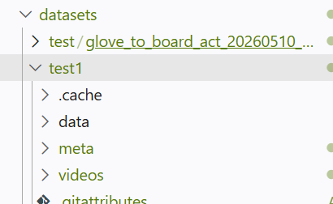

# Lerobot本地部署+远程部署

# 购买（￥1800-2000）
这边有官方的**中文教程**（实则带货，全套购买连接在这里）：[https://zihao-ai.feishu.cn/wiki/GDNJwOuRuiRCNIkmqzUc5y0Untg](https://zihao-ai.feishu.cn/wiki/GDNJwOuRuiRCNIkmqzUc5y0Untg)————但是这里从**数据集采集**的章节开始水了，写的并不详细。

关于**训练和部署的细节**还是需要看官方教程：[https://hugging-face.cn/docs/lerobot/hilserl_sim](https://hugging-face.cn/docs/lerobot/hilserl_sim)

个人建议：

    1. 一定要买一个**电动螺丝刀**，3D打印件的DIY体验不是很好。
    2. 可以去买一个柔性夹爪，防滑的 [https://e.tb.cn/h.izxRfXBa5O7GNrc?tk=4T0B5KXcHB6](https://e.tb.cn/h.izxRfXBa5O7GNrc?tk=4T0B5KXcHB6)
    3. 一定要记住，主臂（从臂是控制臂，**7V电源**）和从臂（从臂是夹手臂，用6个相同电机，**12V电源**）的区别，本人装反了


# 代码解读


# 配环境
拉代码：[https://github.com/huggingface/lerobot.git](https://github.com/huggingface/lerobot.git)

### window本地主机
```bash
conda create -y -n lerobot_env python=3.12
conda activate lerobot_env
pip install -e ".[feetech,async]"
pip install opencv-python 
conda install -y -c conda-forge ffmpeg=7.1.1
```

### ubuntu服务器（4090）
```bash
conda create -y -n lerobot_env python=3.12
conda activate lerobot_env
pip install -e ".[async,smolvla]"
pip install 'lerobot[dataset]'
conda install -y -c conda-forge ffmpeg=7.1.1
（可选）export LD_LIBRARY_PATH="$CONDA_PREFIX/lib:$LD_LIBRARY_PATH"
```

# 组装+调试
仔细按照中文教程就能搞通


# 数据集采集（windows）
```powershell
lerobot-find-cameras opencv

得到参数信息后，得到的参数要跟robot.cameras的参数对上
```

```powershell
lerobot-teleoperate `
  --robot.type=so101_follower `
  --robot.port=COM6 `
  --robot.id=zihao_follower_arm `
  --robot.cameras='{ front: {type: opencv, index_or_path: 0, width: 640, height: 480, fps: 30}}' `
  --teleop.type=so101_leader `
  --teleop.port=COM5 `
  --teleop.id=zihao_leader_arm `
  --display_data=true
```

```powershell
lerobot-record `
  --robot.type=so101_follower `
  --robot.port=COM6 `
  --robot.id=zihao_follower_arm `
  --robot.cameras='{ front: {type: opencv, index_or_path: 0, width: 640, height: 480, fps: 30, fourcc: MJPG}}' `
  --teleop.type=so101_leader `
  --teleop.port=COM5 `
  --teleop.id=zihao_leader_arm `
  --display_data=true `
  --dataset.repo_id=zcBao/test `
  --dataset.single_task="Pick up the object and place it into the box." `
  --dataset.num_episodes=3 `
  --dataset.episode_time_s=15 `
  --dataset.reset_time_s=10 `
  --dataset.push_to_hub=false

  dataset参数解释：
  repo_id代表存储路径录完会给提示
  num_episodes代表录制的轮数
  episode_time_s代表每轮的时间
  reset_time_s代表复位的时间
```

```powershell
├─data
│  └─chunk-000
├─meta
│  └─episodes
│      └─chunk-000
└─videos
    └─observation.images.front
        └─chunk-000
```

之后就可以上传到服务器了，如图所示：



root路径就放到test1就可以了

# 训练
### ACT
```bash
lerobot-train \
  --dataset.repo_id=zcBao/glove_to_board_act \
  --dataset.root=/data/baozhicheng/workspace/lerobot/datasets/glove_to_board_act \
  --dataset.streaming=false \
  --policy.type=act \
  --output_dir=/data/baozhicheng/workspace/lerobot/checkpoints/glove_act_debug \
  --job_name=glove_act_debug \
  --policy.device=cuda \
  --wandb.enable=false \
  --policy.push_to_hub=false \
  --steps=20000 \
  --batch_size=2  
```


# 启动部署
### 服务器
```bash
python -m lerobot.async_inference.policy_server \
  --host=0.0.0.0 \
  --port=8080
```

### 主机
```bash
Test-NetConnection 10.126.62.197 -Port 8080

如果显示：TcpTestSucceeded : True，就说明可以跑通
```

```bash
python -m lerobot.async_inference.robot_client `
  --server_address=10.126.62.197:8080 `
  --robot.type=so101_follower `
  --robot.port=COM6 `
  --robot.id=zihao_follower_arm `
  --robot.cameras='{ front: {type: opencv, index_or_path: 0, width: 640, height: 480, fps: 30}}' `
  --task="Clamp the black object and place it onto the gray board in front" `
  --policy_type=act `
  --pretrained_name_or_path=/data/baozhicheng/workspace/lerobot/checkpoints/glove_act/checkpoints/020000/pretrained_model `
  --policy_device=cuda `
  --actions_per_chunk=10 `
  --chunk_size_threshold=0.8 `
  --aggregate_fn_name=weighted_average `
  --debug_visualize_queue_size=True

  关键参数解释：
    server_address：服务器地址
    policy_type：模型名称
    pretrained_name_or_path:权重路径
    actions_per_chunk：表示服务器每次推理返回 20 步动作，这里一步一秒，我们的摄像头是30帧，20 / 30 ≈ 0.67 秒，也就是说每次预测0.67s的动作序列
    chunk_size_threshold：表示当动作队列剩余低于当前chunk（）的 50% 时，就提前向服务器请求下一批动作。
    aggregate_fn_name：由于新旧 action chunk 之间会有重叠，weighted_average 会对重叠部分进行加权融合，使动作更平滑，减少机械臂突然抖动。
```


> 更新: 2026-05-11 22:35:24  
> 原文: <https://3dcv.yuque.com/org-wiki-3dcv-mm1l0t/zhy6ev/kwnkgtfoy9eupcf6>