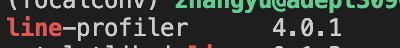
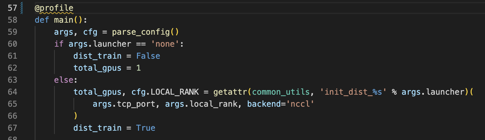
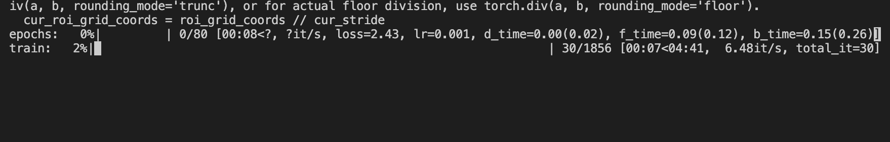
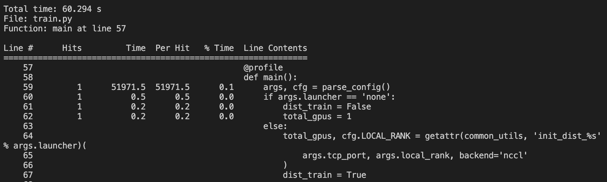
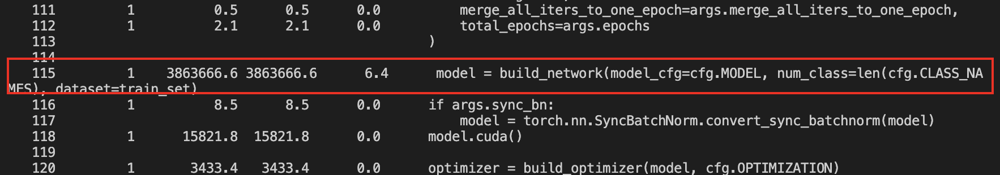
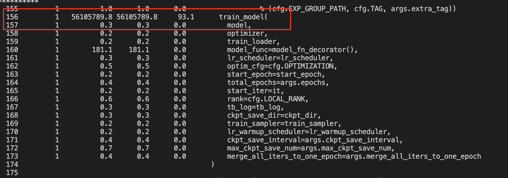
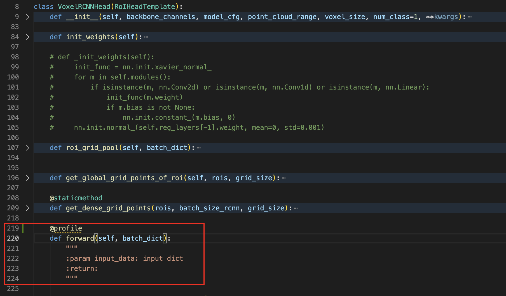
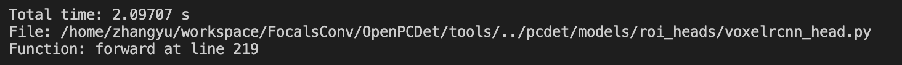
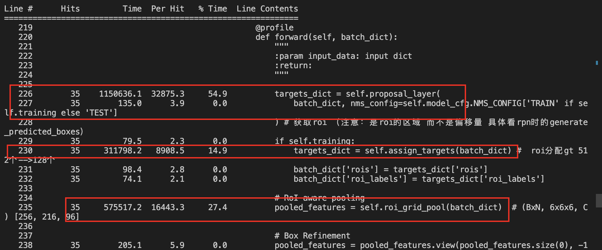
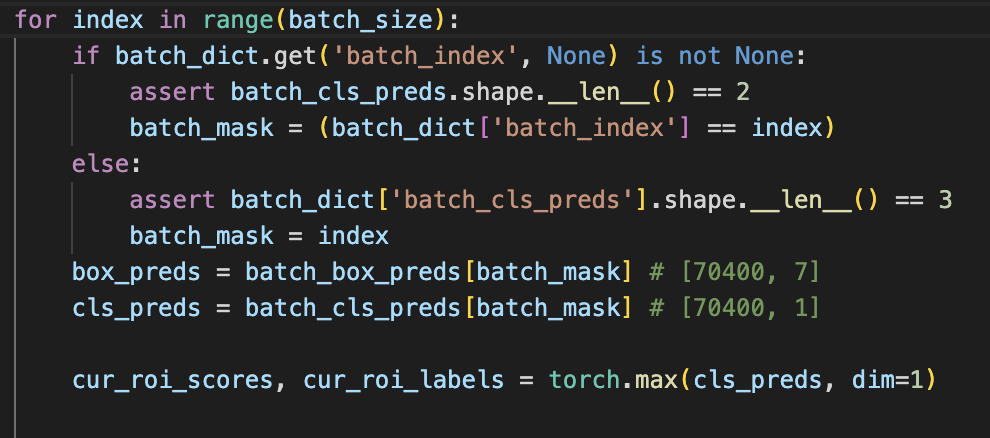

# python代码效率优化

背景：

写完新的模块后，pytorch模型训练速度慢，主要代码运行在每个模块的forward函数。

核心步骤：

1. 定位可优化代码位置
2. 优化问题代码

# 定位

## 使用工具：line\_profiler

（或者利用import time包也可以去测大概时间）

1. 先安装 `pip install line_profiler`

2. 将相应的函数加上装饰器`@profile`

   例如：

   我的启动文件是 train.py ，先测试下。

以main方法为例：

将`@profile`加到main上：

启动一下试试：

运行这个`kernprof -l -v train.py`来启动py文件。

加上我的参数：

`kernprof -l -v train.py --cfg_file cfgs/kitti_models/voxel_rcnn_car.yaml`

等程序跑起来：

需要等程序结束才可以看到时间信息，这里就先 `ctrl+c` 中断。控制台同样会输出时间信息：

第一行是main方法，总共运行了60.294秒。

然后看下面内容

第一列`Line` 代码行数；

第二列`Hits` 本次程序该语句被执行的次数；

第三列`Time` 本次程序该语句运行总占用时间；（单位为`Timer unit: 1e-06 s`）

第四列`Per Hit` 本次程序该语句每次Hit平均时间；

第五列 `% Time`本次程序该语句所占用时间占比。

通常我们直接观察第五列`% Time`

如上图，本次程序占用最长的就是上述红框里的两行。

115行是实例化对象，156行是整个train过程。

再举个例子将`@profile`加到具体的模块中。

以voxelrcnn head为例：

推理过程代码主要是在forward里，我们将`@profile`加到forward()上。

使用同样的命令去运行train.py

`kernprof -l -v train.py --cfg_file cfgs/kitti_models/voxel_rcnn_car.yaml`

运行一会再`ctrl+c`中断。

`proposal_layer()`per hit = 0.0328753s

`assign_targets()`per hit = 0.0089085s

`roi_grid_pool()`  per hit = 0.0164433s

这三个方法几乎占用了整个forward时间。

# 优化

根据需求不同，可能每种代码优化方式不一样。

以pytorch模型为例：

用for之前要先设计好，尽量不要用for去大量遍历features。

常见的优秀的开源codebase(OpenPCDet mmdetection3d等)中，即使需要用for也只是遍历本次batch中的每个样本。例如：

其他地方想要用for最好是用torch自带的方法去替换。

torch自带的方法处理feature速度很快，如果用python循环等操作去处理就很慢了。

如果必须用到for的地方，可以将其独立成一个函数，然后用`numba`装饰器优化一下。

# 总结

这是一次优化经验，对应不同任务需要优化的方式也不同。

之后遇到相关问题 解决后会继续更新....

> 更新: 2023-04-26 22:11:13  
> 原文: <https://3dcv.yuque.com/org-wiki-3dcv-mm1l0t/zhy6ev/sqofak5kewrlutqb>