# 2022/9/5

# Multimodal Virtual Point 3D Detection (NeurIPS 2021)
## 主要创新点：
把物体周围的lidar点变稠密，方便神经网络识别出物体

## 方法：
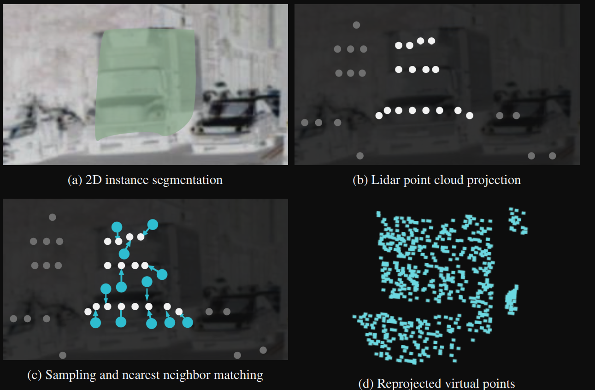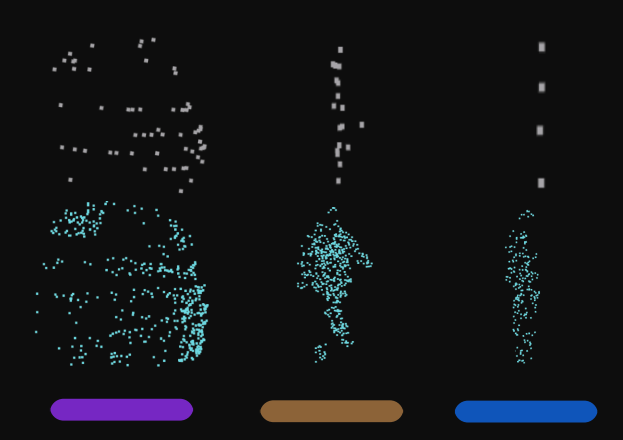

首先是对图像进行实例分割，将激光点投影到图像上，这样图像上每个instance上会有几个激光点投上去。

然后，对每个instance内的像素进行随机采样（图c绿色点），与被激光点投影上的像素（图c白色点）进行最近邻关联，取关联上的激光点的深度为当前像素的深度（VFF里用射线生成器算出了最近邻采样点的深度）。

最后，这些点投影回激光坐标系，得到virual lidar points，这样就达到了点云稠密化的效果，然后使用现在流行的点云处理算法进行处理。

VFF在此基础上改进如下

1. 将激光点投影到图像上时，真实lidar点信息与图像信息进行了融合
2. 对2D图像进行了语义分割而不是实例分割，但是以每个gt_bbox中心为中心形成2D真值高斯场，保证采样点在前景物体上（防止得分较高的点不属于前景物体）
3. 在图片中采样物体上的虚拟点时，采样置信分数较高的点，而不是随机采样
4. 用空体素场+射线生成器，预测了图片上的虚拟采样点在lidar坐标系下的深度，同时，以每个真实lidar点为中心形成3D高斯场，保证虚拟采样点投影回lidar坐标系后在真实点附近（防止深度估计尝试较大偏差）
5. 将真实点的信息传递给了从图像中投影到lidar中的虚拟点

# VPFNet: Improving 3D Object Detection with Virtual Point based LiDAR and Stereo Data Fusion
## 主要创新点：
1. 虚拟点采样法
2. 虚拟点的邻居信息融合

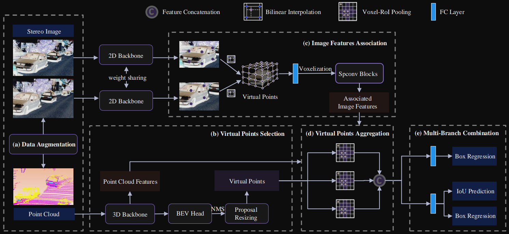

## 方法：
所提出的 VPFNet 的架构。给定立体和 LiDAR 点云对，

我们首先使用 (a) 多模态数据增强技术在训练阶段获得增强场景。

然后在 (b) 虚拟点选择中，我们将数据分别输入 2D 和 3D 主干。 2D 主干仅用于特征提取，3D 主干用于生成 3D 提议，从这些提议中选择虚拟点。（ 3D 提议被随机调整大小并划分为固定大小的网格块，每个网格块/单元是虚拟点。随机调整大小后，提议沿长度、宽度和高度维度划分为 Nx × Ny × Nz 3D 网格。然后我们将这些网格点用作虚拟点。这里，示例 Nx、Ny 和 Nz 值为 12、8 和 22，前景区域中有超过 2K 个样本。这样的样本密度远高于原始 LiDAR 点云（通常为数百个样本）。）

然后在 (c) 图像特征关联中，将虚拟点投影到图像平面以对 2D 图像特征进行采样。采样的图像特征因此与虚拟点相关联。这些特征通过堆叠的稀疏卷积层进行体素化和处理。

接下来，在（d）虚拟点聚合中，我们将虚拟点作为查询点进行采样，并在 3D 空间中定位最近的 K 个 LiDAR 点邻居，并将它们的特征与相关图像进行聚合，从而得到一个聚合的特征向量。

最后在（e）多分支组合中，将这些特征向量输入到检测头中以预测最终结果。我们还涉及一个辅助分支，它只处理聚合的图像特征以防止单模态优势。请注意，仅在训练阶段需要增强步骤和建议调整大小步骤。

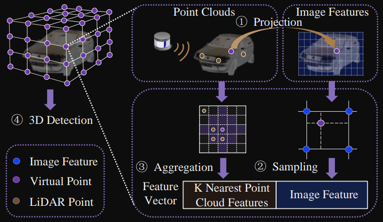

在 VPFNet 中，我们使用虚拟点（标记为红色）来聚合多模态数据。将虚拟点投影到图像平面以对图像特征进行采样。至于 LiDAR 点云特征，我们执行体素 RoI 池化操作（由 5 × 5 正方形标记）来聚合来自 K 个最近邻的点云特征。因此，每个虚拟点的特征向量由采样的图像特征和聚合的 K 个点云特征组成

# **EPNet: Enhancing Point Features with Image Semantics for 3D Object Detection**
## 主要创新点：融合策略
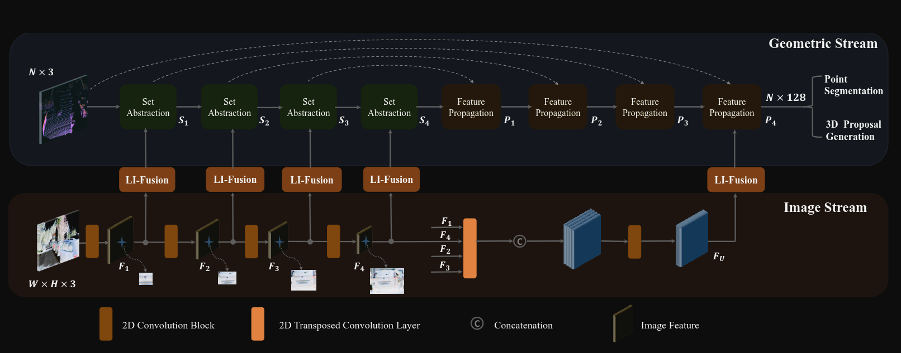

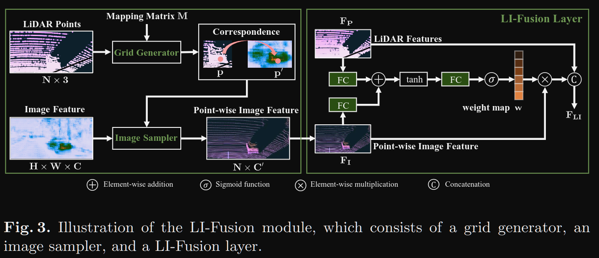

**LI-Fusion可以分为两个部分**

a）将LiDAR points按照坐标映射到图像上，提取对应位置的图像特征，即为point-wise image feature

b）融合LiDAR和Image feature，通过LiDAR data估计每一个点的重要性，作为re-weighting parameters重新度量前一步中提取的point-wise image feature

## 方法
将激光雷达点投影到相机图像上，并表示映射矩阵为M。网格生成器以LiDAR点云和映射矩阵M为输入，输出不同分辨率下的LiDAR点与相机图像的点态对应关系。更具体地说，对于点云中的一个特定点p(x, y, z)，我们可以得到它在相机图像中的对应位置p ' (x '， y ')，可以写成:p ' = M × p，其中M的大小为3 × 4。注意，在投影过程式(1)中，我们将p '和p转换为齐次坐标的三维和四维向量。

 '和图像特征映射F作为输入，对每个采样位置产生逐点图像特征表示V。考虑到采样位置可能落在相邻像素之间，我们使用双线性插值得到连续坐标下的图像特征

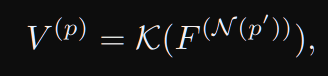

我们使用sigmoid激活函数将权重映射w归一化到[0,1]的范围内。

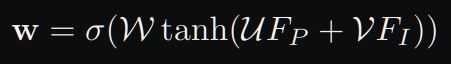

其中W、U、V表示LI-Fusion层中的可学习权矩阵。σ表示s型激活函数

## 损失函数
为了缓解分类得分和定位准确度不一致的问题，作者引入了Consistency Enforcing Loss，如下：

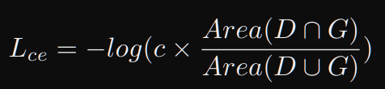

D是预测边界框；G是GT标签；c是D的分类置信度分数；

该损失会使得分类置信度和定位置信度都尽可能高

# Unifying Voxel-based Representation with Transformer for 3D Object Detection
## 主要创新点：把图像投影到体素空间
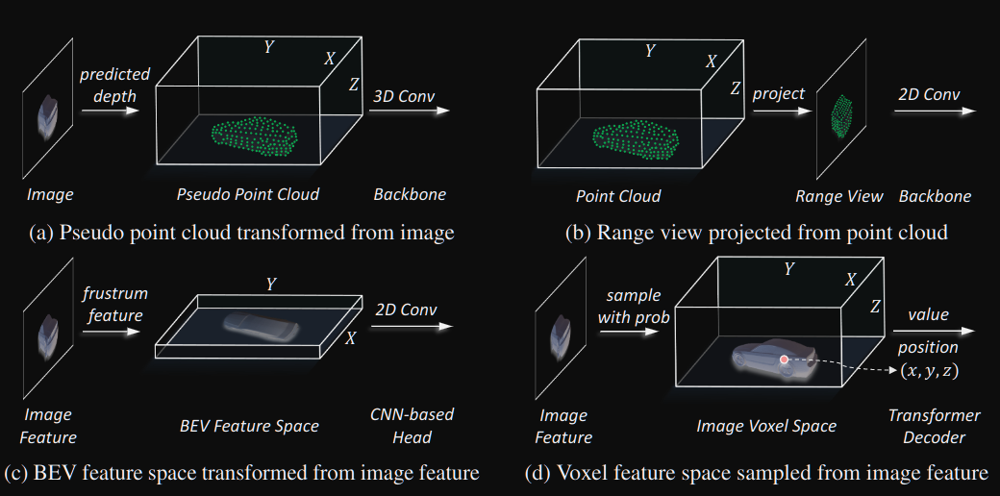

统一表示的方法示例。与其他方法相比，1d方法通过从图像平面上采样特征来构建体素空间，在1c中不需要进行高度级压缩，从而统一表示多模态，避免了语义上的歧义。

VFF

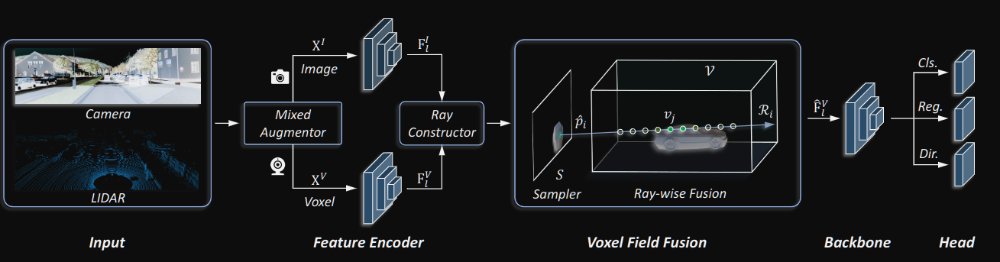

UVTR

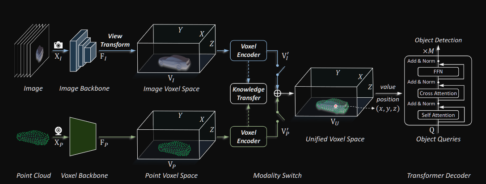

在体素编码器中，特征在空间上相互作用，在训练过程中很容易支持知识转移。根据不同的设置，通过模态开关选择单模态或多模态特性。最后，利用transformer解码器（借鉴DETR的思想，给定N个object queries，每个queries收集其他voxel信息）从具有可学习位置的统一空间中采样特征进行预测。

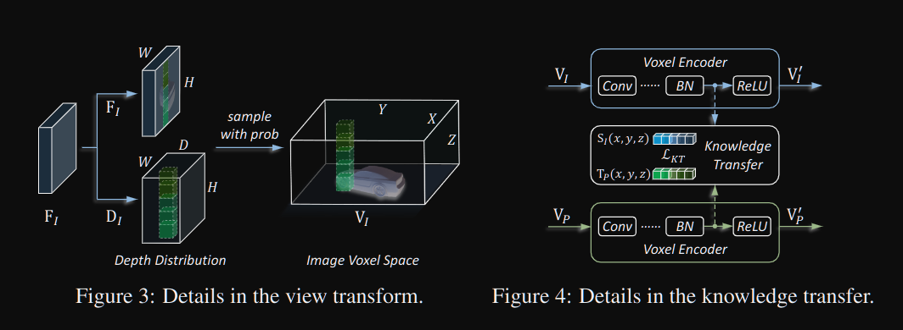

将VP体素编码器中最后一层ReLU层之前的特征作为几何丰富的老师，标记为TP。同时，取与VI相同位置的特征为几何差学生，记为SI

融合策略：知识蒸馏 L2函数进行距离度量（本文参考A Comprehensive Overhaul of Feature Distillation）

[A Comprehensive Overhaul of Feature Distillation](https://zhuanlan.zhihu.com/p/109207716)

# CLOCs: Camera-LiDAR Object Candidates Fusion for 3D Object Detection
## 主要创新点：proposal级的后融合
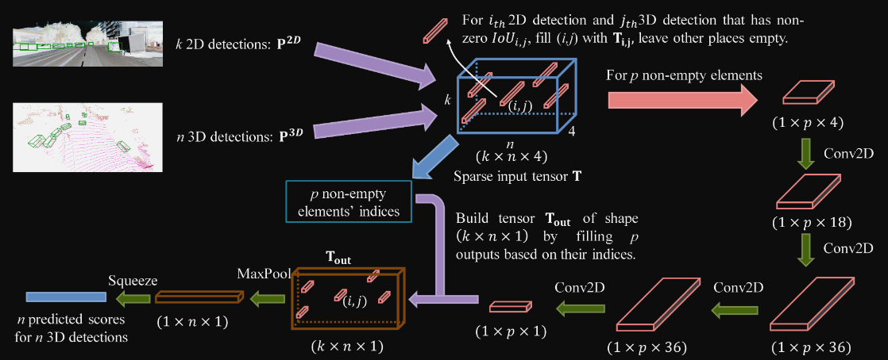

首先，将单独的2D和3D检测候选者转换为一组一致的联合检测候选者(一个稀疏张量，蓝色方框);然后利用二维CNN处理稀疏输入张量中的非空元素;最后，这个处理过的张量通过maxpooling映射到期望的学习目标，即概率得分图。因为只有少数的2D框能与3D框能对应（因为作者认为3D框具体有更高的可信度，所以不论3D框有没有对应的2D框，所有的3D框都会被保存下来），所以T向量是稀疏的。（2D图像k 个候选检测对象，3D图像n个候选检测对象，4是Ti,j的维度）

对于2D检测器生成的 k 个检测结果，将其记为:

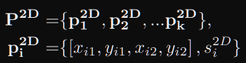

P2D 表示一幅图像中的 k 个候选检测对象。其中 Pi2D 表示的是检测框的一些基本参数以及置信度。

对于一个3D点云场景，其共有 n 个检测候选对象，将其记为：

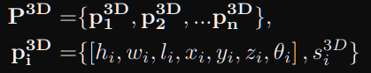

对于k个2D检测结果，以及 n 个3D检测结果，我们构建了一个 k×n×4 的张量 T 。对于张量的每一个元素，其共有四个通道组成。

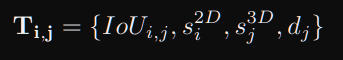

其中， IoUi,j 表示的2D检测框与3D检测框在图像上的投影所计算的值， si2D,sj3D 表示的是2D和3D检测框的置信度评分。 dj 表示的是第 j 个3D检测框距离点云中 x,y 平面的归一化距离。张量 T 中将 IoU 为零的元素剔除，因为其不具有几何一致性。

# FUTR3D: A Unified Sensor Fusion Framework for 3D Detection
## 主要创新：
多传感器向proposal融合

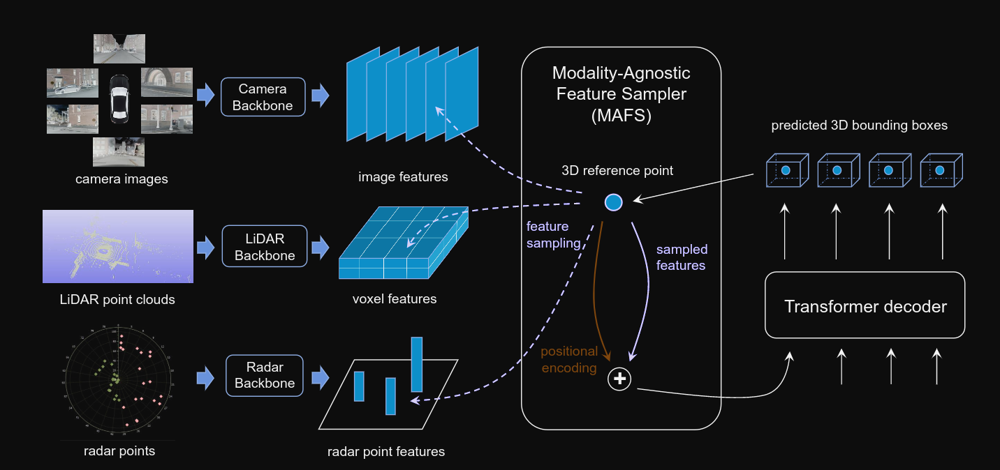

每个传感器模态使用模态特定的特征编码器在其自己的坐标中单独编码。然后，基于查询的特征采样器(MAFS)根据每个查询的三维参考点从所有可用的模式中提取特征。最后，一个变压器解码器从查询中预测出3D边界框。预测框可以迭代反馈到MAFS和变压器解码器，以完善预测

## 符号解释
ci相当于是每个query的中心点（假设i个物体），M为FPN输出的特征层数。

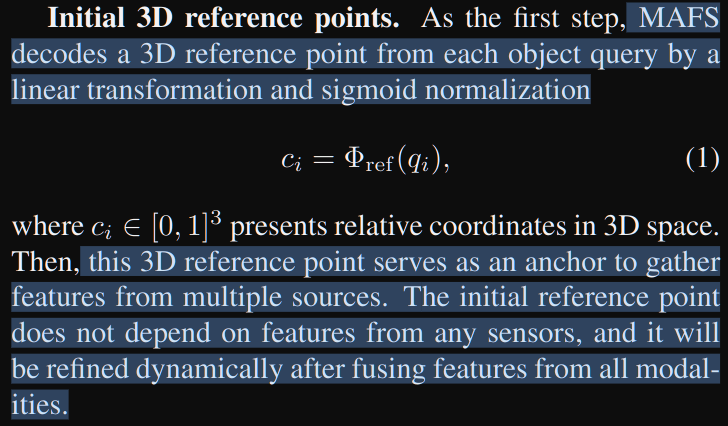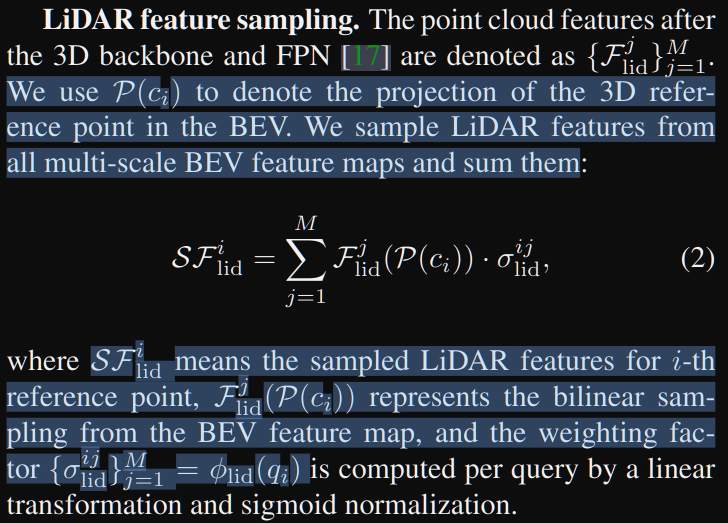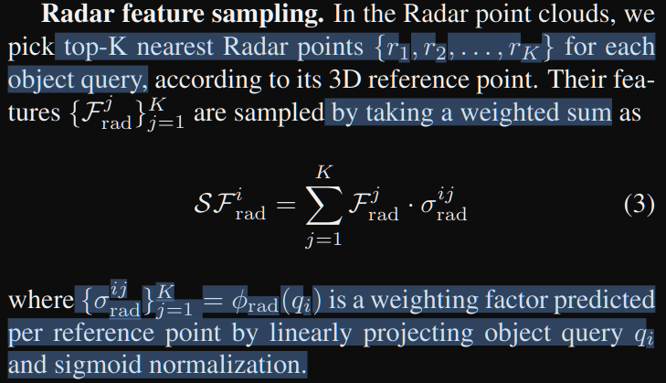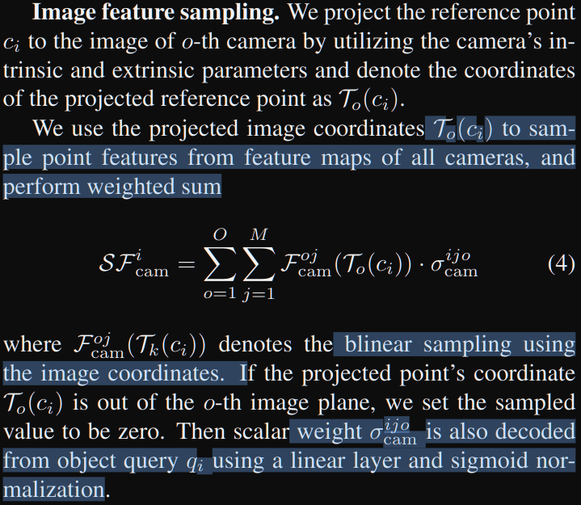

融合函数

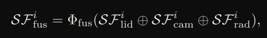

加入位置编码

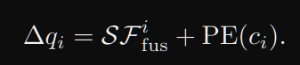

采用自注意机制

# 改进计划
1. 根据EPNet和FFB6改进点与图像之间的融合策略（现在VFF就是简单的加和）。（这周的主要目标）
2. 根据VPFNet的思想，在虚拟点之间进行消息传递和信息融合。
3. 改进虚拟点的生成策略（估计比较难实现）

> 更新: 2023-04-26 22:05:06  
> 原文: <https://3dcv.yuque.com/org-wiki-3dcv-mm1l0t/oa9xe9/gbe7k6>