# Voxel Field Fusion for 3D Object Detection

# <font style="color:rgb(210, 206, 200);background-color:rgb(24, 26, 27);">主要创新</font>
利用图片中的像素生成射线，并用该射线增强其附近的点

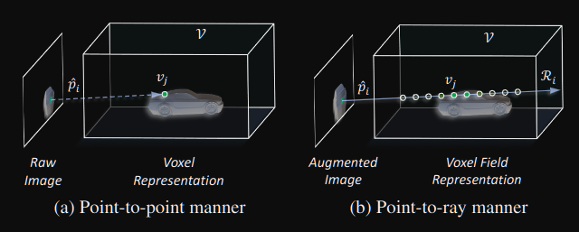


# 流程
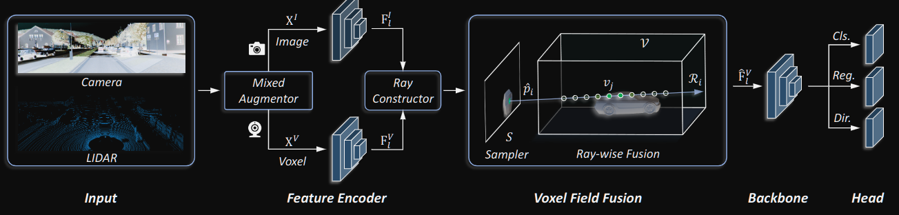

+ <font style="color:rgb(210, 206, 200);background-color:rgb(24, 26, 27);">首先使用混合增强器进行处理，该增强器只用于训练。</font>
+ <font style="color:rgb(210, 206, 200);background-color:rgb(24, 26, 27);">然后，在特征编码器中分别提取两种模式的特征，在射线构造器中建立对应关系。</font>
+ <font style="color:rgb(210, 206, 200);background-color:rgb(24, 26, 27);">在体素场融合中，利用设计的采样器来选择用于交互的关键图像特征。</font>
+ <font style="color:rgb(210, 206, 200);background-color:rgb(24, 26, 27);">然后沿着每条射线用高响应特征进行射线方向融合。</font>
+ <font style="color:rgb(210, 206, 200);background-color:rgb(24, 26, 27);">在体素域中融合新生成的特征后，利用以下检测主干和头部来预测最终的3D建议。</font>

# Mixed Augmentor
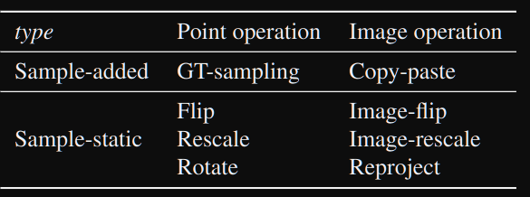

<font style="color:rgb(210, 206, 200);background-color:rgb(24, 26, 27);">样本叠加：在投影的2D框中裁剪数据并将其粘贴到输入图像上，在输入图像中，根据实际深度或裁剪顺序重新组织裁剪。</font>

<font style="color:rgb(210, 206, 200);background-color:rgb(24, 26, 27);">样本静态增强：例如翻转、重新缩放和旋转。</font>

<font style="color:rgb(210, 206, 200);background-color:rgb(24, 26, 27);">样本静态增强包括一组没有添加新样本的变换，例如翻转、重新缩放和旋转。</font>

<font style="color:#E8323C;background-color:rgb(24, 26, 27);">以前的工作使用reproject重新投影来寻找跨模式的点-图像对应，与以前的工作不同的是：</font>

1. <font style="color:#E8323C;background-color:rgb(24, 26, 27);">先对点云进行增广，</font>
2. <font style="color:#E8323C;background-color:rgb(24, 26, 27);">把增广前后的点云投影到2D平面上，</font>
3. <font style="color:#E8323C;background-color:rgb(24, 26, 27);">再根据增广前后的点云投影图的关系，旋转RGB图片</font>

<font style="color:#E8323C;background-color:rgb(24, 26, 27);">用到了这两个函数实现ours：</font><font style="color:#E8323C;background-color:rgb(24, 26, 27);">cv2.findHomography() </font><font style="color:#E8323C;background-color:rgb(24, 26, 27);">cv2.perspectiveTransform()</font>

<font style="color:rgb(192, 186, 178);background-color:rgb(24, 26, 27);">cv2.findHomography()：</font><font style="color:rgb(183, 177, 168);background-color:rgb(24, 26, 27);">计算二维点对之间的最优单映射变换矩阵H（3行x3列） </font>

<font style="color:rgb(183, 177, 168);background-color:rgb(24, 26, 27);">cv2.perspectiveTransform()：对图像进行透视变换</font>

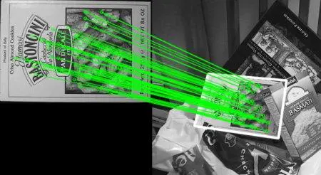

```python
# 原始点投影到2D
random_idx = np.random.permutation(np.arange(0,len(data_dict['points'])))[:100]
points_raw = data_dict['points'][random_idx,:3].copy()  # 点坐标
points2d_raw, depth_raw = data_dict['calib'].lidar_to_img(points_raw)

# 增广点投影到2D
points_aug = data_dict['aug_points'][random_idx,:3].copy()
points2d_aug, depth_aug = data_dict['calib'].lidar_to_img(points_aug)
points2d_aug = points2d_aug.reshape(-1, 1, 2).astype(np.int)

"""
cv2.findHomography()：计算二维点对之间的最优单映射变换透视矩阵H（3行x3列） 
"""
H, status = cv2.findHomography(points2d_aug, points2d_raw, cv2.RANSAC,
                               ransacReprojThreshold)  
"""
cv2.warpPerspective：对图像进行透视变换
src：输入图像
M：变换矩阵
dsize：目标图像shape
flags：插值方式，interpolation方法INTER_LINEAR或INTER_NEAREST
"""
data_dict["images"] = cv2.warpPerspective(images, H, (images.shape[1], 
                                                      images.shape[0]),
                            flags=cv2.INTER_LINEAR + cv2.WARP_INVERSE_MAP)

```

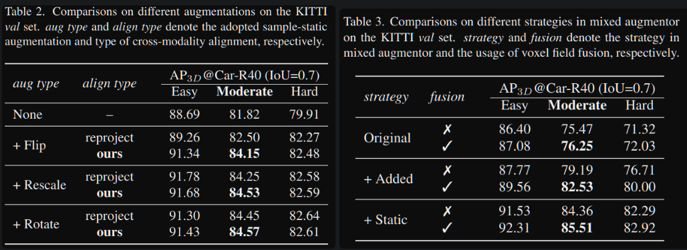

#  Voxel Field Construction
## Voxel Field点与体素对应关系
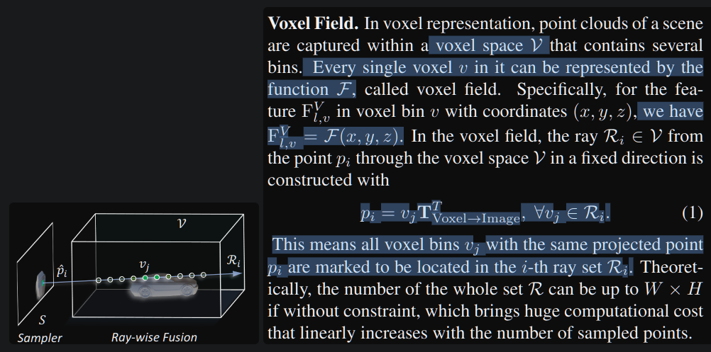


## Learnable Sampler
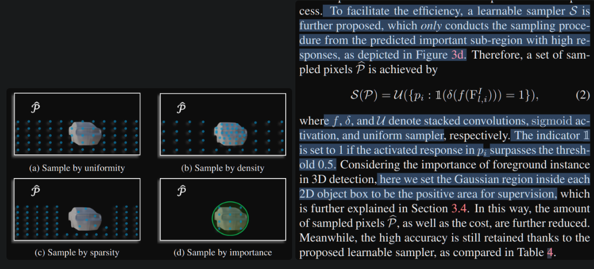
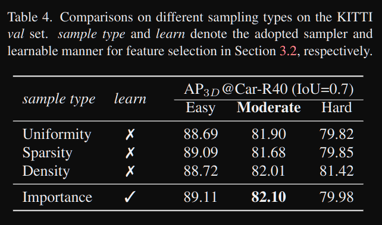


##  Ray-voxel Interaction
## 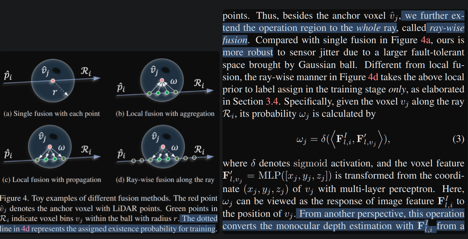
<font style="color:rgba(232, 230, 227, 0.84);background-color:rgb(24, 26, 27);">为了提高网络效率，只选择预测分数ω最高的体素进行融合，该体素占原始非空体素总数的四分之一。</font>

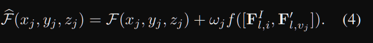

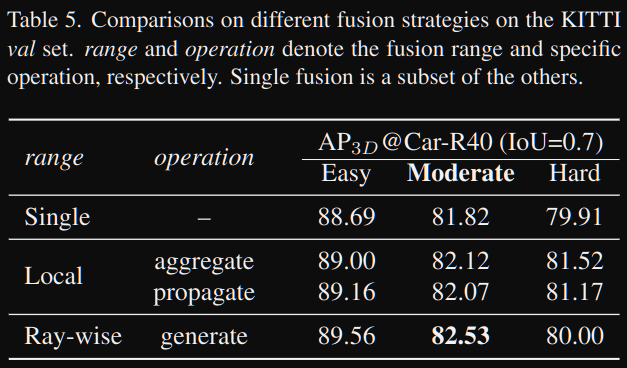


##  Optimization Objectives
损失函数设计：针对采样函数和融合中的高斯分布

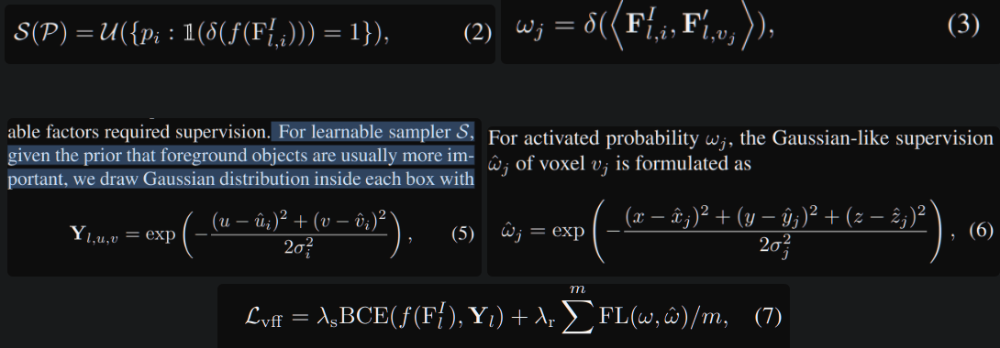  
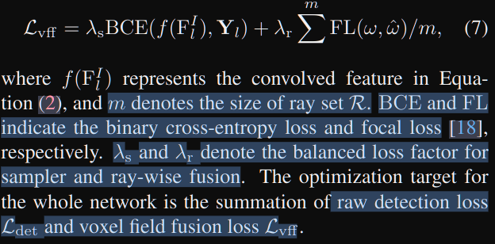

# <font style="color:rgb(210, 206, 200);background-color:rgb(24, 26, 27);">实验</font>
## <font style="color:rgb(210, 206, 200);background-color:rgb(24, 26, 27);">实现细节。</font>
<font style="color:rgb(210, 206, 200);background-color:rgb(24, 26, 27);">在本研究中，我们采用了三个不同的主干来验证本文提出的框架，</font>

<font style="color:rgb(210, 206, 200);background-color:rgb(24, 26, 27);">分别是:KITTI数据集上的PV-RCNN[27]和Voxel R-CNN [8]， </font>

<font style="color:rgb(210, 206, 200);background-color:rgb(24, 26, 27);">nuScenes数据集上的CenterPoint[44]。我们在每个网络中遵循相应的架构和训练设置。</font>

<font style="color:rgb(210, 206, 200);background-color:rgb(24, 26, 27);"></font>

<font style="color:rgb(210, 206, 200);background-color:rgb(24, 26, 27);">在本文提出的VFF中，对公式(2)中的可学习采样器和公式(3)中的特征变换进行了三次卷积和MLP，其中每个摄像头视图使用单个MLP。为了优化，我们所有的实验都将式(7)中的λs和λr设为2和5。除了非空体素外，我们还在推断阶段沿每条射线选取概率ω大于0.05的特征。</font>  


## KITTI实验
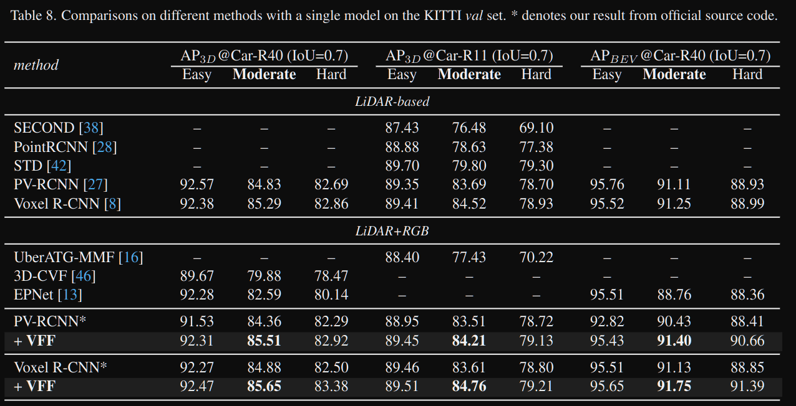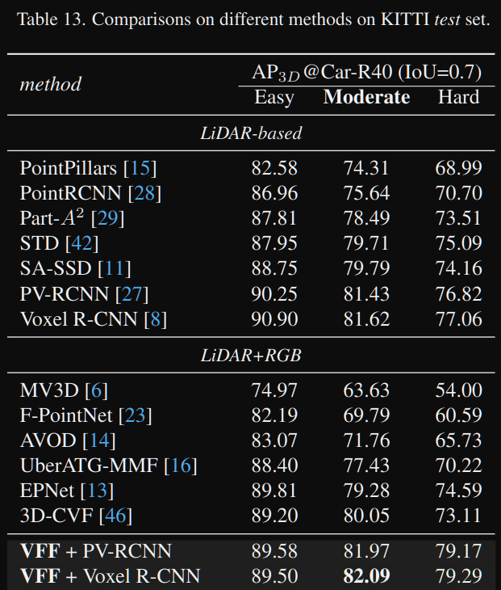


## 消融
### 是否融合
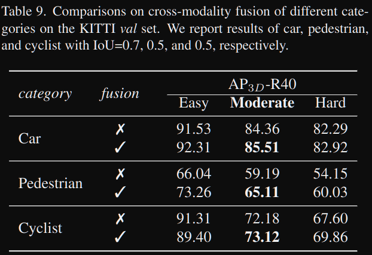

### 2d backbone
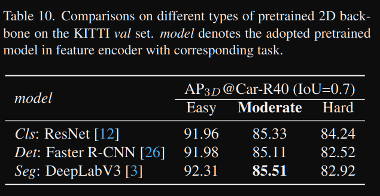


# 总结
+ <font style="color:rgb(210, 206, 200);background-color:rgb(24, 26, 27);">我们提出了体素场融合，一个概念简单但有效的框架，用于三维物体检测中的交叉模态融合。</font>
+ <font style="color:rgb(210, 206, 200);background-color:rgb(24, 26, 27);">与之前的工作的关键区别在于，我们通过在体素场中</font><font style="color:#E8323C;background-color:rgb(24, 26, 27);">将增强图像特征表示和融合为射线</font><font style="color:rgb(210, 206, 200);background-color:rgb(24, 26, 27);">来保持形态的一致性。</font>
+ <font style="color:rgb(210, 206, 200);background-color:rgb(24, 26, 27);">特别是，通过</font><font style="color:#E8323C;background-color:rgb(24, 26, 27);">可学习采样</font><font style="color:rgb(210, 206, 200);background-color:rgb(24, 26, 27);">和</font><font style="color:#E8323C;background-color:rgb(24, 26, 27);">射线融合</font><font style="color:rgb(210, 206, 200);background-color:rgb(24, 26, 27);">消除了多模态特征表示的不一致性。同时，开发了</font><font style="color:#E8323C;background-color:rgb(24, 26, 27);">混合增强器</font><font style="color:rgb(210, 206, 200);background-color:rgb(24, 26, 27);">，以弥补交叉模态数据增强的不足。</font>


> 更新: 2026-01-22 17:45:34  
> 原文: <https://3dcv.yuque.com/org-wiki-3dcv-mm1l0t/oa9xe9/qxgo2i>
