# MomAD(SparseDrive)

SparseDrive load_from = 'ckpt/sparsedrive_stage2.pth'  测试结果

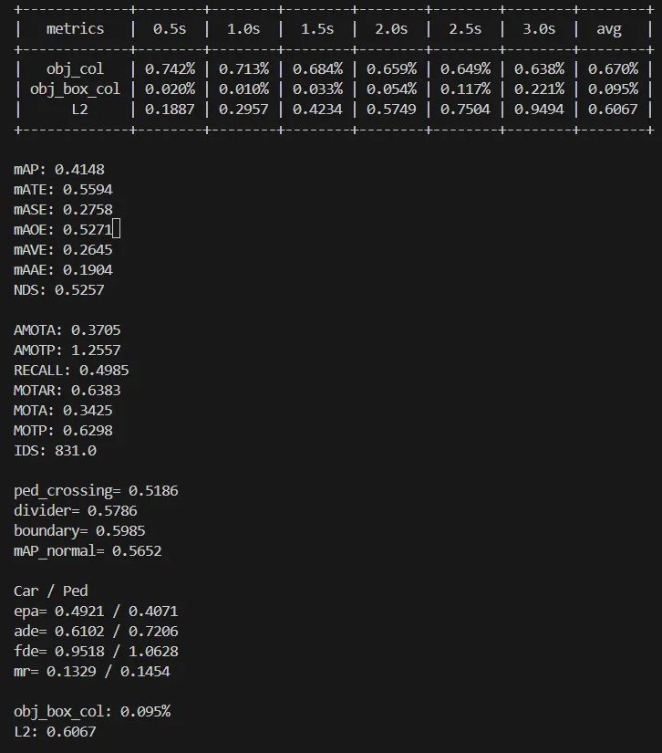

epoch=0(MomAD 使用SpareDrive的模型) load_from = 'ckpt/sparsedrive_stage2.pth'

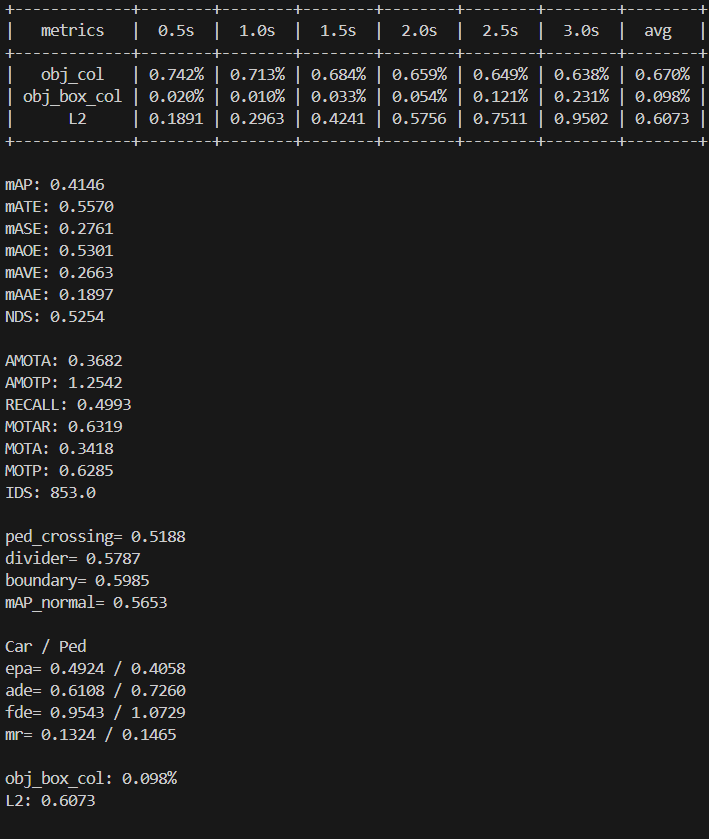

epoch=1  MomAD load_from = 'ckpt/sparsedrive_stage2.pth'

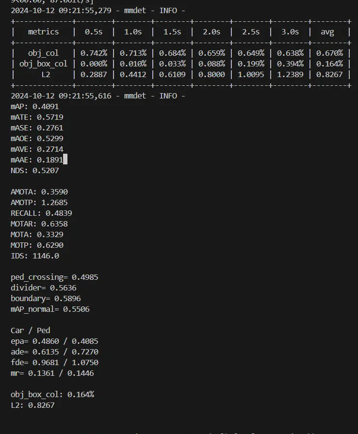

epoch=20  MomAD load_from = 'ckpt/sparsedrive_stage2.pth'

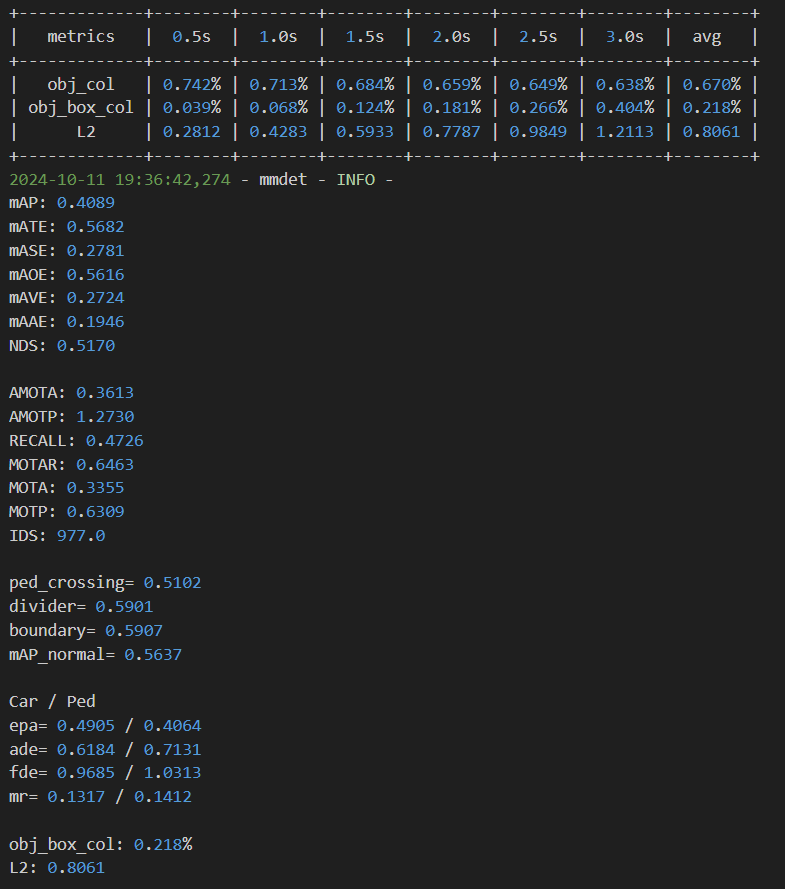

  
epoch=20 MomAD load_from = 'ckpt/sparsedrive_stage1.pth'

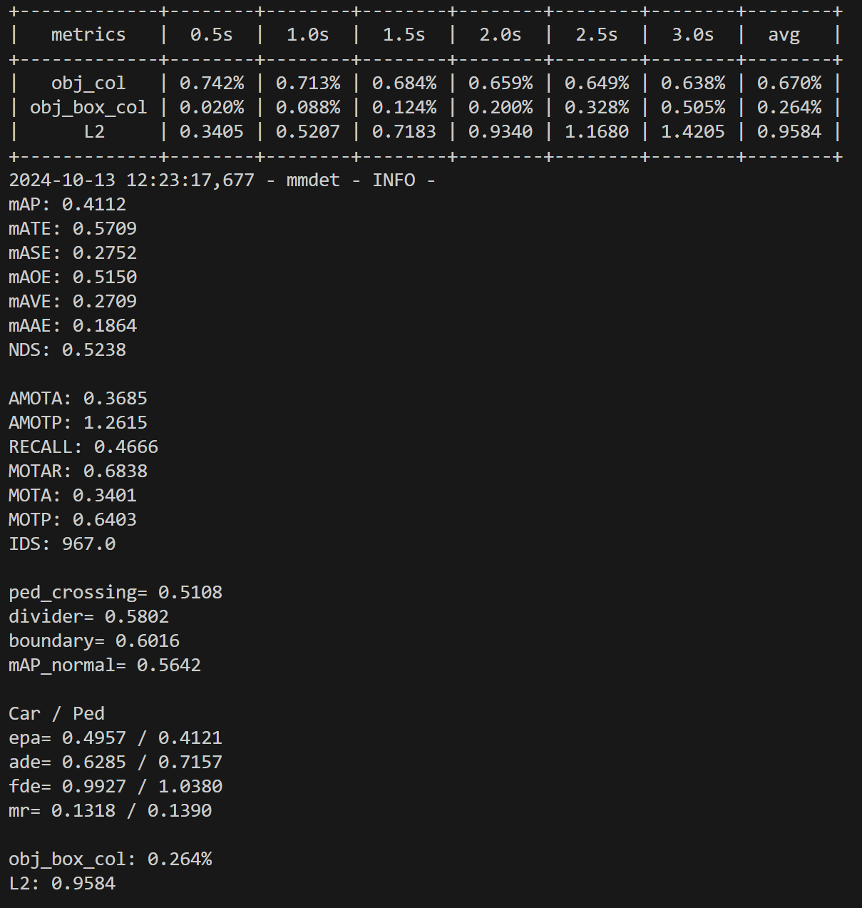

epoch=50 MomAD load_from = 'ckpt/sparsedrive_stage2.pth'

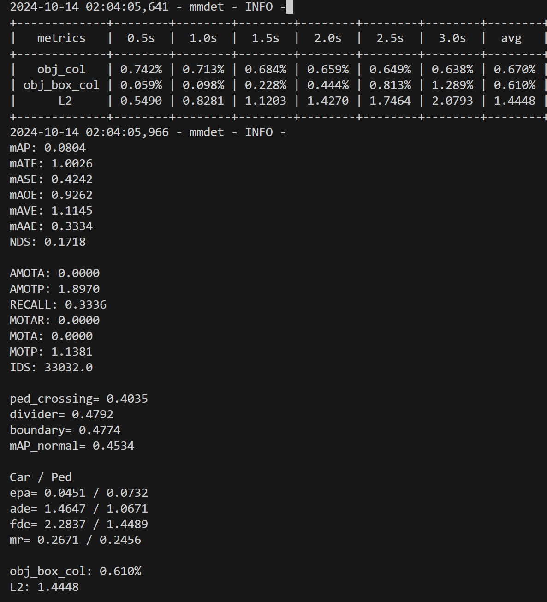

epoch=5 MomAD load_from = 'ckpt/sparsedrive_stage2.pth'

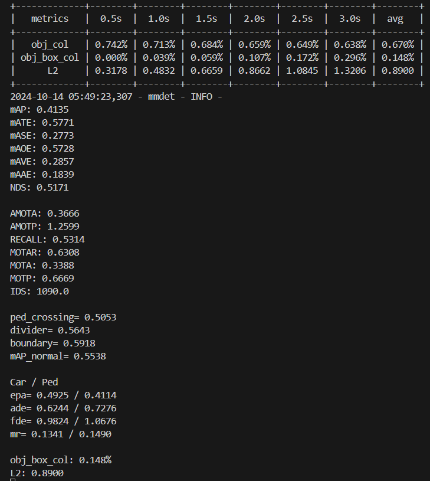

epoch=10 MomAD load_from = 'ckpt/sparsedrive_stage2.pth'

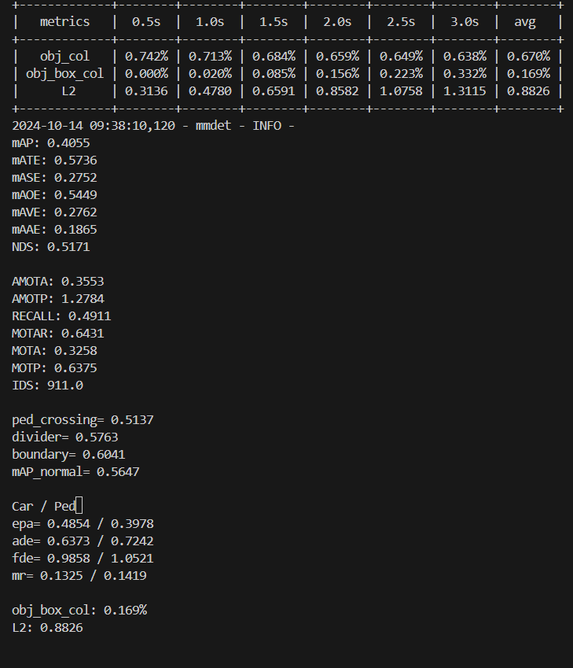

SparseDrive load_from = 'ckpt/sparsedrive_stage2.pth'  原始训练3s，测试6s

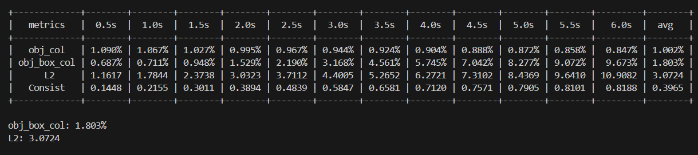

SparseDrive load_from = 'ckpt/sparsedrive_stage2.pth'  原始训练6s，测试6s epoch=10

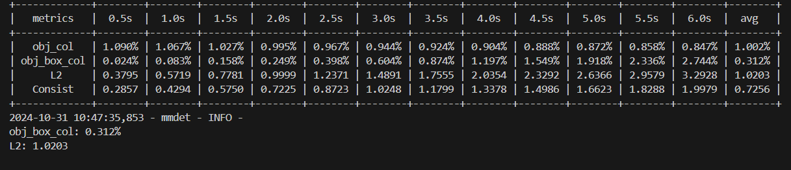

MomAD load_from = 'ckpt/sparsedrive_stage2.pth'  原始训练6s，测试6s epoch=10

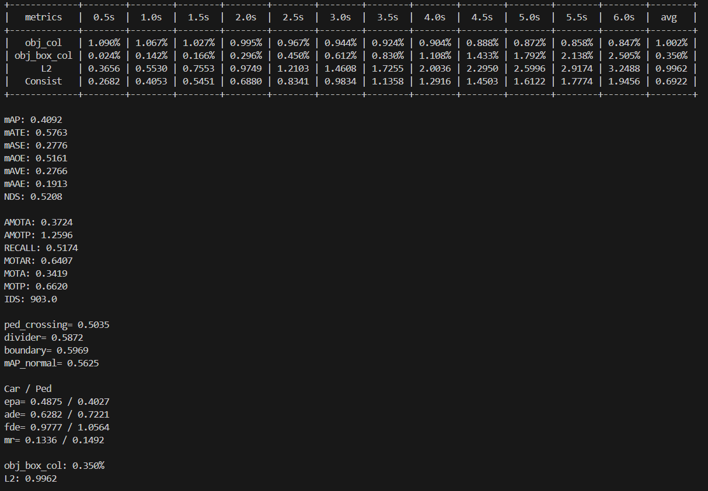

> 更新: 2024-11-01 15:33:07  
> 原文: <https://3dcv.yuque.com/org-wiki-3dcv-mm1l0t/fi3p5p/gzx0w25me79qss02>