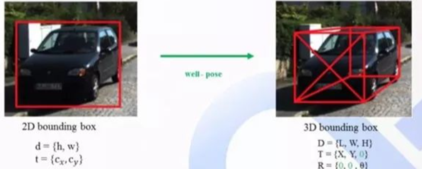
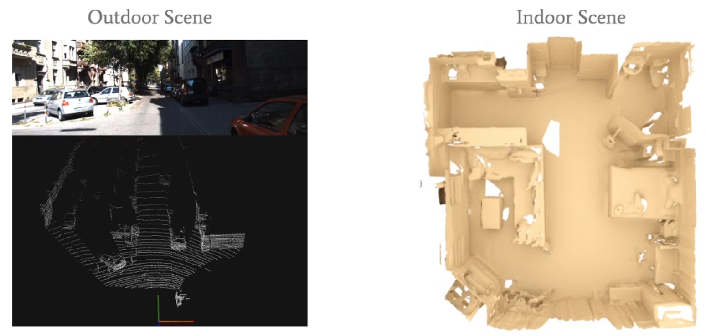

# 1.1三维目标检测概念（入门必读）

# 简介
目标检测是计算机视觉领域的传统任务，与图像识别不同，目标检测不仅需要识别出图像上存在的物体，给出对应的类别，还需要将该物体的位置通过最小包围框（Bounding box）的方式给出。

根据目标检测需要输出结果的不同，一般将使用RGB图像进行目标检测，输出物体类别和在图像上的最小包围框的方式称为2D目标检测，而将使用RGB图像、RGB-D深度图像和激光点云，输出物体类别及在三维空间中的长宽高、目标朝向等信息的检测称为3D目标检测。  

**在2D的基础上将空间扩充到3D，同时还增加了旋转角度预测**（也称为目标方向朝向）**。**

典型的三维物体检测器以场景的点云为输入，生成一个**有方向的3D bounding box**，

# 激光雷达3D目标检测
一般深度的表征方式就是用点云数据，由激光雷达（LiDAR）采集。

室外与室内场景下的点云数据可视化

与图像的表征方式不同，点云数据是不规则的、无序的，相对于图像来说它包含了相对准确的深度信息。（一般没有RGB信息）。由于点云数据的稀疏性和不规则形，所以用传统的CNN来处理它并不是一件容易的事情。

如何处理点云？常见的方法大致分为两类：Point-based、Voxel-based（也有的综述称为Discretization-based）。还有将两种工作融合到一起的Point-Voxel-based。

在一开始这项工作大多数人把不规则的点云映射成俯视图再进行voxelization转换成规则图片，再采用之前的2D检测器来进行检测3D的物体检测。这种方法在栅格化时会损失一定的信息。

随后出现了Frustum-PointNet，先对2d的图像进行一次检测，将检测结果进行对点云图的映射，提取出点云中的3D bounding box，随后对这个bounding box进行一次3D的检测。相当于把2D图片当做一个通往3D的桥梁。这种方法比较依赖2D检测器的性能，如果2D检测器出了问题后面的步骤是不可逆的。这种方法也不能很好的解决2D图片上的遮挡问题，可能会导致无法检测第一辆车后面的第二辆车。

**Voxel-based**

之后的研究者开始从点云上进行下手，也进入了当今3D目标检测的主流——Voxel-based。**VoxelNet**中点云输入进来之后，模型直接将点云数据栅格化处理为一个个的Voxel，把每个Voxel内的点送入Voxel Feature Encoding（VFE）块，最后通过池化层得到稀疏的4D张量，再送入3D卷积层学习全局特征，最后通过RPN生成锚框。**SECNOND**在其的基础上进行了优化，把中间卷积层的普通3D卷积替换为稀疏卷积，这减少了模型的运行时间，还把三维特征压缩为二维，尽量避免使用3D卷积运算。**PointPillars**不是使用Voxel划分点云，而是采用了一种**伪图片**形式输入进模型，这是一个主要创新点。它完全使用2D卷积，推理速度极快，在一个不错的准确率下可以达到**62FPS。**

**Point-based**

先入门**PointNet**和**PointNet++**。

这两篇论文提出了一种直接基于原始点云进行特征提取的网络，可以用作检测模型的Backbone用来提取点的特征。2019年提出了**PointRCNN**，是第一个基于原始点的检测双阶段网络，开启了后续的3DRCNN系列

# 问题与难点
尽管目前对于3D目标检测已经有不少的研究，但是在实际应用中仍然有许多的问题。

首先，对物体遮挡、截断、周围动态环境的健壮性问题。

其次，现有方式大都依赖于物体表面纹理或结构特征，容易造成混淆。

最后，在满足准确率要求的条件下，算法效率有很大问题。

3D bounding box是在真实三维世界中包围目标物体的最小长方体，理论上，一个3D bounding box有9个自由度，3个是位置，3个是旋转，3个是维度大小。对于自动驾驶场景下的物体，绝大多数都是水平放置于地面，所以通过假设物体都放置于水平地面，可以设置滚动和倾斜角度相对于水平面为零，同时底面是水平面的一部分，这样就可以省略掉3个自由度，还有6个自由度，所以3D目标检测也是一个目标物体6D pose预测问题。

3D视觉目标检测的难点主要在于：

1）遮挡，遮挡分为两种情况，目标物体相互遮挡和目标物体被背景遮挡

2）截断，部分物体被图片截断，在图片中只能显示部分物体。

3）小目标，相对输入图片大小，目标物体所占像素点极少。

4）旋转角度学习，物体的朝向不同，但是对应特征相同，旋转角的有效学习有较大难度。

5）缺失深度信息，2D图片相对于激光数据存在信息稠密、成本低的优势，但是也存在缺失深度信息的缺点。 点云数据（见第二章）包含的深度信息还无法被模型高效率学习。

> 更新: 2023-05-13 10:32:03  
> 原文: <https://3dcv.yuque.com/org-wiki-3dcv-mm1l0t/ysgfp9/ak0f67_roe1ha>