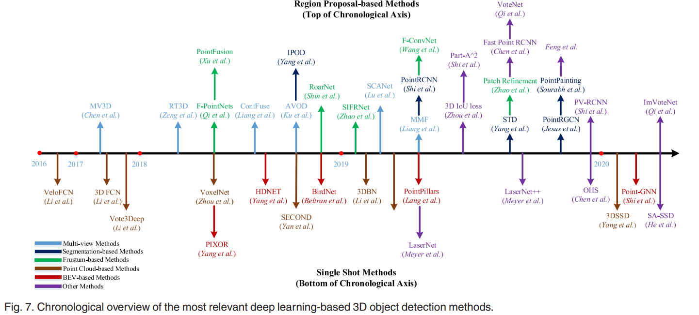
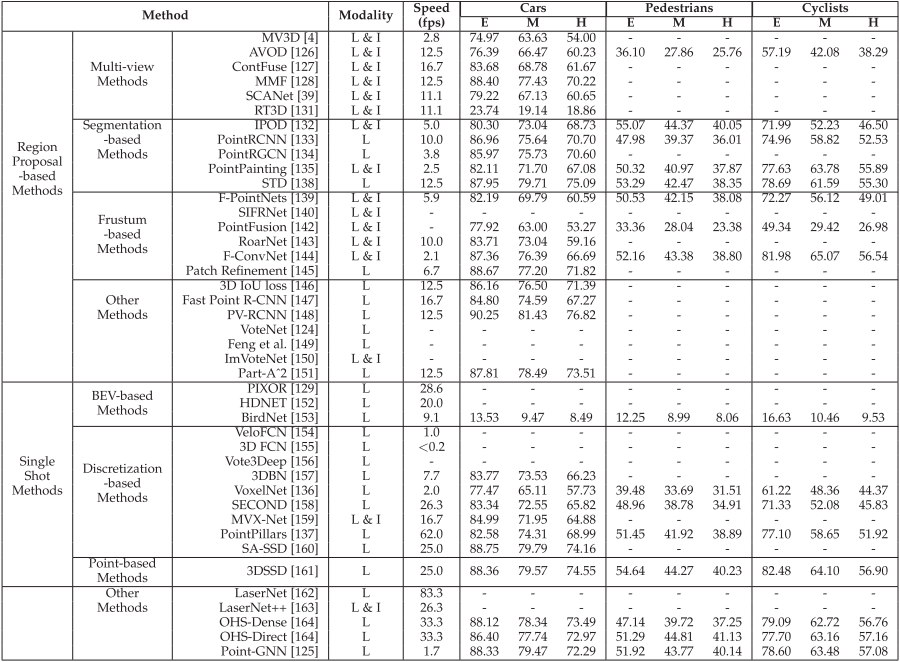

# 1.2 3D目标检测论文综述（入门必读）

几个里程碑的方法如下图 [[引用](https://arxiv.53yu.com/pdf/1912.12033)]

# 
 [A Survey on 3D Object Detection Methods for Autonomous Driving Applications](http://wrap.warwick.ac.uk/114314/1/WRAP-survey-3D-object-detection-methods-autonomous-driving-applications-Arnold-2019.pdf?ref=https://githubhelp.com)**(2019 TITS)**

[Deep Learning for 3D Point Clouds: A Survey ](https://arxiv.53yu.com/pdf/1912.12033)**(2020 TPAMI)**

这篇综述第4章对目标检测的大部分方法进行了介绍

[3D Object Detection for Autonomous Driving: A Survey](https://arxiv.53yu.com/pdf/2106.10823)**(2022 PR) **

[3D Object Detection for Autonomous Driving: A Review and New Outlooks](https://arxiv.org/abs/2206.09474)**(2022 强烈推荐 这是最新、最全的综述)**

****

## 方法分类

> 更新: 2024-05-29 15:41:11  
> 原文: <https://3dcv.yuque.com/org-wiki-3dcv-mm1l0t/ysgfp9/mcxcue_rlgeam>