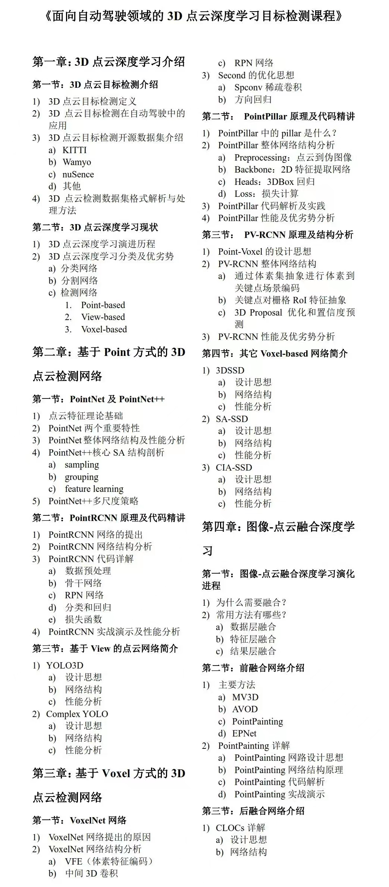

# 3D目标检测视频课（入门必看）

百度网盘链接：  [https://pan.baidu.com/s/1ifb2sbCpdZQSZo93cF6Hpg](https://pan.baidu.com/s/1ifb2sbCpdZQSZo93cF6Hpg)         提取码：6gz9 （**3D视觉工坊的课程**）

阿里网盘链接： [https://www.aliyundrive.com/s/cv1mk4kLsRx](https://www.aliyundrive.com/s/cv1mk4kLsRx)      提取码:   b73a  （**3D视觉工坊的课程**）

链接：[https://pan.baidu.com/s/1OxQ_x9e62dS-kOHB_Zmyvg](https://pan.baidu.com/s/1OxQ_x9e62dS-kOHB_Zmyvg)   提取码：1234 (另一个点云课程，不在课表范围内，部分课程加密)

视频课课表

> 更新: 2024-08-29 21:21:23  
> 原文: <https://3dcv.yuque.com/org-wiki-3dcv-mm1l0t/ysgfp9/gu7s3d_ezf3s1>