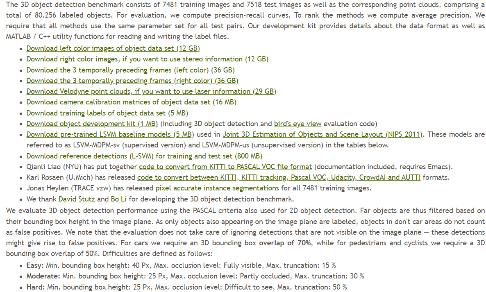
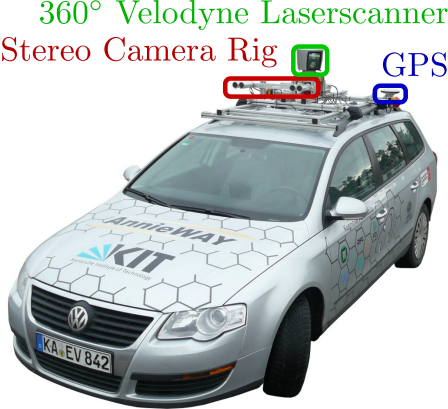
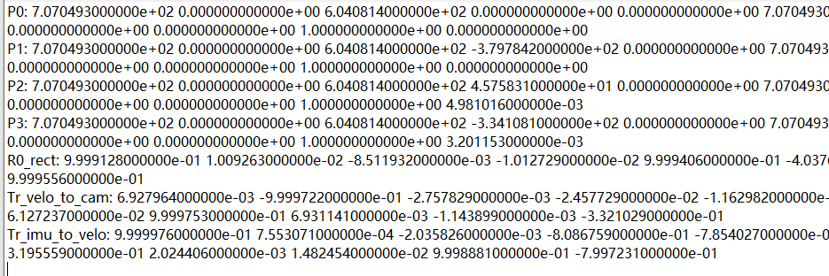
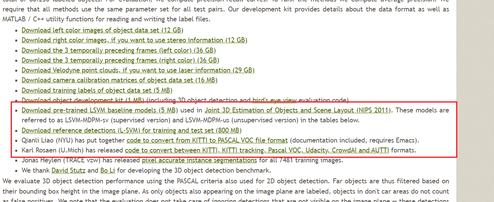
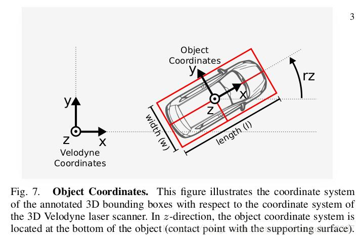

# 2.2 KITTI数据集（必读）

[官方论文](https://projet.liris.cnrs.fr/imagine/pub/proceedings/CVPR2012/data/papers/424_O3C-04.pdf)

## KITTI数据集的简介与使用

[简介与使用](https://blog.csdn.net/Solomon1558/article/details/70173223)

## 组成结构

打开[KITTI官网](https://www.cvlibs.net/datasets/kitti/eval_object.php?obj_benchmark=3d)的3D目标检测benchmark找到可下载的文件，页面如下：

<code>The 3D object detection benchmark consists of 7481 training images and 7518 test images as well as the corresponding point clouds.</code>

有标签的样本包含 7481(trainval) + 7518(test)，其中包含图片和点云。

从第一行开始解释：

### 1. Download left color images of object data set (12 GB)

KITTI数据采集平台配备了一个RGB双目相机(也就是两个RGB相机)，如图：

对于单目和多模态3D检测，通常使用left相机作为图像的输入源。

### 2. Download right color images, if you want to use stereo information (12 GB)

如上所述，这是双目相机的right相机，用于双目检测和双目多模态融合检测，数量与`1.`一致。

### 3. Download the 3 temporally preceding frames (left color) (36 GB)

时间上连续的3帧图片(left camera)，`1.` 和 `2.`所下载的是非连续状态下的单帧数据。数据量大概是`1.`的3倍，具有无label的数据。

### 4. Download the 3 temporally preceding frames (right color) (36 GB)

同`3.`，right相机。

### 5. Download Velodyne point clouds, if you want to use laser information (29 GB)

点云文件，数量与`1.`一致

### 6. Download camera calibration matrices of object data set (16 MB)

标定信息。

P0, P1是灰度相机，P2和P3是`1.` 和 `2.`所下载的RGB相机的左右相机。

标定帧数与label数一致。

### 7. Download training labels of object data set (5 MB)

3D检测用的label。

### 8. Download object development kit

(including 3D object detection and bird's eye view evaluation code)

就像所说的，包含evaluation code。

图中这些是一些工具包（转换数据格式等），以及released baseline。

### 9. pixel accurate instance segmentations

实例分割标签 for 7481个训练sample。

* Jonas Heylen (TRACE vzw) has released [pixel accurate instance segmentations](https://github.com/HeylenJonas/KITTI3D-Instance-Segmentation-Devkit) for all 7481 training images.

## KITTI数据集关于3D目标检测的解读

[KITTI 数据集 3D Object Detection 评测解读](https://zhuanlan.zhihu.com/p/68018673)

数据集总共包含训练集、验证集和测试集。

训练集与验证集一共7481个样本

通常的划分为训练集有3712，验证集3769，测试集7518。

测试集的标签不公开，只能在KITTI官网提交测试结果

**在提交榜单时（刷榜）可以多划分一些数据用于训练，少量的数据用于验证集，这在很多论文中都是使用过的。**

## KITTI的label解析

真实的label样例：

`Pedestrian 0.00 0 -0.20 712.40 143.00 810.73 307.92 1.89 0.48 1.20 1.84 1.47 8.41 0.01`

**15个数代表的含义**

**第1个字符串**：代表物体类别

'Car', 'Van', 'Truck','Pedestrian', 'Person\_sitting', 'Cyclist','Tram',  'Misc' or  'DontCare'

注意，’DontCare’ 标签表示该区域没有被标注，比如由于目标物体距离激光雷达太远。为了防止在评估过程中（主要是计算precision），将本来是目标物体但是因为某些原因而没有标注的区域统计为假阳性(false positives)，评估脚本会自动忽略’DontCare’ 区域的预测结果。

**第2个数**：代表物体是否被截断

从0（非截断）到1（截断）浮动，其中truncated指离开图像边界的对象

**第3个数**：代表物体是否被遮挡

整数0，1，2，3表示被遮挡的程度

0：完全可见  1：小部分遮挡  2：大部分遮挡 3：完全遮挡（unknown）

**第4个数**：alpha，物体的观察角度，范围：-pi~pi

是在相机坐标系下，以相机原点为中心，相机原点到物体中心的连线为半径，将物体绕相机y轴旋转至相机z轴，此时物体方向与相机x轴的夹角

**第5～8**\*\*这4个数\*\*：物体的2维边界框

xmin，ymin，xmax，ymax

**第9～11这**\*\*3个数\*\*：3维物体的尺寸

高、宽、长（单位：米）

**第12～14这**\*\*3个数\*\*：3维物体的位置

x,y,z（在照相机坐标系下，单位：米）

**第15个数**：3维物体的空间方向：rotation\_y

在相机坐标系下，物体的全局方向角（物体前进方向与相机坐标系x轴的夹角），

范围：-pi~pi。

**第16个数**：检测的置信度。（这个是在预测的时候生成的label的最后一个字段）

**注意：相机坐标和雷达坐标的区别以及转换。**

## KITTI数据集坐标转换

[kitti数据集坐标转换](https://blog.csdn.net/taifengzikai/article/details/101197965)

> 更新: 2023-07-18 11:09:26  
> 原文: <https://3dcv.yuque.com/org-wiki-3dcv-mm1l0t/ysgfp9/gha5ap_wp3m5s>