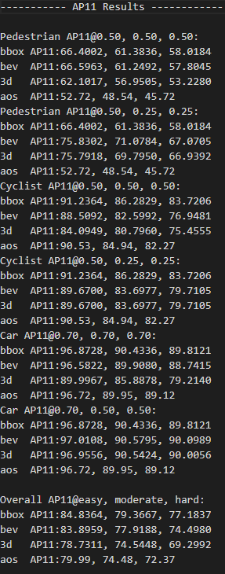
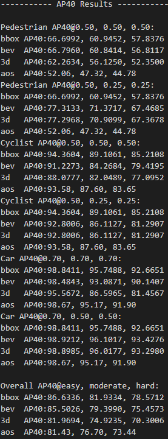
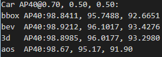
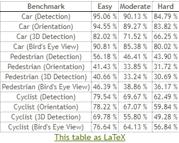

# 2.3 数据集评估指标（入门必读）

[3D目标检测中的评估指标](https://blog.csdn.net/graviti/article/details/106473469)

[如何计算AP，mAP](https://blog.csdn.net/qq_35916487/article/details/89076570?depth_1-utm_source=distribute.pc_relevant.none-task-blog-BlogCommendFromMachineLearnPai2-1&utm_source=distribute.pc_relevant.none-task-blog-BlogCommendFromMachineLearnPai2-1)

搞清楚 R11 与 R40的区别

[KITTI 3D目标检测的评估指标](https://blog.csdn.net/W1995S/article/details/114978988)

# 验证与测试
## 验证集结果
模型在运行中会生成日志文件，在日志文件中可以看到训练时的验证结果

以car数据做解释，对的评价结果分类两部分。

表中的第一行 car AP @ 0.70 0.70 0.70

Car是类别；AP是平均准确率（Average precision），AP40指的是采用40点法评估（AP常见的又AP11和AP40） ；后面三个0.7 都是指的IOU阈值（目标检测中用于评价预测输出包围框与真实框的重叠情况，设置阈值，从而判断预测结果是否为positive）。

第二三四行的第一列是指的三种情况下的检测分别对应着：bbox是指的2D下的检测；bev是指的鸟瞰图下的检测；3D就是指3D下的检测。每一行中的三列数值对应的是easy、moderate和hard下的评估结果。三种难度划分的详细评估参数可以阅读[KITTI论文](https://www.cs.toronto.edu/~urtasun/publications/geiger_et_al_cvpr12.pdf)

第五行AOS指的是平均朝向相似度，用于评价预测输出的朝向与真实框朝向的相似程度，越高越准。

## 测试结果

官网目前给出的测试结果是在AP R40,car(IoU=0.7),PedestrianCyclist(IoU=0.5)指标下评估的。

在**2019年8月10日**，KITTI将test server的评估指标改为了 **AP R40**，在此之前是使用的**AP R11**，详见[KITTI官网](http://www.cvlibs.net/datasets/kitti/eval_object.php?obj_benchmark=3d)中的Note2。

> 更新: 2023-05-13 15:27:41  
> 原文: <https://3dcv.yuque.com/org-wiki-3dcv-mm1l0t/ysgfp9/lhh9b0_mczao8>