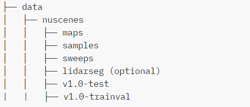
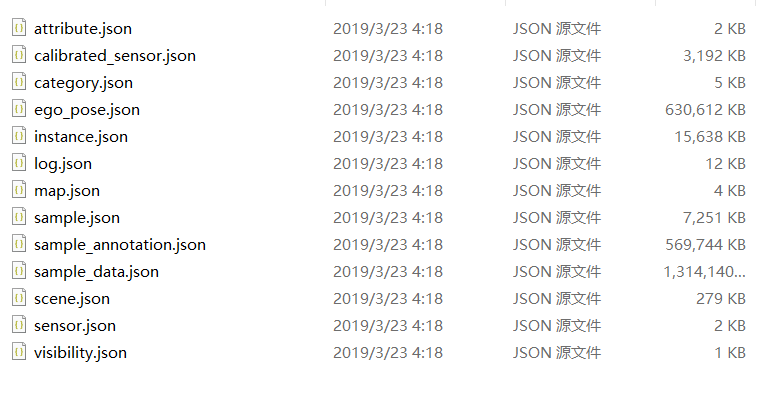
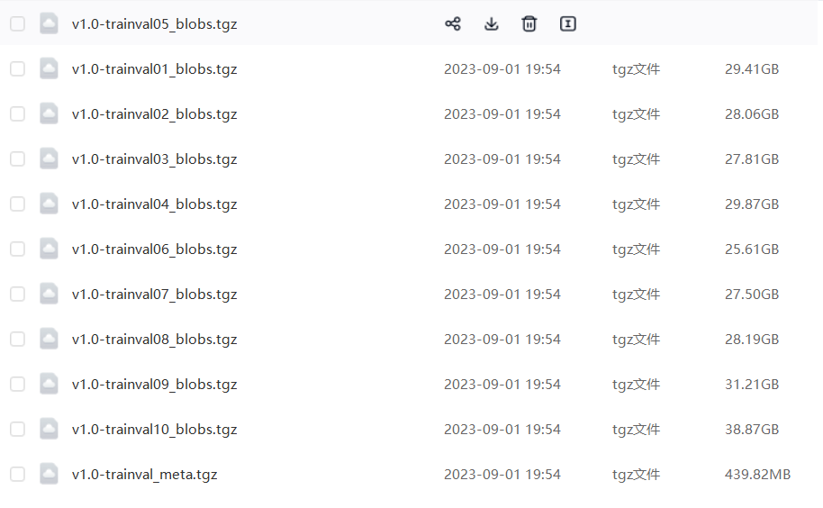

# 2.6 数据集相关链接

# KITTI数据集百度网盘链接（下载好,生成PKL即可使用）：
链接：[https://pan.baidu.com/s/1-zEEJ8Qm3w3KjXWra6vQzQ?pwd=8888](https://pan.baidu.com/s/1-zEEJ8Qm3w3KjXWra6vQzQ?pwd=8888) 

提取码：8888 

OpenPCDet & mmdetection3d

├── data

│   ├── kitti

│   │   │── ImageSets

│   │   │── training

│   │   │   ├──calib & velodyne & label_2 & image_2 & (optional: planes) & (optional: depth_2)

│   │   │── testing

│   │   │   ├──calib & velodyne & image_2

# NuScenes数据集百度网盘链接(下载好，生成PKL即可使用，需要注意1/4，1/8，1/10数据集需自行划分，划分方法在工具类中，这里只提供full以及mini版本)
Openpcdet和mmdet3d均按照下方文件结构设置，其中maps文件夹和v1.0-test在训练过程中也可以省略。

MINI版本链接：[https://pan.baidu.com/s/1JE40w4Fnik-BdolohyhFiQ?pwd=8888](https://pan.baidu.com/s/1JE40w4Fnik-BdolohyhFiQ?pwd=8888) 

提取码：8888 

FuLL版本链接：链接：[https://pan.baidu.com/s/1jwo-8yZ-FLikfqNS3OuBQA?pwd=8888](https://pan.baidu.com/s/1jwo-8yZ-FLikfqNS3OuBQA?pwd=8888) 

提取码：8888 

test文件：链接：[https://pan.baidu.com/s/1aDC06QpvQwzDUdmmrkWk3Q?pwd=8888](https://pan.baidu.com/s/1aDC06QpvQwzDUdmmrkWk3Q?pwd=8888) 

提取码：8888 

特殊注意：full文件夹下有多个文件夹，其中V1.0-trainval01~10_blobs.tgz为**数据包**如图2，V1.0-trainval_meta.tgz文件夹为**标注文件**。任意**数据包**解压后里面包含两个文件夹分别为sweeps和samples，其中sweeps为一段时间连续数据的采集，samples为从sweeps中挑选好的关键帧数据。全部解压后按照下面文件夹结构组织数据集：test文件夹同理

:::info
v1.0-trainval

|---sweeps   #将所有V1.0-trainval01~10_blobs文件夹下的sweeps文件夹下的文件移动到一个文件夹下

|---samples #将所有V1.0-trainval01~10_blobs文件夹下的samples文件夹下的文件移动到一个文件夹下

|---v1.0-trainval #v1.0-trainval_meta.tgz解压好的文件，如图1

:::

图一：标注文件

# Waymo数据集
链接: [https://pan.baidu.com/s/1rtPwtGCpyZpdlRKvGHQLbQ?pwd=6666](https://pan.baidu.com/s/1rtPwtGCpyZpdlRKvGHQLbQ?pwd=6666) 提取码: 6666

> 更新: 2023-09-09 09:28:29  
> 原文: <https://3dcv.yuque.com/org-wiki-3dcv-mm1l0t/ysgfp9/vgezponrhwm8s2sy>