# 3.14 长尾 & 难检/漏检/远距离 for 3D OD

# 写在最前面：长尾问题与难检/漏检/远距离检测的区别
在最开始看的时候，**<u>我以为难漏远是长尾问题的具体表现，是长尾问题的一个子集</u>**，它们之间是没有区别的。但是看了一些文章之后，尤其是从文章分析的角度来看，**<u>这是两个命题，它们之间的关系只是相交</u>**。这里是非常有必要做区分的，因为这影响到看文章和写文章的思路。

它们之间的区别如下：

+ **<u>从立意大小来看：</u>**Long Tail问题是一个比较大的帽子，这个问题在所有以数据驱动的科学研究领域都会涉及到，因为采新数据成本高+已有数据分布不平衡是一个永恒的话题，核心是“在一批固定的数据中，不同分类的样本数量不平衡（长尾分布）”+“在实际生活的应用场景中，会出现模型训练期间永远也没见过的”；难漏远是一个比较小的帽子，某种程度上来说这个帽子可以只是水文章的一个motivation，但凡文章需要上质量只靠这一个motivation很难把文章立起来，需要加上其他的考虑比如说自动驾驶安全等，传统难漏远方法也考虑样本数量不平衡的事情，但是不会放在核心去考虑。
+ **<u>从非端到端传统模型写文章的角度来看：</u>**写长尾问题的有些会在实验的具体分析里提到“难漏远是导致其他模型性能下降的原因之一但是our model解决了这个事情”；写难漏远的文章很少有提到说“our model解决的这个事情是由于长尾分布导致的”，即使这之间确实有联系，并且在实验章节中基本上不会考虑任何有关“长尾分布”所导致的后果。
+ **<u>从非端到端传统模型的方法来看</u>**：考虑长尾问题的文章，策略集中在“调整数据集分布”和“考虑非测试基准中的稀有类”；考虑难漏远的文章则各有各的点，策略上也很多样。两类文章共有的常见操作：考虑ap之外的评价指标。
+ **<u>从端到端模型写文章的角度来看：</u>**端到端模型大量考虑现实场景中的corner case，考虑开环数据长尾分布所导致模型的缺陷，整体性很强；难漏远的小研究点基本上直接死了，因为确实没发现有人单独提。

# 传统模型
传统模型的总结将以“长尾问题”和“难检漏检远距离问题”两个动机（以模型方案为主）进行叙述，剩下的一些策略类文章将划分为“其他”。

## 难检漏检远距离问题
### FocalFormer3D
**发表：ICCV 2023，http://openaccess.thecvf.com/content/ICCV2023/papers/Chen_FocalFormer3D_Focusing_on_Hard_Instance_for_3D_Object_Detection_ICCV_2023_paper.pdf**

**代码：https: //github.com/NVlabs/FocalFormer3D**

**小结：好文章，代码也公开了榜也打了，写的也好团队也强，可以模仿，只是多模态版本24g显卡跑不了**

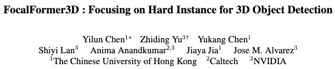

**问题：尽管做出了巨大的努力，但有限的探索来明确解决由遮挡和杂波背景引起的假阴性或遗漏对象。**

假阴性FN：实际为真预测为假---------gt上有object的地方没有被预测出来

没有预测出来的障碍在自动化驾驶里导致安全性问题-------减少假阴性

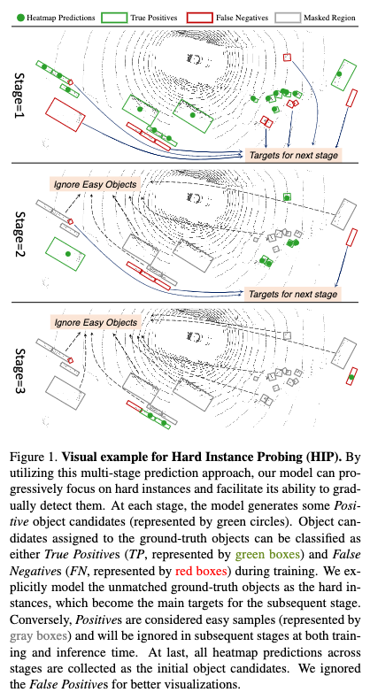

**模型图**

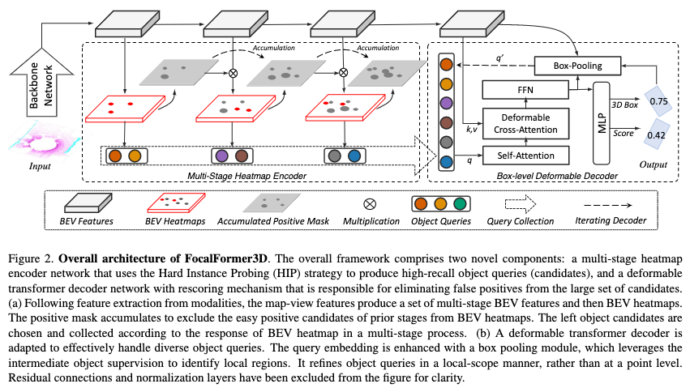

**核心技术：HIP**

初始阶段的候选和预测的组合共有4种情况

候选没命中gt，预测为假：正面预测，HIP阶段删除

候选命中gt，预测为假：负面预测，这里本该预测为真才对，HIP负责检测出来并改正该候选的预测

候选命中gt，预测为真：正面预测，说明这种gt比较容易被检出，HIP标出且不做操作

候选没命中gt，预测为真：负面预测，预测网络的误差HIP不管

**HIP step1**：初始阶段生成候选、指出每个GT称为o_i

**HIP Step2**：神经网络给所有候选做出预测a_i，并把正预测称为p_i

下面指出“预测”不限于anchors（fast rcnn）、point-based anchors（center head）以及query（transformer）

**HIP Step3**：按照指标σ，根据正预测，把gt进行分类

指标σ：iou或者中心距离

gt的二分类：指标高于阈值或者低于阈值，高于分类阈值证明“更容易被探测”，低于分类阈值的就是“hard instance”

操作是在BEV heatmap上进行的，有GT heatmap和pred heatmap。

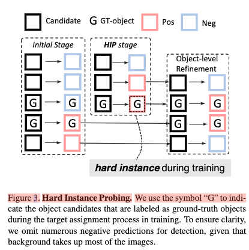

**实验结果**

**主表**

nus test 比 transfusion 高3.2map/2.4nds

240317 lidar榜单第2名，提交时间2023.5

多模态版本 nus test 72.9map/75.0nds

240318 camera+lidar榜单13名（F），2023.5提交

camera分支来自transfusion，使用pretrain，为了减少计算量将图片以1/2尺寸输入

waymo test 纯lidar版本比transfusion高1.1map，但综合性能不是最强的

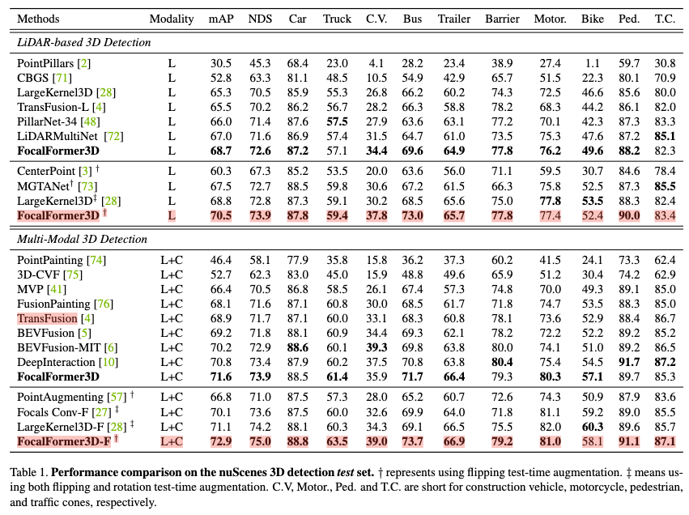

**主要评测指标：recall**

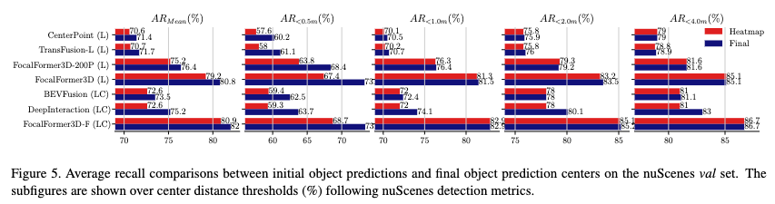

### 

## 长尾问题
### CBGS
**发表：arxiv 2019，https://arxiv.org/pdf/1908.09492**

**代码：openpcdet和mmdetection3d平台都已经集成为数据处理的函数了**

**小结：所有人都用，你不用？**

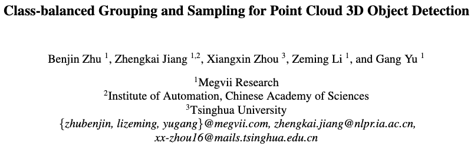

**问题**

baseline pointpillars等方法没法实现稀有类的高性能

**策略：DS Sample**

To alleviate the severe class imbalance, we propose DS Sampling, which generates a smoother instance distribution as the orange columns indicate. To this end, like the sampling strategy used in the image classification task, we firstly duplicate samples of a category according to its fraction of all samples. The fewer a category's samples are, more samples of this category are duplicated to form the final training dataset. More specifically, we first count total point cloud sample number that exists a specific category in the training split, then samples of all categories which are summed up to 128106 samples.

基本思想是把占比较小的类别进行复制，制作出较大数据集，然后针对每个类别用固定比例random sample这个大的数据集，组合出最终数据集，最终数据集的类别密度（类别数量／样本总数）是相近的

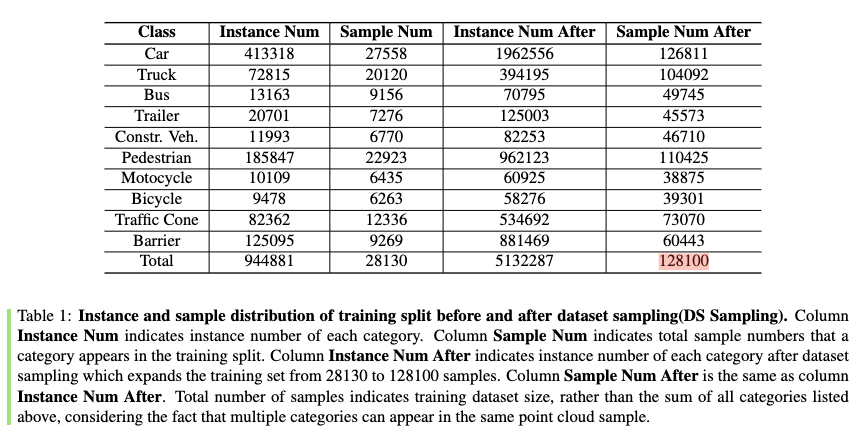

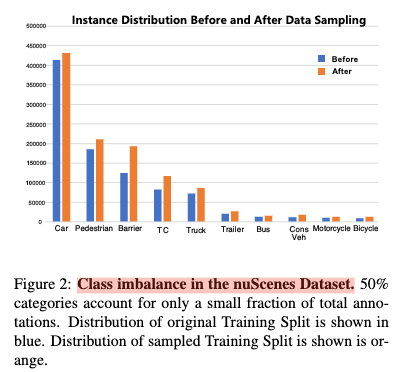

**策略：SECOND里的GT-AUG**

Besides, we use GT-AUG strategy as proposed in SECOND [28] to sample ground truths from an annotation database, which is generated offline, and place those sampled boxes into another point cloud.

把某一样本中的物体点云数据，放到另一个样本中，过程中需要计算摆放位置是否合理

**策略：Class-balanced Grouping（分组头策略）**

重要结论1：大类会主导共享头的性能结果，导致小类的性能差（后续许多文章反复提到）

重要结论2：形状大小相似的类更容易从同一任务中学习，起到相互补偿作用

方案考虑1：所有类别分组。使用multi-group head

方案考虑2：实例数量多的类单独放，只有car

结果：分为6组

Classes of similar shapes or sizes should be grouped. ......

Instance numbers of different groups should be balanced properly.  ......

Guided by the above two principles, in the final settings we split 10 classes into 6 groups: (Car), (Truck, Construction Vehicle), (Bus, Trailer), (Barrier), (Motorcycle, Bicycle), (Pedestrian, Traffic Cone).

**方案：MEGVII（时至今日，跟上面内容比，这里不重要了）**

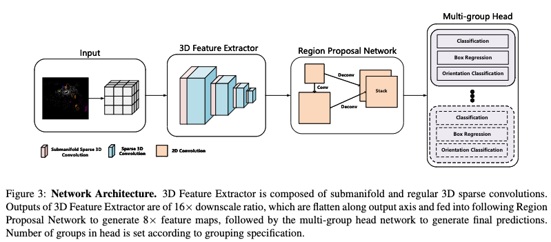

### Long-Tailed 3D Detection via 2D Late Fusion
**发表：arXiv 2023，https://arxiv.org/pdf/2312.10986**

**代码：无**

**小结：思路简单，但是写的非常清楚，有代码就更好了，提到的操作也比较容易复现**

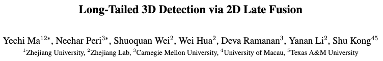

**问题：**长尾问题不是直接拿sota模型在稀有类上进行训练就可以解决的。例子：bevfusion在稀有类上仅有4.4ap。

**立意：**很难从稀疏的lidar点云来解决LT问题，借助图像来进行，认为图像在LT问题上比lidar更可靠。【尽管 LiDAR 和 RGB 3D 探测器最近取得了进展，但我们发现多模态融合对于 LT3D 至关重要。重要的是，同时使用 RGB（为了更好的识别）和 LiDAR（为了更好的 3D 定位）有助于检测稀有类别。】

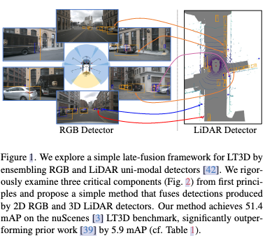

**提了3个问题在fig 2：**

+ **How Do We Incorporate RGB Information?（思路上的重点）**

重复说明lidar精确定位但是稀疏，rgb图像有很大帮助

Towards Long-Tailed 3D Detection[42]：3D rgb 检测器+3D lidar 检测器

作者：2D rgb 检测器+3D lidar 检测器更好

+ **How Do We Match Uni-Modal Detections?（常见操作）**

得到bbox之后如何模态匹配？

3D投影到2D，算iou

+ **How Do We Fuse Matched Detections?（不是思路上的重点）**

Late Fusion，就是最后阶段再fusion

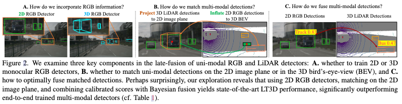

**问题2中的具体策略：**我们考虑两种情况。如果两种模态预测相同的语义类别，我们将执行分数融合（如下所述）。否则，**<u>如果两种模态预测不同的语义类别，我们将使用基于 RGB 的检测的置信度得分和类别标签</u>**。直观上，RGB 检测器比仅使用 LiDAR 的检测器可以更可靠地从高分辨率图像中预测语义。

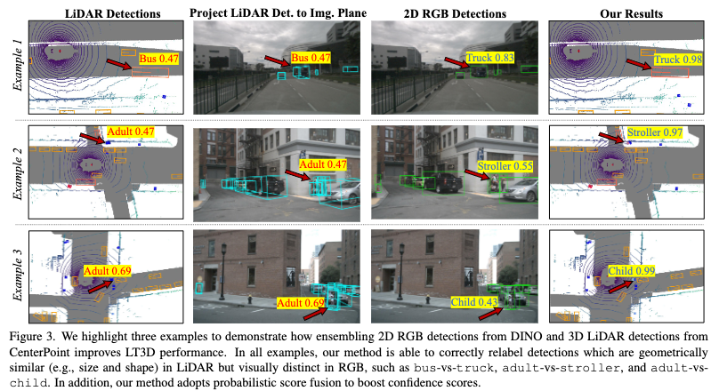

**实验：**这里的ap应该是自己测出来的，因为用了不一样的分类方法（2.2.3的文章里有），不知道如何评价是否测的算高还是低

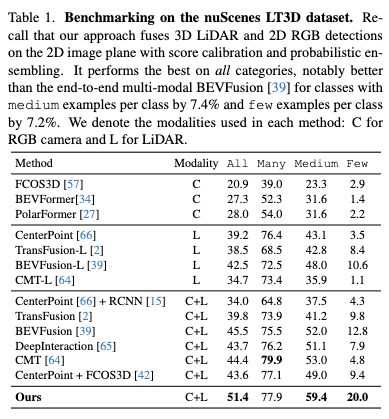

### Towards Long-Tailed 3D Detection
发表：Conference on Robot Learning. PMLR, 2023: 1904-1915

代码：无

小结：提供了mAP的用法

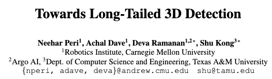

**问题：**在真实的开放世界中，安全导航 [5, 6] 需要自动驾驶汽车可靠地检测儿童和婴儿车等稀有物体。这激发了 长尾 3D 检测 (LT3D)，该问题需要检测常见类别和稀有类别的对象。此外，对于自动驾驶汽车等安全关键的机器人，**<u>我们认为检测但错误分类稀有物体（例如，将儿童错误分类为成人）比根本没有检测到它们要好。</u>**

**立意：**基于 RGB 的 3D 检测器的性能不如基于 LiDAR 的方法，因为单目 RGB 输入无法提供可靠的 3D 测量（与 LiDAR 不同）。因 此，基于 RGB 的 3D 探测器并未得到广泛采用。然而，在探索 LT3D 时，我们发现 RGB 检测器在检测稀有类别的物体方面表现出色。重要的是，多模态融合显着改善了 LT3D。

**（相关工作提到）Long-Tailed 3D Detection via 2D Late Fusion的理论依据：**稀有类别不仅不常见，而且单独使用 LiDAR 也很难区分。这促使 我们使用 RGB 来补充 LiDAR。我们发现同时使用 RGB（为了更好的识别）和 LiDAR（为了更好的 3D 定位）有助于检测稀有类别。

**fig 1左侧按照数量进行分类（在多个论文中出现过）**

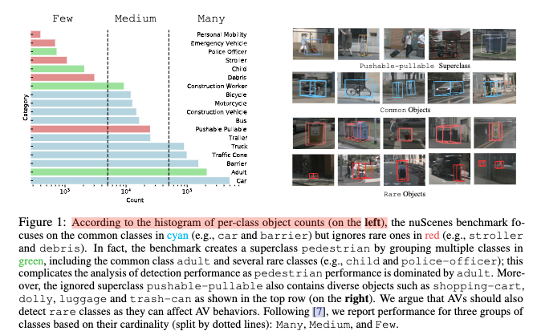

方案：

**1.检测头：**检测头的理论与【Long-Tailed 3D Detection via 2D Late Fusion】是相反的，这里认为单头比多分组头更简单更好，减少稀有类的过拟合

**2.使用语意层次结构进行训练、构建新的评估协议mAP：**在图像分类任务中，分类标签通常组织成一个层次结构，比如从一般类别到具体子类别。传统的分类方法可能只考虑完全正确或错误的分类结果，而忽略了层次结构中的相似性。例如，将猫分类为狗与将猫分类为汽车在层次结构中的距离是不同的。使用层次度量可以更准确地反映分类错误的严重程度。

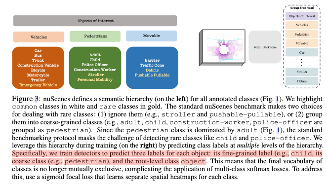

最小公共祖先（LCA）距离度量就是其中一种方法，通过衡量分类标签在分类层次树中的相对距离来评估分类结果的准确性。这样的度量方法有助于在分类任务中引入部分分数，即使分类结果不完全正确，但如果与正确答案具有一定的相似度，仍然可以获得部分分数。

**原文给了3个LCA级别，分别计算AP值**

LCA=̧0：考虑 C 的预测和真实框。将与 C 的真实框重叠的预测集标记为真阳性。 其他预测都是误报。这与标准 AP 指标相同。

LCA=̨1：考虑 C 的预测，以及 C 和 C 的所有同级类（到 C 的 LCA 距离为 1）的真 实框。将与 C 的真实框重叠的预测集标记为真阳性。将与兄弟类重叠的预测集标记 为忽略[43]。 C 的所有其他预测都是误报。

LCA=̩2：考虑 C 的预测以及 C 和 C 的所有兄弟类的真实框（与 C 的 LCA 距离小于 2。对于 nuScenes，这包括所有类。）标记与地面重叠的预测集C 的真值框为 真阳性。将与其他类重叠的预测集标记为忽略。对 C 的所有其他预测都是误报。

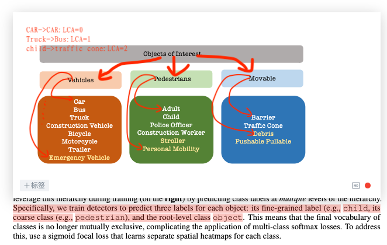

3.数据增强：cbgs的类似策略，一些网络认为这个策略使稀有类别出现更多误报，因此在train的最后禁用掉这个策略，作者验证后发现这个策略牺牲了常见类的性能来提高稀有类性能

4.多模态融合：尽管基于 LiDAR 的检测器广泛用于 3D 检测，但我们发现它们由于错误分类而对稀有类别产生许多高分误报 (FP)。我们专注 于消除此类 FP。为此，我们使用基于 RGB 的检测器，通过利用以下两个见解来过滤 掉高分假阳性 LiDAR 检测：(1) 基于 LiDAR 的 3D 检测器在 3D 定位方面准确，并产 生高召回率（尽管分类很差）， (2) 基于 RGB 的 3D 检测在识别方面是准确的（尽管 3D 定位很差）。图 2 演示了这种过滤策略。对于每个基于 RGB 的检测，我们将基于 LiDAR 的检测保留在 m 米半径内，并删除所有其他检测（不接近任何基于 RGB 的检 测）。在这项工作中，我们使用 FCOS̪D [41] 作为基于 RGB 的检测器。

**<u>fig 2的意思是使用rgb的proposal来筛选lidar的proposal，不被rgb的proposal覆盖的内容直接删掉</u>**

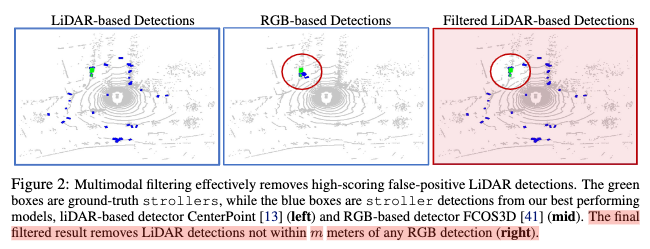

**实验：**

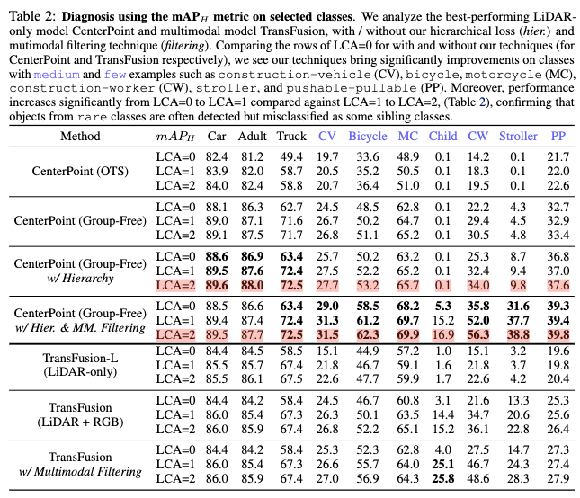

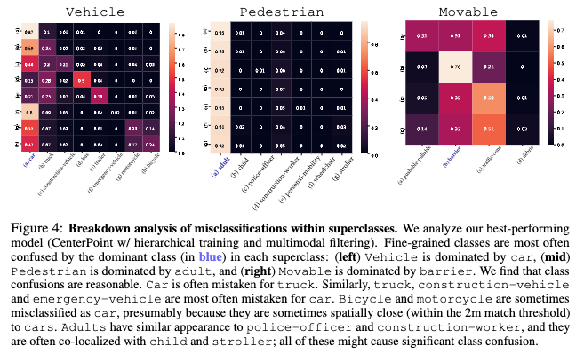

# 端到端模型
慢慢更新

> 更新: 2024-08-23 15:06:17  
> 原文: <https://3dcv.yuque.com/org-wiki-3dcv-mm1l0t/ysgfp9/vdbr5uart75yym7g>