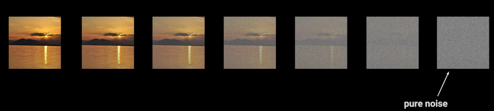
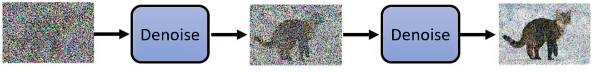
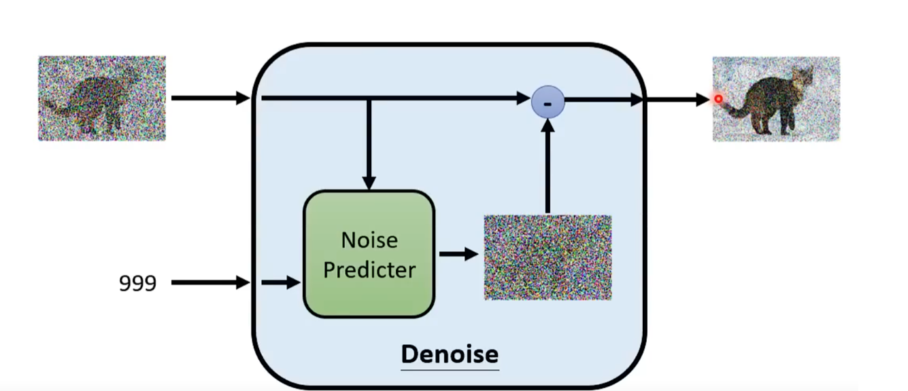

# 3.15 diffusion for 3D&e2e【张根瑞】

6张环视相机图片入门必读论文

## Denoising Diffusion Probabilistic Models (DDPM)
Jonathan Ho, Ajay Jain, Pieter Abbeel， 2020

 [arXiv:2006.11239](https://arxiv.org/abs/2006.11239)

这篇论文是扩散模型领域的奠基性工作，提出了一种基于噪声的生成模型，通过逐步反向去噪来生成数据。

### 模型结构
DDPM的核心思想是将数据生成过程建模为一个反向的马尔科夫链（Markov Chain），这个链的每一步都对应于从当前状态向更少噪声的状态转移。具体来说：

+ **前向过程（Forward Process）**: 在前向过程中，模型逐步向数据添加高斯噪声，直到数据完全变成纯噪声。这个过程可以看作是逐步腐蚀原始数据，使其变得不可辨认。

+ **反向过程（Reverse Process）**: 反向过程则是模型的核心任务，即学习如何从纯噪声一步步去噪，恢复出原始数据。这一过程通过一个神经网络来参数化，并通过最大化对数似然函数来进行训练。

具体来讲是通过U-net神经网络，通过一次次预测给出照片当中的噪点，并用原来的照片减去预测的噪点，以达到降噪的目的。

具体的数学推导过程过于繁琐，我完整观看了b站上李宏毅老师的讲解，讲的比较清楚，但也是需要大量的前期数学原理做铺垫。其中也包含对stable diffusion的模型简介，如果有兴趣可以完整观看一下。

[【生成式AI】Diffusion Model 原理剖析 (1/4)_哔哩哔哩_bilibili](https://www.bilibili.com/video/BV14c411J7f2?p=3&vd_source=43fee1828cab58854171c7ac3fc536e2)

### 入门代码
[附件: diffusion_model .ipynb](./attachments/hbefnvs0UgLN1vGu/diffusion_model .ipynb)

这部分分别具体给出了前向过程、反向过程，也就是U-net、损失函数lossfuction、采样、以及训练的简化版代码，可以更好地帮助大家理解Diffusion Module。

## Improved Denoising Diffusion Probabilistic Models
Alex Nichol, Prafulla Dhariwal， 2021

[arXiv:2102.09672](https://arxiv.org/abs/2102.09672)

本论文对原始的DDPM进行了改进，提出了更高效的训练和采样方法，使得扩散模型在性能上进一步提升，并且减少了计算成本

## 

> 更新: 2024-10-31 18:30:49  
> 原文: <https://3dcv.yuque.com/org-wiki-3dcv-mm1l0t/ysgfp9/qw4p6r9hwuafgqvi>