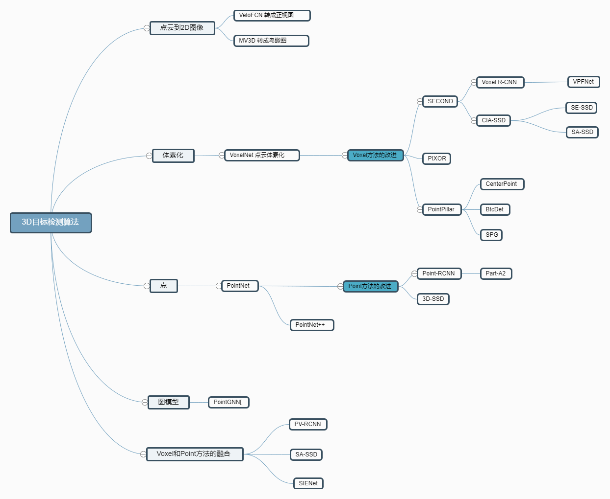

# 3.1 必读论文（入门必读）

## 按出版时间排序

**分类与分割**

PointNet(**2017  CVPR**)：输入点云格式数据直接提取特征。

[论文下载](https://arxiv.org/pdf/1612.00593.pdf)

PointNet++ (**2017  NIPS**)：原作者在PointNet的基础上进行了改进，增强了提取局部特征的能力。

[论文下载](https://proceedings.neurips.cc/paper/2017/file/d8bf84be3800d12f74d8b05e9b89836f-Paper.pdf)

**检测算法**

VoxelNet(**2018  CVPR**)：将点云数据划分为Voxel，再进行分组使用VFE层进行提取特征。**4.4 FPS**

****[论文下载](https://arxiv.org/abs/1711.06396)

SECOND(**2018  sensors**)：在VoxelNet的基础上，将稀疏3D卷积用于替换VoxelNet的普通3D卷积，提升了模型运行速度。**20 FPS  **

[论文下载](https://www.mdpi.com/1424-8220/18/10/3337)

Poinpillars(**2019  CVPR**)：将点云数据划分为Pillar（点柱），从而构成伪图片（pseudo-image）数据，并且在卷积层只使用2D卷积，节省了大量的计算时间。**62 FPS   **

[论文下载](https://arxiv.org/abs/1812.05784)

> 更新: 2023-05-13 15:23:30  
> 原文: <https://3dcv.yuque.com/org-wiki-3dcv-mm1l0t/ysgfp9/hoyc5h_ensy6x>