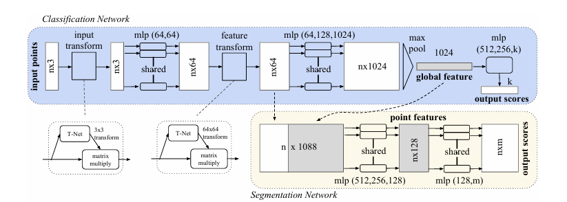
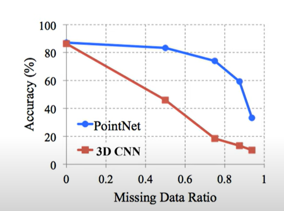
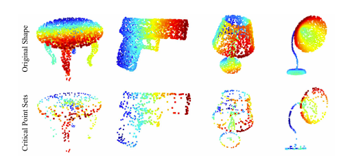

# 3.2 Point-Based 论文（入门必读）

# PointNet与PoinNet++
PointNet: Deep Learning on Point Sets for 3D Classification and Segmentation（**2017 CVPR**）

[论文下载](https://arxiv.org/abs/1612.00593)

PointNet++: Deep Hierarchical Feature Learning on Point Sets in a Metric Space（**2017 NIPS**）

[论文下载](https://proceedings.neurips.cc/paper/2017/file/d8bf84be3800d12f74d8b05e9b89836f-Paper.pdf)

[论文讲解](https://zhuanlan.zhihu.com/p/336496973)

**PointNet与PointNet++是点云处理基础论文后续很多论文都沿用的其的思想。**

PointNet是第一个**直接处理点云**的深度学习框架，PointNet++是原作者在其基础上了弥补了一些不足。

> PointNet将深度学习应用到点云数据中,取得了非常不错的效果，但是**没有充分利用点云中点的局部信息**，在识别复杂场景和表面纹理丰富的目标时效果不佳。（**这句话可能有错**）
>

pointnet architecture:

模型直接用点云作为输出，过程中要么对每一个点做同样的操作，要么提取全局特征，没有顺次输入的操作。这么做有一个很大的优点，就是实现了permutation invariance，这意味着对输入的数据没有什么排列顺序的要求，不管任何的输入顺序都可以得到一样的结果。这么做解决了点云本身数据无序性的问题，无需做额外的数据预处理。

模型通过T-net（主要实现旋转不变性）和MLP（主要提取每个点的重要高纬度特征）来提取模型的local feature，然后max pooling来提取global feature。来实现classification和segmentation这两类任务。

优点：

1：相较于原先的采用3D CNN方法，计算任务少了很多，提高了效率。

2：很值得一提的是鲁棒性的提升，这主要得益于整个模型的创新型架构，每个点最终通过maxpooling提取global feature，而实际上贡献global feature的点只有模型外围的一些关键点（critical point），那些在每个向量上作为极值的点。这意味着实际上大部分点是无意义的，丢失了也没有任何关系。论文中给出了视觉化的展示，而从数据上来看，就算失去了50%的点云数据，精确度几乎没受任何影响。

## 
PointNet++基于PointNet增加了**层级结构**和**密度自适应层**。层级结构使PointNet++**可以提取数据中的局部特征**，在对复杂场景和表面纹理丰富的目标进行分类时能取得更好的效果。

PointNet++的一个重大贡献是在多个尺度上利用邻域来实现健壮性和细节捕捉。PointNet++可以被视为是一个添加了分层结构的PointNet。

**上述两篇论文中为模型是用来作为点云分割和分类的，不包含检测，就像是二维目标检测中的CNN模型和一些Head关系，PointNet类似Backbone。**

# PointRCNN
 PointRCNN: 3D Object Proposal Generation and Detection from Point Cloud（**2019 CVPR AP：75.76**）

[论文下载](https://openaccess.thecvf.com/content_CVPR_2019/papers/Shi_PointRCNN_3D_Object_Proposal_Generation_and_Detection_From_Point_Cloud_CVPR_2019_paper.pdf)

第一个双阶段的Point-Based方法，第一个 anchor-free 和 botttom-up 产生proposal 的3DOD模型。

第一阶段通过PointNet++网络将点云分为前景点和背景点，然后对每一个前景点生成一个候选方案，第二阶段对前景点及其候选方案进行进一步优化，生成最终的bounding box。

Voxel-Based中把点云数据离散化处理，从而降低点云数据的稀疏性，形成一个个**密集的数据结构**。在PointRCNN基于原始的点云数据直接进行特征提取和RPN操作。

+ **大致思路**

第一阶段

先利用PointNet++网络实现前景与背景分割，迫使点云网络捕捉上下文信息，进行精确的点预测，有利于boundging box 的生成。

对所分为前景的点，通过提取特征后

基于bin生成3D bounding box   [关于bin的解释](https://zhuanlan.zhihu.com/p/361973979)

第二阶段

由第一阶段得到的bounding box进行更精确的位置回归

# STD
Std: Sparse-to-dense3dobject detector for point cloud（**ICCV 2019 AP：77.63**）

[论文下载](https://openaccess.thecvf.com/content_ICCV_2019/papers/Yang_STD_Sparse-to-Dense_3D_Object_Detector_for_Point_Cloud_ICCV_2019_paper.pdf)

> 更新: 2024-10-31 18:23:06  
> 原文: <https://3dcv.yuque.com/org-wiki-3dcv-mm1l0t/ysgfp9/mf2qcg_lg6nh4>