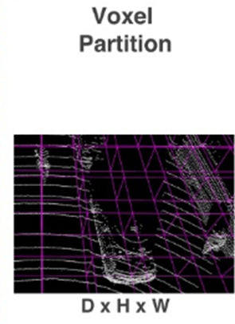
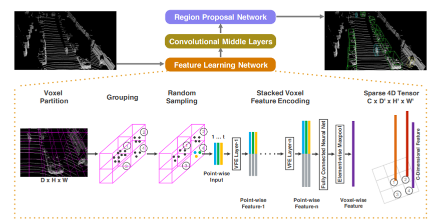
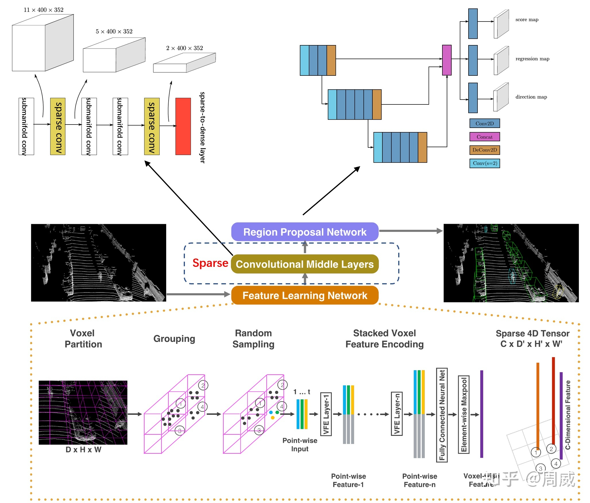
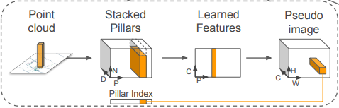
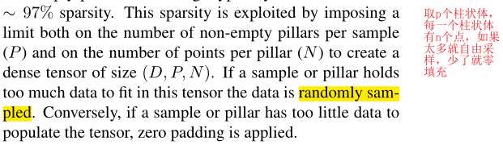
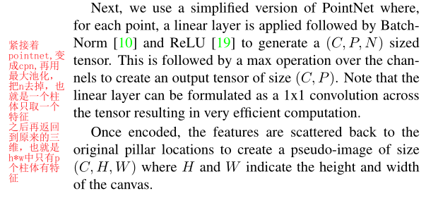

# 3.3 Voxel-Based 论文（入门必读）

# VoxelNet
VoxelNet: End-to-End Learning for Point Cloud Based 3D Object Detection（**2017 CVPR AP：65.11**）

[论文下载](https://arxiv.org/abs/1711.06396)

[论文讲解](https://zhuanlan.zhihu.com/p/352419316)

开山之作

特点：将点云数据划分为体素（Voxel）来表示，开启了Voxel-Based方法，如图所示。

VoxelNet主要由3个部分组成：特征学习网络（Feature Learning Network）、中间卷积层（Convolutional Middle Layers）、RPN。

特征学习网络以原始点云数据为输入，将点云空间划分为体素网格，并将每个体素网格中的点转换为向量表示，用于描述空间信息。通过只处理非空体素，来获得一个表示体素空间信息的特征向量。

之后中间卷积层将体素的特征向量聚合到一个逐渐增大的感受野中，并加入更多的形状描述信息。

最后形成一个体素特征图，用RPN网络生成3D边界框。

通过VFE也就是体素特征编码很好的解决了因为点云稀疏性而导致RPN网络难以直接处理的问题，而最终生成的体素特征图和通过图片进行下采样生成的多信道图类似，又因为点云包含3维特征，相较于图片对于深度特征有更好的提取。

# SECOND
SECOND: Sparsely Embedded Convolutional Detection （**2018  Sensors AP：73.66**）

[论文下载](https://www.mdpi.com/1424-8220/18/10/3337)

[论文讲解](https://zhuanlan.zhihu.com/p/356892010)

SECOND是在VoxelNet的基础上进行了改进。（VoxelNet升级版）

SECOND的最大特点是最大限度地利用了点云中的三维信息。

主要贡献有以下三点：

1.  在中间卷积层中用[稀疏3D卷积](https://zhuanlan.zhihu.com/p/382365889)替换了普通2D卷积，使得速度更快了
2. 提出一个角度回归方法用于改善方向预测
3. 提出一个新的点云数据增强方式

# PointPillars
PointPillars: Fast Encoders for Object Detection from Point Clouds  (**2019 CVPR AP：74.99**)

[论文下载](https://arxiv.org/abs/1812.05784)

[论文讲解](https://zhuanlan.zhihu.com/p/357626425)

该论文中将点云数据转换为一个个的Pillar（柱体），从而构成了**伪图片**数据。

PointPillars的特点：

1. 用学习的特征而不是手工的特征（编码时对点云进行了PointNet学习，详细看消融实验Encoding部分）
2. 以柱体的形式操作就可以不管垂直层面的操作
3. 整个网络只有二维卷积，减少时间

## 伪图片实现步骤（PointCloud to Pseudo-Image）

**论文中的介绍**

# Part-A2
### Part-aˆ 2 net: 3d part-aware and aggregation neural network for object detection from point cloud（2019 Arxiv AP：77.86）
[论文下载](https://www.researchgate.net/profile/Hongsheng-Li-3/publication/334316177_Part-A2_Net_3D_Part-Aware_and_Aggregation_Neural_Network_for_Object_Detection_from_Point_Cloud/links/5decd56f4585159aa46c201c/Part-A2-Net-3D-Part-Aware-and-Aggregation-Neural-Network-for-Object-Detection-from-Point-Cloud.pdf)

> 更新: 2024-10-31 18:24:46  
> 原文: <https://3dcv.yuque.com/org-wiki-3dcv-mm1l0t/ysgfp9/wxpvqf_vyquyx>