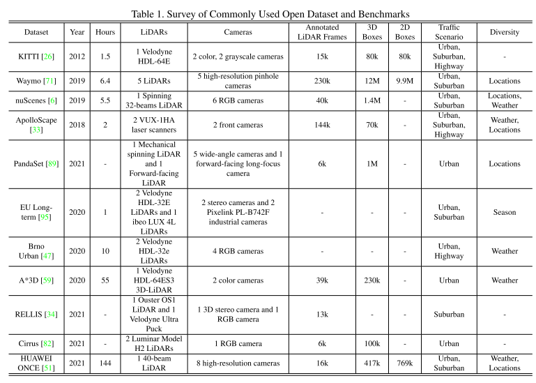
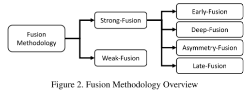
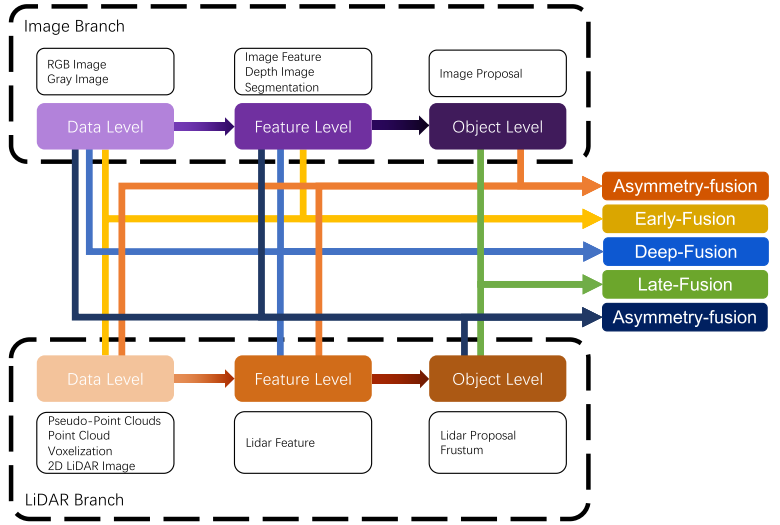
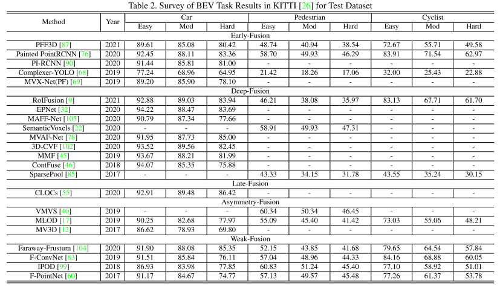
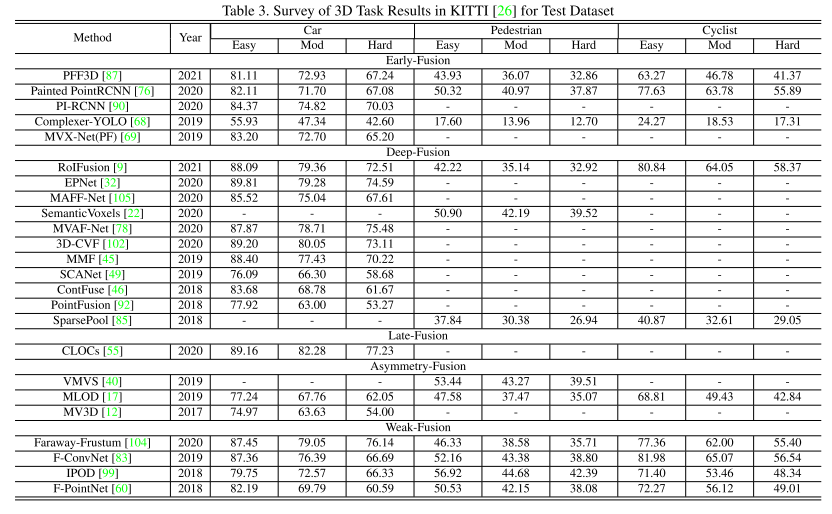
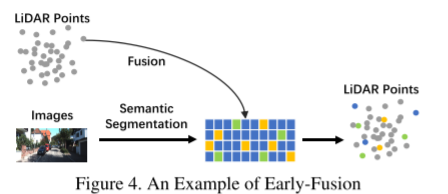
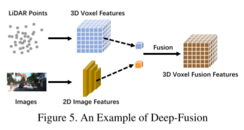
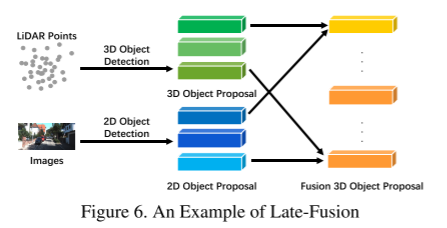
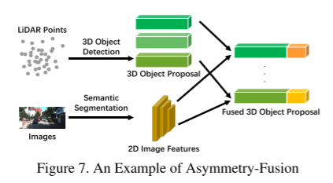
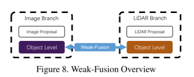

# Multi-modal Sensor Fusion for Auto Driving Perception: A Survey

论文名称 ：Multi-modal Sensor Fusion for Auto Driving Perception: A Survey 

论文下载：[https://arxiv.org/pdf/2202.02703.pdf](https://arxiv.org/pdf/2202.02703.pdf)

2022	arXiv:2202.02703 

多模态融合是感知自动驾驶系统的一项基本任务，最近引起了许多研究人员的兴趣。 然而，由于原始数据的噪声、未充分利用的信息以及多模态传感器的错位，实现相当好的性能并非易事。 在本文中，我们对现有的基于多模态的自动驾驶感知任务方法进行了文献综述。 通常，我们进行了详细的分析，包括 50 多篇论文，利用包括 LiDAR 和相机在内的感知传感器试图解决对象检测和语义分割任务。 与传统的融合模型分类方法不同，我们提出了一种创新的方法，从融合阶段的角度，通过更合理的分类法将它们分为两大类、四个小类。 此外，我们深入研究了当前的融合方法，关注剩余的问题并就潜在的研究机会进行开放式讨论。

贡献:

我们提出了一种用于自动驾驶感知任务的多模态融合方法的创新分类法，包括强融合和弱融合两大类，以及强融合中的四个小类，即早期融合、深度融合、后期融合 ，不对称融合，由 LiDAR 分支和相机分支的特征表示明确定义。

我们对 LiDAR 和相机分支的数据格式和表示进行了深入调查，并讨论了它们的不同特征。

我们对剩余的问题进行了详细的分析，并介绍了多模态传感器融合方法的几个潜在研究方向，这可能会启发未来的研究工作。

数据集：

融合方法论：

从传统分类学的角度来看，所有的多模态数据融合方法都可以方便地分为三种范式，包括数据级融合（early-fusion）、特征级融合（deepfusion）和对象级融合。 后期融合）。

论文提出新的划分方式：

图 3. 强融合概述

表 2. KITTI [26] 中测试数据集的 BEV 任务结果调查

表 3. 测试数据集的 KITTI [26] 中的 3D 任务结果调查

早期融合

深度融合

后期融合

不对称融合

弱融合

.在多模态融合中的机遇

更先进的融合方法  1 错位和信息丢失  2更合理的融合操作

多源信息杠杆   1有更多潜在的有用信息  2表征学习的自我监督

感知传感器的内在问题  1数据域偏差  2 与数据解析冲突

结论：

文中，回顾了 50 多篇有关用于自动驾驶感知任务的多模态传感器融合的相关论文。 具体来说，首先提出了一种创新的方法，从融合的角度通过更合理的分类法将这些论文分为三类。 然后，我们对 LiDAR 和相机的数据格式和表示进行了深入调查，并描述了不同的特征。 最后，对多模态传感器融合的剩余问题进行了详细分析，并介绍了几个新的可能方向，以启发未来的研究工作。

> 更新: 2023-05-05 14:05:01  
> 原文: <https://3dcv.yuque.com/org-wiki-3dcv-mm1l0t/ysgfp9/udphte_rc5bv3>