# 1.Frustum-PointNets

[论文下载](https://arxiv.org/abs/1711.08488)

## 简介
视锥来自计算机图形学。简单理解，**相机中的平面区域(黄色)对应空间中的3D区域**。视锥示意图

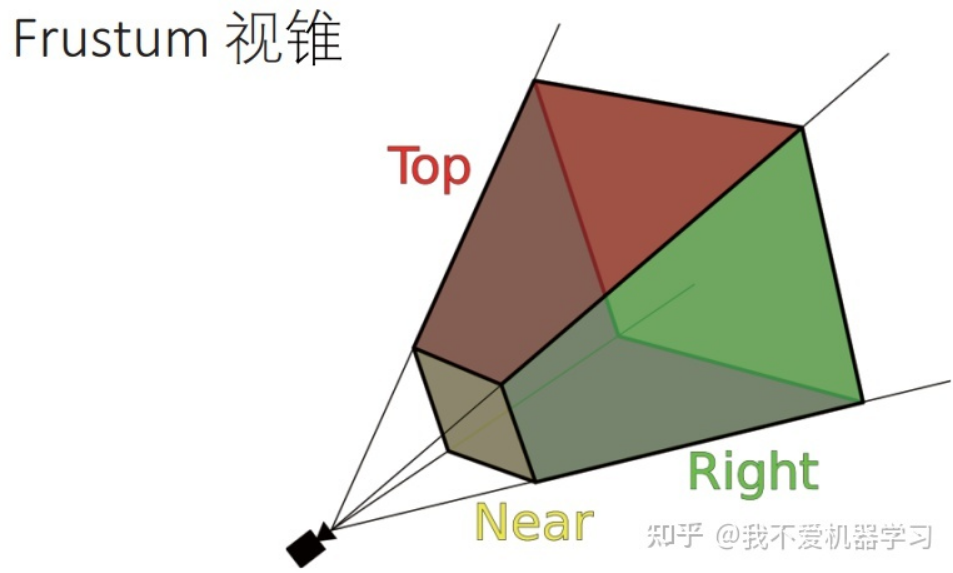

3D目标识别与2D目标识别的相似处是需要**恢复一个边界框**，不过2D的识别是恢复一个2D的边界框，而3D的识别是恢复一个3D的边界框，包括**长宽高、姿态、角度**等。

3D和2D最不同的是，在3D中**更加关注完整的边界框**，即使在**目标物被遮挡或存在背景杂波**的情况下，也能够恢复完整的3D边界框/位置。

输入：**RGB-D数据**，D表示来自LiDAR的稀疏点云或来自depth sensor的dense depth map。

RGB-D = 普通的RGB三通道彩色图像 + Depth Map

在3D计算机图形中，**Depth Map（深度图）是包含与视点的场景对象的表面的距离有关的信息的图像或图像通道**。其中，Depth Map 类似于**灰度图像**，只是它的**每个像素值**是传感器距离物体的**实际距离**。通常**RGB图像和Depth图像是配准**的，因而**像素点之间具有一对一的对应关系**。

输出：目标的amodal三维边界框(包含位置、姿态和角度)以及类别。amodal表示**完整的边界框**，即使目标部分不可见。

3D box的**参数**：

+ 中心点：
+ 长宽高： 
+ 姿态(角度)：。三个自由度，由于重力原因，最终都会落在地上，因此旋转角度往往只有一个自由度，即绕着重力方向的轴旋转，大部分标注只对这一自由度进行标注。

## 2 相关工作
     基于3D目标候选区域 +分类

先在3D中找到物体的位置，然后和2D的特征结合，对物体进行分类。缺点：没有充分利用RGB的检测器。

     基于RGB/RGB-D进行目标检测

由于角度投影问题，很难推理精确的3D信息，如目标深度(3D中距离很远的物体经投影距离变得很近，加大问题难度)和大小。

作者的想法是不仅仅依靠3D进行proposal，而是将3D最好的部分和2D最好的部分结合在一起进行proposal和分类。

下图展示了该想法的一个pipeline。左边是RGB-D的input，左上的颜色表示深度，左下是RGB图片。算法首先基于2D 检测器找到目标(车)的2D边界框，然后结合给定的相机参数，则能确定 2D 边界框的视锥，如右图红色金字塔所示。最后在3D视锥的点云中找到车(绿色)或进行分类和分割。

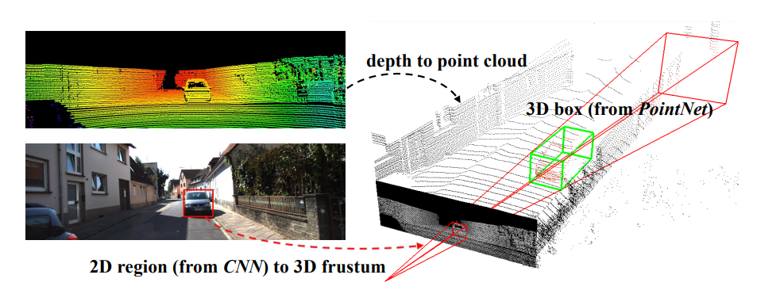

3D 对象检测管道。 给定 RGB-D 数据，我们首先使用 CNN 在 RGB 图像中生成 2D 对象区域建议。 然后将每个 2D 区域拉伸到 3D 视锥体，在其中我们从深度数据中获得点云。 最后，我们的平截头体 PointNet 从平截头体中的点预测对象的（定向和非模态的）3D 边界框。

该模型在KITTI数据上(汽车)的检测效果：

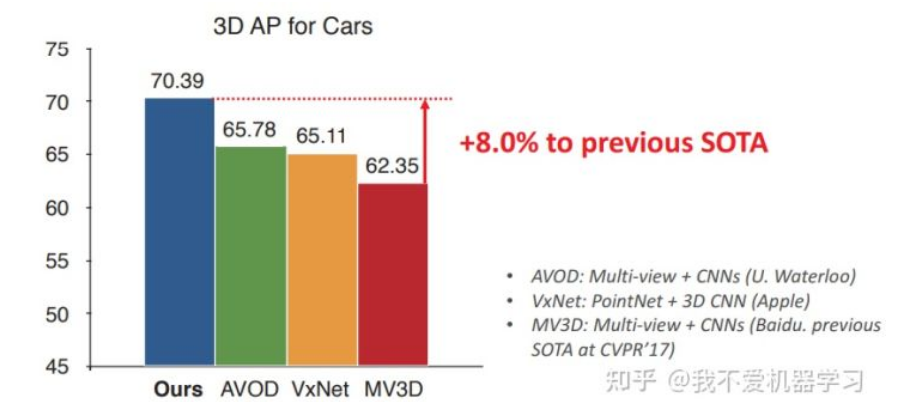

该模型在KITTI数据上的小物体(行人/自行车)的检测效果：

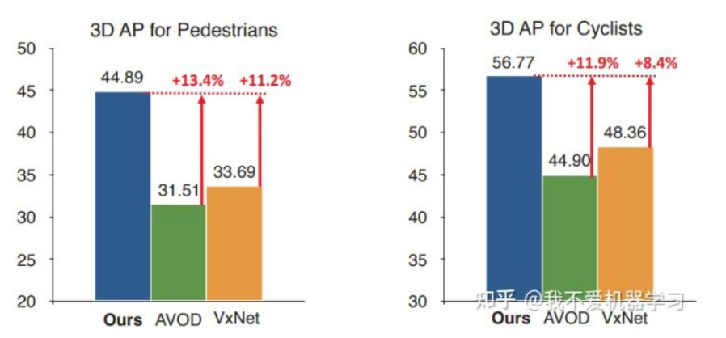

在3D点云中找出这些小目标是困难的，但2D图片具有高分辨率，对识别小物体具有帮助。

主要贡献如下：

提出了一种新的基于 RGB-D 数据的 3D 对象检测框架，称为 Frustum PointNets。

展示了框架下训练三维物体检测器，并在标准的三维物体检测基准上实现最先进的性能。

提供广泛的定量评估来验证我们的设计选择以及丰富的定性结果，以了解我们方法的优势和局限性。

## 3 模型结构
视锥pointnet主要分为三个模块，首先基于RGB训练2D检测器识别目标物位置，然后转化到视锥点云中。此时不会直接进行边界框的预测，因为视锥点云中有很多遮挡和杂波，所以先进行实例分割，将目标点云分割出来，然后经过另一个网络将目标物的完整3D边界框预测出来或进行分类。

第一个模块 Frustum Proposal  

通过图像中的2D region proposals 和深度数据的反投影，生成物体propose 3D frustums。

该模块的输入是RGB-D数据，先用2D检测网络对RGB图像进行检测，生成目标物的候选区域，然后根据相机参数，将2D候选区域抬升到3D视锥点云中，该点云被称为视锥点云。

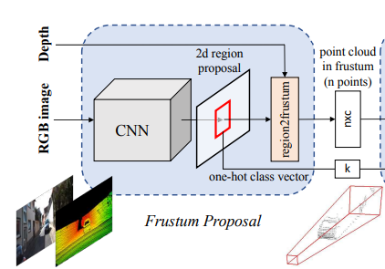

第二个模块 3D Instance Segmentation  

通过点云分割对视锥中的目标物进行定位。该模块的输入是视锥点云，通过pointnet对点云进行二分类，即分为感兴趣物体和其他物体或噪声遮挡物等。将被选中的点云mask出来，将被输入第三个模块。

这个模块也可以加入2D的信息，如将独热编码的类别信息输入进来。

使用示例分割原因及细节：

给定一个 2D 图像区域（及其对应的 3D 平截头体），可以使用几种方法来获取对象的 3D 位置：一种直接的解决方案是使用 2D 从深度图中直接回归 3D 对象位置（例如，通过 3D 边界框）  CNN。 然而，这个问题并不容易，因为遮挡对象和背景杂乱在自然场景中很常见（如下图 所示），这可能会严重分散 3D 定位任务的注意力。 因为物体在物理空间中是自然分离的，所以 3D 点云中的分割比图像中的分割更自然、更容易，远距离物体的像素可以彼此靠近。 观察到这一事实后，我们建议在 3D 点云中而不是在 2D 图像或深度图中分割实例。 类似于 Mask-RCNN [11]，它通过对图像区域中的像素进行二进制分类来实现实例分割，我们使用基于 PointNet 的网络在截锥体中的点云上实现 3D 实例分割。

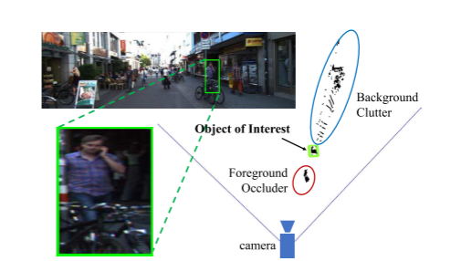

平截头体点云中 3D 检测的挑战。 左：带有人的图像区域建议的 RGB 图像。 右图：从 2D 盒子中鸟瞰挤压平截头体中的 LiDAR 点，我们可以看到前景遮挡物（自行车）和背景杂波（建筑物）的广泛分布的点。

几何变换coordinates normalization

通过一系列的坐标转换规范化学习问题。

假设视锥中存在黑点(a)，其坐标用 (x,y,z) 来表示，则由于 pointnet 是直接输入 (x,y,z) 的，若 (x,y,z) 的分布过大，则网络兼容性要高，能够适应各种不同的坐标。

作者关心的是视锥范围内物体的相对深度关系，因此可以将 (x,y,z)进行变换(b)，使 z 轴指向视锥的中心方向，这样的局部视锥点在坐标轴上就能稳定分布，不会在很大范围内波动。

作者关心的是车的点，得到车的分割，则将坐标系移到分割出的点的中心，则车的点在坐标系周围更加稳定。

分割出的点云中心可能跟物体真实的中心存在偏差，为此作者使用一个网络(t-net)估计物体的真实中心(d)，然后在该中心点的坐标系下估计物体的边界框和角度，会准确很多。

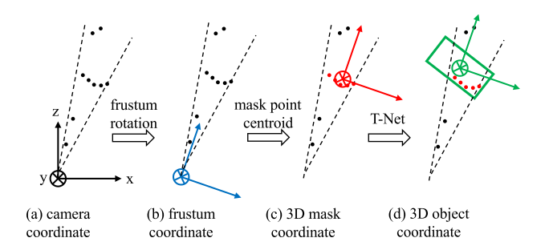

点云的坐标系。 显示人工点（黑点）以说明（a）默认相机坐标；  (b) 将截头体旋转到中心视图后的截头体坐标；  (c) 目标点质心在原点的掩码坐标；  (d) T-Net 预测的对象坐标。

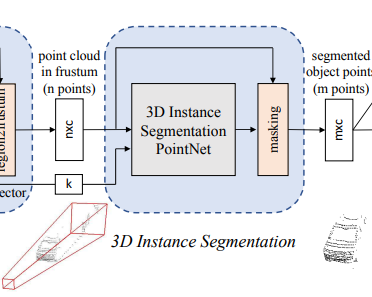

第三个模块   Amodal 3D Box Estimation  

估计分割出的目标点云的边界框。该模块的输入是目标点云，通过pointnet回归估计该目标的3D边界框。

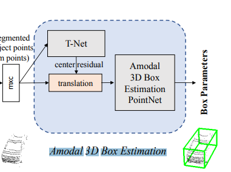

完整：

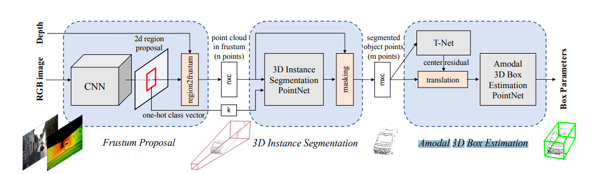

用于 3D 对象检测的 Frustum PointNets。 我们首先利用 2D CNN 对象检测器来提出 2D 区域并对其内容进行分类。 然后将 2D 区域提升到 3D，从而成为平截头体提议。 给定一个平截头体中的点云（n × c，n 个点和 c 个 XYZ 通道，每个点的强度等），对象实例通过每个点的二进制分类来分割。 基于分割的对象点云 (m×c)，轻量级回归 PointNet (T-Net) 尝试通过平移对齐点，使得它们的质心靠近 amodal box 中心。 最后，框估计网络估计对象的非模态 3D 边界框。

一些基本结构：

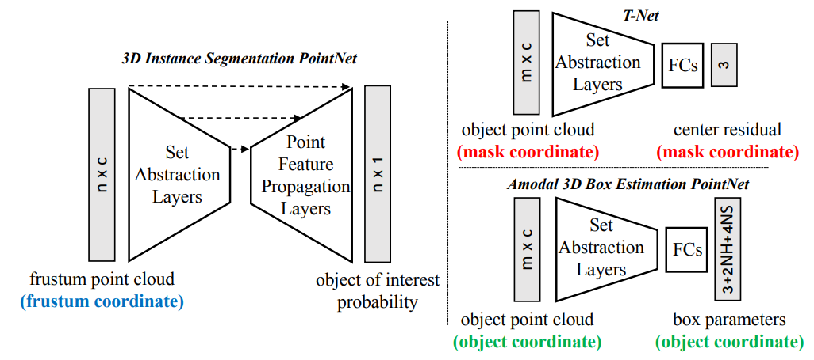

使用pointnet在原始点云中进行 3D 估计。

从下图中可以看出，如果基于2D-mask-CNN对RGB-D数据直接进行实例分割，然后将分割结构转换为视锥点云，则点云分布范围非常大，深度范围在9m-55m，包含了少量的前景遮挡和背景杂波。而作者将2D的region proposal 放在3D点云中进行分割，则分割的很干净，集中在车的范围中，深度也缩小了很多12m-16m。

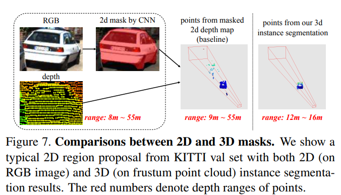

损失函数

为3D边界框设计了特定的损失函数。

3D box的**参数**：

+ 中心点：
+ 长宽高： 
+ 姿态(角度)：。三个自由度，由于重力原因，最终都会落在地上，因此旋转角度往往只有一个自由度，即绕着重力方向的轴旋转，大部分标注只对这一自由度进行标注。

这里没有采用绝对值的回归，而是用了分类和回归的混合方式(cls-reg)。

 将角度分割成K个分角，然后看目标物属于哪个分角，并对分角进行插值。

 边界框，借助预定义的边界框计算损失。

 计算边界框中心点的损失。

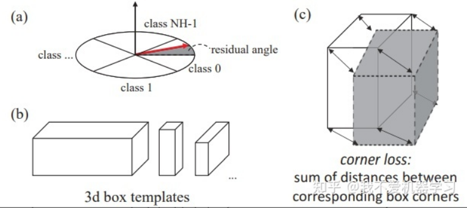

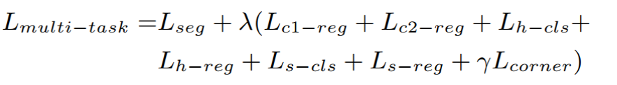

实验

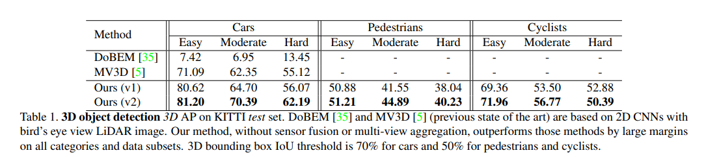表 1. KITTI 测试集上的 3D 物体检测 3D AP。  DoBEM [35] 和 MV3D [5]（以前的最新技术）基于带有鸟瞰 LiDAR 图像的 2D CNN。 我们的方法在没有传感器融合或多视图聚合的情况下，在所有类别和数据子集上都大大优于这些方法。 汽车的 3D 边界框 IoU 阈值为 70%，行人和骑自行车的人为 50%。

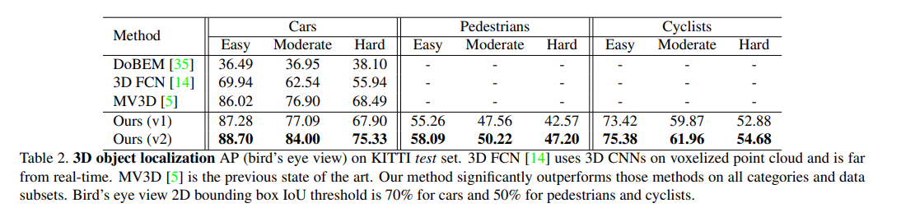

表 2. KITTI 测试集上的 3D 对象定位 AP（鸟瞰图）。  3D FCN [14] 在体素点云上使用 3D CNN，并且远非实时。  MV3D [5] 是之前最先进的技术。 我们的方法在所有类别和数据子集上都明显优于那些方法。 鸟瞰图 2D 边界框 IoU 阈值是汽车的 70%，行人和骑自行车的人的 50%。

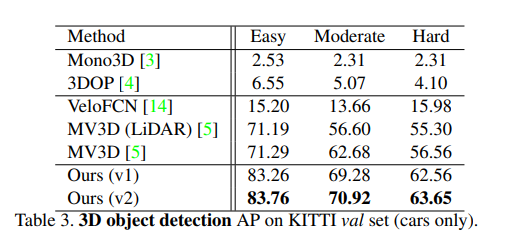

表 3. KITTI 验证集上的 3D 对象检测 AP（仅限汽车）。

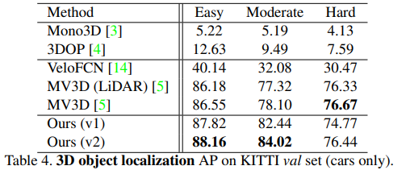

表 4. KITTI 验证集上的 3D 对象定位 AP（仅限汽车）。

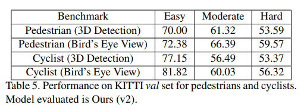

表 5. 行人和骑自行车者的 KITTI val 集的性能。 评估的模型是我们的 (v2)。

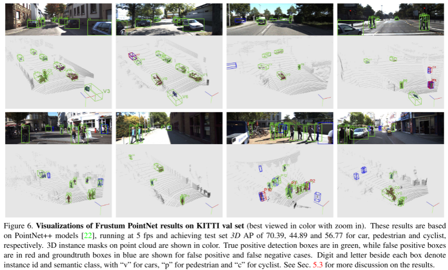

图 6. KITTI val 集上的 Frustum PointNet 结果的可视化（放大后最好以彩色查看）。 这些结果基于 PointNet++ 模型 [22]，以 5 fps 的速度运行，汽车、行人和自行车的测试集 3D AP 分别为 70.39、44.89 和 56.77。 点云上的 3D 实例蒙版以彩色显示。 真阳性检测框是绿色的，而假阳性框是红色的，而蓝色的groundtruth 框显示的是假阳性和假阴性的情况。 每个框旁边的数字和字母表示实例 id 和语义类，“v”表示汽车，“p”表示行人，“c”表示骑自行车的人。 见秒。  5.3 对结果进行更多讨论。

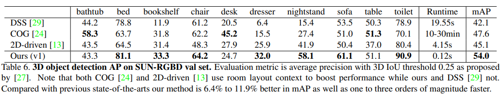

表 6. SUN-RGBD 验证集上的 3D 对象检测 AP。 评估指标是 [27] 提出的 3D IoU 阈值为 0.25 的平均精度。 请注意，COG [24] 和 2D-driven [13] 都使用房间布局上下文来提高性能，而我们的和 DSS [29] 则没有。 与以前的最先进技术相比，我们的方法在 mAP 上提高了 6.4% 到 11.9%，并且速度提高了 1 到 3 个数量级。

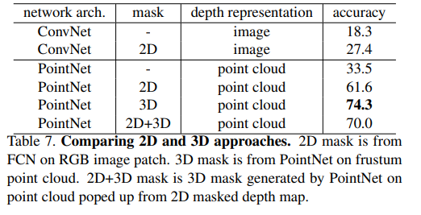

表 7. 比较 2D 和 3D 方法。  2D 蒙版来自 RGB 图像补丁上的 FCN。  3D 蒙版来自 PointNet on frustum point cloud。  2D+3D mask 是 PointNet 在从 2D masked depth map 弹出的点云上生成的 3D mask。

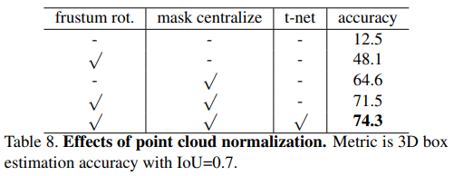

表 8. 点云归一化的效果。 指标是 IoU=0.7 的 3D 框估计精度。

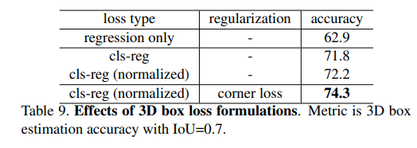

表 9. 3D box loss 公式的影响。 指标是 IoU=0.7 的 3D 框估计精度。  
 

****

> 更新: 2023-05-05 14:04:20  
> 原文: <https://3dcv.yuque.com/org-wiki-3dcv-mm1l0t/ysgfp9/rszuq7_lgoprh>