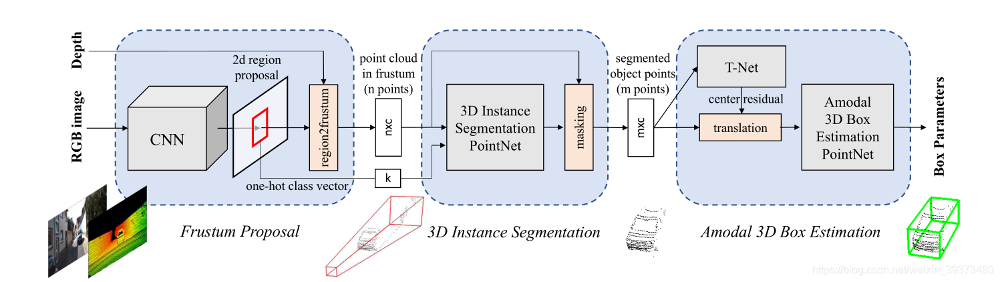
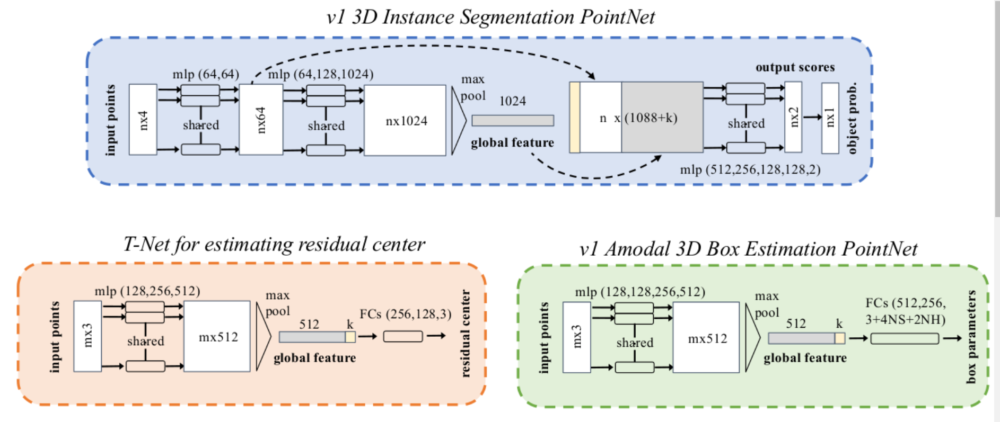
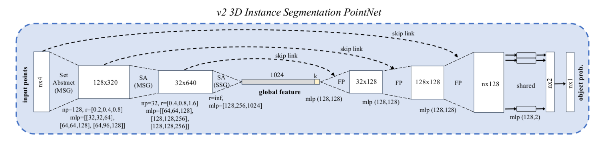
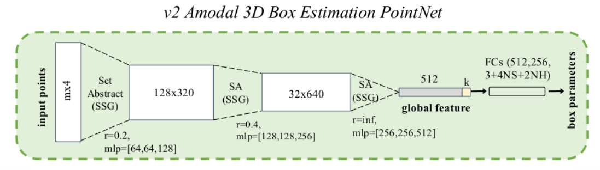
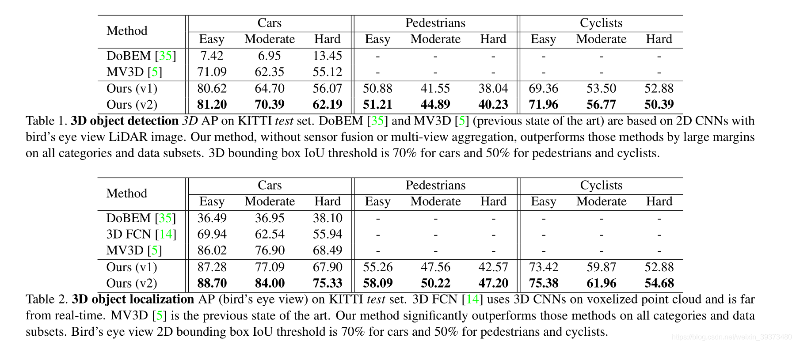
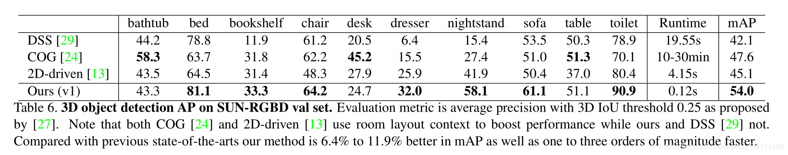
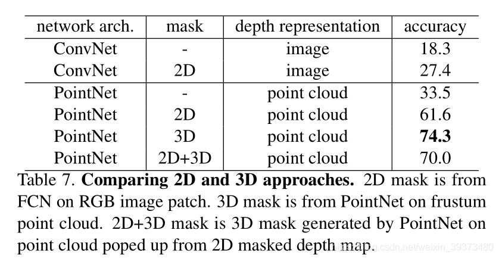
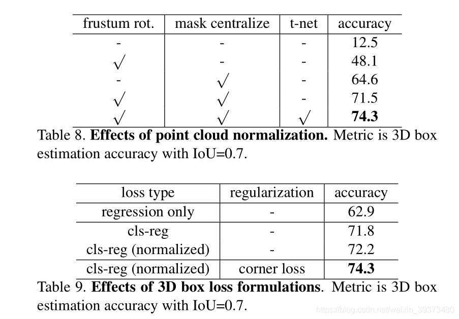

# 2.Frustum-PointPillars

[论文下载](https://openaccess.thecvf.com/content/ICCV2021W/AVVision/html/Paigwar_Frustum-PointPillars_A_Multi-Stage_Approach_for_3D_Object_Detection_Using_RGB_ICCVW_2021_paper.html)：Frustum-PointPillars: A Multi-Stage Approach for 3D Object Detection

using RGB Camera and LiDAR

# 论文整体思路
本文不是单纯依靠点云特征，而是利用二维目标检测的成熟领域来减少三维空间中的搜索空间。 然后，使用柱状特征编码网络在约简点云中进行目标定位。 我们还提出了一种新的点云掩蔽方法，以进一步提高目标的定位。

本文先通过2D模型通过图像生成2D的bounding box，再通过frustum（平截头体）的方式去映射成一个3D的候选区域。在模型的第二阶段，本文使用3D基于点云的模型（如PointNet和PointNet++）去对 上一阶段frustum找出的候选区域进行实例分割和最终3D bounding box的回归。

# 本文贡献
（1）提出了一种新的点云中实时三维目标检测方法：锥柱法。 本文扩展和改进了PointPillums结构，增加了一种新的RGB相机传感器模式，并使用了多级方法。 本文还扩展了用于训练的数据增强，使其能够与多阶段网络结构一起工作。 

（2）本文提出了基于高斯的三维点掩蔽，以区分前景和背景杂波，从而提高三维目标的定位。 在KITTI数据集上的实验和定量评估验证了我们的设计选择。

（3）在KITTI数据集上，F-PointPolidars在行人定位（BEV检测）方面优于PointPolidars和其他多级SOTA方法。 在运行时方面，我们的方法明显优于其他多阶段SOTA方法。 

# 模型介绍

从图中的第一部分可以看出，该模型首先通过一个2D的CNN去得到一个物体2D的bounding box和它的类别，然后将2D的bounding box映射成一个3D的frustum proposal。

图中的第二部分是一个实例分割的网络，可以将上一步frustum proposal中的点采样到N × C ，其中N是点的个数，C是每个点的特征维度，包含XYZ以及强度信息。最终这些点和这个proposal通过2D CNN得到的类别的one hot vector一起作为这一步实例分割网络的输入，输出一个对于N个点的mask掩码，被掩码过滤过的M MM个点继续作为下一阶段的输入。

最后一阶段，一个基于PointNet的TNet网络，将输入点校正对齐，并通过另一个网络回归预测出3D的bounding box。

模型的具体结构如图：

# 实验结果
论文在detection的任务里比较了KITTI数据集（包含3D detection和鸟瞰图的detection）和SUN-RGBD数据集。

> 更新: 2023-05-05 14:04:32  
> 原文: <https://3dcv.yuque.com/org-wiki-3dcv-mm1l0t/ysgfp9/ab98w8_dum9wa>