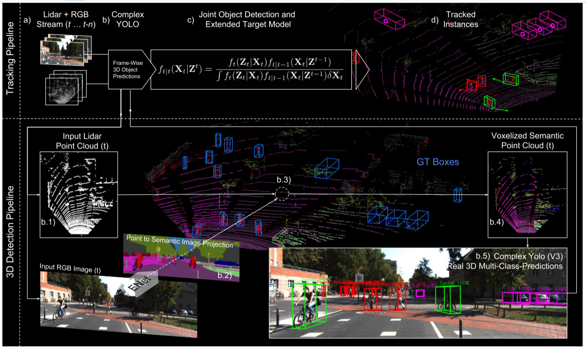
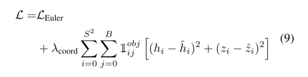
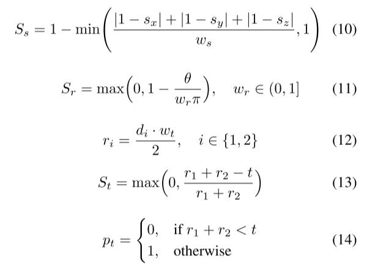

# 3.Complexer-YOLO

[论文下载：](https://openaccess.thecvf.com/content_CVPRW_2019/html/WAD/Simon_Complexer-YOLO_Real-Time_3D_Object_Detection_and_Tracking_on_Semantic_Point_CVPRW_2019_paper.html)Complexer-YOLO: Real-Time 3D Object Detection and Tracking on Semantic Point Clouds 

# 摘要
三维物体的精确检测是计算机视觉中的一个基本问题，对自动驾驶汽车、增强/虚拟现实以及机器人学中的许多应用有着巨大的影响。 本文提出了一种基于神经网络的三维检测器和视觉语义分割技术在自动驾驶环境下的融合。 此外，我们引入了Scalerotation-Translation Score(SRTS)，这是一种快速且高度可参数化的评估指标，用于对象检测的比较，它将我们的推理时间提高了20%，训练时间减少了一半。 在此基础上，我们利用时域信息，将最新的在线多目标特征跟踪技术应用于目标测量，进一步提高了测量的准确性和鲁棒性。 我们在KITTI上的实验表明，我们在所有相关类别中都获得了与最先进的结果相同的结果，同时保持了性能和精度的权衡，仍然实时运行。 此外，我们的模型是第一个融合视觉语义和三维目标检测的模型。

Complexer-YOLO：基于语义[点云](https://so.csdn.net/so/search?q=%E7%82%B9%E4%BA%91&spm=1001.2101.3001.7020)的实时三维目标检测与跟踪三维目标的精确检测是计算机视觉中的一个基本问题，在自动驾驶、AR/VR以及机器人领域中都起到巨大的作用。在本文中，基于自动驾驶领域最为先进的3D目标检测与视觉语义分割技术，我们提出了一种新的融合神经网络。此外，我们还引入了尺度旋转平移分子（SRTs），这是一种快速且高度参数化的对比目标检测效果的评估指标，它将我们的推理时间提高了20%同时促使训练时间减半。在此基础上，我们将最先进的在线多目标特征跟踪技术应用于目标测量中，进一步提高了利用时间信息的准确性和鲁棒性。我们在KITTI上的实验表明，我们在所有相关类别中都取得了与最新技术相同的结果，同时保持了性能和准确性的折衷，并且仍然实时运行。此外，我们的模型是第一个融合视觉语义和三维目标检测的模型。

# 主要贡献
1. **视觉类特征**：结合了基于相机的快速语义分割生成的可视逐点类特征

2. **体素化输入**：扩展Complex-YOLO处理具有可变尺寸深度而不是固定RGB贴图的体素化输入特征

3. **真正的3D预测**：扩展回归网络以预测3D框的高度和z偏移，以在三个维度上处理目标。

4.**刻度-旋转-平移分数（SRT）**：考虑到检测到的对象的3DoF姿势（包括偏航角，例如宽度，高度和长度），我们引入了SRT，这是一种用于3D盒子的新验证指标，明显比IoU更快。

5.**多目标跟踪：**在线特征跟踪器的应用与检测网络分离，可以基于实际的物理假设进行结合时间的跟踪和目标实例化。

6.**实时功能**：尽管语义分割，3D对象检测（例如多目标跟踪）方面有最新的成果，但我们提供了新的具有出色的全面实时功能的跟踪管道。可以将管道直接引入感知城市风光的每辆自动驾驶汽车中。

# 实验分析

Complexer-YOLO处理流水线：图中展示了一个新颖的、完整的实时点云3D检测(B.1-5)和跟踪流水线(A，B，C，D，E)。 该跟踪流水线由以下几部分组成：(a)从流中获取LIDAR+RGB帧；(b)基于帧的复杂YOLO三维多类预测；(c)用于特征跟踪的联合对象和扩展目标模型；(d)环境模型内的三维对象实例跟踪。 具体包括：（1）LIDAR框架的体素化；（2）借助eNet对RGB图像进行语义分割；（3）LIDAR对语义图像反投影的逐点分类；（4）语义体素网格的生成；（5）用于三维多类预测的真实三维复合体YOLO。

**点云预处理:**每个体素，在其3D空间中至少存在一个点，并且对前置相机可见，每个体素都填充有从范围[1、2]中的语义映射中提取的归一化类值。

**深度和颜色渲染:**通过步长2的卷积来替换最大池化层，并添加残差联接层。总共有49个卷积层。此外，我们加入目标高度h和地面偏移z作为目标回归参数，并将二者合并到多单元损失函数中。

在训练过程中，通常使用IoU来对比检测值和地面真值。但是，在比较旋转边框时，以上参考值存在缺点。如果两个边框的大小和位置相同，角度相差π 这两个边框之间的IoU是1，这意味着它们完全匹配。显然不是这样，因为两个边框之间的角度存在最大的差异。因此，在训练一个网络时，它不会因为预测这样的边框而受到惩罚甚至鼓励。这将导致对目标方向的错误预测，同时计算三维空间中旋转边框的精确IoU也是一项耗时的任务。

为了克服这两个问题，我们引入了一个新的高度参数化的简单评价指标称为缩放旋转平移分数（SRTs）。

所有之前的分数都在区间[0，1]内，可以使用简单的加权平均值和惩罚点组合成最终分数（Ssrt）。

SRT与网络必须完成的三个子任务（旋转、位置、大小）完美地结合在一起，以便预测具有偏航角的3D边框。

**LMB RFS中的扩展目标模型:**在LMB更新步骤中，每个预测目标与时间步的每个测量相关联，并且根据所定义的测量模型执行更新。

> 更新: 2023-05-05 14:04:35  
> 原文: <https://3dcv.yuque.com/org-wiki-3dcv-mm1l0t/ysgfp9/xsout3_dza94a>