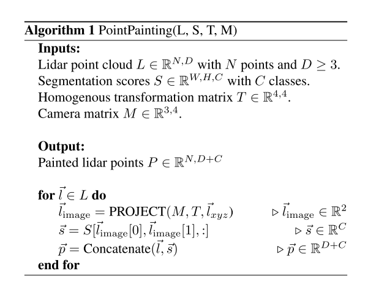
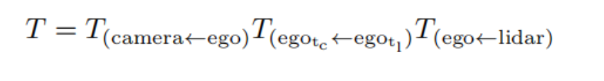
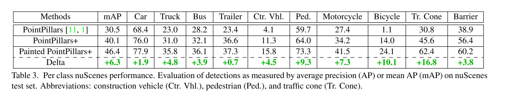
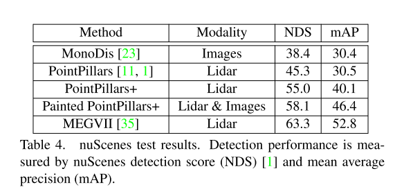

# 4.PointPainting

[论文下载](https://openaccess.thecvf.com/content_CVPR_2020/html/Vora_PointPainting_Sequential_Fusion_for_3D_Object_Detection_CVPR_2020_paper.html)： PointPainting: Sequential Fusion for 3D Object Detection  （2022CVPR）

发表单位：an Aptiv Company  

# 摘要
camera和lidar都是自动驾驶领域很重要的传感器。但是，通过在几个主要的benchmark数据集上做实验发现，基于lidar的方法要优于基于lidar和camera融合的方法。在这篇论文中，作者提出了pointpainting，这是一个序列化的融合方法，可以用来解决这个问题。pointpainting通过将lidar的point投射到基于图片的语义分割网络中，并且将每一个类别的分数添加到每一个点上。实验结果表明，在三个不同的点云目标检测方法 Point-RCNN, VoxelNet和PointPillars上，使用KITTI和nuScenes数据集都可以得到好的效果。同时，作者还研究了pointpainting这种融合办法的效果与语义分割输出的质量和形式之间的关系，以及在执行pipeline的时候怎样最小化延迟。

# 引言
图片和点云作为物体的两种不同表现形式，可以呈现出来物体的不同特征，比如图片可以反映物体的颜色以及质地texture，点云就可以呈现一个很精确的范围以及深度等。所以在检测的时候有必要将两个结合在一起。

在目前fusion精度低的可能原因时，作者认为可能是数据处理的视角不一样，在lidar-based的SOTA的方法中，基本上都是在BEV的视图上进行的，但是在Image视图却是在front视图。lidar数据很容易转化为BEV视图信息，但是Image却不容易，也不精确。因此作者认为fusion的核心问题在于将BEV视角和camrea信息融合。

之前的融合方法大致可以分为这几类：以物体为中心的融合object-centric fusion，连续的特征融合continuous feature fusion，显式转换explicit transform和 detection seeding。

大概介绍一下这几种融合方法。

object-centric fusion：MV3D和AVOD是两个典型。这是一种two-stage的架构，融合是发生在proposals level阶段。

continuous feature fusion：在特征图上进行融合，这类融合方式最大的缺点在于“特征模糊”，这是因为在BEV视图上的一个pixel对应着Image视图上的多个pixel。

explicit transform：将Image转化到BEV视图表示，再在此视图上进行融合。

detection seeding：类似F-pointnet，先通过2D detector得到image检测结果，再投影到3D lidar上。

pointpainting解决了现阶段已有的许多融合方法的问题，它不会在3D检测架构上添加任何的约束；也不会有深度模糊；也没有限制最大的召回。

# pointpainting架构
pointpainting架构以点云和图片作为输入，并且得到最终的3D检测框。它主要包括三个阶段：1）语义分割：通过使用一个基于图像的网络来计算分割分数。2）融合：lidar的点云会被写成score。3）3D物体检测：一个基于lidar的3D检测网络。

## 1）基于图像的语义网络
在融合的pipeline中，使用语义分割有几个好处。一个是语义分割要比3D物体检测容易实现，因为分割只需要本地的，每一个像素的分类，但是3D检测是需要3D定位和分类。语义分割是容易训练，并且比较快。

## 2）pointpainting

上图中的x，y，z，r和x，y，z，r，t分别是KITTI和nuScenes的点云坐标。x，y，z是空间坐标，r是反射比，t是时间戳。lidar的点云转换是通过投射到camera。在KITTI中，这种转换是Tcamera←lidar。在nuScenes中，转换是需要使用一些额外的东西，整个转换的过程是这样的：

如上图所示，首先是将lidar转换到ego，然后将ego转换到lidar的capture的，最后转换到图片上。分割网络的输出是C个类别的分数，KITTI中是4个类别（车，行人，骑车的人，背景），nuScenes中是11个类别（10个类别和背景）。一旦lidar的点云被投射到图片上了，分割分数就也会被加到lidar的点云上。但是有些点云可以投影到两个图片中，此时作者的选择方法是随机选择一个就行。

## 3）3D物体检测
使用3个不同的lidar三维检测器，PointPillars, VoxelNet和 PointRCNN

在nuScenes上的结果如下面两个图所示：

> 更新: 2023-05-05 14:04:39  
> 原文: <https://3dcv.yuque.com/org-wiki-3dcv-mm1l0t/ysgfp9/pgbpoh_gi1fhm>