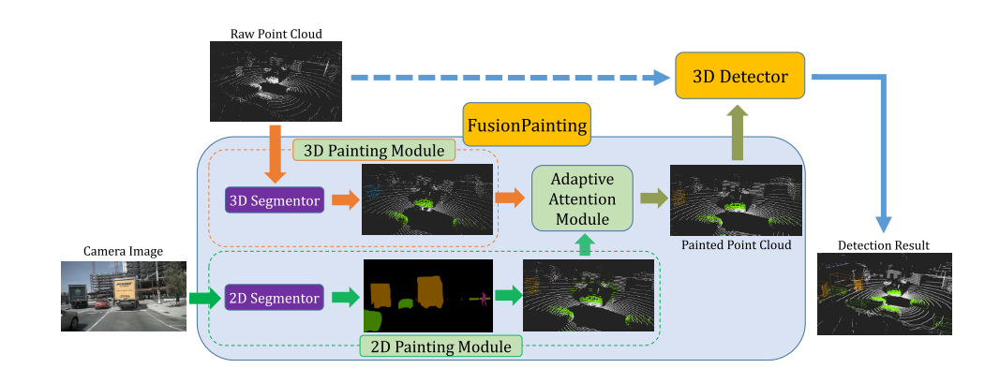

# 5.FusionPainting

[论文下载：](https://arxiv.org/abs/2106.12449) FusionPainting: Multimodal Fusion with Adaptive Attention for 3D Object Detection (2021ITSC)

# 摘要
三维障碍物的精确检测是自动驾驶和智能交通的一项重要任务。 在本文中，我们提出了一个通用的多模态融合框架FusionFluking，将二维RGB图像和三维点云在语义层次上进行融合，以提高三维目标检测的效率。 特别地，FusionPhointing框架由三个主要模块组成：多模态语义分割模块、基于注意力的自适应语义融合模块和三维目标检测器。 首先，基于二维和三维分割方法对二维图像和三维激光雷达点云进行语义信息提取。 然后基于所提出的基于注意力的语义融合模块对不同传感器的分割结果进行自适应融合。 最后，用融合语义标记绘制的点云被发送到三维检测器，以获得三维目标结果。 在大规模NUSCENES检测基准上，通过与三种不同基线的比较，验证了该框架的有效性。 实验结果表明，与仅使用点云的方法相比，该融合策略能显著提高检测性能，与仅使用点云绘制二维分割信息的方法相比，该融合策略能显著提高检测性能。 此外，在Nuscenes测试基准上，所提出的方法优于其他最先进的方法。 代码可以在[https://github.com/shaiqing26/fusionpainting/](https://github.com/shaiqing26/fusionpainting/)上找到。 

# 引言
基于多模态的目标检测方法可以分为早期融合、深度融合和后期融合。 早期的融合方法旨在将原始数据直接组合在一起，然后再将其送入检测框架中，从而生成一种新的数据类型。 通常，这类方法要求每类传感器数据之间具有像素级的对应关系。 与早期融合方法不同的是，后期融合方法首先对每类数据分别进行检测，然后在包围盒级对检测结果进行融合。 与上述两种方法不同的是，基于深度融合的方法通常先用不同类型的深度神经网络提取特征，然后在特征层进行融合。

# 创新点
（1）首次提出了一个通用的多模态融合框架FusionPhointing在语义层次上融合不同类型的信息，以提高三维目标检测的性能。

（ 2）为了进一步提高系统的性能，提出了一个注意模块，通过学习上下文特征，在体素级融合不同种类的语义信息。 

（3）在大规模自动驾驶基准NUSCENES上的实验结果表明了该融合框架的优越性，并与其他方法相比取得了SOTA结果。 

# 实验

FusionPhointing框架概述。 首先用二维分割器和三维分割器对输入的点云和二维图像进行处理，得到语义估计。 然后，采用自适应注意模块在语义层次上对两种类型的传感器进行融合。 最后，将绘制的点云送入现代三维检测器，产生检测结果。 

> 更新: 2023-05-05 14:04:45  
> 原文: <https://3dcv.yuque.com/org-wiki-3dcv-mm1l0t/ysgfp9/lgn0gk_dmbra5>