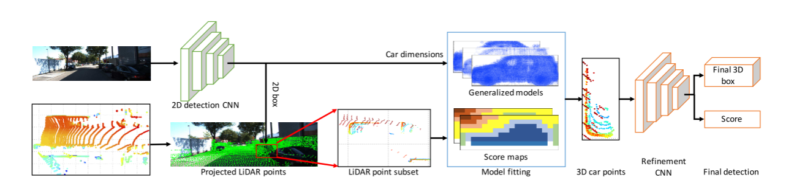

# 6.A General Pipeline

[论文下载：](https://arxiv.org/pdf/1803.00387.pdf)A General Pipeline for 3D Detection of Vehicles   （2018ICRA）

摘要

自动驾驶需要对环境中车辆及其他物体的3D感知能力。目前大部分的方法都支持2D车辆检测。这篇论文提出了一种在对2D检测网络做出最小更改的情况下，将任何2D神经网络与3D点云融合来生成3D信息的灵活的方法。为了能够识别3D检测框，作者基于广义的车辆模型和分数图开发了一种有效的模型匹配的算法。作者提出了一个2部分卷积神经网络（CNN）来优化3D检测框。

实验

作者使用两种不同的监测网络在KITTI数据集上测试了提出的Pipeline。两个网络得到的3D检测结果十分相似，证明了提出的pipeline的灵活性。此外，检测结果排在所有3D检测算法的第二名，证明了该算法的竞争力。

General fusion pipeline：所有显示的点云都是3D的，但从顶部（鸟瞰）观看。 高度是由颜色编码的，红色是地面。 基于2D检测选择点的子集。 然后，基于广义汽车模型和分数映射的模型拟合算法在子集中找到汽车点，并设计了两级细化CNN对检测到的3D盒进行微调并重新分配客观分数。 

> 更新: 2023-05-05 14:04:46  
> 原文: <https://3dcv.yuque.com/org-wiki-3dcv-mm1l0t/ysgfp9/ihbwqo_bgzq5r>