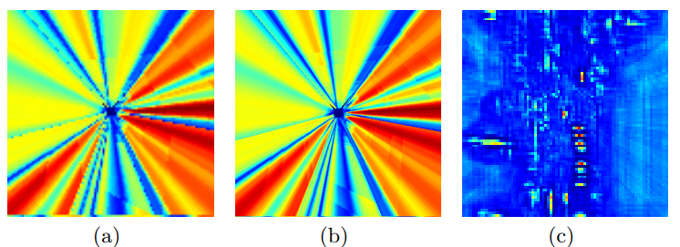
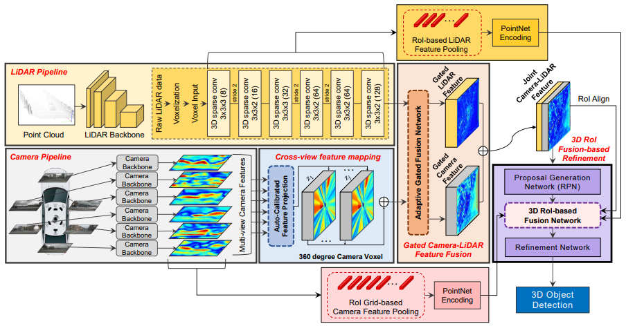
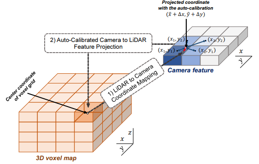
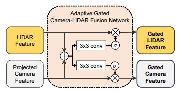
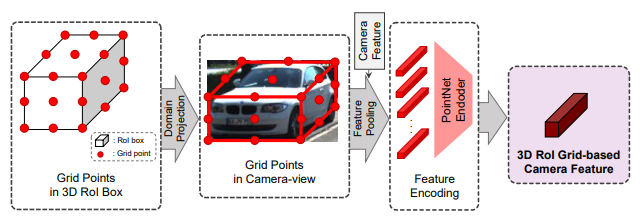
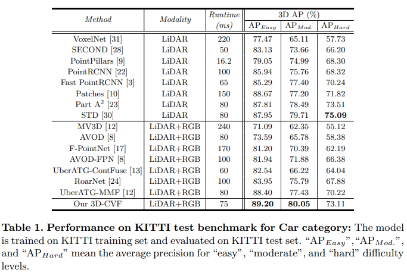
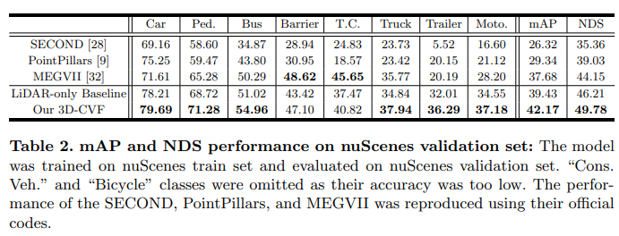

# 3D-CVF

由于视角不同，相机特征投影到3D世界坐标中时，会丢失空间信息，因为这个转换是一对多（one-to-many）的映射；此外，投影坐标与LIDAR 3D坐标之间可能存在不一致性。因此如何在不损失信息的情况下融合2种特征至关重要。

3D-CVF，可以有效融合从camera和LIDAR中单独提取的特征图，融合LIDAR和N个多视角的camera可以覆盖更广泛的视野。通过2阶段实现camera和LIDAR间的信息融合：第一阶段目标是生成强联合camera-LIDAR特征，通过能够校正空间偏移的插值投影，将camera-view特征映射到平滑且密集的BEV特征图。下图（a）（b）展示了是否经过自动标定投影而获得的特征图的差异，显然经过标定后的特征图更平滑。但是，由(b)可以看出，camera特征映射是一对多的映射，因此无法在转换后的camera特征映射上定位目标。为了定位BEV中的目标，基于注意力机制提出adaptive gated fusion network 如c图

在第二阶段refinement中也同样实现了camera-LIDAR信息融合。通过第一阶段的联合camera-LIDAR特征图生成区域建议，应用3D RoI-based pooling将low-level LIDAR特征和camera特征与联合camera-LIDAR特征图融合，再通过PointNet编码和池化与LIDAR和camera特征相对的3D ROI边界框。

网络结构

LIDAR pipeline；Camera pipeline；cross-view 空间特征映射；Gated camera-LIDAR 特征融合网络；

Proposals生成与refinement网络。

LIDAR pipeline：先对原始点云进行体素化，然后利用voxelnet进行编码，以生成固定长度的向量，在利用类似于SECOND框架提取特征（6个3D稀疏卷积）。

RGB pipeline：利用预训练的resnet18+FPN生成特征图。

Cross-view feature mapping：将图像信息在前视图视锥信息融合到点云BEV视角，auto-calibrated projection将camera-view下的camera特征映射转化为BEV-view的特征，再采用附加的卷积层增强特征。

Gated Camera-LiDAR Feature Fusion：主要用于结合camera特征和LIDAR特征。利用注意力机制权衡不同模态特征的重要性，以生成联合camera-LIDAR特征图。

3D RoI Fusion-based Refinement：利用联合camera-LIDAR特征图生成区域建议，再应用RoI-pooling进行refinement。由于联合camera-LIDAR特征图的空间信息较少，因此需要补充一些信息。使用3D ROI-based pooling提取多尺度LIDAR特征和camera特征，再由PointNet编码，并由3D ROI-based融合网络与联合camera-LIDAR特征图进行融合。最后利用融合的特征产生了最终的检测结果。

交叉视图特征映射

首先交叉视图特征(CVF)映射是为了生成在BEV中投影的相机特征图。自动校准投影将相机视图中的相机特征图转换为BEV中的特征地图。然后，通过附加的卷积层对投影的特征图进行增强，并将其传送到门控相机-LiDAR特征融合模块。论文中构建了一个摄像头体素结构用于特征映射。为了生成空间密集的特征，构造的相机体素结构的体素数量是LiDAR体素结构的四倍，其宽度和高度在(x，y)轴上比LiDAR体素结构长两倍。这使得体素结构具有更高的空间分辨率。然后利用自动校准投影法，

具体做法如下：为了在BEV中表示相机特征，将每个体素（就是指的上面构造的摄像头体素结构）的中心坐标投影到相机视图平面中(x+∆x，y+∆y)的点上，(x,y)就是一个像素点的坐标。使用线性插值组合其相邻的四个特征像素，并将组合后的特征像素分配给相应的体素。为什么有效？作者认为自动校准的投影提供了空间平滑的相机特征图，这些特征地图与BEV域中的LiDAR特征地图能形成非常好的匹配

门控摄像机-LiDAR特征融合：它是将摄像机特征图与LiDAR特征图相结合，并且用了空间注意力图根据两个特征图的重要性来选择性的融合特征，最后生成了联合的相机-LiDAR特征图，并传给3D ROI融合refinement模块。

具体的操作：自适应门控融合网络先把两个输入concatenate起来，然后应用3×3卷积层，使用Sigmoid函数来生成注意图。这些注意图通过基于元素的乘积操作分别乘以相机特征(这时候的相机特征是经过交叉视图特征映射后的）和LiDAR特征。分别得到经过注意力图后的相机特征和雷达特征，最后的联合特征是将生成的这两个再concatenate起来得到的。

基于3D-ROI融合的精化(refinement)

在得到联合Camera-LiDAR特征后，由于联合的特征没有包含足够的空间信息，于是采用基于3D ROI pooling的方法提取多尺度LiDAR特征和相机特征（这些特征是由PointNet编码）和联合特征进行再次融合。最后利用融合后的特征产生最终的检测结果。

具体操作如下，将联合Camera-LiDAR特征扔进RPN网络回归坐标和置信度，最后得到对应的ROI。然后将ROI通过坐标转换为全局坐标并和浅层的LiDAR和相机特征进行融合。作者认为这些浅层的特征图保留了目标详细的空间信息（特别是z轴的），所以对proposals提供了很有用的信息。对于每一个LiDAR或者相机特征，将一个ROI分为R×R×R等间距坐标，使用RoI grid-based pooling，每个格子被单独得用PointNet编码，每个LiDAR或者相机特征最后把每个网格的特征向量进行组合生成一个1乘1的特征向量。最后将LiDAR和相机特征这两个1×1的特征于ROI对齐的联合特征concatenate起来，得到用于proposal refinement的最终特征。

实验

> 更新: 2023-05-05 14:04:33  
> 原文: <https://3dcv.yuque.com/org-wiki-3dcv-mm1l0t/ysgfp9/ez4l58_benlxk>