# AVOD

[论文下载](https://arxiv.org/abs/1712.02294)

AVOD（Aggregate View Object Detection）算法和MV3D算法在思路上相似，可以说，AVOD是MV3D的升级版。

和MV3D相比，AVOD主要做了以下一些改进：

MV3D中使用VGG16的一部分进行特征提取。在AVOD中，作者使用了引入FPN层的Encoder-Decoder结构进行高分辨率点云和图片特征提取；

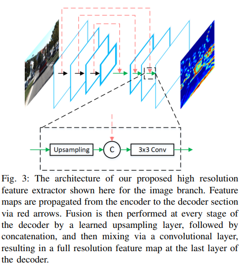

图 3  我们提出的用于图像分支的高分辨率特征提取器的架构。 特征图通过红色箭头从编码器传播到解码器部分。 然后在解码器的每个阶段通过学习的上采样层执行融合，然后进行连接，然后通过卷积层进行混合，从而在解码器的最后一层产生全分辨率特征图。

MV3D中使用8个角点（每个角点由一个三维坐标表示）描述3D BBox。在AVOD中，作者使用4个角点（只包含x,y）和2个高度（共4*2+2=10）来描述一个3D BBox。

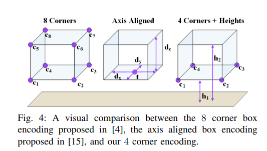

AVOD网络结构

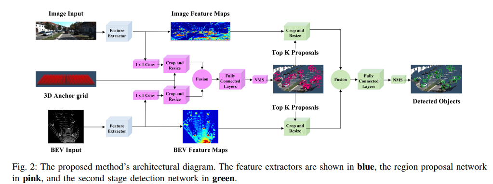

图 2：所提出方法的架构图。 特征提取器以蓝色显示，区域提议网络以粉红色显示，第二阶段检测网络以绿色显示。

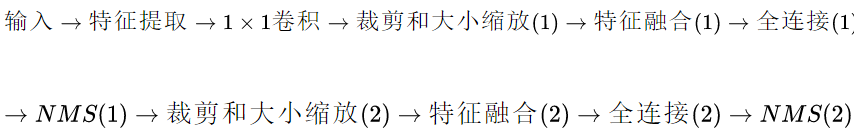

从图中可以看出，网络的输入有两个，3D Anchor grid某种意义上不算输入。这两个输入分别为（1）图片输入；（2）俯视视角的3D点云数据。

BEV数据由两部分组成，分别为（1）高度图；（2）密度图。这里和MV3D不同的是，MV3D中还有强度图，把这个图给删，能降低计算量。

高度图的获取方式：

选择点云数据的BEV视角[-40,  40]X[0,  70]的区域，划分为0.1米大小的一个个小方格（假设方格是个数是 H X W )。在每个小方格里，将高度区域为[0,  2.5 ]划分为M个切片，每个切面范围内找到最大高度点云对应的高度即可。这样总共获得了 H X W X  M 大小的高度图输入。

密度图的获取方式：

每个单元格的密度计算公式为

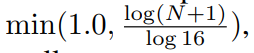N是单元格里点云数量

特征提取

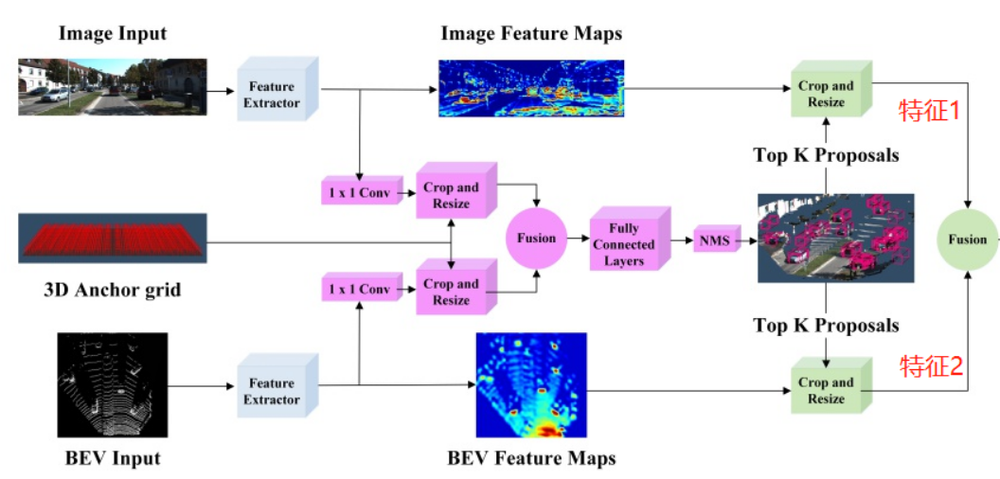

该网络主要提取出二部分数据，分别是图像特征、点云俯视图特征，其中图像+点云俯视图融合特征，在数据整合起到作用。后面将这二种特征进行融合。

Encoder-Decoder

AVOD使用的是FPN，FPN特征金字塔(Feature Pyramid Networks)是目前用于目标检测、语义分割、行为识别等重要部分，对于提高模型性能具有较好的表现。

FPN包含了encoder和decoder，输入image，输出多尺度的feature map

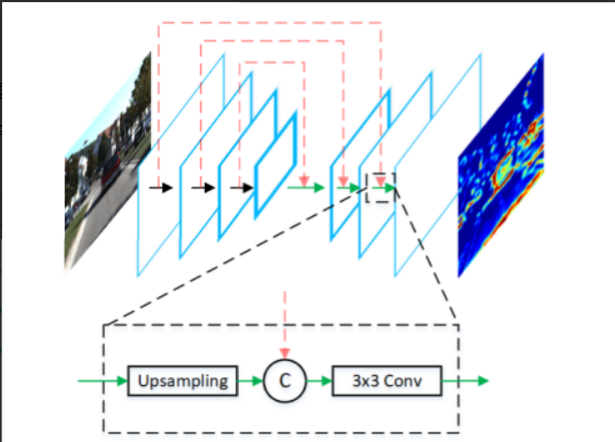

采用此结构的原因是 因为在MV3D中，像行人这样的小物体的俯视图中本身就很小，然后进行特征提取后，长宽会被进一步地被压缩，以至于在特征图上可能都占不了一个像素点，那么对这类小物体的检测精度就不够了

特征提取结束后，作者先利用1  X  1卷积操作对特征图进行降维。

通过 1 × 1 卷积层进行降维：在某些场景中，区域提议网络需要在 GPU 内存中保存 100K 锚点的特征裁剪。 尝试直接从高维特征图中提取特征作物会给每个输入视图带来很大的内存开销。 例如，假设 32 位浮点表示，从 256 维特征图中为 100K 锚点提取 7 × 7 特征裁剪需要大约 5 GB 的内存。 此外，使用 RPN 处理此类高维特征作物大大增加了其计算需求。

AVOD使用的是裁剪和调整（crop and resize）

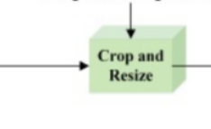

将这些3D Anchor映射到俯视视角和前视视角。那么就分别获得了这两个视角各自的2D Anchor（分别记做A和B，A为BEV视角2D Anchor，B为图片视角2D Anchor）。

然后将这些2D Anchor作为待裁剪的区域，分别裁剪由特征网络和 1 X 1卷积输出的BEV特征图（记做C）和RGB特征图（记做D）。裁剪后统一将裁剪的区域缩放到 7 X 7大小。

特征融合

完成裁剪和大小缩放后，将裁剪的BEV特征图（记做C）和RGB特征图（记做D）按位均值操作，即可完成融合。

全连接和NMS

融合的特征用作两个全连接层的输入，一个全连接层用来进行3D BBox的回归，另一个全连接层用来进行前景/背景置信度的估计。

3D 框回归是通过计算 (Δtx,Δty,Δtz,Δdx,Δdy,Δdz)，前三个为Anchor和Ground-Truth之间中心点的偏移，后三个为Anchor和Ground-Truth之间尺度（长宽高）的比例的对数。

Region Proposal

上面我们进行了一轮完成的RPN过程，粗略地获得了一系列看起来还可以的3D BBox。但是还是不够，因为框还是比较多，位置也不足够准确。

又进行了一轮RPN。过程是

先在粗略选择的Proposal中选择前K个最好的3D BBox。然后继续将这些3D BBox映射到BEV视角和前视视角，分别获得对应视角上的2D BBox。利用BEV视角的2D BBox在BEV特征上进行裁剪和Resize，得到裁剪重塑的BEV特征。利用前视视角的2D BBox在图像特征上进行裁剪和Resize，得到裁剪重塑的图像特征。利用按位平均操作，实现裁剪重塑的BEV特征和裁剪重塑的图像特征的融合。全连接层引出三个分支，分别用于处理融合特征，得到三个输出，输出内容为输出框的位置回归，朝向估计以及类别分类。

朝向

在MV3D中，朝向估计是依赖于长边估计的，也就是检测出来的3D检测框的哪个边最长，朝向就沿着这个方向。

当然，这会有两个问题。1.车辆可能符合这样的规律，但行人不一定符合这个设定。2. 假设长边确定了，可能有两个相差180度的方向都沿着这个长边。如下图所示，假设知道了BEV视角的检测框（绿色），可能有两个相差180的朝向都沿着长边。

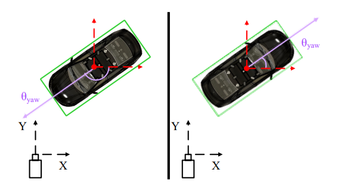

作者引入了两个角度 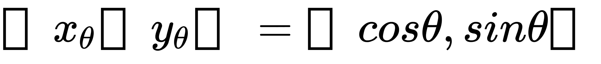 约束朝向。

实验

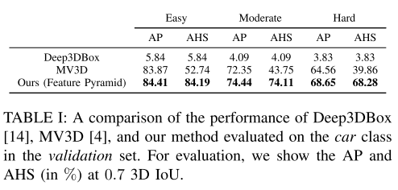

表 I：Deep3DBox [14]、MV3D [4] 和我们的方法在验证集中的汽车类上评估的性能比较。 为了评估，我们以 0.7 3D IoU 显示 AP 和 AHS（以 % 为单位）。

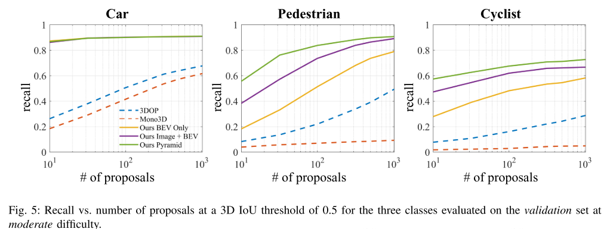

图 5：在 3D IoU 阈值为 0.5 的情况下，在中等难度的验证集上评估的三个类的召回率与提案数量。

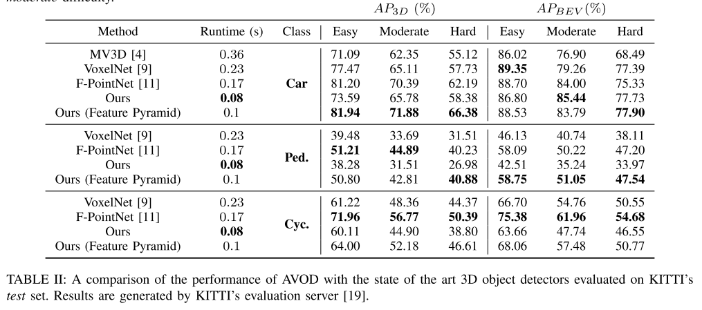

表二：在 KITTI 的测试集上评估的 AVOD 与最先进的 3D 物体检测器的性能比较。 结果由 KITTI 的评估服务器 [19] 生成。

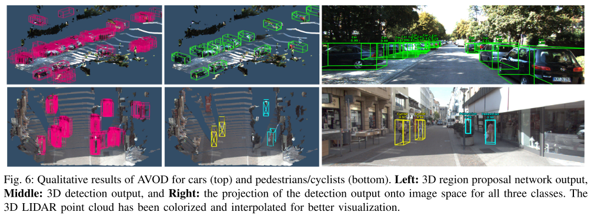

图6: 汽车 (上) 和行人/骑自行车者 (下) 的AVOD定性结果。左: 3D区域建议网络输出，中: 3D检测输出，右: 检测输出到所有三个类的图像空间上的投影。3D LIDAR点云已被着色和插值，以实现更好的可视化。

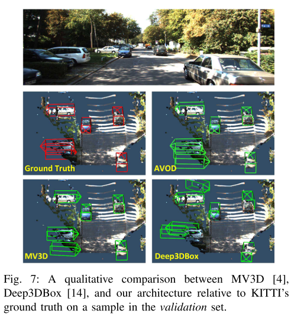

图 7：MV3D [4]、Deep3DBox [14] 和我们的架构在验证集中的样本上相对于 KITTI 的基本事实的定性比较。

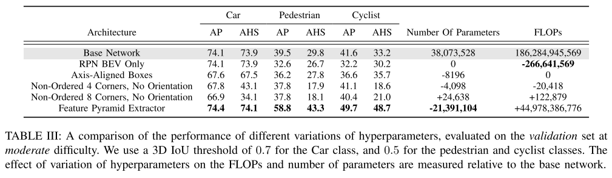

表三：不同超参数变体的性能比较，在中等难度的验证集上进行评估。 我们对 Car 类使用 0.7 的 3D IoU 阈值，对行人和骑自行车者类使用 0.5。 超参数变化对 FLOP 和参数数量的影响是相对于基础网络测量的。

> 更新: 2023-05-05 14:04:24  
> 原文: <https://3dcv.yuque.com/org-wiki-3dcv-mm1l0t/ysgfp9/hvhwg9_dwm1pa>