# AutoAlign

论文名称：AutoAlign: Pixel-Instance Feature Aggregation for Multi-Modal 3D Object Detection

论文下载：[http://arxiv.org/pdf/2201.06493v1](http://arxiv.org/pdf/2201.06493v1)

作者：Zehui Chen,Zhenyu Li,Shiquan Zhang,Liangji Fang,Qinghong Jiang,Feng Zhao,Bolei Zhou,Hang Zhao

机构*： University of Science and Technology, Harbin Institute of Technology, SenseTime Research, The Chinese University of Hong Kong, IIIS, Tsinghua University

 AutoAlign，一种用于 3D 对象检测的自动特征融合策略。 我们没有与相机投影矩阵建立确定性对应关系，而是使用可学习的对齐图对图像和点云之间的映射关系进行建模。 该地图使我们的模型能够以动态和数据驱动的方式自动对齐非同质特征。 具体来说，设计了一个交叉注意力特征对齐模块来自适应地聚合每个体素的像素级图像特征。 为了增强特征对齐过程中的语义一致性，我们还设计了一个自监督的跨模态特征交互模块，通过该模块，模型可以通过实例级特征引导来学习特征聚合。

贡献：

提出了一个可学习的多模态特征融合框架，称为 AutoAlign，它在像素级别和实例级别都增强了融合过程。

提出了一种用于 2D-3D 检测的联合训练范式，以规范从图像分支中提取的特征并提高检测精度。

通过广泛的实验，我们验证了所提出的 AutoAlign 在各种 3D 检测器上的有效性，并在 KITTI 和 nuScenes 数据集上实现了具有竞争力的性能。

AutoAlign。 它使检测器能够以自适应的方式聚合跨模态特征，这被证明在建模非同质表示之间的关系方面是有效的。 同时，它利用了像素级别的细粒度特征聚合，同时通过实例特征交互保持语义一致性，如下图

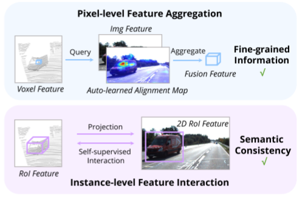

图 1：AutoAlign 中图像和点云之间的交互示意图。 交互作用在两个层次上：（i）像素级特征聚合保留了图像中细粒度的 RGB 特征，（ii）实例级特征交互增强了非同质表示之间的语义一致性。

提出两个模块：

为了保留 RGB 数据中的具体细节，一交叉注意力特征对齐 (CAFA) 模块，该模块动态关注图像中的像素级特征，并通过在更高的 3D 级别（支柱或 体素）。 每个体素特征将查询整个图像平面以获得像素级语义对齐图。 然后，CAFA 基于对齐图聚合图像特征，并将它们与原始 3D 特征连接在一起。

 为了促进点云和图像之间语义一致性的学习，提出自监督跨模态特征交互（SCFI）模块。 详细地说，我们首先使用由检测器预测的成对的 2D3D 提议来提取各自域中的区域特征。 之后，将在 2D 和 3D 空间中的成对区域特征之间施加相似性损失。 通过在实例级别与跨模态特征交互，SCFI 增强了在 CAFA 中感知语义相关信息的能力。

网络结构

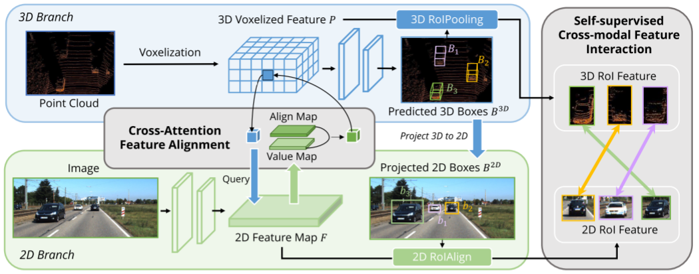

图 2：AutoAlign 的框架。 它由两个核心组件组成：CAFA（Cross-Attention Feature Alignment）在图像平面上执行特征聚合，以提取每个体素特征的细粒度像素级信息，SCFI（Self_supervised Cross-model Feature Interaction）进行跨模态自监督监督，发挥 实例级指导，以加强 CAFA 模块中的语义一致性。

使用 ResNet-50 作为主干从给定图像中提取全局特征图。 结果，一个大小为H×W的输入图像将产生空间维度为H/32×W/32的特征图。 从图像主干中提取的特征图表示为 Z ∈ Rh×w×c，其中 h、w、c 分别是全局特征图的高度、宽度和通道。 添加了一个 1×1 的卷积来降低特征维度，创建一个新的特征图 F ∈ Rh×w×d。 之后，我们将 F 的空间维度展平为一维，得到一个 hw × d 特征向量。 在我们的交叉注意机制中，给定特征图 F = {f1, f2, ..., fhw}（fi 表示第 i 个空间位置的图像特征）和体素特征 P = {p1, p2, ...,  pJ}（pj 表示每个非空体素特征）从原始点云中提取，键和值由 F 生成，查询由 P 生成。形式上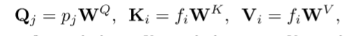

其中 WQ ∈ Rd×dk , WK ∈ Rd×dk , WV ∈ Rd×dv (1) 是线性投影。 对于第 j 个查询 Qj，注意力权重是根据跨模态查询与键之间的点积相似度计算的：

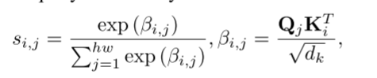交叉注意力机制的输出定义为根据注意力权重对所有值的加权和：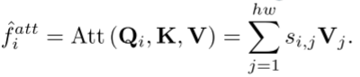

归一化的注意力权重 si,j 对不同空间像素 fi 和体素 pj 之间的兴趣进行建模，即图 2 所示的对齐图。这些值的加权和可以聚合细粒度的空间像素来更新 pj，从而丰富了点 以全局视图方式具有二维信息的特征。 与 Transformer 架构一样，我们使用前馈网络生成最终的 RGB 感知点特征，如下所示：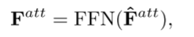

其中 FFN(·) 是一个使用全连接 (FC) 层的简单神经网络 [Vaswani et al., 2017]。

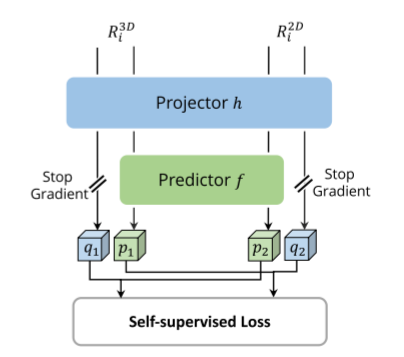

图 3：自监督特征交互的架构。 来自图像和点的非同质 RoI 特征均由 MLP 头处理，以生成用于特征交互的跨模态表示。

实验

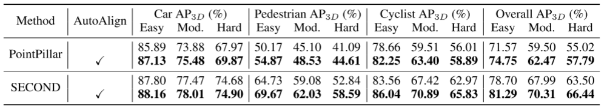

表 1：在 KITTI 验证集上不带和不带 AutoAlign 的不同 3D 物体检测器上的 AP3D 性能。

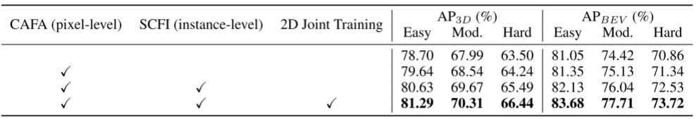

表 2：我们的 AutoAlign 中每个组件的效果。 结果报告在带有 SECOND 的 KITTI 验证集上。

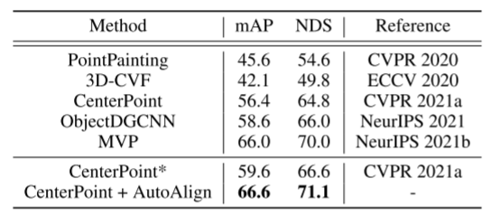

表 3：nuScenes 数据集上的 mAP 和 NDS 性能。 这些模型在 nuScenes 训练子集上进行训练，并在 nuScenes 验证子集上进行评估。  * 表示我们重新实现。

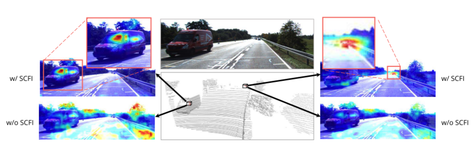

图 4：CAFA 模块从两个随机选择的点体素生成的对齐图的可视化。 为了验证 SCFI 模块的有效性，我们还可视化了没有 SCFI 模块的对齐图。  SCFI 使用实例级语义监督对 CAFA 进行规范化，从而产生具有位置和语义意义的对齐图。

> 更新: 2023-05-05 14:04:59  
> 原文: <https://3dcv.yuque.com/org-wiki-3dcv-mm1l0t/ysgfp9/dxwc3v_isf04e>