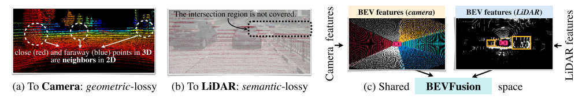
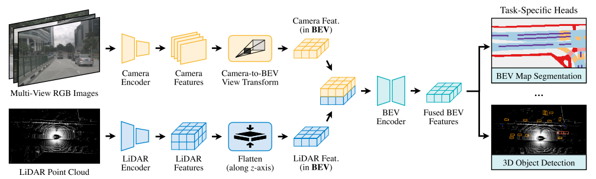
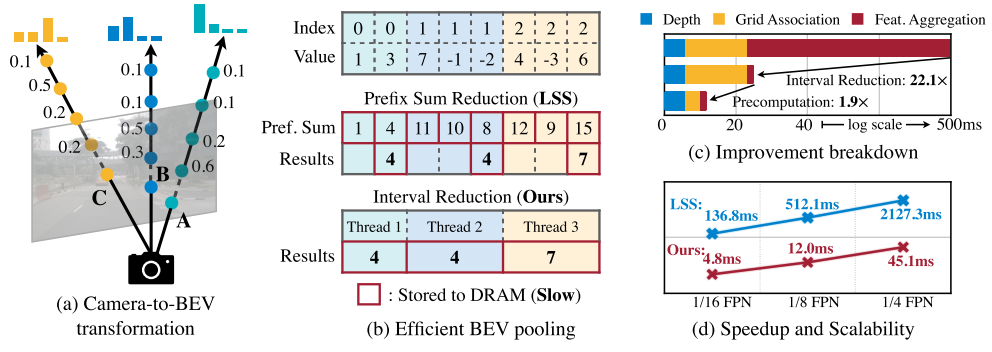
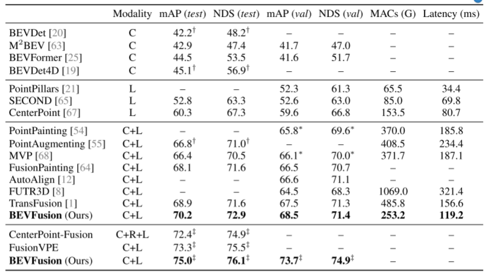
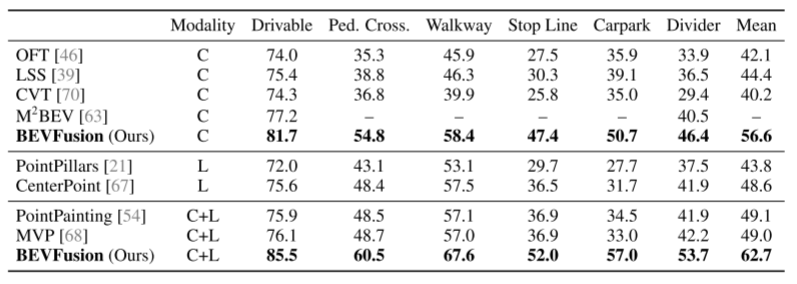
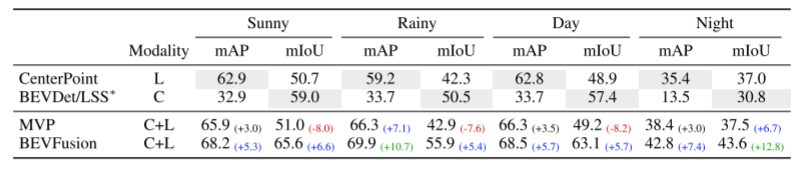
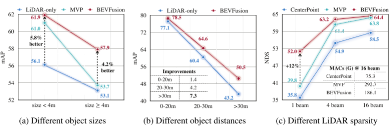

# BEVFusion

论文全称：Bevfusion: Multi- task multi-sensor fusion with unified bird’s-eye view representation

论文：[https://arxiv.org/abs/2205.13542](https://arxiv.org/abs/2205.13542)

单位：MIT（韩松团队）, 上海交大

提出的BEVFusion是一种多任务多传感器融合框架，其统一BEV表征空间中的多模态特征，很好地保留了几何和语义信息。为实现这一点，优化BEV池化，诊断并解除视图转换中的关键效率瓶颈，将延迟减少了40倍。BEVFusion从根本上来说是任务无关的，无缝支持不同的3D感知任务，几乎没有架构的更改。

来自不同传感器的数据以根本不同的方式表征：例如，摄像头在透视图中捕获数据，激光雷达在3D视图中捕获数据。为了解决这种视图差异，必须找到一种适用于多任务多模态特征融合的统一表征。由于在2D感知方面取得了巨大成功，自然的想法是将激光雷达点云投影到摄像头图像平面上，并使用2D CNN处理RGB-D数据。然而，这种激光雷达到摄像头的投影引入了严重的几何畸变，对于面向几何的任务（如3D目标识别）的效率较低。

最近的传感器融合方法遵循了另一个方向，用语义标注、CNN特征或2D图像中的虚拟点（virtual points）来增强激光雷达点云，然后应用现有基于激光雷达的检测器预测3D边框。尽管这些点级融合方法在大规模检测基准上表现出了卓越的性能，但几乎不适用于面向语义的任务，如BEV地图分割。这是因为摄像头到激光雷达的投影在语义上是有损的，而BEB Fusion就是想避免这个几何和语义的损失，建立BEV特征的融合表征，实现3D语义任务。

如图所示：对于典型的32线激光雷达扫描，只有5%的摄像头特征与激光雷达点匹配，而其他所有特征都将被删除。对于更稀疏的激光雷达（或成像雷达），这种密度差异将变得更加剧烈。

近年来，多传感器融合方法可分为提议级（proposal level）融合和点级融合方法。早期方法MV3D在3D中创建目标提议，并将其投影到图像以提取RoI特征。F-PointNet、F-ConvNet和CenterFusion都将图像提议提升到3D平截体（frustum）中。最近的工作FUTR3D和TransFusion定义了3D空间中的目标查询，并将图像特征融合到这些提议中。所有提议级融合方法都是以目标为中心的，不能简单地推广到其他任务，如BEV地图分割。另一方面，点级融合方法通常将图像语义特征绘制到前景FG激光雷达点上，并在修饰的（decorated）点云输入上做基于激光雷达的检测。因此，它们既以目标为中心，又以几何为中心。其中，PointPaint、PointAugmenting、MVP、FusionPaint和AutoAlign是（激光雷达）输入级修饰，而Deep Continuous Fusion和DeepFusion是特征级修饰。

多任务CNN在2D计算机视觉领域也得到了很好的研究，包括联合目标检测、实例分割、姿势估计和人机交互。最近同时出现的研究M2BEV和BEVFormer，联合执行3D目标检测和BEV分割。上述方法均未考虑多传感器融合。MMF同时使用摄像头和激光雷达输入进行深度图补全和目标检测，但仍然以目标为中心，不适用于BEV地图分割。

如图所示是BEVFusion流程：给定不同的感知输入，首先应用特定于模态的编码器来提取其特征；将多模态特征转换为一个统一的BEV表征，其同时保留几何和语义信息；存在的视图转换效率瓶颈，可以通过预计算和间歇降低来加速BEV池化过程；然后，将基于卷积的BEV编码器应用到统一的BEV特征中，以缓解不同特征之间的局部偏准；最后，添加一些特定任务头支持不同的3D场景理解工作。

采用BEV作为融合的统一表征，该视图对几乎所有感知任务都很友好，因为输出空间也在BEV。更重要的是，到BEV的转换同时保持了几何结构（来自激光雷达特征）和语义密度（来自摄像头特征）。一方面，LiDAR到BEV投影将稀疏LiDAR特征沿高度维度（height dimension）展平，因此不会产生几何失真。另一方面，摄像头到BEV投影将每个摄像头特征像素投射回3D空间的一条光线中（ray casting），这可以生成密集的BEV特征图，并保留了摄像头的全部语义信息。

摄像头到BEV的变换非常重要，因为与每个摄像头图像特征像素关联的深度（depth）本质上是不明确的。根据LSS，明确预测每个像素的离散深度分布。然后，沿着摄像头光线将每个特征像素分散成D个离散点，并根据相应的深度概率重缩放（rescale）相关特征。这将生成大小为N*_H*_W*D的摄像头特征点云，其中N是摄像头数，（H，W）是摄像头特征图大小。此类3D特征点云沿x、y轴量化，步长为r（例如，0.4m）。用BEV池化操作来聚合每个r×r BEV网格内的所有特征，并沿z轴展平特征。

虽然简单，但BEV池化的效率和速度惊人地低，在RTX 3090 GPU上需要500毫秒以上（而模型的其余部分计算只需要100毫秒左右）。这是因为摄像头特征点云非常大，即典型的工作负载，每帧可能生成约200万个点，比激光雷达特征点云密度高两个数量级。为了消除这一效率瓶颈，建议通过预计算和间歇降低来优化BEV池化进程。

如图所示：摄像机到BEV变换（a）是在统一的BEV空间进行传感器融合的关键步骤。然而，现有的实现速度非常慢，单个场景可能需要2秒的时间。文章提出了有效的BEV池化方法（b），通过预计算使间歇降低和加快网格关联，视图转换模块（c，d）的执行速度提高了40倍。

BEV池化的第一步是将摄像头特征点云的每个点与BEV网格相关联。与激光雷达点云不同，摄像头特征点云的坐标是固定的（只要摄像头内参外参保持不变，通常在适当标定后）。基于此，预计算每个点的3D坐标和BEV网格索引。还有，根据网格索引对所有点进行排序，并记录每个点排名。在推理过程中，只需要根据预计算的排序对所有特征点重排序。这种缓存机制可以将网格关联的延迟从17ms减少到4ms。

网格关联后，同一BEV网格的所有点将在张量表征中连续。BEV池化的下一步是通过一些对称函数（例如，平均值、最大值和求和）聚合每个BEV网格内的特征。现有的实现方法首先计算所有点的前缀和（prefix sum），然后减去索引发生变化的边界值。然而，前缀和操作，需要在GPU进行树缩减（tree reduction），并生成许多未使用的部分和（因为只需要边界值），这两种操作都是低效的。为了加速特征聚合，文章里实现一个专门的GPU内核，直接在BEV网格并行化：为每个网格分配一个GPU线程，该线程计算其间歇和（interval sum）并将结果写回。该内核消除输出之间的依赖关系（因此不需要多级树缩减），并避免将部分和写入DRAM，从而将特征聚合的延迟从500ms减少到2ms。

通过优化的BEV池化，摄像头到BEV的转换速度提高了40倍：延迟从500ms减少到12ms（仅为模型端到端运行时间的10%），并且可以在不同的分特征辨率之间很好地扩展。在共享BEV表征中，这是统一多模态感知特征的关键促成因素。两项并行化工作也发现了纯摄像头3D检测的这一效率瓶颈。假设均匀深度分布，或截断每个BEV网格内的点，可以近似视图transformer计算。相比之下，该技术在没有任何近似的情况下是精确的，但仍然更快。

实验

表 1：BEVFusion 在 nuScenes（验证和测试）上实现了最先进的 3D 对象检测性能，没有花里胡哨。 它打破了将相机特征装饰到 LiDAR 点云上的惯例，并提供至少 1.3% 的 mAP 和 NDS，计算成本降低 1.5-2 倍。  （*：我们的重新实现；†：带测试时间增强（TTA）；‡：带模型集成和 TTA）

表2:BEVFusion优于13.6%的先进的多传感器融合方法贝福地图分割在nuScenes (val)一致的改善在不同的类别。

表 3：BEVFusion 在不同的光照和天气条件下都很稳健，显着提高了单模态基线（以灰色标记）在具有挑战性的雨天和夜间场景下的性能。  （*：BEVDet-Tiny 和 LSS 的变体，具有更大的主干和视图转换器）

图 5：BEVFusion 在不同的 LiDAR 稀疏度、物体大小和与自我汽车的物体距离下始终优于最先进的单模态和多模态检测器，尤其是在更具挑战性的设置（即稀疏点云、小/ 远处的物体）。

> 更新: 2023-05-05 14:04:42  
> 原文: <https://3dcv.yuque.com/org-wiki-3dcv-mm1l0t/ysgfp9/pguub2_ad2y2n>