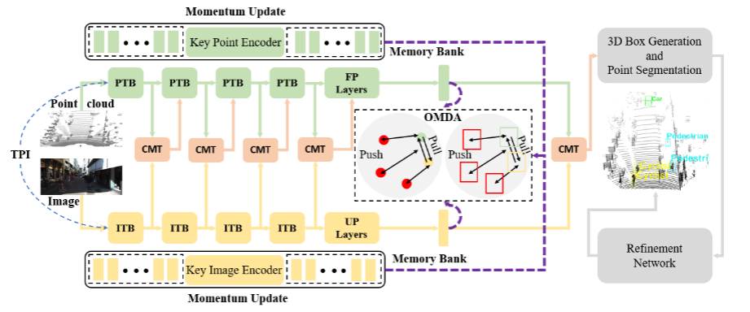
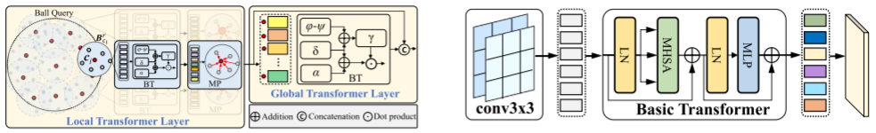
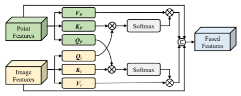
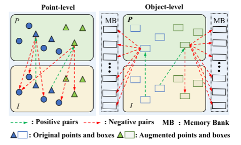
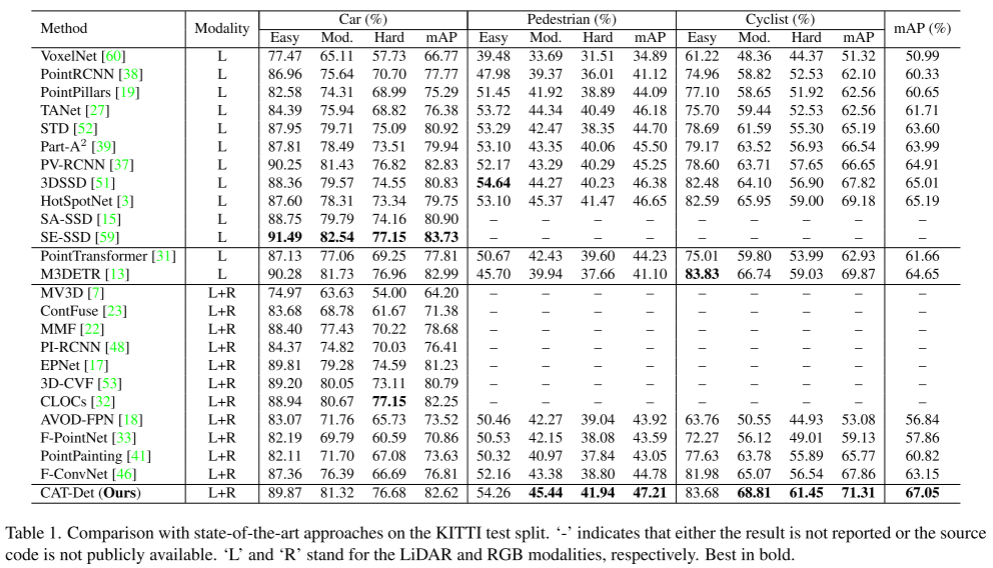
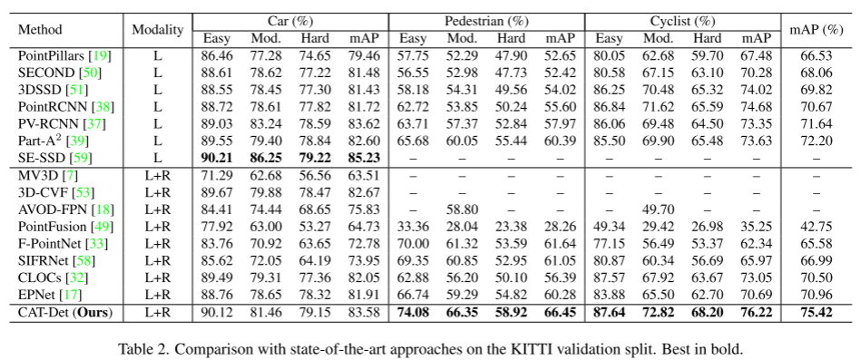

# CAT-Det

论文名称：CAT-Det: Contrastively Augmented Transformer for Multi-modal 3D Object Detection

论文下载：[https://arxiv.org/pdf/2204.00325.pdf](https://arxiv.org/pdf/2204.00325.pdf)

作者单位：北航     代码未开源

Kitti上多模态方法没有纯点云方法好的原因主要有一下三个方面：

（1）在多模态 3D 对象检测中，PointNet++/3D 稀疏卷积 和 2D CNN 是分别提取点云和图像特征的主要模块。受限于它们的局部感受野，无法从两种模态中全面获取上下文，从而引发信息丢失。 (2) 广泛采用的融合方案，特别是特征级的融合方案，如直接连接 [7, 18]、附加卷积 [22, 23] 和简单注意 [17, 55]，不分配权重或粗略在有限的感受野中学习到不同特征的权重，其中关键线索没有很好地突出显示。 (3) Groundtruth 数据增强 [52] 是促进仅 LiDAR 方法的常见做法；不幸的是，将这种机制应用于多模态方法并不是那么简单，因为单一模态中的增强往往会导致语义错位。 [43]确实提出了一种用于配对数据的交叉模态增强技术，但图像处理过程繁琐且容易产生噪声。

综上所示其实就三点：感受野太小，特征的融合方式太简单、数据增广难

为了解决这些问题，提出了 Contrastively Augmented Transformer Detector (CAT-Det).

针对三个问题的解决方案：（1）用一个局部Transformer和全局Transformer 提取特征，分别获得局部特征和全局特征。 （2）用Transformer进行特征融合（3）数据增广后使用对比学习策略

包括：Pointformer (PT) branch, Imageformer (IT) branch， Cross-Modal Transformer (CMT)，不像PointNet和CNN，PT和IT都有很大的感受野，随后，CMT 模块进行跨模态特征交互和多模态特征组合，其中在两种模态中提取的基本线索通过整体学习的细粒度权重得到充分强调。PT、IT 和 CMT 的集成将模式内和模式间的远程依赖完全编码为强大的表示，从而有利于检测性能。此外，我们通过分层对比学习提出了一种单向多模态数据增强（OMDA）方法，该方法通过仅在点云模态上执行来实现有效的增强。

多模态3D物体检测器：MV3D，AVOD ，F-PointNet ，F-ConvNet ，PointPainting ，PI-RCNN，CLOCs 

网络结构

点云数据处理分支PT和图像数据处理分支IT。左PTB,右ITB

PTB 由一个局部Transformer层和一个全局Transformer层组成。局部层探索邻域内点的几何结构，全局层在场景级别编码整体上下文。通过组合它们，PTB 从附近局部区域的点以及整个场景中捕获上下文信息

local transformer layer:先在P上最远点采样，获得子集C。然后把每个C作为中心进行ball query，每个ball内的点记为B，把B喂进一个transformer block，进行局部特征的提取。

global transformer layer：和局部特征提取一样，只不过输入变成了子集C，而不是ball query的B。然后使用Feature Propagation (FP) layer进行上采样获得每个点的特征

 ITB 由两个用于局部视觉上下文编码的卷积层和一个连续的基本多头transformer 编码器 [10]用于全局上下文信息探索。最后，ITB 将转换后的向量序列重新整形为 2D 特征图以供进一步处理。在堆叠的 ITB 之后，使用上采样 (UP) 层来恢复图像分辨率，生成与原始图像大小相同的特征图。就是卷积，然后transformer 编码输出特征，然后上采样到原始图像大小的特征图（为了和点云对齐）。

Cross-Modal Transformer(CMT). 将点云投影到图像上，获得与点云对应的图像特征（原始图像特征数量多余点云数量）

交叉模态数据转换分支-CMT；CMT联合编码模式内和模式间的障碍物上下文，从而充分挖掘用于检测的多模态信息。如下图所示

单向多模态数据增强（OMDA）方法，该方法通过在point和目标级别上进行对比学习，仅通过增强点云提高精度。如下图所示是对比学习

数据增强已被证明是一种有效的目标检测方法，但它主要应用于单一模态，很少用于多模态场景。由于点云与图像之间的异质性，通常难以跨模态同步增强操作，导致严重的跨模态不对中。最近[43]提出了一种复杂的成对数据生成方法，但图像上的流水线操作繁琐且容易产生噪声。相反，我们提出了一种新的单向多模态数据增强(OMDA)方法，该方法只对点云进行增强，并通过对比学习有效地将其扩展到多种模态。

OMDA的基本思想有两个方面:(1)高质量的图像增强通常比点云上的图像增强要复杂和困难得多，因此只需要对LiDAR数据进行增强，然后进行轻量级的多模态扩展。(2)单向augmentation如(1)可能带来严重的跨模态偏差。受最近在自监督模型[4,16]和跨模态语义对齐[25,26]中的对比学习成功的启发，我们精心设计了一种对比学习方案，以解决跨模态的这种错位。

具体来说，OMDA采用的是GT-Paste，这种方法广泛应用于仅使用激光雷达的方法，通过粘贴来自其他激光雷达帧的额外3D对象来增强给定的点云，而不会产生空间碰撞。由于缺少增加的点云对应的图像，就会出现跨模态数据错位，可能会恶化多模态交互作用(例如CMT)，这隐含地假设点云/图像对是良好对齐的。因此，我们在原始点云 P 、相应的图像 I 和增强的点云 Paug 之间以分层方式在点和对象级别执行对比学习。

表 1. 与 KITTI 测试拆分的最先进方法的比较。  “-”表示结果未报告或源代码未公开。  “L”和“R”分别代表 LiDAR 和 RGB 模式。 最好是粗体。

表2.与最先进的Kitti验证拆分方法的比较。最好的粗体。

> 更新: 2023-05-05 14:04:40  
> 原文: <https://3dcv.yuque.com/org-wiki-3dcv-mm1l0t/ysgfp9/se2e7u_mu4tyd>